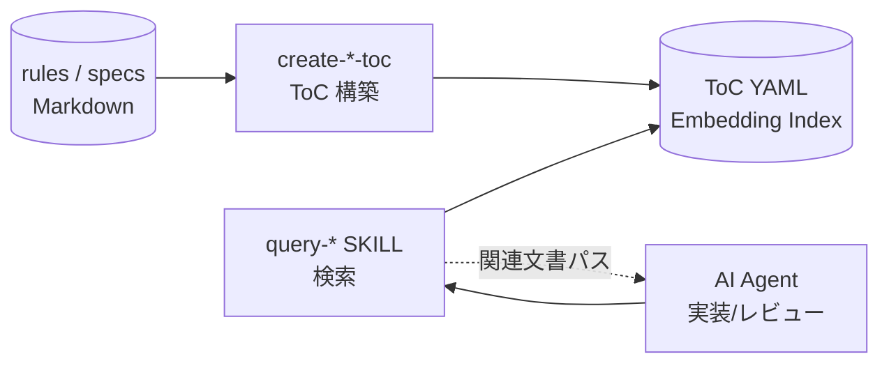

# doc-advisor

**Version: 0.3.0**

Claude Code 用の AI 検索可能なドキュメントインデックスプラグイン。プロジェクトのルール・仕様文書を ToC（キーワード）と Embedding（セマンティック）の 2 層で検索し、AI が必要なコンテキストを自動発見できるようにする。

[English README](README_en.md)

## なぜ doc-advisor が必要か

プロジェクトが大きくなるとルール・規約・設計文書が蓄積される。AI がそれらを見つけられなければ活用できない。`doc-advisor` はこれらの文書をインデックス化し、AI が実装・レビュー時に関連文書を自動取得できるようにする。

- **実装前**: コードを書く前にプロジェクト固有の実装ルールと関連仕様を集める
- **レビュー時**: 適用すべきルールをレビュー観点として追加し、汎用的なベストプラクティスではなくプロジェクトの実際の基準で検査する

## スキル一覧

| スキル               | 説明                                            | トリガー句         |
| -------------------- | ----------------------------------------------- | ------------------ |
| **query-rules**      | ルール文書を ToC・Embedding・ハイブリッドで検索 | `"ルール確認"`     |
| **query-specs**      | 仕様文書を ToC・Embedding・ハイブリッドで検索   | `"仕様確認"`       |
| **create-rules-toc** | ルール文書の変更後に ToC を構築・更新           | `"rules ToC 更新"` |
| **create-specs-toc** | 仕様文書の変更後に ToC を構築・更新             | `"specs ToC 更新"` |

## ワークフロー



## インストール

```text
/plugin marketplace add BlueEventHorizon/DocAdvisor
/plugin install doc-advisor@DocAdvisor
```

無効化したプラグインを再有効化するには、ターミナルから:

```bash
claude plugin enable doc-advisor@DocAdvisor
```

### ローカルで試す（セッション限定）

```bash
git clone https://github.com/BlueEventHorizon/DocAdvisor.git
claude --plugin-dir ./DocAdvisor
```

## セットアップ

### 1. `.doc_structure.yaml` の配置

プロジェクトのドキュメント配置を宣言する設定ファイルが必要。最小例:

```yaml
# doc_structure_version: 3.0

rules:
  root_dirs:
    - docs/rules/
  doc_types_map:
    docs/rules/: rule
  patterns:
    target_glob: "**/*.md"

specs:
  root_dirs:
    - "docs/specs/**/design/"
    - "docs/specs/**/requirements/"
  doc_types_map:
    "docs/specs/**/design/": design
    "docs/specs/**/requirements/": requirement
  patterns:
    target_glob: "**/*.md"
```

追加で使えるフィールド:

- `output_dir`: ToC 出力先（既定: `.claude/doc-advisor/`）
- `patterns.exclude`: 除外するファイル/ディレクトリのパターン

### 2. 初回 ToC 構築

```text
/doc-advisor:create-rules-toc --full
/doc-advisor:create-specs-toc --full
```

### 3. 検索

```text
/doc-advisor:query-rules "認証フローのレビュー観点"
/doc-advisor:query-specs "ユーザ登録 API"
```

## 検索モード

`query-rules` / `query-specs` は 3 モードに対応:

| モード       | 引数      | 動作                                                            |
| ------------ | --------- | --------------------------------------------------------------- |
| auto（既定） | `(none)`  | ToC キーワード検索を常時実行。API キー設定時のみ Embedding 追加 |
| toc          | `--toc`   | ToC キーワード検索のみ                                          |
| index        | `--index` | Embedding セマンティック検索のみ                                |

## 動作要件

- [Claude Code](https://claude.ai/code) CLI
- Python 3（標準ライブラリのみ。追加パッケージは不要）
- OpenAI API キー（Embedding 検索を使う場合のみ。`OPENAI_API_DOCDB_KEY` を優先参照、未設定なら `OPENAI_API_KEY` にフォールバック）

## 開発者向け情報

このリポジトリ自体での開発フロー・テスト・フォーマットについては [`CLAUDE.md`](CLAUDE.md) を参照。

このリポジトリは `BlueEventHorizon/bw-cc-plugins` マーケットプレイス（forge / anvil / doc-advisor / doc-db の 4 プラグイン集）から `doc-advisor` を分離したものです。

## ライセンス

[MIT](LICENSE)
