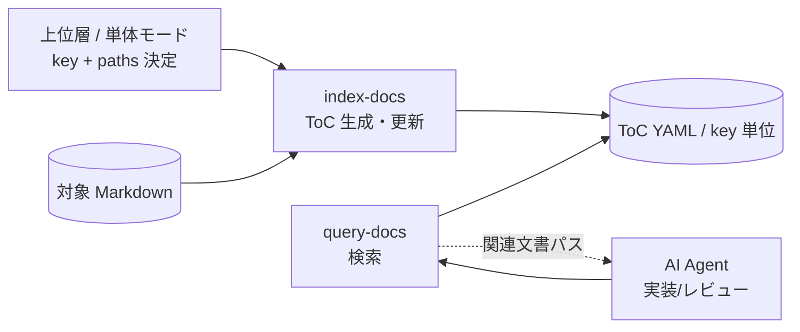

# doc-advisor

**Version: 0.3.0**

Claude Code 用の AI 検索可能なドキュメントインデックスプラグイン。プロジェクトの Markdown 文書を ToC（キーワード・メタデータ）で `key` 単位にインデックス化・検索し、AI が必要なコンテキストを自動発見できるようにする。

[English README](README_en.md)

## なぜ doc-advisor が必要か

プロジェクトが大きくなるとルール・規約・設計文書が蓄積される。AI がそれらを見つけられなければ活用できない。`doc-advisor` はこれらの文書をインデックス化し、AI が実装・レビュー時に関連文書を自動取得できるようにする。

- **実装前**: コードを書く前にプロジェクト固有の実装ルールと関連仕様を集める
- **レビュー時**: 適用すべきルールをレビュー観点として追加し、汎用的なベストプラクティスではなくプロジェクトの実際の基準で検査する

## スキル一覧

doc-advisor は文書集合を `key`（任意の文字列）単位で管理する汎用 ToC Provider。`key` の意味（rules / specs 等の分類）を解釈せず、与えられた `key` と project-root-relative の `paths` に対して決定的に動作する。

| スキル         | 説明                                                         | トリガー句           |
| -------------- | ------------------------------------------------------------ | -------------------- |
| **index-docs** | key + paths から ToC（キーワード/メタデータ）を生成・更新    | `"index docs"`       |
| **query-docs** | key 単位の ToC をキーワード/自然文で検索し関連文書パスを返す | `"関連文書を探して"` |

## ワークフロー



## インストール

```text
/plugin marketplace add BlueEventHorizon/DocAdvisor
/plugin install doc-advisor@DocAdvisor
```

無効化したプラグインを再有効化するには、ターミナルから:

```bash
claude plugin enable doc-advisor@DocAdvisor
```

### ローカルで試す（セッション限定）

```bash
git clone https://github.com/BlueEventHorizon/DocAdvisor.git
claude --plugin-dir ./DocAdvisor
```

## 使い方

事前の設定ファイル（`.doc_structure.yaml`）は不要。`key` と project-root-relative の `paths` を渡すだけで動作する。

### 1. ToC 構築（index-docs）

`key` と paths を指定して、その key の **完全な desired state** として ToC を構築・更新する。

```text
# 上位層（forge 等）が key と paths を決定して渡す
/doc-advisor:index-docs --key my-rules --paths-json '["docs/rules/a.md", "docs/rules/b.md"]'

# paths を JSON ファイルから読み込む
/doc-advisor:index-docs --key my-rules --paths-file paths.json

# 単体モード: project root 以下の全 Markdown を予約 key "all" に索引化
/doc-advisor:index-docs --all
```

> **desired-state の破壊性**: `--paths-json` / `--paths-file` で渡す paths は当該 key の完全な desired state。前回 ToC に存在し今回 paths に含まれない path は削除される（部分配列を渡すと残りが消える）。

### 2. 検索（query-docs）

```text
# key を指定して検索
/doc-advisor:query-docs --key my-rules "認証フローのレビュー観点"

# key 省略時は予約 key "all"（project 全体の単体モード索引）を検索
/doc-advisor:query-docs "ユーザ登録 API"
```

## 動作要件

- [Claude Code](https://claude.ai/code) CLI
- Python 3.9 以上（標準ライブラリのみ。追加パッケージは不要）

## 開発者向け情報

このリポジトリ自体での開発フロー・テスト・フォーマットについては [`CLAUDE.md`](CLAUDE.md) を参照。

このリポジトリは `BlueEventHorizon/bw-cc-plugins` マーケットプレイス（forge / anvil / doc-advisor / doc-db の 4 プラグイン集）から `doc-advisor` を分離したものです。

## ライセンス

[MIT](LICENSE)
