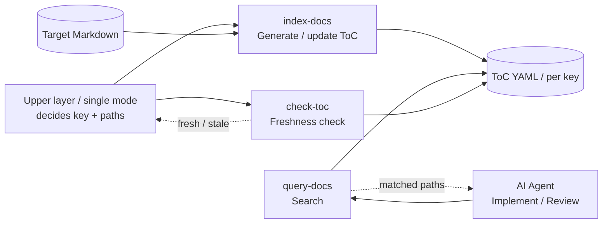

# doc-advisor

**Version: 0.4.5**

An AI-searchable document index plugin for Claude Code. Indexes project Markdown documents per `key` with a ToC (keyword / metadata) search so AI can automatically find the context it needs.

[日本語版 README](README.md)

## Why doc-advisor

As a project grows, rules, conventions, and design documents accumulate. AI cannot use what it cannot find. `doc-advisor` indexes these documents and makes them automatically discoverable during implementation and review.

- **Before implementation** — gather project-specific coding rules and relevant specs before writing a line of code.
- **During review** — add applicable rules as review perspectives so reviews check against your actual standards, not generic best practices.

### Nobody can maintain "which documents must I read for this task" (doc-advisor's reason to exist)

For a stable rule document, a fixed "follow this" reference is fine — the rule itself rarely changes, so the cost is low. But **implementation tasks** are different. The **set of documents you must read to implement a feature changes from task to task** ("to implement this you need documents A, B, and C").

That raises the real problem — **who works out that set and tells the implementer?** Hand-authoring a "read these" list for every conceivable task, and updating it every time documents are added, moved, or revised, is not realistic. **Maintenance cost explodes.**

doc-advisor exists precisely to build that "task → documents to read" mapping **dynamically from the task description, rather than writing it down in advance**. So a document only needs to carry **what it depends on (concepts, IDs)**; _which_ documents to read for a given task is assembled on demand by `query-docs`. As a result, hard-coding a directory-path "look here" reference into a document becomes **unnecessary in the first place** (path references rot when files move or are renamed, adding to maintenance cost).

## Skills

doc-advisor is a generic ToC Provider that manages document sets per `key` (an arbitrary string). It does not interpret the meaning of a `key` (rules / specs classification); it operates deterministically on the given `key` and project-root-relative `paths`.

| Skill          | Description                                                      | Trigger               |
| -------------- | ---------------------------------------------------------------- | --------------------- |
| **index-docs** | Generate / update a ToC (keyword / metadata) from key + paths    | `"index docs"`        |
| **query-docs** | Search a per-key ToC by keyword / natural language, return paths | `"find related docs"` |
| **check-toc**  | Report whether a per-key ToC is `fresh` or `stale` (read-only)   | `"is the ToC fresh"`  |

## Workflow



## Installation

```text
/plugin marketplace add BlueEventHorizon/DocAdvisor
/plugin install doc-advisor@DocAdvisor
```

To re-enable a disabled plugin, from your terminal:

```bash
claude plugin enable doc-advisor@DocAdvisor
```

### Local trial (session only)

```bash
git clone https://github.com/BlueEventHorizon/DocAdvisor.git
claude --plugin-dir ./DocAdvisor/plugins/doc-advisor
```

## Usage

No configuration file (`.doc_structure.yaml`) is required up front. Just pass a `key` and project-root-relative `paths`.

### 1. Build a ToC (index-docs)

Pass a `key` and paths; the paths are treated as the complete desired state for that key.

```text
# An upper layer (e.g. forge) decides the key and paths and passes them
/doc-advisor:index-docs --key my-rules --paths-json '["docs/rules/a.md", "docs/rules/b.md"]'

# Read paths from a JSON file
/doc-advisor:index-docs --key my-rules --paths-file paths.json

# Single mode: index every Markdown file under the project root into the reserved key "all"
/doc-advisor:index-docs --all
```

> **Desired-state destructiveness**: The paths passed via `--paths-json` / `--paths-file` are the complete desired state for that key. Any path present in the previous ToC but absent from the new paths is deleted (passing a partial array drops the rest).

### 2. Search (query-docs)

```text
# Search a specific key
/doc-advisor:query-docs --key my-rules "review perspectives for auth flow"

# Omitting --key searches the reserved key "all" (single-mode index of the whole project)
/doc-advisor:query-docs "user registration API"
```

### 3. Freshness check (check-toc)

A read-only skill that answers "is this ToC still usable?" before searching. It only reports the verdict as JSON; it never generates or updates an index.

```text
# Check whether the ToC was generated within the last 24 hours
/doc-advisor:check-toc --key my-rules --max-age 86400

# Target the reserved key "all"
/doc-advisor:check-toc --all --max-age 86400
```

The answer is the two-valued `freshness`. A missing ToC is also reported as `stale`, because the follow-up action (rebuild the index) is the same as for an expired one. The cause comes alongside as `reason` (`missing` / `outdated` / `generated_at_invalid` / `generated_at_future`).

```json
{
  "status": "ok",
  "key": "my-rules",
  "freshness": "stale",
  "reason": "outdated",
  "age_seconds": 172800,
  "max_age_seconds": 86400
}
```

`--max-age` is required. Choosing the threshold — and deciding what to do when the ToC is stale — belongs to the caller.

## Requirements

- [Claude Code](https://claude.ai/code) CLI
- Python 3.9 or later (standard library only; no extra packages required)

## For Developers

For development flow, tests, and formatting in this repository itself, see [`CLAUDE.md`](CLAUDE.md).

This repository was separated from `BlueEventHorizon/bw-cc-plugins` (a marketplace bundling forge / anvil / doc-advisor / doc-db).

## License

[MIT](LICENSE)
