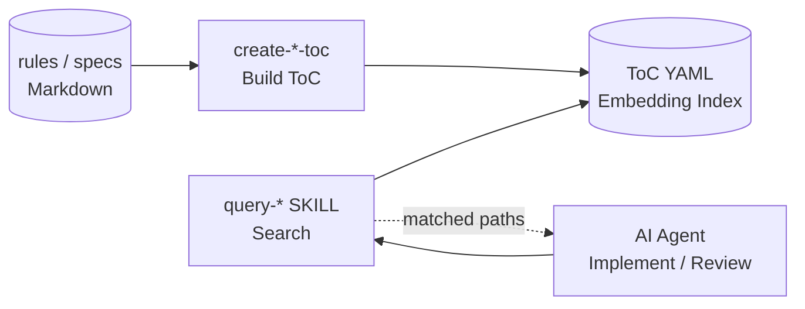

# doc-advisor

**Version: 0.3.0**

An AI-searchable document index plugin for Claude Code. Indexes project rules and specifications with a two-layer search (keyword ToC + Embedding semantic search) so AI can automatically find the context it needs.

[日本語版 README](README.md)

## Why doc-advisor

As a project grows, rules, conventions, and design documents accumulate. AI cannot use what it cannot find. `doc-advisor` indexes these documents and makes them automatically discoverable during implementation and review.

- **Before implementation** — gather project-specific coding rules and relevant specs before writing a line of code.
- **During review** — add applicable rules as review perspectives so reviews check against your actual standards, not generic best practices.

## Skills

| Skill                | Description                                        | Trigger               |
| -------------------- | -------------------------------------------------- | --------------------- |
| **query-rules**      | Search rules with ToC / Embedding / hybrid mode    | `"query rules"`       |
| **query-specs**      | Search specs with ToC / Embedding / hybrid mode    | `"query specs"`       |
| **create-rules-toc** | Build/update rules ToC after rule documents change | `"rebuild rules ToC"` |
| **create-specs-toc** | Build/update specs ToC after spec documents change | `"rebuild specs ToC"` |

## Workflow



## Installation

```text
/plugin marketplace add BlueEventHorizon/DocAdvisor
/plugin install doc-advisor@DocAdvisor
```

To re-enable a disabled plugin, from your terminal:

```bash
claude plugin enable doc-advisor@DocAdvisor
```

### Local trial (session only)

```bash
git clone https://github.com/BlueEventHorizon/DocAdvisor.git
claude --plugin-dir ./DocAdvisor
```

## Setup

### 1. Place `.doc_structure.yaml`

A configuration file declaring where documents live is required. Minimal example:

```yaml
# doc_structure_version: 3.0

rules:
  root_dirs:
    - docs/rules/
  doc_types_map:
    docs/rules/: rule
  patterns:
    target_glob: "**/*.md"

specs:
  root_dirs:
    - "docs/specs/**/design/"
    - "docs/specs/**/requirements/"
  doc_types_map:
    "docs/specs/**/design/": design
    "docs/specs/**/requirements/": requirement
  patterns:
    target_glob: "**/*.md"
```

Additional supported fields:

- `output_dir`: ToC output directory (default: `.claude/doc-advisor/`)
- `patterns.exclude`: glob patterns to exclude

### 2. Initial ToC build

```text
/doc-advisor:create-rules-toc --full
/doc-advisor:create-specs-toc --full
```

### 3. Search

```text
/doc-advisor:query-rules "review perspectives for auth flow"
/doc-advisor:query-specs "user registration API"
```

## Search Modes

`query-rules` / `query-specs` support 3 modes:

| Mode           | Argument  | Behavior                                                         |
| -------------- | --------- | ---------------------------------------------------------------- |
| auto (default) | `(none)`  | ToC keyword search always; Embedding added if API key is present |
| toc            | `--toc`   | ToC keyword search only                                          |
| index          | `--index` | Embedding semantic search only                                   |

## Requirements

- [Claude Code](https://claude.ai/code) CLI
- Python 3 (standard library only; no extra packages required)
- OpenAI API key (only if you use Embedding search; `OPENAI_API_DOCDB_KEY` is preferred, falling back to `OPENAI_API_KEY` if unset)

## For Developers

For development flow, tests, and formatting in this repository itself, see [`CLAUDE.md`](CLAUDE.md).

This repository was separated from `BlueEventHorizon/bw-cc-plugins` (a marketplace bundling forge / anvil / doc-advisor / doc-db).

## License

[MIT](LICENSE)
