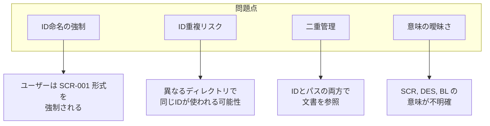
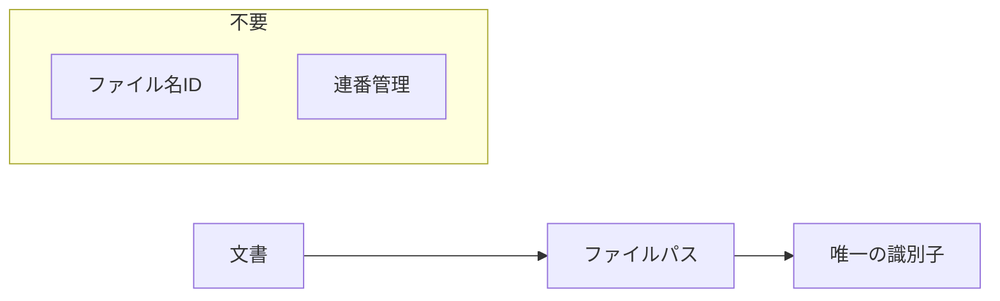
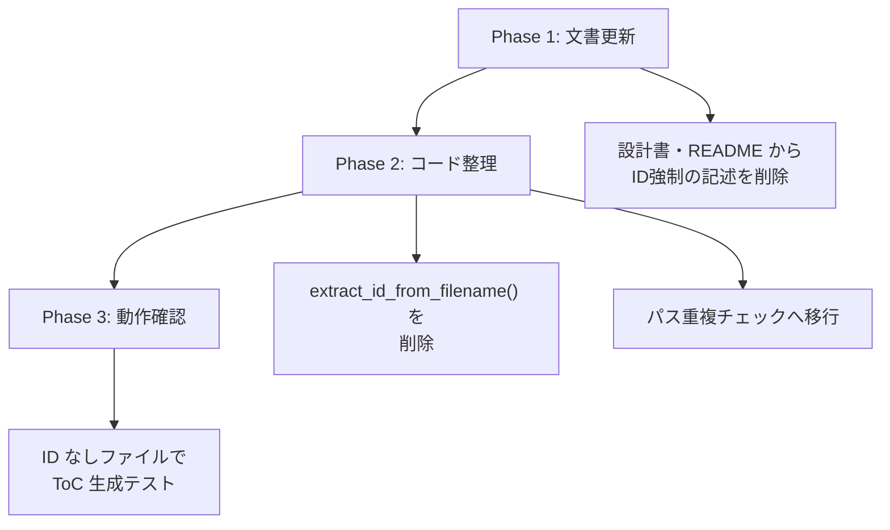

# DES-003: 文書識別子の設計

## 概要

本設計書では、doc-advisor における文書の識別方法を定義する。文書はファイルパス（project-root-relative path）で一意に識別し、ファイル名の ID プレフィックスに依存しない。

key + path I/F（REQ-001）では、この原則を **key（ToC 管理単位）+ path（文書識別子）の二層識別** へ拡張する。key は ToC の所属を表す opaque な識別子、path は当該 ToC 内での文書の一意キーである（詳細は § key + path 二層識別）。

## 現状分析と問題点

### 現在の実装

現在、文書IDとして以下の2つの方式が混在している：

1. **ファイル名ベースのID抽出**
   - `toc_utils.py` の `extract_id_from_filename()` 関数
   - 正規表現 `[A-Z]+-\d+` でファイル名からIDを抽出
   - 例: `SCR-001_login.md` → `SCR-001`

2. **ファイルパスベースのキー**
   - `specs_toc.yaml` / `rules_toc.yaml` のキー
   - 例: `specs/requirements/login.md`

### 問題点



#### 問題1: ID命名の強制

| 現状                                     | 問題                                               |
| ---------------------------------------- | -------------------------------------------------- |
| ファイル名に `[A-Z]+-\d+` パターンを期待 | ユーザーの命名自由度を制限                         |
| `SCR-001_login.md` 形式を暗黙的に要求    | `login_screen.md` のようなシンプルな名前が使えない |

#### 問題2: ID重複リスク

```
specs/requirements/SCR-001_login.md
specs/design/SCR-001_login_design.md
```

同じID `SCR-001` が異なるディレクトリで使用される可能性がある。

#### 問題3: 二重管理

| 識別方法                             | 使用箇所                                                                         |
| ------------------------------------ | -------------------------------------------------------------------------------- |
| ID (`SCR-001`)                       | `.claude/.doc-advisor/toc/specs/.toc_work/SCR-001.yaml`、validate の重複チェック |
| パス (`specs/requirements/login.md`) | ToC YAML のキー、実際のファイル参照                                              |

2つの識別子を管理する必要があり、冗長である。

#### 問題4: 意味の曖昧さ

| プレフィックス | 想定意味        | 問題                           |
| -------------- | --------------- | ------------------------------ |
| `SCR-`         | Screen?         | ディレクトリ構造との関係が不明 |
| `DES-`         | Design          | ディレクトリで区別すれば不要   |
| `REQ-`         | Requirement     | ディレクトリで区別すれば不要   |
| `BL-`          | Business Logic? | 定義なし                       |
| `APP-`         | Application?    | 定義なし                       |

IDプレフィックスの意味が整理されていない。

## 設計方針

### 原則: ファイルパスを唯一の識別子とする



**理由:**

1. **ファイルパスは必ずユニーク** - ファイルシステムが保証
2. **追加の命名規則が不要** - ユーザーは自由にファイル名を決められる
3. **ToC YAML のキーとして既に使用** - 一貫性がある

### ファイル名は自由

| OK                         | NG（強制しない） |
| -------------------------- | ---------------- |
| `login.md`                 | -                |
| `login_screen.md`          | -                |
| `SCR-001_login.md`         | -                |
| `2024-01-login-feature.md` | -                |

ユーザーがIDプレフィックスを使いたければ使えるが、システムは強制しない。

## 詳細設計

### 文書の識別

```yaml
# 識別子 = project-root-relative path
identifier: "docs/specs/base/requirements/login.md"

# これだけでファイルが特定できる
file_path: docs/specs/base/requirements/login.md
```

### key + path 二層識別

key + path I/F（REQ-001）では、識別を 2 層で行う:

| 層       | 役割                                   | 例                           |
| -------- | -------------------------------------- | ---------------------------- |
| **key**  | ToC の管理単位（opaque、上位層が決定） | `rules` / `all` / 任意文字列 |
| **path** | 当該 key の ToC 内での文書の一意キー   | `docs/rules/coding.md`       |

- ToC YAML の `docs` セクションのキーは project-root-relative path であり、引き続きファイルパスが文書の唯一の識別子である（ID プレフィックスに依存しない）。
- key → 保存パスの変換は `toc_store.py` が決定的に解決する（DES-005 §3.1）。

### `.toc_work/` ファイル名生成

key 単位ストア配下の作業ファイル名は、元パスの SHA-256 から生成する（DES-005 §6.4）:

```python
# store_dir/.toc_work/ のファイル名を元パスのハッシュから生成
work_filename = hashlib.sha256(source_file_path.encode()).hexdigest()[:16] + ".yaml"
```

ID に依存せず、元パスは YAML 内の `_meta.source_file` で保持される。衝突空間は当該 key の `store_dir` 配下に閉じる。

### 廃止した機能

| 機能                         | 場所              | 対応                                            |
| ---------------------------- | ----------------- | ----------------------------------------------- |
| `extract_id_from_filename()` | `toc_utils.py`    | **削除済み**（REQ-001 §6.2 clean break で除去） |
| ID重複チェック               | `validate_toc.py` | パス重複チェックに変更（実装済み）              |

### 移行計画



## 影響範囲

### 変更が必要なファイル（実施済み）

| ファイル                | 変更内容                                           |
| ----------------------- | -------------------------------------------------- |
| `toc_utils.py`          | `extract_id_from_filename()` を削除（clean break） |
| `formats/toc_format.md` | ID 要件・`doc_type` の記述がないことを確認         |

### 変更不要なファイル

| ファイル          | 理由                           |
| ----------------- | ------------------------------ |
| `merge_toc.py`    | パスベースで動作している       |
| `validate_toc.py` | パス重複チェックは実装済み     |
| `prepare_toc.py`  | パスからワークファイル名を生成 |

## 結論

| 項目                                      | 決定                                                 |
| ----------------------------------------- | ---------------------------------------------------- |
| 文書の識別子                              | **ファイルパス**（ルートディレクトリからの相対パス） |
| ファイル名のID                            | **任意**（ユーザーの自由）                           |
| IDプレフィックス規則                      | **なし**（システムは関知しない）                     |
| 既存コードの `extract_id_from_filename()` | **削除済み**（REQ-001 §6.2 clean break で除去）      |

### 推奨するファイル命名

システムは強制しないが、可読性のために以下を推奨：

```
# 推奨: 内容がわかる名前
specs/requirements/user_authentication.md
specs/design/login_screen_design.md

# 許容: ユーザーが管理しやすい形式
specs/requirements/REQ-001_user_authentication.md
specs/requirements/001_user_authentication.md
specs/requirements/2024-01_authentication.md
```
