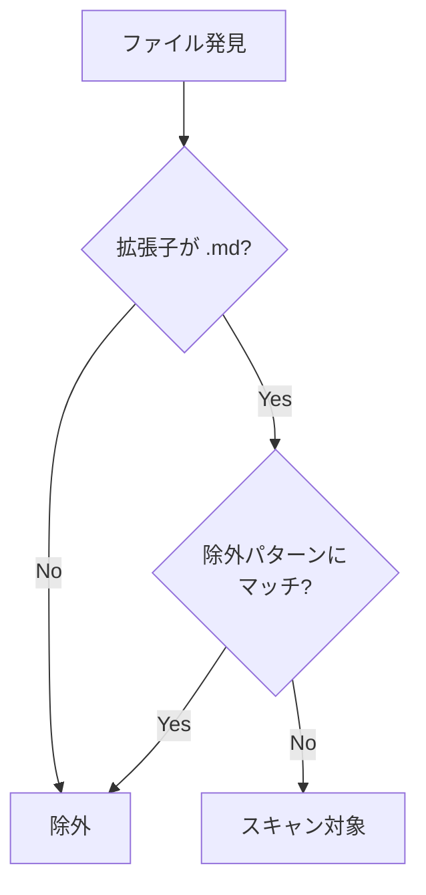

# DES-004: ドキュメントモデル設計書

## 概要

本設計書では、doc-advisor が管理するドキュメントモデルの全体構造と、スキャン対象の判定・除外ルールを定義する。

doc-advisor は ToC を **opaque な `key` 単位**で管理する。Issue #15 で旧モデル（`rule` / `spec` の 2 カテゴリ固定・`.doc_structure.yaml` 探索・`doc_type` 分類）を廃止し、上位層が決定した `key + paths` を入力とする汎用 ToC Provider へ移行した。key → 保存パス変換・ストアディレクトリ構造・ToC スキーマ・path 検証の詳細は **DES-005** が定義する。本書は、その上で継続する **スキャン対象判定・除外パターンロジック** を定義する。

## 関連要件

- REQ-001 FR-N01: key 単位 ToC 管理
- REQ-001 §6.4: 単体モード（`all`）の固定除外

---

## ドキュメントモデル（key 単位）

doc-advisor のドキュメントモデルは以下に集約される（詳細設計は DES-005）:

| 項目               | 定義                                                                                            | 参照               |
| ------------------ | ----------------------------------------------------------------------------------------------- | ------------------ |
| 管理単位           | opaque な `key`（rule/spec のような分類意味を持たない）                                         | REQ-001 FR-N01     |
| key → 保存パス変換 | `.claude/.doc-advisor/toc/{slug}/`（決定的変換）                                                 | DES-005 §3.1       |
| ストアディレクトリ | `toc.yaml` / `.toc_checksums.yaml` / `.toc_work/`                                               | DES-005 §3.2       |
| path 検証          | 絶対パス / traversal / 不在 / 非 Markdown を reject。root 外 symlink は default-deny + 明示承認 | DES-005 §5         |
| ToC スキーマ       | `title` / `purpose` / `content_details` / `applicable_tasks` / `keywords`（`doc_type` なし）    | DES-005 §7         |
| 入力               | 上位層が渡す `key` + `paths`、または `--all` 単体モード                                         | REQ-001 FR-N03/N04 |

> 旧モデルの category 別固定パス（`toc/rules/`, `toc/specs/`）・`.doc_structure.yaml` スキーマ・`doc_types_map`・`doc_type` 分類は廃止した（REQ-001 §6.2 clean break）。

---

## スキャン対象と除外ルール

単体モード（`--all`）で project root 以下の Markdown を収集する際、以下の除外ルールを適用する。除外パターン判定ロジック（`should_exclude()`）は旧モデルから継続する共通資産である（REQ-001 NFR-N02）。

### スキャンパターン

各収集起点配下の `**/*.md`。

```
収集起点/**/*.md
```

### スキャン対象判定フロー



### 除外パターンの適用

除外パターンは次のセマンティクスで判定する。このマッチャーは**システム固定除外（単体モード）と `--exclude-json` のユーザー除外で共通**であり、両者で同じ語の意味が変わらないことを保証する（Issue #30）。

- **`/` を含まないパターン（裸名）**: **任意階層のディレクトリ名に完全一致**（ファイル名は対象外。`plan` は `planning.md` を除外しない）。
- **`/` を含むパターン**: project root 起点の `rel_path` 全体との**セグメント境界マッチ**。`rel_path == pattern`（パス完全一致＝ファイル／ディレクトリ指定）または `pattern + "/"` の前置き（サブツリー指定）でマッチする。**root-anchored** であり（パスの途中からの部分一致ではない）、かつ部分文字列マッチでもないため、`a/b` が `za/bc` に誤爆せず、`docs/spec` が `docs/specs` に誤爆しない。

```python
def should_exclude(filepath, root_dir, exclude_patterns):
    rel_path = normalize_path(filepath.relative_to(root_dir))
    path_parts = rel_path.split('/')
    dir_parts = path_parts[:-1]  # ファイル名を除いたディレクトリセグメント

    for pattern in exclude_patterns:
        normalized = normalize_path(pattern.strip('/'))
        if not normalized:
            continue
        if '/' in normalized:
            # rel_path 全体とのセグメント境界マッチ（完全一致 or サブツリー前置き）
            if rel_path == normalized or rel_path.startswith(normalized + '/'):
                return True
        else:
            # ディレクトリ名の完全一致（ファイル名は対象外）
            if normalized in dir_parts:
                return True
    return False
```

### 除外例

| パス                            | 除外パターン   | 結果                                                       |
| ------------------------------- | -------------- | ---------------------------------------------------------- |
| `docs/plan/roadmap.md`          | `plan`         | 除外（任意階層のディレクトリ名一致）                       |
| `docs/specs/forge/plan/p.md`    | `plan`         | 除外（裸名は任意階層にマッチ）                             |
| `docs/requirements/planning.md` | `plan`         | **対象**（`plan` はファイル名・部分名にはマッチしない）    |
| `docs/archive/old_spec.md`      | `archive`      | 除外                                                       |
| `docs/design/info/readme.md`    | `docs/design`  | 除外（root 起点のサブツリー前置き）                        |
| `docs/design/info/readme.md`    | `design/info`  | **対象**（root-anchored。途中からの部分一致はしない）      |
| `docs/drop.md`                  | `docs/drop.md` | 除外（パス完全一致＝ファイル指定）                         |
| `docs/specs/x.md`               | `docs/spec`    | **対象**（セグメント境界。`spec` は `specs` に誤爆しない） |

### 単体モード（`all`）の固定除外

単体モード（`--all`）では、ユーザー設定ではなくコードに定義した固定除外リストを `should_exclude()` に渡して適用する。除外リストの定義（SoT）は DES-005 §9.1 を参照する。

> **Note**: 生成物（`toc.yaml`, `.toc_checksums.yaml`, `.toc_work/`）はストア配下（`.claude/.doc-advisor/toc/`）に閉じるため、`.claude/**` 固定除外で常に走査対象外となる。

---

## 関連設計書

| 設計書  | 内容                                                                                                            |
| ------- | --------------------------------------------------------------------------------------------------------------- |
| DES-003 | 文書識別子の設計（key + path 二層識別）                                                                         |
| DES-005 | key + path ToC Provider 設計（ストア構造 / スキーマ / path 検証 / 2 フェーズ sync / 単体モード / SKILL・agent） |
