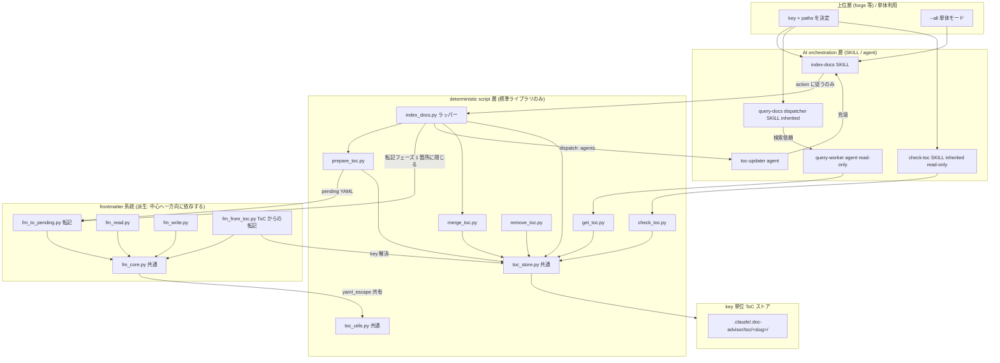
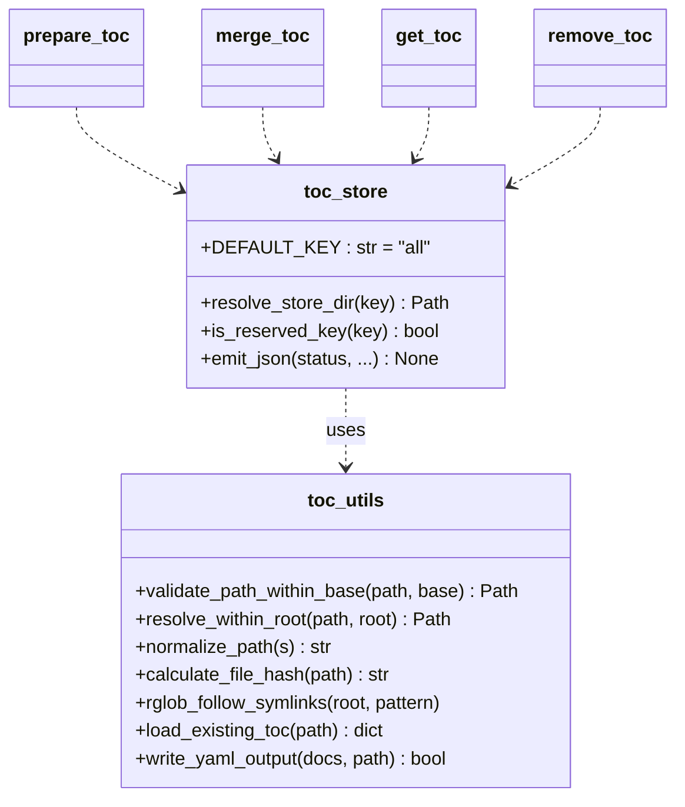
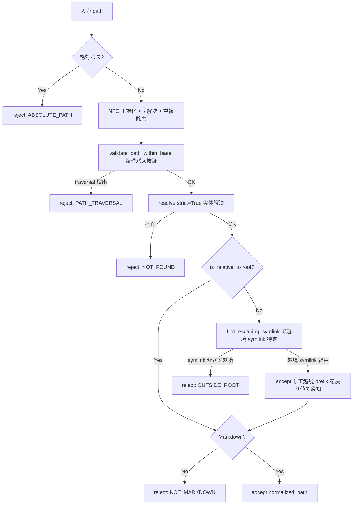
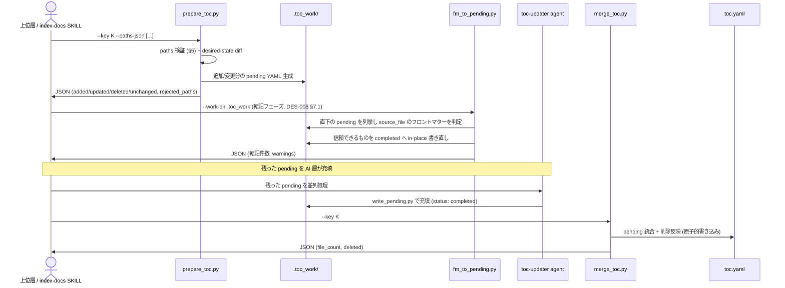
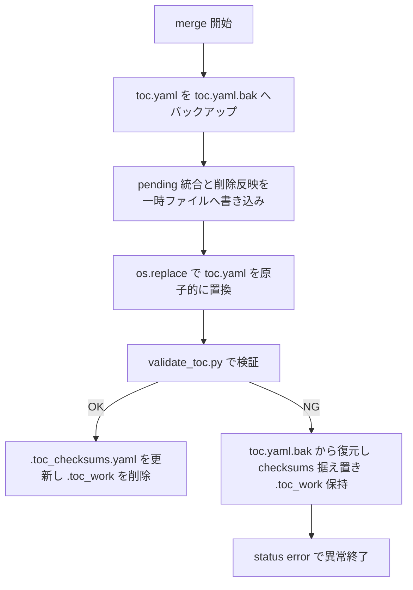
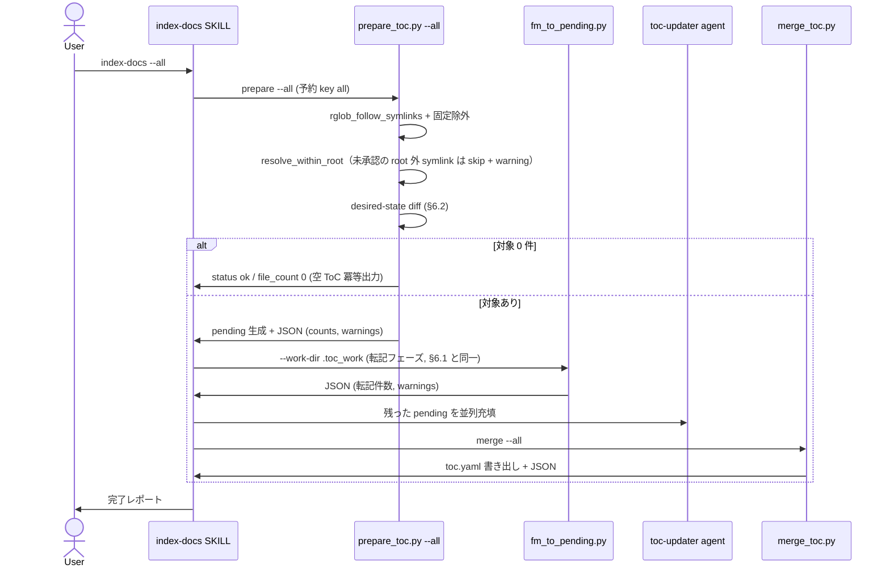
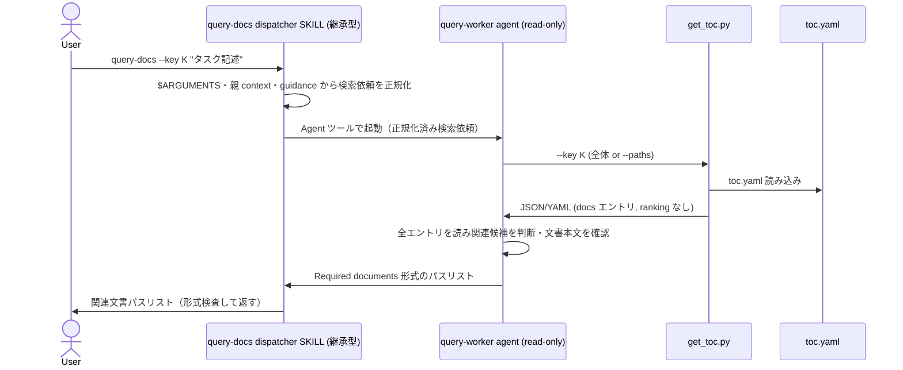

# DES-005 key + path ToC Provider 設計書

## メタデータ

| 項目     | 値                                                   |
| -------- | ---------------------------------------------------- |
| 設計 ID  | DES-005                                              |
| 関連要件 | REQ-001                                              |
| 作成日   | 2026-05-30                                           |
| 参照     | REQ-001, DES-003, DES-004, DES-009, ADR-002, FNC-002 |

## 1. 概要

REQ-001 が定める「key + project-root-relative paths を入力とする汎用 ToC Provider」を実装するための設計を定義する。旧 category（rules/specs）固定・`.doc_structure.yaml` 探索ベースの実装を、**opaque key 単位のストア**へ再編し、文書集合の決定責務を上位層へ委譲する。決定的処理（path 検証・差分検出・フロントマターからの転記・merge）と AI 処理（転記できなかった文書のメタデータ抽出）の境界を script 構成で明示する。

採用アプローチ:

- ToC を `key` 単位のストアディレクトリに分離（category 固定パスを廃止）
- desired-state sync を `prepare_toc.py`（差分検出 + pending 生成）と `merge_toc.py`（統合）の 2 フェーズに分割し、間に script 層の転記（`fm_to_pending.py`）と、転記できなかった pending への AI メタデータ充填を順に挟む
- path 検証は既存の論理パス検証（traversal）を流用しつつ、symlink 実体解決を**新規ロジック**として追加
- 全 script を単一 JSON の stdout 契約に統一

## 2. アーキテクチャ概要

### 2.1 レイヤー構成

REQ-001 FR-N07 のレイヤー責務境界を、deterministic script 層と AI orchestration 層に分離する。



### 2.2 依存方向規範 [MANDATORY]

レイヤード依存とし、下位が上位を参照しない。

1. AI 層 → script 層 → 共通モジュール（`toc_store.py` / `toc_utils.py`）→ ストアの単方向
2. script 層は AI 層を呼ばない。`prepare → merge` の間はまず script 層が転記（`fm_to_pending.py`）を行い、転記できなかった pending のメタデータ抽出のみを AI 層が担う
3. 循環依存を作らない。ToC パイプラインの共通ロジックは `toc_utils.py`（既存）と `toc_store.py`（key 解決・ストア I/O）に集約する。`frontmatter/` 配下は派生系統であり、依存は**派生 → 中心の一方向に限る**（中心側がフロントマターの知識を持つことは倒立であり許さない。例外は転記の起動 1 箇所のみ）。表記・走査規則は中心側の実装を共有し、2 実装に分けない（`fm_core.py` は `toc_utils.yaml_escape`、`fm_run.py` は `expand_dirs.py`）。key / store_dir を知るのは `fm_from_toc.py` だけとし、他は ToC を知らない汎用モジュールとして保つ。撤回時は `frontmatter/` の削除で戻せる（中心側の実装は残る）。境界の正本は DES-008 §6.1

生成系 `index-docs` と検索系 `query-docs` はいずれも継承型 SKILL であり、カスタム Agent を Agent ツールで起動する（fork 型 SKILL は Agent を起動できないため）。`index-docs` は `toc-updater` を並列起動し、`query-docs` dispatcher は read-only な `query-worker` を起動して実検索を隔離する（ADR-002 改訂版）。

## 3. ストレージ設計

### 3.1 key → 保存パス変換

REQ-001 FR-N01-3 の「決定的変換」を以下で実現する。

```text
store_dir(key) = .claude/.doc-advisor/toc/{slug}/
```

- `slug`: key を NFC 正規化（既存 `normalize_path`）後、`[a-z0-9_-]` 以外を `_` に置換し、英小文字化・連続 `_` 圧縮・長さ 40 文字で切り詰め。切り詰めの前後で前後の `_` を除去する
- slug が空（記号のみ key 等）になる場合は `slug = "k"`
- 同一 key は常に同一 slug → 同一 store_dir に解決される（決定的）

### 3.2 ストアディレクトリ構造

```text
.claude/.doc-advisor/toc/{slug}-{hash}/
├── toc.yaml           # 最終 ToC (metadata + docs)
├── .toc_checksums.yaml # key 単位の変更検出用チェックサム
└── .toc_work/         # prepare が生成する pending YAML (一時)
```

- original key は `toc.yaml` の `metadata.key` に保持される（REQ-001 FR-N01-4）
- 予約 key `all`（REQ-001 FR-N04）は `store_dir("all")` に解決する。`all` はユーザー任意 key として reject されるため（FR-N01-5）、名前空間衝突は起きない
- `.toc_work/` は merge 後に削除される一時ディレクトリであり、**`.gitignore` に登録しない**。正常動作では merge 完了時に消えるため、残存は merge 未完・クリーンアップ漏れの異常シグナルである。`.gitignore` で隠すと残存に気づけなくなるので、あえて追跡対象外（untracked）のまま放置し、`git status` で残存を目視検知できることを優先する（§6.6 continuation の再開判定もこの残存可視性に依存する）。誤 commit は `git add` を明示パスに限定する運用で防ぐ

旧 category 別固定パス（`toc/rules/`, `toc/specs/`）は廃止し、本構造へ移行する。既存ストアからの移行は行わず再生成とする（REQ-001 §6.2 clean break / 非目的「自動 migration を持たない」）。

### 3.3 key の検証

| 入力              | 扱い                                                                              |
| ----------------- | --------------------------------------------------------------------------------- |
| 空 key            | reject（`error_code: KEY_EMPTY`）                                                 |
| 過長 key          | slug 切り詰めで吸収（reject しない）                                              |
| Unicode key       | NFC 正規化後に slug 化                                                            |
| `all`（任意指定） | reject（`error_code: KEY_RESERVED`）。`--all` / `--key` 省略のみが予約 key に到達 |

> **slug 衝突について**: 異なる key が同一 slug に変換される場合（例: `"foo bar"` と `"foo/bar"` → どちらも `"foo_bar"`）、同一 store_dir を共有する。先に生成した key の ToC が上書きされてもエラーは発生しない。上位層は key の命名が slug 衝突を起こさないよう管理する責任を持つ。実用上 `rules` / `specs` / `all` のような単純な key を使う限り問題は生じない。

## 4. モジュール設計

### 4.1 モジュール一覧

| モジュール                                                   | 責務                                                                                                                        | 依存                                                                                                                          |
| ------------------------------------------------------------ | --------------------------------------------------------------------------------------------------------------------------- | ----------------------------------------------------------------------------------------------------------------------------- |
| `index_docs.py`                                              | **索引パイプラインのラッパー**。AI が呼ぶ唯一の入口。段階判定 → 配管 → `action` 出力                                        | `expand_dirs`, `prepare_toc`, `merge_toc`, `toc_store`, `frontmatter/fm_to_pending`（§4.5）                                   |
| `toc_store.py`                                               | key → store_dir 解決、JSON 出力ヘルパ、予約 key 判定                                                                        | `toc_utils`                                                                                                                   |
| `toc_utils.py`                                               | path 検証（traversal + symlink 実体解決）、glob、checksums、YAML I/O                                                        | 標準ライブラリ                                                                                                                |
| `expand_dirs.py`                                             | dirs / グロブを rglob 展開して paths 配列へ変換（**システム固定除外のみ**適用。ユーザー除外は扱わない / §4.2.2）、JSON 出力 | `toc_utils`                                                                                                                   |
| `prepare_toc.py`（旧 `create_pending_yaml.py` を改名・転用） | paths 検証 → desired-state 差分検出 → pending 生成、`--dry-run`、JSON 出力                                                  | `toc_store`, `toc_utils`                                                                                                      |
| `merge_toc.py`                                               | 充填済み pending を統合 → `toc.yaml` 書き出し（削除反映、原子的書き込み）、JSON 出力                                        | `toc_store`, `toc_utils`                                                                                                      |
| `get_toc.py`（旧 `filter_toc.py` を統合）                    | `toc.yaml` 取得（全体 or `--paths` 縮小抽出）、ranking しない、JSON or YAML 出力                                            | `toc_store`, `toc_utils`                                                                                                      |
| `remove_toc.py`                                              | key 全体削除 / `--paths` 個別エントリ削除、JSON 出力                                                                        | `toc_store`, `toc_utils`                                                                                                      |
| `check_toc.py`                                               | ToC の鮮度判定（read-only）。`metadata` のみ読み `freshness` を JSON 出力（DES-009）                                        | `toc_store`, `toc_utils`                                                                                                      |
| `write_pending.py`                                           | toc-updater agent が pending にメタデータ充填（`--key` 対応、doc_type 引数なし）                                            | `toc_utils`                                                                                                                   |
| `validate_toc.py`                                            | `toc.yaml` 検証（doc_type 必須なし、key ストアパス対応）                                                                    | `toc_store`, `toc_utils`                                                                                                      |
| `frontmatter/fm_core.py`                                     | フロントマターのパース / 生成、本文抽出・正規化、`body_hash` 計算、スキーマ検証                                             | `toc_utils`（表記・値域の規則を共有。DES-008 §6.1）。`toc_store` は import しない                                             |
| `frontmatter/fm_read.py`                                     | 渡されたパスのフロントマターを読み信頼判定（DES-008 §5.1）→ JSON 出力                                                       | `fm_core`（`toc_store` を import しない）                                                                                     |
| `frontmatter/fm_write.py`                                    | メタデータのマージ書き込み、整形実行後の `body_hash` 打刻                                                                   | `fm_core`（同上）                                                                                                             |
| `frontmatter/fm_to_pending.py`                               | 指定ディレクトリ直下の pending を転記で完了化（`status: completed`）、JSON 出力                                             | `fm_core`（同上）                                                                                                             |
| `frontmatter/fm_run.py`                                      | **書き込み SKILL が呼ぶラッパー**（plan / apply）。対象確定・除外適用・転記・書き込み・信頼判定を配管                       | `fm_core`, `fm_read`, `fm_write`, `fm_from_toc`, `expand_dirs`, `toc_utils`（走査・除外・パス基準の規則を共有。DES-008 §6.1） |
| `frontmatter/fm_from_toc.py`                                 | `toc.yaml` のメタデータを原本フロントマターへ写す転記 + 陳腐化ガード（DES-008 §8.2）                                        | `fm_core`, `toc_store`, `toc_utils`（ToC の在り処を知る唯一のモジュール）                                                     |

`create_checksums.py` の `--promote-pending` / `--clean-work-dir` 機能は `toc_store.py` に統合し、key 単位で扱う。

`frontmatter/` 配下は ToC パイプラインの派生系統であり、依存は派生 → 中心の一方向に限る（DES-008 §6.1）。pending への転記フェーズ（`fm_to_pending.py`）は prepare と AI 充填の間に置かれ、key 解決も store_dir 解決も行わず、pending の置き場所は呼び出し側が引数で渡す。key / store_dir を解決するのは `fm_from_toc.py` だけであり、ToC の在り処の知識はこの 1 モジュールに閉じる。

各 script の主な CLI オプション:

| script                         | 主なオプション                                                                                                                                                                                                                                                                                                          |
| ------------------------------ | ----------------------------------------------------------------------------------------------------------------------------------------------------------------------------------------------------------------------------------------------------------------------------------------------------------------------- |
| `index_docs.py`                | `--key` / `--all` / `--dirs` / `--paths` / `--exclude`（上位層が機械的に渡す JSON 形 `--dirs-json` / `--paths-json` / `--exclude-json` / `--paths-file` も受ける。`--on-fill-error` は confirm の答えを戻す経路。`--allow-external` は同じく confirm の答えを戻す**隠しオプション**で、`--all` の走査でのみ意味を持つ） |
| `toc_store.py`                 | `--work-status` / `--claim` / `--reset-error` / `--promote-pending` / `--clean-work-dir`（**保守・障害切り分け用**。通常経路はラッパーが内部で呼ぶ）                                                                                                                                                                    |
| `expand_dirs.py`               | `--dirs-json`（必須）/ `--paths-json` / `--project-root`（すべて JSON 配列。ラッパーが内部で呼ぶ）。**ユーザー除外の引数を持たない**（適用点は対象集合の確定後 / §4.2.2）                                                                                                                                               |
| `prepare_toc.py`               | `--key` / `--paths-json` / `--paths-file` / `--all` / `--dry-run` / `--allow-external-json`                                                                                                                                                                                                                             |
| `merge_toc.py`                 | `--key` / `--all` / `--delete-only`                                                                                                                                                                                                                                                                                     |
| `get_toc.py`                   | `--key` / `--all` / `--paths`（`--all` / `--key all` は REQ-001 FR-N04-4）                                                                                                                                                                                                                                              |
| `remove_toc.py`                | `--key` / `--all` / `--paths-json`（`--all` / `--key all` は REQ-001 FR-N04-4）                                                                                                                                                                                                                                         |
| `check_toc.py`                 | `--key` / `--all` / `--max-age`（必須）。列挙外の引数は受け取らない（REQ-005 FR-C01-4）                                                                                                                                                                                                                                 |
| `frontmatter/fm_to_pending.py` | `--work-dir`                                                                                                                                                                                                                                                                                                            |
| `frontmatter/fm_read.py`       | `--paths-json`                                                                                                                                                                                                                                                                                                          |
| `frontmatter/fm_write.py`      | `--entries-json` / `--format-command`                                                                                                                                                                                                                                                                                   |
| `frontmatter/fm_from_toc.py`   | CLI を持たない（`fm_run.py` から import して使う変換モジュール）                                                                                                                                                                                                                                                        |

### 4.1.1 ラッパー `index_docs.py`（AI が呼ぶ唯一の入口）

コア script は個々の処理を決定論的に実装しているが、**script 間の受け渡しが AI に残っていた**。実運用では 1 回の索引で AI が 15 回以上のコマンドを手で組み立て、各段の JSON から次の引数へフィールドを転記していた。とくに連続ディスパッチの空きスロット計算（`window − len(in_flight_groups)`）は、ADR-006 が「entry 数で引くと過大に減算され負になり、補充されず wave に逆戻りする」と明示的に警告している計算である。これを AI に委ねる根拠はない。

そこで **AI が呼ぶ入口を 1 本のラッパーに集約する**。AI に残す責務は次の 2 つだけである。

1. **Agent の起動** — script は Agent を起動できない
2. **判断** — 越境 symlink の承認・充填エラーへの対応（書き戻しの承認判定は `write-frontmatter` の責務 / DES-008 §8.2）

#### 呼び出し形

通常経路は 1 コマンドであり、**Agent の完了通知を受けるたびに同じコマンドを再実行する**。初回と再開を呼び出し側が区別しない（状態は `.toc_work/` が持ち、ラッパーが段階を判定する）。ウィンドウ幅・バッチサイズ・リース TTL は呼び出し側の判断材料にならないため **CLI に出さない**（ラッパー内の定数とする）。

#### 呼び出し元は 2 種類ある [MANDATORY]

「オプションをほぼ持たない入口にする」という方針は、**上位層との既存の契約を壊す理由にならない**。対象指定には 2 通りの形を両方受け付ける。

| 呼び出し元               | 形                               | 理由                                                                     |
| ------------------------ | -------------------------------- | ------------------------------------------------------------------------ |
| 人間・AI が手で打つ      | `--dirs docs/rules/ docs/specs/` | 短く、引用符のエスケープが要らない                                       |
| **上位層が機械的に渡す** | `--dirs-json '["docs/rules/"]'`  | 設定ファイルから解決した配列をそのまま渡せる。文字列へ組み立て直させない |

`--exclude` / `--paths` も同様に JSON 形（`--exclude-json` / `--paths-json`）を受け、指定されていれば連結する。

**この規定は実際に壊した経験から来ている。** ラッパー化の際に `--dirs-json` / `--exclude-json` を落として `--dirs` / `--exclude` のみとしたところ、forge の `update-db-rules` / `update-db-specs`（`.doc_structure.yaml` から解決した配列を `--dirs-json` で渡し、**index-docs を 1 回だけ呼ぶ**）が `unrecognized arguments` で失敗するようになった。上位層は再実行も引数の組み替えもしないため、**索引が動かないまま、上位層には理由が分からない**状態になる。

入口の数を絞ることと、受け付ける引数の形を絞ることは別である。前者は AI の負担を減らすが、後者は**呼び出し元を壊す**。

#### `action` の値域

| `action`   | 意味                              | 呼び出し側の動作                                 |
| ---------- | --------------------------------- | ------------------------------------------------ |
| `dispatch` | 起動すべき Agent がある           | `agents[]` の各要素で起動 → 同じコマンドを再実行 |
| `wait`     | 走行中の Agent のみ（未投入なし） | 完了通知を待つ → 同じコマンドを再実行            |
| `confirm`  | 判断が必要（`reason` を見る）     | 判断し、決定を引数に足して再実行                 |
| `done`     | 完了                              | 完了レポートを出す                               |
| `error`    | 異常                              | `error_code` / `message` を報告                  |

`agents[]` の要素は `{subagent_type, prompt, entry_files}` であり、**`prompt` は Agent へそのまま渡せる文字列**とする。呼び出し側に key と entry_file を転記させないためである。

`confirm` の `reason` は `external_symlink`（`--allow-external` で承認を渡す。**`--all` の走査でのみ起きる** / §5.3）と `fill_error`（`--on-fill-error retry|merge|abort`）の 2 種であり、いずれも稀な経路である。**通常経路では引数が増えない。**

`done` は完了レポートに必要な値をすべて含める。`transcribed`（転記件数）は **merge の出力から導出する**（`added + updated − len(ai_extracted_paths)`）。ラッパーは状態を持たないため複数回の呼び出しにまたがる転記件数を自分では積算できないが、充填が完了した pending には必ず来歴（`_meta.extracted_by`）が書かれるため、統合された文書は転記か AI 抽出のいずれかに必ず分類される。この導出により、転記件数のために `merge_toc.py` へ新しい出力項目を足す必要がない。

#### コア script の呼び方

**コア script の CLI 契約（stdout に単一 JSON / §8.1）をそのまま使う。** `main(argv)` を同一プロセスで呼び、stdout をリダイレクトして JSON を受け取る。理由は 2 つある。

1. **コア script を一切変更しない。** ラッパーのために新しい戻り値の経路を足すと、コア script を単体で使ったときとラッパー経由で使ったときで挙動が分岐しうる。CLI 契約が唯一の出口であり続ける方が、両者の一致が構造的に保たれる
2. subprocess を使わないため Python の起動コストが 1 回で済み、stderr のログはそのまま呼び出し側へ流れる（進捗が見える）

`toc_store` のみ関数を直接 import する。`store_dir` の解決結果は JSON 契約に現れないため（CLI は `toc_path` しか返さない）CLI 経由では受け取れない。

#### コア CLI の位置づけ [MANDATORY]

コア script の CLI は**残す**（テストと障害切り分けに必要）。ただし **SKILL / agent からは呼ばない**。呼ぶのはラッパーのみとする。二重の入口を持つと状態が食い違う（prepare を再実行して充填済み pending を壊す、claim せずに Agent を起動して二重投入する等）。この規約は各 SKILL.md の禁止事項にも明記する。

#### フロントマター依存の閉じ込め

転記の呼び出しは**ラッパー内の 1 関数に閉じる**。フロントマター方式を撤回する場合はその関数と呼び出し 1 行を削るだけで全体が通る（転記 0 件と等価になり、すべての pending が AI 抽出へ回る）。`scripts/frontmatter/` をディレクトリごと削除できる状態を保つための境界である（DES-008 §6.1）。

この境界が実際に成立していることは**テストで固定する**。`frontmatter/` を含まない `scripts/` のコピーを作ってラッパーを実行し、索引が完了することを確認する。実装当初は転記関数が `ImportError` を捕捉しておらず、ディレクトリを削除するとラッパー全体がクラッシュした。「1 ディレクトリの削除で戻せる」という主張は、テストを書くまで成立していなかった。

**「撤回」と「破損」を区別する [MANDATORY]**: 許容するのは**方式の不在だけ**である。`frontmatter/` ディレクトリが存在しないのは撤回であり、転記 0 件として続行してよい。一方 **ディレクトリが存在するのに転記モジュールを読み込めない場合は破損**であり、`action: error`（`error_code: READ_ERROR`）とする。

**何が失われるのかを正確に述べる**。破損時に転記 0 件として続行しても、未信頼の文書は AI 抽出へ回るため索引は `done` に到達し、**生成される `toc.yaml` の内容は正しい**（AI 抽出は転記のフォールバック先として正常な経路であり、DES-008 §7.1 がそう規定している）。失われるのは**転記による高速化だけ**である。したがってここで防ぎたいのは「誤った ToC が出ること」ではなく、**配布物が壊れたまま性能劣化が黙って続くこと**である。

それでも error とする理由は、**配布物の部分破損は放置してよい状態ではない**からである。転記は 600 件規模の索引コストを削減するために導入した機構であり（DES-008 §2）、それが恒久的に機能していないのに `done` が返り続ければ、利用者は「そういう速度のツールだ」と受け取る。warning は自動実行で見落とされるため、成功経路に載せてはならない。

この判断は**可用性とのトレードオフ**である。error にすると、AI 抽出では索引できる状態でも索引が止まる。撤回（ディレクトリの不在）を error にせず続行させているのは、そちらは**意図された状態**であり放置すべき異常ではないためである。区別の基準は「異常か否か」であり、「索引できるか否か」ではない。

区別はディレクトリの有無で行う。`ImportError` の捕捉だけでは、`fm_to_pending` 自身とその依存の破損を撤回と同一視してしまう。

**捕捉するのは `ImportError` ではなく `Exception` 全体とする [MANDATORY]**。構文エラーは `SyntaxError` であり `ImportError` ではない。捕まえ損ねると例外が `main()` の外へ伝播して traceback で終了し、**§8.1 の「stdout に単一 JSON」という契約を破る**。呼び出し側は `action` で分岐するため、機械的に扱えない終了は silent success とは別種の欠陥である（「破損が露見するから放置してよい」とはならない）。`KeyboardInterrupt` / `SystemExit` は `BaseException` 派生であり捕まえない（利用者による中断を握りつぶさない）。

### 4.2 toc_utils.py の改修方針

| 廃止 / 改修                                                                                                                                                                                                                       | 理由                                                                |
| --------------------------------------------------------------------------------------------------------------------------------------------------------------------------------------------------------------------------------- | ------------------------------------------------------------------- |
| `load_config()` の category 分岐 / `_get_default_config()` の rules/specs 固定キー                                                                                                                                                | REQ-001 §6.2 旧 category ロジック削除                               |
| `init_common_config()` の `root_dirs` / `doc_types_map` 探索・`ConfigNotReadyError`                                                                                                                                               | doc_structure 探索廃止。key + paths を直接受け取る                  |
| `find_config_file()`（`.doc_structure.yaml` 探索）                                                                                                                                                                                | 通常経路で `.doc_structure.yaml` を読まない（REQ-001 受け入れ基準） |
| 流用: `normalize_path` / `calculate_file_hash` / `rglob_follow_symlinks` / `should_exclude` / `load_existing_toc` / `write_yaml_output` / `yaml_escape` / `validate_path_within_base` / `write_checksums_yaml` / `load_checksums` | REQ-001 NFR-N02 既存資産再利用                                      |

### 4.2.1 パスの基準は入口で 1 つに固定する [MANDATORY]

project-root-relative なパスからファイルを開く作法が 2 つある。**project root と結合してから開くもの**（`prepare_toc` / `merge_toc` の hash 計算、`frontmatter/fm_from_toc.py` の陳腐化ガード）と、**相対パスをそのまま渡して cwd に解決させるもの**（`fm_core.read_text` 経由の読み書き、`frontmatter/fm_to_pending.py`）である。

どちらも単独では正しいが、**1 回の実行で両方を通ると別のファイルを指しうる**。実際に `fm_run` では「`$CLAUDE_PROJECT_DIR/docs/a.md` の hash を照合して『変更なし、転記して安全』と判断し、`$PWD/docs/a.md` へ書き込んで `body_hash` を打刻する」経路が成立していた。照合した対象と書き込む対象が別物になり、陳腐化ガードが機能しない。`index_docs` も同じ組み合わせを 1 実行で通す。

**したがって 2 つの作法が交差する入口 ——`index_docs.py` と `frontmatter/fm_run.py` の `main()` は、先頭で `toc_utils.ensure_project_root_cwd()` を呼び、cwd を project root へ揃える。** 一致を検査して弾く形は採らない ——それは症状を止めるだけで 2 つの作法が残り、次の交差点で再発する。基準を 1 つにすれば食い違いが起こり得ない。

**対象はこの 2 本に限る。** コア script（`prepare_toc` / `merge_toc` / `write_pending` / `fm_read` / `fm_write` / `fm_to_pending`）は通常経路ではこのラッパー 2 本の内側から呼ばれ、cwd を継承するため揃っている。単独起動はテストと障害切り分けの経路であり、そこでは呼び出し側が cwd を決める。全 CLI へ同じ呼び出しを配ると、**同じ規則の適用点が 8 箇所に増える**——本節が塞ごうとしている「同じことを複数箇所でやる」に自ら反する。**交差が新しい入口で生じたときに、その入口へ足す。**

**cwd を変える前に、argv で受け取ったファイルの位置を絶対パスへ解決する**（`--entries-file` / `--paths-file`）。これらは呼び出し元の cwd 基準で渡され得る。`--paths` / `--dirs` は契約上 project-root-relative なので影響しない。

### 4.2.2 除外は「確定した対象集合」へ適用する [MANDATORY]

`--exclude` は**選び方ではなく、選んだ結果から何を落とすか**である。したがって適用点は**対象集合の確定後**であり、ディレクトリ展開の内側ではない。

以前はユーザー除外を `expand_dirs` の rglob 中でのみ適用していた。その結果、対象の出どころが `--dirs` 以外のとき（明示 paths のみ / `--from-toc` の ToC 全件）は**黙って無視された**。とくに `apply --from-toc --exclude`（`--dirs` なし）は対象 0 件から全件フォールバックへ落ち、「除外して」と指定した原本まで書き換えた ——**指定と正反対の結果**である。同じ黙殺が `index_docs`（明示 paths のみの経路）にもあった。

| 対象の出どころ           | 除外の適用                                                                    |
| ------------------------ | ----------------------------------------------------------------------------- |
| `--dirs` の展開結果      | 確定後に `toc_utils.filter_excluded` で適用                                   |
| 明示 `--paths`           | 同上                                                                          |
| `--from-toc` の ToC 全件 | 同上                                                                          |
| **単体モード**の全走査   | システム固定除外のみ。**ユーザー除外との併用は拒否する**（`UNSUPPORTED_ARG`） |
| `--paths-file` の配列    | 同上。配列はファイルのまま prepare へ渡され、ラッパーの手元で確定しない       |

- **`expand_dirs` はユーザー除外の引数を持たない**（`--exclude-json` を削除した）。渡さないだけでは同じ規則の適用点が 2 つ残るため、機構ごと消して適用点を 1 つにする。`expand_dirs` は**システム固定除外**の適用を続ける ——走査中に落とすことがその責務であり、利用者の指定とは別の規則である
- 判定そのものは `should_exclude` を共有する。システム固定除外とユーザー除外で意味論が食い違わないようにするため、規則の実装は 1 つだけ置く
- **適用できない経路では拒否する（黙って捨てない）[MANDATORY]**。単体モードは prepare が project root 以下を自分で走査し、`--paths-file` は配列をファイルのまま prepare へ渡すため、どちらも**対象集合がラッパーの手元に無い**。適用できないまま受理すると「除外したつもりの文書が索引される」ので、`UNSUPPORTED_ARG` で拒否して理由を伝える。適用できる経路（`--dirs` / `--paths`）では従来どおり適用する
- **判定は「単体モードか」で行い、`--all` の有無で行わない [MANDATORY]**。単体モードへは `--all` の明示と `--key` の省略の 2 つの入口があり（REQ-001 FR-N04-1）、フラグで判定すると後者が素通りする。実際に素通りし、`--dirs` の展開結果へ除外を適用して**「除外した」という警告まで出したうえで**、その結果が単体モード分岐で捨てられていた（報告と実態が食い違う状態）
- **落とした件数を `warnings` に載せる。** 黙って対象から消すと、指定が効いたのか対象が無かったのかを呼び出し側が区別できない

`--exclude` はディレクトリ専用ではない。`should_exclude` の意味論により、ファイル指定（`docs/drop.md`）・サブツリー指定（`docs/draft`）・任意階層のディレクトリ名（`draft`）のいずれも書ける。

### 4.2.3 対象指定の出どころは 1 つに限る [MANDATORY]

`--paths-file` は `--dirs` / `--paths` / `--dirs-json` / `--paths-json` と**併用できない**。併用は `UNSUPPORTED_ARG` で拒否する。

`--dirs` と `--paths`、およびそれぞれの JSON 形は連結される（§4.1.1）。一方 `--paths-file` は配列をファイルのまま prepare へ渡す経路であり、連結する先が無い。**優先関係を推定して片方を黙って捨てることが、§4.2.2 の黙殺と同じ欠陥になる。** 指定が競合したときに正しい方を当てる方法は無く、当てられなかったとき利用者には「指定したのに索引されない文書がある」ことしか見えない。

拒否は `--exclude` の併用拒否（§4.2.2）と同じ理屈である。**適用できない指定を受理しない。**

### 4.3 主要関数のクラス図（共通モジュール）



## 5. path 検証設計

REQ-001 §6.1 を実装する。**traversal 検証は既存 `validate_path_within_base()` を流用し、symlink 実体解決は別ロジック `resolve_within_root()` として新規実装する**。

### 5.1 検証フロー



**単体モード以外では越境 symlink を止めない [MANDATORY]**: `validate_path` は越境 symlink を受理し、越境した prefix を戻り値の第 2 要素で通知する。`prepare_toc.py` はそれを warning（解決先の実体パスと件数を含む）に変換して索引を続行する。REQ-001 §6.1a のとおり、何を索引するかの決定は呼び出し元に属し、doc-advisor は透明性で安全性を担保する。

確認を要求するのは **単体モードの走査のみ**（`--all` / `--key` 省略。§5.3）。対象指定の形による違いはない——`--dirs` / `--dirs-json` / `--paths` / `--paths-json` / `--paths-file` はいずれも同じ経路を通り、すべて索引する。この経路では誰も対象を渡していないため、`status: needs_confirmation` で止めて承認を求める（§8.2）。承認は `--allow-external-json` で戻す。これは SKILL が `AskUserQuestion` で取った決定を戻す内部的な通路であり、上位層との契約ではない（§10.1 の公開引数表には載せない）。

### 5.2 新規ロジック `resolve_within_root()` / `find_escaping_symlink()`

- `resolve_within_root()`: `Path.resolve(strict=True)` で symlink を辿って実体を解決（不在は `FileNotFoundError` → NOT_FOUND として扱い、REQ-001 FR-N03-4 の不在 reject と兼ねる）。`Path.is_relative_to(project_root)`（Python 3.9 で追加。サポート下限は REQ-001 NFR-N01 で 3.11 に確定）で root 配下を判定し、root 外実体は `PathRejection(OUTSIDE_ROOT)` を送出する低レベル primitive。
- `find_escaping_symlink(rel_path, root)`: root から path コンポーネントを順に辿り、最初に「symlink かつ実体が root 配下でない」prefix（= 承認の単位）を返す。越境 symlink が無ければ None。
- `validate_path(path, root)`: `resolve_within_root()` の OUTSIDE_ROOT を捕捉し、`find_escaping_symlink` で越境点を特定する。越境 symlink 経由なら**受理**し `(normalized_path, symlink_prefix)` を返す。symlink を介さない真の越境なら OUTSIDE_ROOT を再送出する（traversal 相当であり、誰も symlink を張っていない root 外参照である）。越境していなければ第 2 要素は `None`。
- 大文字小文字衝突は正規化後パスの集合で検出し warning（処理は継続）

既存 `validate_path_within_base()` の docstring（symlink 先を意図的に許可）は変更せず、traversal 専用として流用する。

**戻り値をタプルにした理由**: 越境の事実は「例外か否か」ではなく「付随情報」になった。呼び出し元へ通知する経路が必要だが、accept 後に `find_escaping_symlink` を再実行すると同じ走査を 2 度行う（1 path あたり深さ分の `resolve` が増える）。受理の判定と同時に得られる値をそのまま返す方が正確かつ安価である。

### 5.3 単体モード走査との関係

`--all` 収集は `rglob_follow_symlinks`（`os.walk(followlinks=True)`）で symlink を follow して列挙するが、**列挙後に各ファイルへ `resolve_within_root()` を適用する**。root 外実体を指すものは、承認済み（`allow_external`）なら収集対象に含め、未承認なら収集から外して `external_pending` に集約し、`status: needs_confirmation` で確認を求める。

**明示 paths との非対称は意図的である**（REQ-001 §6.1a）。明示 paths は呼び出し元が索引対象として渡したものであり確認しない。一方この走査で見つかる symlink は誰も渡していないため、project root の外へ勝手に広げない。両経路とも最終的に「実体が root 配下、または呼び出し元が渡した／ユーザーが承認した越境 symlink 配下」を保証する。

## 6. desired-state sync 設計

### 6.1 prepare / merge 2 フェーズ（FR-N07-3）



転記は per-file の判定を `prepare_toc.py` に持たせるものではなく、prepare と充填の間に置く独立したフェーズである。転記済みの pending は `_meta.status: completed` になるため `toc_store.py --work-status` の `pending` / `pending_groups` に現れず、充填フェーズの対象から自動的に外れる。全件を転記できた場合は Agent を 1 つも起動せず merge へ直行する（DES-008 §7.1）。

### 6.2 差分検出アルゴリズム

paths を当該 key の完全な desired state として扱う（REQ-001 FR-N02）。

1. 入力 paths を §5 で検証・正規化 → `desired`（集合）
2. `store_dir/.toc_checksums.yaml` から前回状態 `prev`（path → hash）を読む
3. 各カテゴリを算出:
   - **added**: `desired - prev.keys()`
   - **updated**: `desired ∩ prev.keys()` かつ現在の SHA-256 が `prev[path]` と不一致
   - **unchanged**: `desired ∩ prev.keys()` かつ hash 一致
   - **deleted**: `prev.keys() - desired`
4. added + updated について pending YAML を生成（merge 待ち）
5. deleted は merge フェーズで `toc.yaml` から除去

`--dry-run` 時は手順 4-5 を行わず、件数と path 一覧のみ JSON 出力（REQ-001 FR-N02-5）。

### 6.3 desired-state の破壊性（REQ-001 受け入れ基準）

部分配列を渡すと `prev` の残りが deleted となり ToC から消える。これは仕様であり上位層の責務。`prepare_toc.py` は deleted 件数を JSON に明示し、`--dry-run` で事前確認できるようにする。回帰テストで「部分配列 → 残り削除」を固定する。

### 6.4 work file 名

work file 名は `sha256(source_file)[:16].yaml` とする。衝突空間は key 単位ストア配下に閉じる。

### 6.5 バックアップと異常系（merge 失敗時の復元）

REQ-001 NFR-N07 を反映する。`merge_toc.py` は ToC 書き出しの backup → validate → restore フローを key 単位ストアに対して定義する（旧 category 単位フローを key 単位へ再編）。



- 原子的書き込み（`os.replace`、既存 `write_yaml_output`）で書き込み途中の破損を防ぐ
- 検証失敗時は `toc.yaml.bak` から復元し、checksums を更新せず `.toc_work/` を保持して再実行可能とする
- バックアップ・work ファイルは当該 key の `store_dir` 配下に閉じるため、他 key の merge と干渉しない

### 6.6 中断耐性と continuation（key 単位）

continuation モードを key 単位ストアで成立させる。`.toc_work/` を `store_dir/.toc_work/` に置くことで、再開判定と work dir 競合回避を key 単位に閉じる。

| 状況                                         | 判定                                                                          |
| -------------------------------------------- | ----------------------------------------------------------------------------- |
| `store_dir/.toc_work/` が存在し pending あり | 当該 key の prepare を再実行せず、残 pending を転記 → 充填 → merge の順で処理 |
| `store_dir/.toc_work/` が存在し全 completed  | 当該 key の merge へ直行                                                      |
| `store_dir/.toc_work/` なし                  | 通常の prepare から開始                                                       |

- 複数 key を同時に処理しても、各 key の `.toc_work/` は別ディレクトリのため競合しない
- continuation 判定は `index-docs` SKILL が key ごとに行う（orchestrator パターン §10 を key 単位で適用）

## 7. ToC スキーマ設計

### 7.1 doc_type の除去（非目的）

`formats/toc_format.md` から `doc_type` を除去する。category 廃止により doc_type 自動分類が成立しないため。

```yaml
# 改訂後 toc.yaml（doc_type 削除）
metadata:
  name: string # key 由来の索引名
  key: string # original key
  generated_at: datetime
  file_count: integer
docs:
  <project-relative-path>:
    title: string
    purpose: string
    content_details: array[string] # 1..10
    applicable_tasks: array[string] # 1..10
    keywords: array[string] # 1..10
```

- pending YAML の `_meta` からも `doc_type` を削除。`write_pending.py` の `--doc-type` 関連引数を廃止
- `validate_toc.py` の必須フィールドから `doc_type` を除外（title/purpose + 3 配列のみ必須）
- 検索（query-docs）は title/purpose/keywords を AI が読む方式（FNC-002 継続）で、doc_type 除去による検索機能影響はない

### 7.2 metadata 拡張

`metadata.key` に original key を併記し、ToC 単体でも由来 key を追跡可能にする。`merge_toc.py` は `--key` 引数の値を `metadata.key` に書き出す。

## 8. JSON 出力契約

### 8.1 共通スキーマ（REQ-001 FR-N08）

全 script は stdout に単一 JSON、ログ・進捗は stderr（既存 `log()` を踏襲）。ただし `get_toc.py` の `--format yaml` は検索 SKILL が AI に渡す用途の例外で、既定は JSON、`--format yaml` 指定時のみ ToC 本体の生 YAML を stdout に出す（§4.1 の「JSON or YAML 出力」に対応）。

```json
{
  "status": "ok | error | partial | needs_confirmation",
  "error_code": "INVALID_PATH | PATH_TRAVERSAL | ABSOLUTE_PATH | OUTSIDE_ROOT | NOT_FOUND | NOT_MARKDOWN | KEY_EMPTY | KEY_RESERVED | TOC_NOT_FOUND | NO_TARGETS | UNSUPPORTED_ARG | INVALID_MAX_AGE | TOC_READ_ERROR | READ_ERROR | null",
  "message": "human-readable",
  "key": "rules",
  "toc_path": ".claude/.doc-advisor/toc/rules-<hash>/toc.yaml",
  "normalized_paths": ["docs/a.md"],
  "rejected_paths": [{ "path": "../x.md", "reason": "PATH_TRAVERSAL" }],
  "counts": { "added": 0, "updated": 0, "deleted": 0, "unchanged": 0 },
  "warnings": ["case-insensitive collision: docs/A.md vs docs/a.md"],
  "ai_extracted_paths": ["docs/a.md"],
  "external_pending": [
    {
      "symlink": "meta",
      "resolved": "/abs/path/outside/root",
      "affected_count": 12
    }
  ]
}
```

### 8.2 enum 定義

| フィールド           | 値域                                                                                                                                                                                                                          |
| -------------------- | ----------------------------------------------------------------------------------------------------------------------------------------------------------------------------------------------------------------------------- |
| `status`             | `ok` / `error` / `partial`（一部 path を reject しつつ処理続行）/ `needs_confirmation`（**単体モードの走査が**未承認の root 外 symlink を見つけ、書き込みをせず承認を待つ。明示 paths では返らない。NFR-N06 / §5.3）          |
| `error_code`         | §8.1 の列挙値 + `null`。`toc_store.py` に定数として集約し、テストで enum を固定（REQ-001 FR-N08-2）                                                                                                                           |
| `external_pending`   | `status: needs_confirmation` 時に出力（単体モードのみ）。`[{symlink, resolved, affected_count}]`（越境 symlink 単位に集約）。明示 paths で越境 symlink を索引した場合は同じ内容を warning として出す                          |
| `ai_extracted_paths` | project-root-relative path の配列（昇順）。`merge_toc.py` 固有。今回の run で AI 抽出（pending の `_meta.extracted_by: ai`）により索引された文書のうち、最終 `docs` に残ったもの。`status: ok` 時のみ出力し、該当なしは空配列 |

各 script は使うフィールドのみ出力してよいが、`status` / `error_code` は必須。越境 symlink 関連の `OUTSIDE_ROOT` は「symlink を介さない真の root 外」専用に残す。symlink 経由の越境は、明示 paths では warning、単体モードの走査では `needs_confirmation` + `external_pending` で扱う。

`error_code` の値域は最上位フィールドだけでなく、`rejected_paths[].reason` のように
error_code 値を載せる入れ子フィールドにも適用する。

`READ_ERROR`（対象文書そのものを読めない。権限不足・デコード不能等）はフロントマターの
読み取り経路が個々のファイルの失敗理由として使う（DES-008 §6.2）。不在は `NOT_FOUND`、
`toc.yaml` の読み取り失敗は `TOC_READ_ERROR` と区別する。

`INVALID_MAX_AGE`（`--max-age` が未指定・非整数・0 以下）と `TOC_READ_ERROR`（`toc.yaml` を読めない）は
`check_toc.py` が使う（DES-009 §5.2）。`check_toc.py` は §8.1 の共通フィールドに加えて `freshness` / `reason` /
`generated_at` / `age_seconds` / `max_age_seconds` を出力し、`status` は `ok` / `error` の 2 値のみを取る。
ToC 不在は `TOC_NOT_FOUND` ではなく `status: ok` + `freshness: stale` として返す（REQ-005 FR-C03-3。
`get_toc.py` が不在を `TOC_NOT_FOUND` とするのと意図的に異なる）。

`ai_extracted_paths` は `merge_toc.py` が出力する報告専用フィールドであり、DES-008 §8.2 の書き戻し候補を
`index-docs` SKILL へ渡すためにある。`toc.yaml` にも checksums にも書き出さず、pending 統合・原子的書き込み・
検証・checksums 更新の**処理ロジックには影響しない**（DES-008 §7.1 の無改造範囲は JSON 出力への項目追加を含まない）。
ToC の生成が完了していない経路（書き込み失敗・validation 失敗で `.toc_work/` を保持する経路）では出力しない。
`--delete-only` は pending を統合しないため常に空配列となる。

## 9. 単体モード（all-markdown）設計

REQ-001 FR-N04。`--all` / `--key` 省略時、予約 key `all` に解決し project root 以下の Markdown を対象にする。

### 9.1 走査と除外

- `rglob_follow_symlinks(project_root, "**/*.md")` で列挙
- 固定除外（**本リストが除外定義の SoT**。要件は REQ-001 FR-N04-3）: `.git/**`, `.claude/**` runtime state, `.codex/**`, `node_modules/**`, `vendor/**`, `dist/**`, `build/**`, `__pycache__/**`, `.venv/**`, `target/**`, `coverage/**`, `.pytest_cache/**`, `.mypy_cache/**`, 生成済み ToC / work files。既存 `should_exclude()`（DES-004）に固定除外リストを渡して適用
- 列挙後に `resolve_within_root()` を適用し、root 外実体の symlink は未承認なら `external_pending` に集約して `needs_confirmation` で確認を求め、承認済み（`--allow-external-json`）なら収集対象に含める（§5.3 / NFR-N06）

### 9.2 境界条件

- 最大ファイル数超過時は `warnings` に含め処理継続（REQ-001 NFR-N05、閾値は 100 件）
- 空 repo / 対象 0 件は `error` ではなく空 `toc.yaml` を冪等出力（`status: ok`, `file_count: 0`）

### 9.3 単体モードのシーケンス



転記フェーズは単体モードでも key 指定と同一である。prepare が生成する pending の形式は
モードによらず同じであり、転記を省く根拠がないためである（§6.1 の記述を正典とする）。

## 10. SKILL / agent 設計

key + path 汎用化（REQ-001 §6.2）に伴い、SKILL / agent を以下のコンポーネントへ一本化する。

| コンポーネント      | 種別                            | 責務                                                                                                                                                                                                                                                                                                                   |
| ------------------- | ------------------------------- | ---------------------------------------------------------------------------------------------------------------------------------------------------------------------------------------------------------------------------------------------------------------------------------------------------------------------- |
| `index-docs`        | SKILL（継承型）                 | **`index_docs.py` を呼び、返る `action` に従う**（§4.1.1）。Agent の起動と判断のみを担い、配管はラッパーが行う。`action: done` の `ai_extracted_paths` を提示し、全件を `write-frontmatter` へ `--paths` と `--from-toc <key>` で引き渡す（承認の要否の判定は引き渡し先が行う。原本は自ら書き換えない / DES-008 §8.2） |
| `query-docs`        | SKILL（継承型 dispatcher）      | `$ARGUMENTS`・親 context・guidance から検索依頼を構築し `query-worker` を起動。`--key` 省略時は予約 key `all`                                                                                                                                                                                                          |
| `check-toc`         | SKILL（継承型）                 | `check_toc.py` を 1 回呼び `freshness` を返す read-only なラッパ。`--key` / `--all` / `--max-age`（DES-009）                                                                                                                                                                                                           |
| `write-frontmatter` | SKILL（継承型）                 | 対象文書の本文からメタデータを作成し `fm_write.py` でフロントマターへ書き込む。承認の要否は `write_policy` に従う（doc-advisor の既存フロントマターの更新は承認不要、新規追加はユーザ承認を取る / DES-008 §8.1 / §8.2 / §10.1）                                                                                        |
| `query-worker`      | Agent（Read, Grep, Glob, Bash） | `get_toc` を呼び ToC 全エントリ読解・関連判断・`Required documents:` 返却（read-only）                                                                                                                                                                                                                                 |
| `toc-updater`       | Agent（Read, Bash）             | pending を読み元文書からメタデータ抽出 → `write_pending.py --key` で充填                                                                                                                                                                                                                                               |

ADR-002 改訂版（継承型 dispatcher + read-only worker 隔離）を `query-docs` / `query-worker` が実装する。orchestrator パターン（Phase 2 並列・中断耐性・continue モード、§6.6）を `index-docs` が用いる。

### 10.1 SKILL の引数契約 [MANDATORY]

**SKILL の引数は上位層との公開インターフェースであり、その正本は本設計書に置く。**

#### なぜ設計書に置くのか

以前は SKILL の引数仕様が `plugins/doc-advisor/skills/*/SKILL.md` にしか存在しなかった。SKILL.md は配布物であり、方式変更のたびに全面書き換えの対象になる。**唯一の正本が書き換え対象そのものだったため、上位層との契約が書き換えで消えても突き合わせる相手がいなかった。**

実際に消えた。ラッパー化（§4.1.1）の際に `index-docs` から `--dirs-json` / `--exclude-json` が落ち、forge の `update-db-rules` / `update-db-specs` / `query-db-rules` / `query-db-specs` が `unrecognized arguments` で失敗した。上位層は再実行も引数の組み替えもしないため、**索引が動かないまま、上位層には理由が分からない**状態になる。

以後、SKILL.md は本節の実装であり、正本ではない。SKILL.md を書き換えたら本節と突き合わせる。

#### 契約（受け付けなければならない引数）

`index-docs`:

| 引数                     | 主な呼び出し元                                                       | 備考                                                                               |
| ------------------------ | -------------------------------------------------------------------- | ---------------------------------------------------------------------------------- |
| `--key <key>`            | 上位層 / 利用者                                                      | `all` は予約語のため任意指定不可                                                   |
| `--dirs <dir>...`        | 人間・AI が手で打つ                                                  | グロブメタ文字可                                                                   |
| `--dirs-json '[...]'`    | **上位層（forge）**                                                  | 設定から解決した配列をそのまま渡す形。`--dirs` と併用可                            |
| `--paths <path>...`      | 人間・AI が手で打つ                                                  | 当該 key の完全な desired state                                                    |
| `--paths-json '[...]'`   | 上位層 / README 記載                                                 | 同上                                                                               |
| `--paths-file <path>`    | 上位層（中身は **paths 配列そのもの**。`{"paths": [...]}` ではない） | 長大な配列を argv に載せないための形。他の対象指定との併用不可                     |
| `--exclude <path>...`    | 人間・AI が手で打つ                                                  | 確定した対象集合からの除外（**単体モード** / `--paths-file` とは併用不可。§4.2.2） |
| `--exclude-json '[...]'` | **上位層（forge）**                                                  | `--exclude` と併用可                                                               |
| `--all`                  | 利用者                                                               | 予約 key `all`（**単体モードの入口の 1 つ**）。対象指定・`--exclude` と併用不可    |
| ~~`--allow-external`~~   | —                                                                    | **公開しない**。`--all` の confirm の答えを戻す隠しオプション（§5.3）              |
| `--on-fill-error <mode>` | 利用者（`confirm` 後）                                               | 例外経路のみ（`reason: fill_error`）。`retry` / `merge` / `abort`                  |

> **併用不可はフラグではなくモードに紐づく [MANDATORY]**: 単体モード（project root 以下の全走査）へ入る書き方は **`--all` の明示と `--key` の省略の 2 つ**であり、REQ-001 FR-N04-1 と同要件の一元定義表がこれを同義と定めている。したがって上表の「対象指定と併用不可」「`--exclude` と併用不可」は、**`--key` を省略した場合にも等しく適用する**。上表はフラグ単位で並んでいるため `--all` の行にしか現れないが、条件はモードである。
>
> 実装で `args.all` だけを見ると `--key` を省略した呼び出しがガードを素通りし、渡した対象指定が prepare の単体モード分岐で捨てられる。**その帰結は「1 件だけ索引するつもりが project root 全体が索引され、desired-state のため当該 key の ToC の内容も全件へ置き換わる」**であり、実際にこの欠陥が発生した（§4.2.2 / §4.2.3 が [MANDATORY] で禁じた黙殺そのものである）。判定は `--all` の有無ではなく「単体モードか」で行う。

`query-docs`: `--key <key>`（省略時は予約 key `all`）＋ 自然文のタスク記述。**検索側に対象指定の黙殺は無い**（`get_toc` は `--key` 省略時も `--paths` の縮小抽出を尊重する）。制約が生じるのは走査を伴う索引側だけである。
`check-toc`: `--key <key>` / `--all` / `--max-age <秒>`（必須。DES-009）。
`write-frontmatter`: DES-008 §8.1 に規定する。

#### 変更規約

| 変更                     | 手順                                                                                                                               |
| ------------------------ | ---------------------------------------------------------------------------------------------------------------------------------- |
| 引数を**追加**する       | 本節に追記する。既存の呼び出し元は壊れない                                                                                         |
| 引数を**削除・改名**する | **後方互換を壊す変更**。呼び出し元を横断 grep で確認し、計画に個別項目として挙げて承認を得てから行う                               |
| 受け付ける**形**を減らす | 削除と同じ扱い。入口の数を絞ることと、受け付ける引数の形を絞ることは別である（前者は AI の負担を減らすが、後者は呼び出し元を壊す） |

**既知の呼び出し元**（横断 grep の起点。網羅ではない）:

| 呼び出し元                                                                                | 渡す形                           |
| ----------------------------------------------------------------------------------------- | -------------------------------- |
| bw-cc-plugins `plugins/forge/skills/{update-db-rules,update-db-specs}/SKILL.md`           | `--dirs-json` / `--exclude-json` |
| bw-cc-plugins `plugins/forge/skills/{query-db-rules,query-db-specs}/SKILL.md`（stale 時） | `--dirs-json` / `--exclude-json` |
| bw-cc-plugins `.claude/skills/update-forge-toc/SKILL.md`（配布物ではないローカル skill）  | `--key forge-rules --paths-json` |

いずれも各 SKILL を **1 回だけ**呼び、引数を組み替えず、失敗時に再試行しない。**配布プラグインだけを見ると呼び出し元を見落とす**（ローカル skill も上位層である）。

上位層が `--dirs-json` を渡してきた場合、`--dirs` へ書き換えたり要素を並べ替えたりしない（渡された形をそのまま script へ渡す）。

## 11. ユースケース設計

### 11.1 ユースケース一覧

| ユースケース             | アクター        | 入口                                |
| ------------------------ | --------------- | ----------------------------------- |
| key の ToC を生成・更新  | 上位層 / 利用者 | `index-docs --key K`                |
| 単体で全 Markdown を索引 | 利用者          | `index-docs --all`                  |
| key の ToC を検索        | 利用者 / Claude | `query-docs --key K` / `query-docs` |
| key の ToC を削除        | 上位層 / 利用者 | `remove_toc.py --key K`             |
| desired-state の事前確認 | 上位層          | `prepare_toc.py --key K --dry-run`  |
| key の ToC の鮮度を確認  | 上位層          | `check-toc --key K --max-age <秒>`  |

### 11.2 検索ユースケースのシーケンス（query-docs）



`get_toc.py` は lexical ranking / score を行わず ToC の定義順を保持する（REQ-001 FR-N05-2）。最終的な関連判断は read-only worker（AI）が担い、dispatcher は検索依頼の構築と結果の形式検査に限定される（ADR-002 改訂版）。

## 12. 使用する既存コンポーネント

| コンポーネント                                | ファイルパス                          | 用途                                                  |
| --------------------------------------------- | ------------------------------------- | ----------------------------------------------------- |
| `validate_path_within_base()`                 | `scripts/toc_utils.py`                | traversal 検証（流用、§5.1）                          |
| `normalize_path()`                            | `scripts/toc_utils.py`                | NFC 正規化（§5.1）                                    |
| `calculate_file_hash()`                       | `scripts/toc_utils.py`                | SHA-256 変更検出（§6.2）                              |
| `rglob_follow_symlinks()`                     | `scripts/toc_utils.py`                | 単体モード走査（§9.1）                                |
| `should_exclude()`                            | `scripts/toc_utils.py`                | 固定除外適用（§9.1 / DES-004）                        |
| `load_existing_toc()`                         | `scripts/toc_utils.py`                | toc.yaml 読み込み（§6 / get_toc）                     |
| `write_yaml_output()`                         | `scripts/merge_toc.py`                | 原子的 ToC 書き込み（§6）                             |
| `write_checksums_yaml()` / `load_checksums()` | `scripts/toc_utils.py`                | key 単位 checksums I/O（§6.2）                        |
| `yaml_escape()`                               | `scripts/toc_utils.py`                | YAML エスケープ                                       |
| `has_substantive_content()`                   | `scripts/prepare_toc.py`              | 空ファイルスキップ（旧 create_pending_yaml から転用） |
| orchestrator パターン                         | `workflows/index_toc_orchestrator.md` | index-docs の並列・中断耐性                           |

再利用しない判断: `find_config_file()` / `load_config()` の category 分岐は doc_structure 廃止に伴い削除（再利用せず）。理由は REQ-001 §6.2。

## 13. テスト設計

REQ-001 NFR-N03（`scripts/` テスト必須）に従い、同一 PR でテストを伴う。

- **単体テスト対象**:
  - `toc_store.resolve_store_dir()`: slug 化・予約 key `all`・空/過長/Unicode key
  - path 検証: 絶対パス / traversal / 不在 / 非 Markdown / `./a.md`↔`a.md` 同一視 / 大小衝突 warning
  - 越境 symlink（§5.1 / §5.3 / REQ-001 §6.1a）: **明示 paths は索引され `needs_confirmation` にならないこと**（`--dirs` 配下の symlink を含む実運用構成をラッパー経由で `done` まで到達させる）、warning が解決先の実体パスと件数を含むこと、**その warning が初回の応答に出ること**（ラッパーは状態を持たず prepare は 1 度しか走らないため、ここで消えると注意喚起の唯一の経路が失われる）、単体モードの走査は `needs_confirmation` になり承認で受理されること、`find_escaping_symlink` の越境点特定・ディレクトリ symlink の単一集約、symlink を介さない真の root 外は従来どおり reject されること
  - desired-state diff: added/updated/unchanged/deleted の算出、**部分配列が残りを削除する固定**（REQ-001 受け入れ基準）
  - JSON 契約: status / error_code enum の固定
  - 単体モード: 固定除外の適用、空 repo の冪等空出力、未承認 root 外 symlink の skip + warning / 承認時の取り込み
  - 鮮度判定（`check_toc.py`）: 詳細は DES-009 §8。`judge` の純関数テストと、引数エラーの subprocess 契約テスト（stdout 単一 JSON / exit code 1）を含む
- **ラッパー（`index_docs.py`）の統合テスト対象**（§4.1.1）:
  - 同じコマンドの繰り返しで prepare → 転記 → 充填 → merge が完了すること
  - `action` の値域と分岐（`dispatch` / `wait` / `confirm` / `done` / `error`）
  - `agents[].prompt` が Agent へそのまま渡せる文字列であること
  - claim により同じコマンドの再実行が二重投入しないこと
  - **空きスロットを走行中 Agent 数で数えること**（`window` より `in_flight_groups` が多いとき `available` が負にならず `wait` になる。ADR-006 の回帰固定）
  - 全件転記できたとき Agent を 1 つも返さず `done` へ直行すること
  - **上位層が渡す JSON 形の対象指定を受けること**（§4.1.1「呼び出し元は 2 種類ある」）: `--dirs-json` / `--exclude-json` / `--paths-json` / `--paths-file` がそれぞれ機能し、繰り返し指定形と併用したとき連結されること。不正な JSON・配列でない値・空文字列を含む配列を `INVALID_PATH` で拒否すること。`--all` との併用時に**どの引数が併用されたかをメッセージで報告する**こと
  - **`frontmatter/` を含まない `scripts/` のコピーで索引が完了すること**（撤回可能性の実証）
  - **`frontmatter/` はあるが読み込めない場合に `action: error` になること**（撤回と破損の区別。破損が `done` として隠れないことの固定）。破損の作り方を 3 通り固定する: モジュールの欠落 / 構文エラー / 依存モジュールの破損。いずれも **stdout が単一 JSON であり stderr に traceback が出ないこと**を確認する（`ImportError` のみを捕捉する実装に戻ると構文エラーで traceback になり失敗する）
  - **再試行が claim/lease に乗ること**: `--on-fill-error retry` の後に同じコマンドを再実行すると `action: wait` になり二重投入しないこと。および retry 後の entry が `error_pending` でなく通常の pending になっていること
  - 削除のみ / 対象 0 件 / 全件 unchanged の各冪等経路
  - 充填エラーで `confirm` を返し、`--on-fill-error` の 3 値がそれぞれ機能すること
  - 索引実行が原本のバイト列を変えないこと / 成功時に `.toc_work/` が残らないこと
- **SKILL 引数契約のテスト対象**（§10.1 / DES-008 §8.1）:
  - `index_docs.py` / `frontmatter/fm_run.py` が契約の各引数を受け付けること（`unrecognized arguments` にならない）
  - 各 SKILL.md が契約の各引数を**記載していること**。SKILL.md は配布物であり全面書き換えの対象になるため、記載が消えると AI がその形で呼べなくなる。実装が受け付けるだけでは上位層の呼び出しは通らない
  - 上位層が渡した JSON 形をそのまま渡す規定が SKILL.md に残っていること
  - このテストは事故（`--dirs-json` の消失）を実際に検出することを、壊れていた時点のツリーで確認して導入した
- **統合テスト対象**:
  - `prepare → write_pending → merge` の協調フローで toc.yaml が生成される
  - `remove --key` でストアが削除される
  - 旧 doc_structure 依存が通常経路に残っていないことの回帰テスト（embedding-removal 回帰テストに倣う）

## 14. 移行に伴う設計上の注意

- 既存 `toc/{rules,specs}/` から `toc/` への自動移行は行わない（clean break、REQ-001 §6.2 / 非目的で確定）。再生成で対応

## 改定履歴

| 日付       | バージョン | 内容                                                                                                                                                                                                                                                                                                                                                                                                                                                                                                                                                                                                                                                                                                                                                                                                                                                                                                                                                                                              |
| ---------- | ---------- | ------------------------------------------------------------------------------------------------------------------------------------------------------------------------------------------------------------------------------------------------------------------------------------------------------------------------------------------------------------------------------------------------------------------------------------------------------------------------------------------------------------------------------------------------------------------------------------------------------------------------------------------------------------------------------------------------------------------------------------------------------------------------------------------------------------------------------------------------------------------------------------------------------------------------------------------------------------------------------------------------- |
| 2026-05-30 | 0.1        | 初版作成（追加 feature new-if の DES-006 として）。REQ-004 を実装する設計を定義                                                                                                                                                                                                                                                                                                                                                                                                                                                                                                                                                                                                                                                                                                                                                                                                                                                                                                                   |
| 2026-06-01 | 0.2        | `/forge:merge-specs` により DES-006 を本 DES-005 へ溶融（additive_development_spec §4）。旧 ToC 生成フロー設計（Phase 0 config_required 等）を key + path provider 設計へ全面再編。参照は REQ-001 へ更新                                                                                                                                                                                                                                                                                                                                                                                                                                                                                                                                                                                                                                                                                                                                                                                          |
| 2026-07-30 | 0.3        | check-toc（DES-009）の追加に伴い、`check_toc.py` を §2.1 レイヤ図・§4.1 モジュール一覧・CLI オプション表へ、`check-toc` を §10 / §11.1 へ追記。§8 の `error_code` 値域に `INVALID_MAX_AGE` / `TOC_READ_ERROR` を追加し、鮮度確認の JSON 契約（`status` 2 値・ToC 不在の扱い）を明記。§13 に鮮度判定のテスト方針を追記                                                                                                                                                                                                                                                                                                                                                                                                                                                                                                                                                                                                                                                                             |
| 2026-08-03 | 0.4        | フロントマターメタデータ（DES-008）の追加に伴い、転記フェーズを反映。§1 概要と §2.2 依存方向規範を「script 層の転記 → 残りを AI 層が充填」の 2 段へ改め、`fm_core.py` を独立系統の共通ロジックとして明記。§2.1 レイヤ図へ `frontmatter/` 系統を追加し、§4.1 に `frontmatter/` 配下 4 件のモジュール表と CLI オプション表を追記。§6.1 のシーケンスへ `fm_to_pending.py` の転記経路を追記し、§6.6 の再開判定を転記を含む順序へ更新。§9.3 の単体モードシーケンスにも同じ転記経路を追記し、§10 の `index-docs` 責務と `write-frontmatter` SKILL の行を追加。あわせて `formats/toc_format.md` の Language Rule を本文追従へ改訂（DES-008 §4.4）                                                                                                                                                                                                                                                                                                                                                        |
| 2026-08-03 | 0.5        | AI 抽出結果の書き戻し候補（DES-008 §8.2）の受け渡し経路を反映。§8.1 のスキーマ例と §8.2 の enum 定義表へ `merge_toc.py` 固有フィールド `ai_extracted_paths` を追記し、報告専用であること・`status: ok` 時のみ出力すること・`--delete-only` では常に空配列であることを明記。§10 の `index-docs` は merge 完了後に候補を提示し、承認された対象のみを `write-frontmatter` へ `--paths-json` で引き渡す                                                                                                                                                                                                                                                                                                                                                                                                                                                                                                                                                                                               |
| 2026-08-29 | 1.3        | **書き戻しの承認方針の変更を反映**（DES-008 §8.2 の 2.2 改訂と対）。§4.1.1 の判断一覧から「書き戻しの可否」を外し、§10 の `index-docs` 責務を「`ai_extracted_paths` の全件を `write-frontmatter` へ引き渡す（承認の要否の判定は引き渡し先が行う）」へ、`write-frontmatter` 責務を「承認の要否は `write_policy` に従う」へ更新。`index-docs` 側の確認ゲートは二重承認のため撤去された                                                                                                                                                                                                                                                                                                                                                                                                                                                                                                                                                                                                              |
| 2026-08-04 | 1.2        | **越境 symlink の default-deny を撤去した**（§5.1 / §5.2 / §5.3 / §8.2 / §10.1 / §13。要件は REQ-001 §6.1a 新設・NFR-N06 改訂）。既定で禁止する設計は成立していなかった: ①外部の仕様書を symlink で取り込む構成が実運用で索引されており、②その唯一の呼び出し元である forge は index-docs を 1 回だけ呼ぶため確認に答えられない。**索引が動かないまま上位層には理由が分からない**状態になる。`--all` 以外のすべての対象指定（`--dirs` / `--dirs-json` / `--paths` / `--paths-json` / `--paths-file`）は越境 symlink であっても索引し、解決先と件数を warning で提示する（安全性は禁止ではなく透明性で担保する）。確認を残すのは `--all` の走査のみで、そこは誰も対象を渡していないため。`validate_path` は例外ではなく `(path, 越境 prefix)` を返す形にし（accept 後の再走査を避けるため）、`ExternalSymlinkPending` は削除した。`--allow-external` は confirm の答えを戻す隠しオプションとし、公開引数表からは外した                                                                              |
| 2026-08-04 | 1.1        | **SKILL の引数契約の正本を本設計書へ移した**（§10.1 新設 / DES-008 §8.1）。1.0 の事故の根本原因は「既存の呼び出し元を確認しなかった」だけではなく、**引数仕様の唯一の正本が SKILL.md（＝全面書き換えの対象そのもの）だったこと**である。設計書に無いため、書き換えで契約が消えても突き合わせる相手が無かった。§4.1 のモジュール一覧と CLI オプション表に欠落していた `expand_dirs.py` を追加し（旧版には行が無く、`--dirs-json` の出所が設計書上どこにも無かった）、`prepare_toc.py` の `--allow-external-json` も補った。あわせて契約の変更規約（追加は自由 / 削除・改名は横断 grep と承認が必要 / 受け付ける形を減らすのは削除と同じ扱い）と既知の呼び出し元を規定。§13 に SKILL 引数契約のテストを追加し、**壊れていた時点のツリーで実際に落ちることを確認**した。§10 の `write-frontmatter` への引き渡しが `--paths-json` と書かれたまま古くなっていた（実際は `--paths`）ため修正                                                                                                            |
| 2026-08-04 | 1.0        | **上位層との契約を壊していた不具合を修復した**（§4.1.1 に「呼び出し元は 2 種類ある」を新設・§4.1 の CLI 表・§13 のテスト）。0.7 のラッパー化で対象指定を `--dirs` / `--exclude` のみとし、`--dirs-json` / `--exclude-json` を落としたため、これらを渡して **index-docs を 1 回だけ呼ぶ** forge の `update-db-rules` / `update-db-specs` が `unrecognized arguments` で失敗していた。上位層は再実行も引数の組み替えもしないため、索引が動かないまま理由も分からない状態になる。「入口の数を絞る」ことと「受け付ける引数の形を絞る」ことは別であり、後者は呼び出し元を壊すという教訓を規定として残した                                                                                                                                                                                                                                                                                                                                                                                              |
| 2026-08-04 | 0.9        | Codex レビュー round 3（🟡 major 1 件）を反映。転記モジュールの読み込み失敗の捕捉を `ImportError` から `Exception` 全体へ広げた（§4.1.1 / §13）。構文エラーは `SyntaxError` であり `ImportError` ではないため、捕まえ損ねると traceback で終了し §8.1 の「stdout に単一 JSON」契約を破る。0.8 の時点では「破損が露見する方向なので放置」と判断していたが、silent success を避けることと CLI 契約を満たすことは別の要求であり、後者を落としていた。回帰テストを 3 通り（欠落 / 構文エラー / 依存の破損）へ拡張し、stdout が単一 JSON で stderr に traceback が出ないことを固定した                                                                                                                                                                                                                                                                                                                                                                                                                 |
| 2026-08-04 | 0.8        | Codex レビュー（🟡 major 2 件）を反映。①転記の「撤回」と「破損」を区別し、`frontmatter/` があるのに転記モジュールを読み込めない場合は `action: error`（`READ_ERROR`）とした（§4.1.1）。`ImportError` の捕捉だけでは破損を撤回と同一視していた。**この判断の根拠は「誤った ToC が出ること」ではない**——破損時も AI 抽出へフォールバックするため `toc.yaml` の内容は正しく、失われるのは転記による高速化だけである。防ぐのは「配布物が壊れたまま性能劣化が黙って続くこと」であり、可用性（AI 抽出では索引できるのに止まる）とのトレードオフを取ったうえで、配布物の部分破損は放置してよい状態ではないと判断した。②充填エラーの再試行を claim/lease に乗せた（ADR-006 追補 2）。`error_pending` をそのまま投入すると `claim_entries` が拒否するため claim が効かず、同じコマンドの再実行で二重投入が起きていた。`toc_store.reset_error_entries()` / `--reset-error` を追加し、error 状態を解除してから通常の claim 経路へ合流させる。§4.1 の CLI 表に `toc_store.py` の行を追加し §13 にテストを追記 |
| 2026-08-04 | 0.7        | 索引パイプラインのラッパー `index_docs.py` を追加した（§4.1 モジュール一覧・§4.1.1 新節・§2.1 レイヤ図・§10 の `index-docs` 責務・§13 のテスト設計）。個々の処理は script 化されていたが **script 間の配管が AI に残っており**、1 回の索引で AI が 15 回以上のコマンドを手で組み立て、各段の JSON から次の引数へフィールドを転記していた。とくに連続ディスパッチの空きスロット計算は ADR-006 が明示的に警告している計算であり、AI に委ねる根拠がなかった。AI が呼ぶ入口を 1 本に集約し、残す責務を「Agent の起動」と「判断」のみとした。コア script の CLI は残すが SKILL からは呼ばないことを規約とした。ウィンドウ幅等のチューニング値は CLI に出さない                                                                                                                                                                                                                                                                                                                                         |
| 2026-08-03 | 0.6        | 0.4 で行った `formats/toc_format.md` の Language Rule の本文追従化を**撤回**し、英語統一へ戻した（DES-008 §4.4 の 1.5 改訂）。desired-state 差分で `unchanged` が再抽出されないため、言語を本文に追従させると `toc.yaml` 内の言語混在が恒久化することが実データで判明したこと、および腐敗検出は `body_hash` が言語非依存に担っていることが理由。本 DES-005 が規定する生成フロー自体（転記フェーズ・シーケンス・モジュール一覧）に変更はない                                                                                                                                                                                                                                                                                                                                                                                                                                                                                                                                                       |
