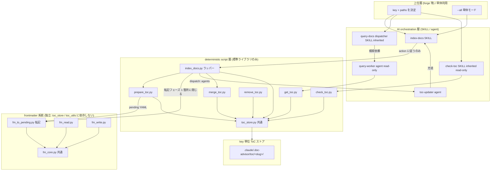
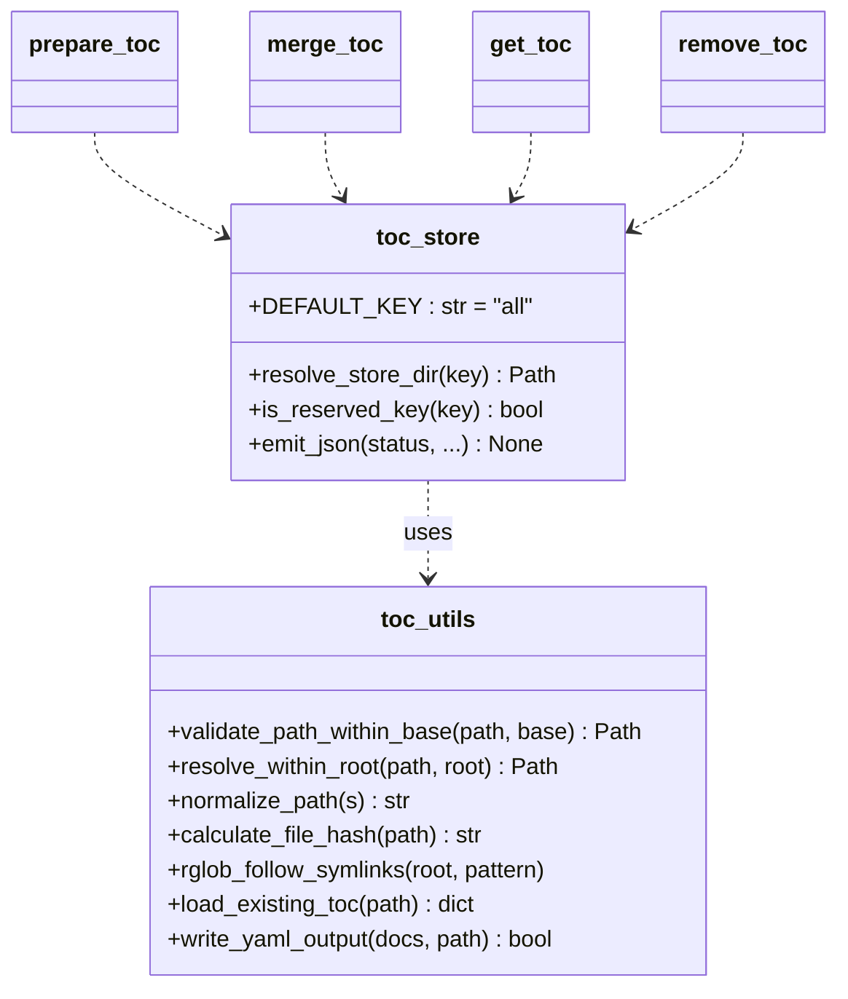
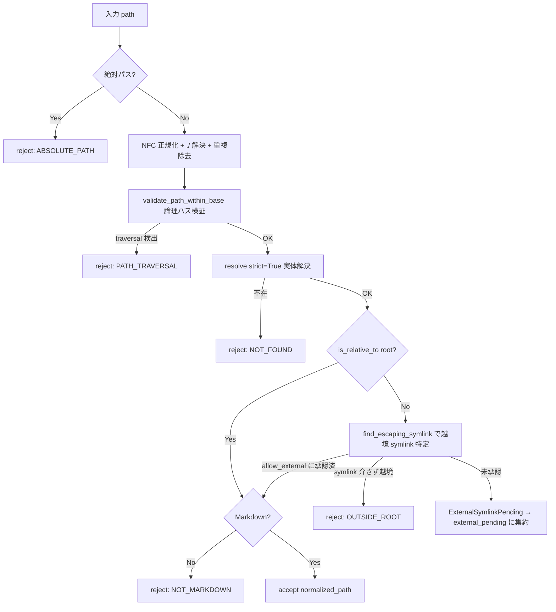
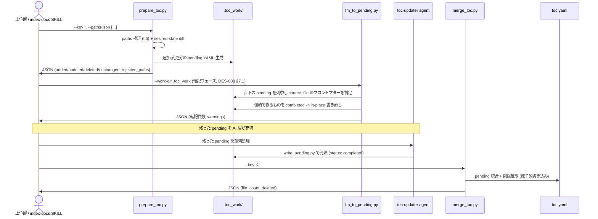
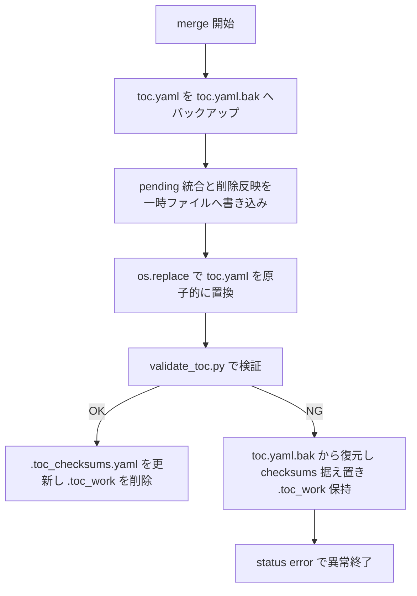
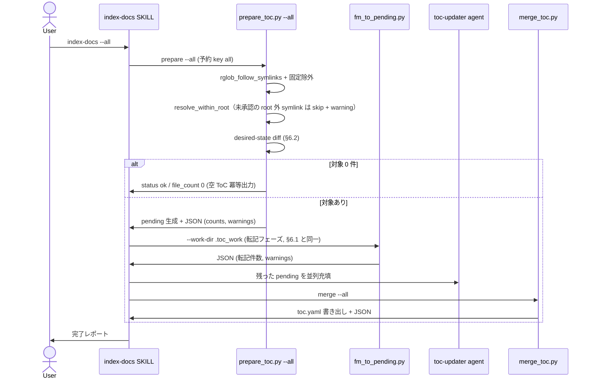
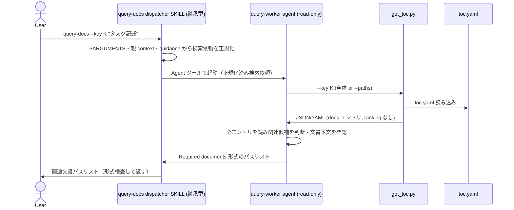

# DES-005 key + path ToC Provider 設計書

## メタデータ

| 項目     | 値                                                   |
| -------- | ---------------------------------------------------- |
| 設計 ID  | DES-005                                              |
| 関連要件 | REQ-001                                              |
| 作成日   | 2026-05-30                                           |
| 参照     | REQ-001, DES-003, DES-004, DES-009, ADR-002, FNC-002 |

## 1. 概要

REQ-001 が定める「key + project-root-relative paths を入力とする汎用 ToC Provider」を実装するための設計を定義する。旧 category（rules/specs）固定・`.doc_structure.yaml` 探索ベースの実装を、**opaque key 単位のストア**へ再編し、文書集合の決定責務を上位層へ委譲する。決定的処理（path 検証・差分検出・フロントマターからの転記・merge）と AI 処理（転記できなかった文書のメタデータ抽出）の境界を script 構成で明示する。

採用アプローチ:

- ToC を `key` 単位のストアディレクトリに分離（category 固定パスを廃止）
- desired-state sync を `prepare_toc.py`（差分検出 + pending 生成）と `merge_toc.py`（統合）の 2 フェーズに分割し、間に script 層の転記（`fm_to_pending.py`）と、転記できなかった pending への AI メタデータ充填を順に挟む
- path 検証は既存の論理パス検証（traversal）を流用しつつ、symlink 実体解決を**新規ロジック**として追加
- 全 script を単一 JSON の stdout 契約に統一

## 2. アーキテクチャ概要

### 2.1 レイヤー構成

REQ-001 FR-N07 のレイヤー責務境界を、deterministic script 層と AI orchestration 層に分離する。



### 2.2 依存方向規範 [MANDATORY]

レイヤード依存とし、下位が上位を参照しない。

1. AI 層 → script 層 → 共通モジュール（`toc_store.py` / `toc_utils.py`）→ ストアの単方向
2. script 層は AI 層を呼ばない。`prepare → merge` の間はまず script 層が転記（`fm_to_pending.py`）を行い、転記できなかった pending のメタデータ抽出のみを AI 層が担う
3. 循環依存を作らない。ToC パイプラインの共通ロジックは `toc_utils.py`（既存）と `toc_store.py`（key 解決・ストア I/O）に集約する。`frontmatter/fm_core.py` はこの 2 つを import しない独立系統の共通ロジックであり、意図的に第 3 の集約点として分離する（DES-008 §6.1。フロントマター方式を撤回する際に 1 ディレクトリの削除で戻せることを優先する）

生成系 `index-docs` と検索系 `query-docs` はいずれも継承型 SKILL であり、カスタム Agent を Agent ツールで起動する（fork 型 SKILL は Agent を起動できないため）。`index-docs` は `toc-updater` を並列起動し、`query-docs` dispatcher は read-only な `query-worker` を起動して実検索を隔離する（ADR-002 改訂版）。

## 3. ストレージ設計

### 3.1 key → 保存パス変換

REQ-001 FR-N01-3 の「決定的変換」を以下で実現する。

```text
store_dir(key) = .claude/.doc-advisor/toc/{slug}/
```

- `slug`: key を NFC 正規化（既存 `normalize_path`）後、`[a-z0-9_-]` 以外を `_` に置換し、英小文字化・連続 `_` 圧縮・長さ 40 文字で切り詰め。切り詰めの前後で前後の `_` を除去する
- slug が空（記号のみ key 等）になる場合は `slug = "k"`
- 同一 key は常に同一 slug → 同一 store_dir に解決される（決定的）

### 3.2 ストアディレクトリ構造

```text
.claude/.doc-advisor/toc/{slug}-{hash}/
├── toc.yaml           # 最終 ToC (metadata + docs)
├── .toc_checksums.yaml # key 単位の変更検出用チェックサム
└── .toc_work/         # prepare が生成する pending YAML (一時)
```

- original key は `toc.yaml` の `metadata.key` に保持される（REQ-001 FR-N01-4）
- 予約 key `all`（REQ-001 FR-N04）は `store_dir("all")` に解決する。`all` はユーザー任意 key として reject されるため（FR-N01-5）、名前空間衝突は起きない
- `.toc_work/` は merge 後に削除される一時ディレクトリであり、**`.gitignore` に登録しない**。正常動作では merge 完了時に消えるため、残存は merge 未完・クリーンアップ漏れの異常シグナルである。`.gitignore` で隠すと残存に気づけなくなるので、あえて追跡対象外（untracked）のまま放置し、`git status` で残存を目視検知できることを優先する（§6.6 continuation の再開判定もこの残存可視性に依存する）。誤 commit は `git add` を明示パスに限定する運用で防ぐ

旧 category 別固定パス（`toc/rules/`, `toc/specs/`）は廃止し、本構造へ移行する。既存ストアからの移行は行わず再生成とする（REQ-001 §6.2 clean break / 非目的「自動 migration を持たない」）。

### 3.3 key の検証

| 入力              | 扱い                                                                              |
| ----------------- | --------------------------------------------------------------------------------- |
| 空 key            | reject（`error_code: KEY_EMPTY`）                                                 |
| 過長 key          | slug 切り詰めで吸収（reject しない）                                              |
| Unicode key       | NFC 正規化後に slug 化                                                            |
| `all`（任意指定） | reject（`error_code: KEY_RESERVED`）。`--all` / `--key` 省略のみが予約 key に到達 |

> **slug 衝突について**: 異なる key が同一 slug に変換される場合（例: `"foo bar"` と `"foo/bar"` → どちらも `"foo_bar"`）、同一 store_dir を共有する。先に生成した key の ToC が上書きされてもエラーは発生しない。上位層は key の命名が slug 衝突を起こさないよう管理する責任を持つ。実用上 `rules` / `specs` / `all` のような単純な key を使う限り問題は生じない。

## 4. モジュール設計

### 4.1 モジュール一覧

| モジュール                                                   | 責務                                                                                 | 依存                                                                                        |
| ------------------------------------------------------------ | ------------------------------------------------------------------------------------ | ------------------------------------------------------------------------------------------- |
| `index_docs.py`                                              | **索引パイプラインのラッパー**。AI が呼ぶ唯一の入口。段階判定 → 配管 → `action` 出力 | `expand_dirs`, `prepare_toc`, `merge_toc`, `toc_store`, `frontmatter/fm_to_pending`（§4.5） |
| `toc_store.py`                                               | key → store_dir 解決、JSON 出力ヘルパ、予約 key 判定                                 | `toc_utils`                                                                                 |
| `toc_utils.py`                                               | path 検証（traversal + symlink 実体解決）、glob、checksums、YAML I/O                 | 標準ライブラリ                                                                              |
| `prepare_toc.py`（旧 `create_pending_yaml.py` を改名・転用） | paths 検証 → desired-state 差分検出 → pending 生成、`--dry-run`、JSON 出力           | `toc_store`, `toc_utils`                                                                    |
| `merge_toc.py`                                               | 充填済み pending を統合 → `toc.yaml` 書き出し（削除反映、原子的書き込み）、JSON 出力 | `toc_store`, `toc_utils`                                                                    |
| `get_toc.py`（旧 `filter_toc.py` を統合）                    | `toc.yaml` 取得（全体 or `--paths` 縮小抽出）、ranking しない、JSON or YAML 出力     | `toc_store`, `toc_utils`                                                                    |
| `remove_toc.py`                                              | key 全体削除 / `--paths` 個別エントリ削除、JSON 出力                                 | `toc_store`, `toc_utils`                                                                    |
| `check_toc.py`                                               | ToC の鮮度判定（read-only）。`metadata` のみ読み `freshness` を JSON 出力（DES-009） | `toc_store`, `toc_utils`                                                                    |
| `write_pending.py`                                           | toc-updater agent が pending にメタデータ充填（`--key` 対応、doc_type 引数なし）     | `toc_utils`                                                                                 |
| `validate_toc.py`                                            | `toc.yaml` 検証（doc_type 必須なし、key ストアパス対応）                             | `toc_store`, `toc_utils`                                                                    |
| `frontmatter/fm_core.py`                                     | フロントマターのパース / 生成、本文抽出・正規化、`body_hash` 計算、スキーマ検証      | 標準ライブラリのみ（`toc_store` / `toc_utils` を import しない）                            |
| `frontmatter/fm_read.py`                                     | 渡されたパスのフロントマターを読み信頼判定（DES-008 §5.1）→ JSON 出力                | `fm_core`、標準ライブラリのみ（同上）                                                       |
| `frontmatter/fm_write.py`                                    | メタデータのマージ書き込み、整形実行後の `body_hash` 打刻                            | `fm_core`、標準ライブラリのみ（同上）                                                       |
| `frontmatter/fm_to_pending.py`                               | 指定ディレクトリ直下の pending を転記で完了化（`status: completed`）、JSON 出力      | `fm_core`、標準ライブラリのみ（同上）                                                       |

`create_checksums.py` の `--promote-pending` / `--clean-work-dir` 機能は `toc_store.py` に統合し、key 単位で扱う。

`frontmatter/` 配下は ToC パイプラインから独立した系統であり、フロントマターの読み書きと pending への転記のみを担う（DES-008 §6.1）。転記は prepare と AI 充填の間に置かれる独立したフェーズであり、key 解決も store_dir 解決も行わず、pending の置き場所は呼び出し側が引数で渡す。

各 script の主な CLI オプション:

| script                         | 主なオプション                                                                                                                                  |
| ------------------------------ | ----------------------------------------------------------------------------------------------------------------------------------------------- |
| `index_docs.py`                | `--key` / `--all` / `--dirs` / `--paths` / `--paths-json` / `--paths-file` / `--exclude`（例外経路のみ `--allow-external` / `--on-fill-error`） |
| `prepare_toc.py`               | `--key` / `--paths-json` / `--paths-file` / `--all` / `--dry-run`                                                                               |
| `merge_toc.py`                 | `--key` / `--all` / `--delete-only`                                                                                                             |
| `get_toc.py`                   | `--key` / `--all` / `--paths`（`--all` / `--key all` は REQ-001 FR-N04-4）                                                                      |
| `remove_toc.py`                | `--key` / `--all` / `--paths-json`（`--all` / `--key all` は REQ-001 FR-N04-4）                                                                 |
| `check_toc.py`                 | `--key` / `--all` / `--max-age`（必須）。列挙外の引数は受け取らない（REQ-005 FR-C01-4）                                                         |
| `frontmatter/fm_to_pending.py` | `--work-dir`                                                                                                                                    |
| `frontmatter/fm_read.py`       | `--paths-json`                                                                                                                                  |
| `frontmatter/fm_write.py`      | `--entries-json` / `--format-command`                                                                                                           |

### 4.1.1 ラッパー `index_docs.py`（AI が呼ぶ唯一の入口）

コア script は個々の処理を決定論的に実装しているが、**script 間の受け渡しが AI に残っていた**。実運用では 1 回の索引で AI が 15 回以上のコマンドを手で組み立て、各段の JSON から次の引数へフィールドを転記していた。とくに連続ディスパッチの空きスロット計算（`window − len(in_flight_groups)`）は、ADR-006 が「entry 数で引くと過大に減算され負になり、補充されず wave に逆戻りする」と明示的に警告している計算である。これを AI に委ねる根拠はない。

そこで **AI が呼ぶ入口を 1 本のラッパーに集約する**。AI に残す責務は次の 2 つだけである。

1. **Agent の起動** — script は Agent を起動できない
2. **判断** — 越境 symlink の承認・充填エラーへの対応・書き戻しの可否

#### 呼び出し形

通常経路は 1 コマンドであり、**Agent の完了通知を受けるたびに同じコマンドを再実行する**。初回と再開を呼び出し側が区別しない（状態は `.toc_work/` が持ち、ラッパーが段階を判定する）。ウィンドウ幅・バッチサイズ・リース TTL は呼び出し側の判断材料にならないため **CLI に出さない**（ラッパー内の定数とする）。

#### `action` の値域

| `action`   | 意味                              | 呼び出し側の動作                                 |
| ---------- | --------------------------------- | ------------------------------------------------ |
| `dispatch` | 起動すべき Agent がある           | `agents[]` の各要素で起動 → 同じコマンドを再実行 |
| `wait`     | 走行中の Agent のみ（未投入なし） | 完了通知を待つ → 同じコマンドを再実行            |
| `confirm`  | 判断が必要（`reason` を見る）     | 判断し、決定を引数に足して再実行                 |
| `done`     | 完了                              | 完了レポートを出す                               |
| `error`    | 異常                              | `error_code` / `message` を報告                  |

`agents[]` の要素は `{subagent_type, prompt, entry_files}` であり、**`prompt` は Agent へそのまま渡せる文字列**とする。呼び出し側に key と entry_file を転記させないためである。

`confirm` の `reason` は `external_symlink`（`--allow-external` で承認を渡す）と `fill_error`（`--on-fill-error retry|merge|abort`）の 2 種であり、いずれも稀な経路である。**通常経路では引数が増えない。**

`done` は完了レポートに必要な値をすべて含める。`transcribed`（転記件数）は **merge の出力から導出する**（`added + updated − len(ai_extracted_paths)`）。ラッパーは状態を持たないため複数回の呼び出しにまたがる転記件数を自分では積算できないが、充填が完了した pending には必ず来歴（`_meta.extracted_by`）が書かれるため、統合された文書は転記か AI 抽出のいずれかに必ず分類される。この導出により、転記件数のために `merge_toc.py` へ新しい出力項目を足す必要がない。

#### コア script の呼び方

**コア script の CLI 契約（stdout に単一 JSON / §8.1）をそのまま使う。** `main(argv)` を同一プロセスで呼び、stdout をリダイレクトして JSON を受け取る。理由は 2 つある。

1. **コア script を一切変更しない。** ラッパーのために新しい戻り値の経路を足すと、コア script を単体で使ったときとラッパー経由で使ったときで挙動が分岐しうる。CLI 契約が唯一の出口であり続ける方が、両者の一致が構造的に保たれる
2. subprocess を使わないため Python の起動コストが 1 回で済み、stderr のログはそのまま呼び出し側へ流れる（進捗が見える）

`toc_store` のみ関数を直接 import する。`store_dir` の解決結果は JSON 契約に現れないため（CLI は `toc_path` しか返さない）CLI 経由では受け取れない。

#### コア CLI の位置づけ [MANDATORY]

コア script の CLI は**残す**（テストと障害切り分けに必要）。ただし **SKILL / agent からは呼ばない**。呼ぶのはラッパーのみとする。二重の入口を持つと状態が食い違う（prepare を再実行して充填済み pending を壊す、claim せずに Agent を起動して二重投入する等）。この規約は各 SKILL.md の禁止事項にも明記する。

#### フロントマター依存の閉じ込め

転記の呼び出しは**ラッパー内の 1 関数に閉じる**。フロントマター方式を撤回する場合はその関数と呼び出し 1 行を削るだけで全体が通る（転記 0 件と等価になり、すべての pending が AI 抽出へ回る）。`scripts/frontmatter/` をディレクトリごと削除できる状態を保つための境界である（DES-008 §6.1）。

この境界が実際に成立していることは**テストで固定する**。`frontmatter/` を含まない `scripts/` のコピーを作ってラッパーを実行し、索引が完了することを確認する。実装当初は転記関数が `ImportError` を捕捉しておらず、ディレクトリを削除するとラッパー全体がクラッシュした。「1 ディレクトリの削除で戻せる」という主張は、テストを書くまで成立していなかった。

### 4.2 toc_utils.py の改修方針

| 廃止 / 改修                                                                                                                                                                                                                       | 理由                                                                |
| --------------------------------------------------------------------------------------------------------------------------------------------------------------------------------------------------------------------------------- | ------------------------------------------------------------------- |
| `load_config()` の category 分岐 / `_get_default_config()` の rules/specs 固定キー                                                                                                                                                | REQ-001 §6.2 旧 category ロジック削除                               |
| `init_common_config()` の `root_dirs` / `doc_types_map` 探索・`ConfigNotReadyError`                                                                                                                                               | doc_structure 探索廃止。key + paths を直接受け取る                  |
| `find_config_file()`（`.doc_structure.yaml` 探索）                                                                                                                                                                                | 通常経路で `.doc_structure.yaml` を読まない（REQ-001 受け入れ基準） |
| 流用: `normalize_path` / `calculate_file_hash` / `rglob_follow_symlinks` / `should_exclude` / `load_existing_toc` / `write_yaml_output` / `yaml_escape` / `validate_path_within_base` / `write_checksums_yaml` / `load_checksums` | REQ-001 NFR-N02 既存資産再利用                                      |

### 4.3 主要関数のクラス図（共通モジュール）



## 5. path 検証設計

REQ-001 §6.1 を実装する。**traversal 検証は既存 `validate_path_within_base()` を流用し、symlink 実体解決は別ロジック `resolve_within_root()` として新規実装する**。

### 5.1 検証フロー



明示 paths モードで `external_pending` が空でなく、かつ承認指定（`--allow-external-json`）が無い場合、`prepare_toc.py` は書き込みをせず `status: needs_confirmation` を返す（§8.2）。上位層は越境 symlink を提示して承認を取り、承認 prefix を `--allow-external-json` に並べて再実行する（decided モード）。

### 5.2 新規ロジック `resolve_within_root()` / `find_escaping_symlink()`

- `resolve_within_root()`: `Path.resolve(strict=True)` で symlink を辿って実体を解決（不在は `FileNotFoundError` → NOT_FOUND として扱い、REQ-001 FR-N03-4 の不在 reject と兼ねる）。`Path.is_relative_to(project_root)`（Python 3.9+、REQ-001 NFR-N01 で下限確定）で root 配下を判定し、root 外実体は `PathRejection(OUTSIDE_ROOT)` を送出する低レベル primitive。
- `find_escaping_symlink(rel_path, root)`: root から path コンポーネントを順に辿り、最初に「symlink かつ実体が root 配下でない」prefix（= 承認の単位）を返す。越境 symlink が無ければ None。
- `validate_path(path, root, allow_external)`: `resolve_within_root()` の OUTSIDE_ROOT を捕捉し、`find_escaping_symlink` で越境点を特定する。承認済み（`allow_external`）なら受理、未承認なら `ExternalSymlinkPending`（reject ではない確認待ち信号）、symlink を介さない真の越境なら OUTSIDE_ROOT を再送出する。
- 大文字小文字衝突は正規化後パスの集合で検出し warning（処理は継続）

既存 `validate_path_within_base()` の docstring（symlink 先を意図的に許可）は変更せず、traversal 専用として流用する。越境 symlink の default-deny + 明示承認は `validate_path` / `find_escaping_symlink` が担う。

### 5.3 単体モード走査との関係

`--all` 収集は `rglob_follow_symlinks`（`os.walk(followlinks=True)`）で symlink を follow して列挙するが、**列挙後に各ファイルへ `resolve_within_root()` を適用する**。root 外実体を指すものは、承認済み（`allow_external`）なら収集対象に含め、未承認なら収集から外して `external_pending` に集約する。`--all` は非対話のバルク索引のため、未承認の越境 symlink は `needs_confirmation` でブロックせず **skip し warning に列挙**する（取り込みたい場合は `--allow-external-json` で明示承認）。明示 paths モードは §5.1 のとおり `needs_confirmation` でブロックする。両経路とも最終的に「実体が root 配下、または明示承認された越境 symlink 配下」を保証する。

## 6. desired-state sync 設計

### 6.1 prepare / merge 2 フェーズ（FR-N07-3）



転記は per-file の判定を `prepare_toc.py` に持たせるものではなく、prepare と充填の間に置く独立したフェーズである。転記済みの pending は `_meta.status: completed` になるため `toc_store.py --work-status` の `pending` / `pending_groups` に現れず、充填フェーズの対象から自動的に外れる。全件を転記できた場合は Agent を 1 つも起動せず merge へ直行する（DES-008 §7.1）。

### 6.2 差分検出アルゴリズム

paths を当該 key の完全な desired state として扱う（REQ-001 FR-N02）。

1. 入力 paths を §5 で検証・正規化 → `desired`（集合）
2. `store_dir/.toc_checksums.yaml` から前回状態 `prev`（path → hash）を読む
3. 各カテゴリを算出:
   - **added**: `desired - prev.keys()`
   - **updated**: `desired ∩ prev.keys()` かつ現在の SHA-256 が `prev[path]` と不一致
   - **unchanged**: `desired ∩ prev.keys()` かつ hash 一致
   - **deleted**: `prev.keys() - desired`
4. added + updated について pending YAML を生成（merge 待ち）
5. deleted は merge フェーズで `toc.yaml` から除去

`--dry-run` 時は手順 4-5 を行わず、件数と path 一覧のみ JSON 出力（REQ-001 FR-N02-5）。

### 6.3 desired-state の破壊性（REQ-001 受け入れ基準）

部分配列を渡すと `prev` の残りが deleted となり ToC から消える。これは仕様であり上位層の責務。`prepare_toc.py` は deleted 件数を JSON に明示し、`--dry-run` で事前確認できるようにする。回帰テストで「部分配列 → 残り削除」を固定する。

### 6.4 work file 名

work file 名は `sha256(source_file)[:16].yaml` とする。衝突空間は key 単位ストア配下に閉じる。

### 6.5 バックアップと異常系（merge 失敗時の復元）

REQ-001 NFR-N07 を反映する。`merge_toc.py` は ToC 書き出しの backup → validate → restore フローを key 単位ストアに対して定義する（旧 category 単位フローを key 単位へ再編）。



- 原子的書き込み（`os.replace`、既存 `write_yaml_output`）で書き込み途中の破損を防ぐ
- 検証失敗時は `toc.yaml.bak` から復元し、checksums を更新せず `.toc_work/` を保持して再実行可能とする
- バックアップ・work ファイルは当該 key の `store_dir` 配下に閉じるため、他 key の merge と干渉しない

### 6.6 中断耐性と continuation（key 単位）

continuation モードを key 単位ストアで成立させる。`.toc_work/` を `store_dir/.toc_work/` に置くことで、再開判定と work dir 競合回避を key 単位に閉じる。

| 状況                                         | 判定                                                                          |
| -------------------------------------------- | ----------------------------------------------------------------------------- |
| `store_dir/.toc_work/` が存在し pending あり | 当該 key の prepare を再実行せず、残 pending を転記 → 充填 → merge の順で処理 |
| `store_dir/.toc_work/` が存在し全 completed  | 当該 key の merge へ直行                                                      |
| `store_dir/.toc_work/` なし                  | 通常の prepare から開始                                                       |

- 複数 key を同時に処理しても、各 key の `.toc_work/` は別ディレクトリのため競合しない
- continuation 判定は `index-docs` SKILL が key ごとに行う（orchestrator パターン §10 を key 単位で適用）

## 7. ToC スキーマ設計

### 7.1 doc_type の除去（非目的）

`formats/toc_format.md` から `doc_type` を除去する。category 廃止により doc_type 自動分類が成立しないため。

```yaml
# 改訂後 toc.yaml（doc_type 削除）
metadata:
  name: string # key 由来の索引名
  key: string # original key
  generated_at: datetime
  file_count: integer
docs:
  <project-relative-path>:
    title: string
    purpose: string
    content_details: array[string] # 1..10
    applicable_tasks: array[string] # 1..10
    keywords: array[string] # 1..10
```

- pending YAML の `_meta` からも `doc_type` を削除。`write_pending.py` の `--doc-type` 関連引数を廃止
- `validate_toc.py` の必須フィールドから `doc_type` を除外（title/purpose + 3 配列のみ必須）
- 検索（query-docs）は title/purpose/keywords を AI が読む方式（FNC-002 継続）で、doc_type 除去による検索機能影響はない

### 7.2 metadata 拡張

`metadata.key` に original key を併記し、ToC 単体でも由来 key を追跡可能にする。`merge_toc.py` は `--key` 引数の値を `metadata.key` に書き出す。

## 8. JSON 出力契約

### 8.1 共通スキーマ（REQ-001 FR-N08）

全 script は stdout に単一 JSON、ログ・進捗は stderr（既存 `log()` を踏襲）。ただし `get_toc.py` の `--format yaml` は検索 SKILL が AI に渡す用途の例外で、既定は JSON、`--format yaml` 指定時のみ ToC 本体の生 YAML を stdout に出す（§4.1 の「JSON or YAML 出力」に対応）。

```json
{
  "status": "ok | error | partial | needs_confirmation",
  "error_code": "INVALID_PATH | PATH_TRAVERSAL | ABSOLUTE_PATH | OUTSIDE_ROOT | NOT_FOUND | NOT_MARKDOWN | KEY_EMPTY | KEY_RESERVED | TOC_NOT_FOUND | NO_TARGETS | UNSUPPORTED_ARG | INVALID_MAX_AGE | TOC_READ_ERROR | READ_ERROR | null",
  "message": "human-readable",
  "key": "rules",
  "toc_path": ".claude/.doc-advisor/toc/rules-<hash>/toc.yaml",
  "normalized_paths": ["docs/a.md"],
  "rejected_paths": [{ "path": "../x.md", "reason": "PATH_TRAVERSAL" }],
  "counts": { "added": 0, "updated": 0, "deleted": 0, "unchanged": 0 },
  "warnings": ["case-insensitive collision: docs/A.md vs docs/a.md"],
  "ai_extracted_paths": ["docs/a.md"],
  "external_pending": [
    {
      "symlink": "meta",
      "resolved": "/abs/path/outside/root",
      "affected_count": 12
    }
  ]
}
```

### 8.2 enum 定義

| フィールド           | 値域                                                                                                                                                                                                                          |
| -------------------- | ----------------------------------------------------------------------------------------------------------------------------------------------------------------------------------------------------------------------------- |
| `status`             | `ok` / `error` / `partial`（一部 path を reject しつつ処理続行）/ `needs_confirmation`（未承認の root 外 symlink があり、書き込みをせず承認を待つ。NFR-N06）                                                                  |
| `error_code`         | §8.1 の列挙値 + `null`。`toc_store.py` に定数として集約し、テストで enum を固定（REQ-001 FR-N08-2）                                                                                                                           |
| `external_pending`   | `status: needs_confirmation` 時に出力。`[{symlink, resolved, affected_count}]`（越境 symlink 単位に集約。`--all` で skip した場合は warning にも列挙）                                                                        |
| `ai_extracted_paths` | project-root-relative path の配列（昇順）。`merge_toc.py` 固有。今回の run で AI 抽出（pending の `_meta.extracted_by: ai`）により索引された文書のうち、最終 `docs` に残ったもの。`status: ok` 時のみ出力し、該当なしは空配列 |

各 script は使うフィールドのみ出力してよいが、`status` / `error_code` は必須。越境 symlink 関連の `OUTSIDE_ROOT` は「symlink を介さない真の root 外」専用に残し、symlink 経由の越境は `needs_confirmation` + `external_pending` で扱う。

`error_code` の値域は最上位フィールドだけでなく、`rejected_paths[].reason` のように
error_code 値を載せる入れ子フィールドにも適用する。

`READ_ERROR`（対象文書そのものを読めない。権限不足・デコード不能等）はフロントマターの
読み取り経路が個々のファイルの失敗理由として使う（DES-008 §6.2）。不在は `NOT_FOUND`、
`toc.yaml` の読み取り失敗は `TOC_READ_ERROR` と区別する。

`INVALID_MAX_AGE`（`--max-age` が未指定・非整数・0 以下）と `TOC_READ_ERROR`（`toc.yaml` を読めない）は
`check_toc.py` が使う（DES-009 §5.2）。`check_toc.py` は §8.1 の共通フィールドに加えて `freshness` / `reason` /
`generated_at` / `age_seconds` / `max_age_seconds` を出力し、`status` は `ok` / `error` の 2 値のみを取る。
ToC 不在は `TOC_NOT_FOUND` ではなく `status: ok` + `freshness: stale` として返す（REQ-005 FR-C03-3。
`get_toc.py` が不在を `TOC_NOT_FOUND` とするのと意図的に異なる）。

`ai_extracted_paths` は `merge_toc.py` が出力する報告専用フィールドであり、DES-008 §8.2 の書き戻し候補を
`index-docs` SKILL へ渡すためにある。`toc.yaml` にも checksums にも書き出さず、pending 統合・原子的書き込み・
検証・checksums 更新の**処理ロジックには影響しない**（DES-008 §7.1 の無改造範囲は JSON 出力への項目追加を含まない）。
ToC の生成が完了していない経路（書き込み失敗・validation 失敗で `.toc_work/` を保持する経路）では出力しない。
`--delete-only` は pending を統合しないため常に空配列となる。

## 9. 単体モード（all-markdown）設計

REQ-001 FR-N04。`--all` / `--key` 省略時、予約 key `all` に解決し project root 以下の Markdown を対象にする。

### 9.1 走査と除外

- `rglob_follow_symlinks(project_root, "**/*.md")` で列挙
- 固定除外（**本リストが除外定義の SoT**。要件は REQ-001 FR-N04-3）: `.git/**`, `.claude/**` runtime state, `.codex/**`, `node_modules/**`, `vendor/**`, `dist/**`, `build/**`, `__pycache__/**`, `.venv/**`, `target/**`, `coverage/**`, `.pytest_cache/**`, `.mypy_cache/**`, 生成済み ToC / work files。既存 `should_exclude()`（DES-004）に固定除外リストを渡して適用
- 列挙後に `resolve_within_root()` を適用し、root 外実体の symlink は未承認なら skip して `external_pending` に集約・warning 化、承認済み（`--allow-external-json`）なら収集対象に含める（§5.3 / NFR-N06）

### 9.2 境界条件

- 最大ファイル数超過時は `warnings` に含め処理継続（REQ-001 NFR-N05、閾値は 100 件）
- 空 repo / 対象 0 件は `error` ではなく空 `toc.yaml` を冪等出力（`status: ok`, `file_count: 0`）

### 9.3 単体モードのシーケンス



転記フェーズは単体モードでも key 指定と同一である。prepare が生成する pending の形式は
モードによらず同じであり、転記を省く根拠がないためである（§6.1 の記述を正典とする）。

## 10. SKILL / agent 設計

key + path 汎用化（REQ-001 §6.2）に伴い、SKILL / agent を以下のコンポーネントへ一本化する。

| コンポーネント      | 種別                            | 責務                                                                                                                                                                                                                                                                          |
| ------------------- | ------------------------------- | ----------------------------------------------------------------------------------------------------------------------------------------------------------------------------------------------------------------------------------------------------------------------------- |
| `index-docs`        | SKILL（継承型）                 | **`index_docs.py` を呼び、返る `action` に従う**（§4.1.1）。Agent の起動と判断のみを担い、配管はラッパーが行う。`action: done` の `ai_extracted_paths` を提示し、承認された対象のみ `write-frontmatter` へ `--paths-json` で引き渡す（原本は自ら書き換えない / DES-008 §8.2） |
| `query-docs`        | SKILL（継承型 dispatcher）      | `$ARGUMENTS`・親 context・guidance から検索依頼を構築し `query-worker` を起動。`--key` 省略時は予約 key `all`                                                                                                                                                                 |
| `check-toc`         | SKILL（継承型）                 | `check_toc.py` を 1 回呼び `freshness` を返す read-only なラッパ。`--key` / `--all` / `--max-age`（DES-009）                                                                                                                                                                  |
| `write-frontmatter` | SKILL（継承型）                 | 対象文書の本文からメタデータを作成し `fm_write.py` でフロントマターへ書き込む。原本を書き換えるため実行前にユーザ承認を取る（DES-008 §8.1 / §10.1）                                                                                                                           |
| `query-worker`      | Agent（Read, Grep, Glob, Bash） | `get_toc` を呼び ToC 全エントリ読解・関連判断・`Required documents:` 返却（read-only）                                                                                                                                                                                        |
| `toc-updater`       | Agent（Read, Bash）             | pending を読み元文書からメタデータ抽出 → `write_pending.py --key` で充填                                                                                                                                                                                                      |

ADR-002 改訂版（継承型 dispatcher + read-only worker 隔離）を `query-docs` / `query-worker` が実装する。orchestrator パターン（Phase 2 並列・中断耐性・continue モード、§6.6）を `index-docs` が用いる。

## 11. ユースケース設計

### 11.1 ユースケース一覧

| ユースケース             | アクター        | 入口                                |
| ------------------------ | --------------- | ----------------------------------- |
| key の ToC を生成・更新  | 上位層 / 利用者 | `index-docs --key K`                |
| 単体で全 Markdown を索引 | 利用者          | `index-docs --all`                  |
| key の ToC を検索        | 利用者 / Claude | `query-docs --key K` / `query-docs` |
| key の ToC を削除        | 上位層 / 利用者 | `remove_toc.py --key K`             |
| desired-state の事前確認 | 上位層          | `prepare_toc.py --key K --dry-run`  |
| key の ToC の鮮度を確認  | 上位層          | `check-toc --key K --max-age <秒>`  |

### 11.2 検索ユースケースのシーケンス（query-docs）



`get_toc.py` は lexical ranking / score を行わず ToC の定義順を保持する（REQ-001 FR-N05-2）。最終的な関連判断は read-only worker（AI）が担い、dispatcher は検索依頼の構築と結果の形式検査に限定される（ADR-002 改訂版）。

## 12. 使用する既存コンポーネント

| コンポーネント                                | ファイルパス                          | 用途                                                  |
| --------------------------------------------- | ------------------------------------- | ----------------------------------------------------- |
| `validate_path_within_base()`                 | `scripts/toc_utils.py`                | traversal 検証（流用、§5.1）                          |
| `normalize_path()`                            | `scripts/toc_utils.py`                | NFC 正規化（§5.1）                                    |
| `calculate_file_hash()`                       | `scripts/toc_utils.py`                | SHA-256 変更検出（§6.2）                              |
| `rglob_follow_symlinks()`                     | `scripts/toc_utils.py`                | 単体モード走査（§9.1）                                |
| `should_exclude()`                            | `scripts/toc_utils.py`                | 固定除外適用（§9.1 / DES-004）                        |
| `load_existing_toc()`                         | `scripts/toc_utils.py`                | toc.yaml 読み込み（§6 / get_toc）                     |
| `write_yaml_output()`                         | `scripts/merge_toc.py`                | 原子的 ToC 書き込み（§6）                             |
| `write_checksums_yaml()` / `load_checksums()` | `scripts/toc_utils.py`                | key 単位 checksums I/O（§6.2）                        |
| `yaml_escape()`                               | `scripts/toc_utils.py`                | YAML エスケープ                                       |
| `has_substantive_content()`                   | `scripts/prepare_toc.py`              | 空ファイルスキップ（旧 create_pending_yaml から転用） |
| orchestrator パターン                         | `workflows/index_toc_orchestrator.md` | index-docs の並列・中断耐性                           |

再利用しない判断: `find_config_file()` / `load_config()` の category 分岐は doc_structure 廃止に伴い削除（再利用せず）。理由は REQ-001 §6.2。

## 13. テスト設計

REQ-001 NFR-N03（`scripts/` テスト必須）に従い、同一 PR でテストを伴う。

- **単体テスト対象**:
  - `toc_store.resolve_store_dir()`: slug 化・予約 key `all`・空/過長/Unicode key
  - path 検証: 絶対パス / traversal / 不在 / 非 Markdown / `./a.md`↔`a.md` 同一視 / 大小衝突 warning
  - 越境 symlink: 未承認は `ExternalSymlinkPending`（`external_pending` 集約 / `needs_confirmation`）、承認（`--allow-external-json`）で受理、`find_escaping_symlink` の越境点特定・ディレクトリ symlink の単一集約
  - desired-state diff: added/updated/unchanged/deleted の算出、**部分配列が残りを削除する固定**（REQ-001 受け入れ基準）
  - JSON 契約: status / error_code enum の固定
  - 単体モード: 固定除外の適用、空 repo の冪等空出力、未承認 root 外 symlink の skip + warning / 承認時の取り込み
  - 鮮度判定（`check_toc.py`）: 詳細は DES-009 §8。`judge` の純関数テストと、引数エラーの subprocess 契約テスト（stdout 単一 JSON / exit code 1）を含む
- **ラッパー（`index_docs.py`）の統合テスト対象**（§4.1.1）:
  - 同じコマンドの繰り返しで prepare → 転記 → 充填 → merge が完了すること
  - `action` の値域と分岐（`dispatch` / `wait` / `confirm` / `done` / `error`）
  - `agents[].prompt` が Agent へそのまま渡せる文字列であること
  - claim により同じコマンドの再実行が二重投入しないこと
  - **空きスロットを走行中 Agent 数で数えること**（`window` より `in_flight_groups` が多いとき `available` が負にならず `wait` になる。ADR-006 の回帰固定）
  - 全件転記できたとき Agent を 1 つも返さず `done` へ直行すること
  - **`frontmatter/` を含まない `scripts/` のコピーで索引が完了すること**（撤回可能性の実証）
  - 削除のみ / 対象 0 件 / 全件 unchanged の各冪等経路
  - 充填エラーで `confirm` を返し、`--on-fill-error` の 3 値がそれぞれ機能すること
  - 索引実行が原本のバイト列を変えないこと / 成功時に `.toc_work/` が残らないこと
- **統合テスト対象**:
  - `prepare → write_pending → merge` の協調フローで toc.yaml が生成される
  - `remove --key` でストアが削除される
  - 旧 doc_structure 依存が通常経路に残っていないことの回帰テスト（embedding-removal 回帰テストに倣う）

## 14. 移行に伴う設計上の注意

- 既存 `toc/{rules,specs}/` から `toc/` への自動移行は行わない（clean break、REQ-001 §6.2 / 非目的で確定）。再生成で対応

## 改定履歴

| 日付       | バージョン | 内容                                                                                                                                                                                                                                                                                                                                                                                                                                                                                                                                                                                                                                                      |
| ---------- | ---------- | --------------------------------------------------------------------------------------------------------------------------------------------------------------------------------------------------------------------------------------------------------------------------------------------------------------------------------------------------------------------------------------------------------------------------------------------------------------------------------------------------------------------------------------------------------------------------------------------------------------------------------------------------------- |
| 2026-05-30 | 0.1        | 初版作成（追加 feature new-if の DES-006 として）。REQ-004 を実装する設計を定義                                                                                                                                                                                                                                                                                                                                                                                                                                                                                                                                                                           |
| 2026-06-01 | 0.2        | `/forge:merge-specs` により DES-006 を本 DES-005 へ溶融（additive_development_spec §4）。旧 ToC 生成フロー設計（Phase 0 config_required 等）を key + path provider 設計へ全面再編。参照は REQ-001 へ更新                                                                                                                                                                                                                                                                                                                                                                                                                                                  |
| 2026-07-30 | 0.3        | check-toc（DES-009）の追加に伴い、`check_toc.py` を §2.1 レイヤ図・§4.1 モジュール一覧・CLI オプション表へ、`check-toc` を §10 / §11.1 へ追記。§8 の `error_code` 値域に `INVALID_MAX_AGE` / `TOC_READ_ERROR` を追加し、鮮度確認の JSON 契約（`status` 2 値・ToC 不在の扱い）を明記。§13 に鮮度判定のテスト方針を追記                                                                                                                                                                                                                                                                                                                                     |
| 2026-08-03 | 0.4        | フロントマターメタデータ（DES-008）の追加に伴い、転記フェーズを反映。§1 概要と §2.2 依存方向規範を「script 層の転記 → 残りを AI 層が充填」の 2 段へ改め、`fm_core.py` を独立系統の共通ロジックとして明記。§2.1 レイヤ図へ `frontmatter/` 系統を追加し、§4.1 に `frontmatter/` 配下 4 件のモジュール表と CLI オプション表を追記。§6.1 のシーケンスへ `fm_to_pending.py` の転記経路を追記し、§6.6 の再開判定を転記を含む順序へ更新。§9.3 の単体モードシーケンスにも同じ転記経路を追記し、§10 の `index-docs` 責務と `write-frontmatter` SKILL の行を追加。あわせて `formats/toc_format.md` の Language Rule を本文追従へ改訂（DES-008 §4.4）                |
| 2026-08-03 | 0.5        | AI 抽出結果の書き戻し候補（DES-008 §8.2）の受け渡し経路を反映。§8.1 のスキーマ例と §8.2 の enum 定義表へ `merge_toc.py` 固有フィールド `ai_extracted_paths` を追記し、報告専用であること・`status: ok` 時のみ出力すること・`--delete-only` では常に空配列であることを明記。§10 の `index-docs` は merge 完了後に候補を提示し、承認された対象のみを `write-frontmatter` へ `--paths-json` で引き渡す                                                                                                                                                                                                                                                       |
| 2026-08-04 | 0.7        | 索引パイプラインのラッパー `index_docs.py` を追加した（§4.1 モジュール一覧・§4.1.1 新節・§2.1 レイヤ図・§10 の `index-docs` 責務・§13 のテスト設計）。個々の処理は script 化されていたが **script 間の配管が AI に残っており**、1 回の索引で AI が 15 回以上のコマンドを手で組み立て、各段の JSON から次の引数へフィールドを転記していた。とくに連続ディスパッチの空きスロット計算は ADR-006 が明示的に警告している計算であり、AI に委ねる根拠がなかった。AI が呼ぶ入口を 1 本に集約し、残す責務を「Agent の起動」と「判断」のみとした。コア script の CLI は残すが SKILL からは呼ばないことを規約とした。ウィンドウ幅等のチューニング値は CLI に出さない |
| 2026-08-03 | 0.6        | 0.4 で行った `formats/toc_format.md` の Language Rule の本文追従化を**撤回**し、英語統一へ戻した（DES-008 §4.4 の 1.5 改訂）。desired-state 差分で `unchanged` が再抽出されないため、言語を本文に追従させると `toc.yaml` 内の言語混在が恒久化することが実データで判明したこと、および腐敗検出は `body_hash` が言語非依存に担っていることが理由。本 DES-005 が規定する生成フロー自体（転記フェーズ・シーケンス・モジュール一覧）に変更はない                                                                                                                                                                                                               |
