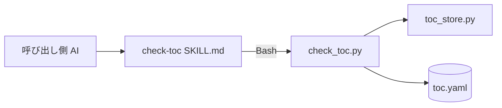
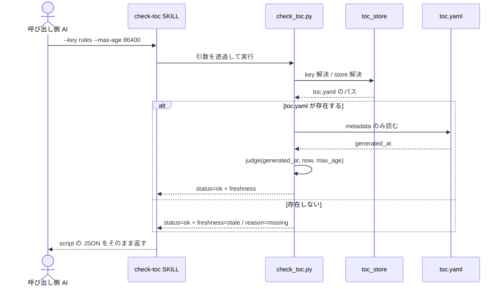

# DES-009 check-toc（ToC 鮮度確認）設計書

## メタデータ

| 項目     | 値         |
| -------- | ---------- |
| 設計 ID  | DES-009    |
| 関連要件 | REQ-005    |
| 作成日   | 2026-07-29 |

## 1. 概要

`check-toc` を、判定ロジックを持つ script（`check_toc.py`）と、それを 1 回呼ぶだけの SKILL の 2 層で実装する。
判定は `toc.yaml` の `metadata.generated_at` と閾値の比較だけで完結するため、既存の key 解決・store 解決・JSON 出力を
そのまま再利用し、新規に書くのは「metadata だけを読む reader」と「鮮度の比較」に限る。

呼び出し側が読む答えは `freshness`（`fresh` / `stale`）の 1 field だけである（REQ-005 FR-C03）。
原因は `reason` として返すが、呼び出し側が分岐に使わない補助情報として扱う。

## 2. 設計方針

### 2.1 script と SKILL の責務分離

判定は決定論的処理なので script に置き、SKILL は引数を透過して script を呼ぶだけとする。
SKILL.md にロジックを書かない（`docs/rules/implementation_guidelines.md`）。

### 2.2 起動経路は継承型 SKILL

`check-toc` は **継承型 SKILL**（`context: fork` を指定しない）として実装する。

fork 型 SKILL は隔離 context の AI が return 値を構築するため、script の stdout と呼び出し側が受け取る文字列の間に
出力を生成する AI が 1 段挟まる。REQ-005 FR-C03-4 は「最終出力は script の JSON のみ」を要求しており、
この経路では要約・説明の混入を構造的に防げない。継承型なら Bash の stdout がそのまま親 context に入る。

継承型 SKILL は `$ARGUMENTS` に親タスクの指示文が混入すると暴走する経路を持つ（`docs/rules/skill_authoring_notes.md`）。
本 SKILL は受け取る引数を `--key` / `--all` / `--max-age` に限り、未知の引数を script 側で拒否する（REQ-005 FR-C01-4）ことで、
指示文が渡されても判定を実行せずエラーになる状態にする。SKILL.md 側では `$ARGUMENTS` を解釈・補完せずそのまま渡す。

`allowed-tools` は `Bash` のみとし、Read も Write も持たせない。ただし `allowed-tools` は「承認なしで使えるツールの
allowlist」であり書き込み系ツールの**物理 deny ではない**（`base/ADR-002 §E`）。したがって read-only 性（REQ-005 FR-C04-3）は
権限ではなく、SKILL.md の禁止事項・`check_toc.py` を読み取りのみで実装すること・副作用なしを検証する単体テストの
多層で担保する。`allowed-tools` の絞り込みはツール露出の削減として、その一層に位置づける。

### 2.3 metadata だけを読む

`toc.yaml` は `metadata:` ブロックが `docs:` より前に置かれる（`plugins/doc-advisor/formats/toc_format.md`）。
本 script は行単位で読み進め、`docs:` に到達した時点で読み取りを打ち切る。
既存の `toc_utils.load_existing_toc` は全エントリを解析するため使用しない（REQ-005 NFR-C02）。

この打ち切りは観測可能な性質として単体テストする（`docs:` 以降が壊れていても判定が成功すること）。

### 2.4 判定時刻の注入

判定時刻は `main(argv, now=None)` の引数として受け取り、省略時に `datetime.now(timezone.utc)` を用いる。
テストは `now` を固定値で渡し、実時刻に依存しない（REQ-005 NFR-C03）。

## 3. アーキテクチャ

### 3.1 コンポーネント図

依存方向は `SKILL.md → script → 既存共通モジュール → ファイル` の一方向とする。
`check_toc.py` から SKILL を呼ばない。

### 3.2 モジュール一覧

| モジュール                  | 責務                                                      | 依存                     |
| --------------------------- | --------------------------------------------------------- | ------------------------ |
| `skills/check-toc/SKILL.md` | `$ARGUMENTS` を透過して script を 1 回呼び、stdout を返す | `check_toc.py`           |
| `scripts/check_toc.py`      | 引数検証、metadata 読み取り、鮮度判定、JSON 出力          | `toc_store`、`toc_utils` |

`check_toc.py` は `plugins/doc-advisor/scripts/` に置く。key 解決と store 解決を `toc_store` と共有するため、
SKILL 固有ディレクトリには置かない。

### 3.3 関数構成

| 関数                                | 責務                                                                                             |
| ----------------------------------- | ------------------------------------------------------------------------------------------------ |
| `parse_args(argv)`                  | `--key` / `--all` / `--max-age` のみを受け取る。`--key` と `--all` は排他。解析不能は `ArgError` |
| `read_toc_metadata(toc_path)`       | `docs:` に到達するまでの行から metadata の scalar を dict で返す                                 |
| `parse_generated_at(value)`         | ISO 8601 を timezone-aware datetime に変換。解析不能は `None`                                    |
| `judge(generated_at, now, max_age)` | `(freshness, reason, age_seconds)` を返す純関数                                                  |
| `main(argv, now=None)`              | 上記を束ね、`toc_store.emit_json` で出力して exit code を返す                                    |

`judge` を純関数として切り出すのは、判定規則（REQ-005 FR-C02）を I/O から独立してテストするためである。

## 4. 判定設計

### 4.1 判定手順

1. 引数を検証する。`--max-age` が正の整数でなければ `status=error` で終了する。
2. key を解決する（`toc_store.resolve_key_from_args`）。予約語・空 key は既存の検証に従いエラーとする。
3. store から `toc.yaml` の位置を解決する（`toc_store.resolve_store_dir`）。
4. `toc.yaml` が存在しなければ `freshness=stale` / `reason=missing` を返す。
5. metadata を読む。読み取り自体が失敗した場合は `status=error` を返す。
6. `generated_at` を解析し、`judge` で `freshness` / `reason` / `age_seconds` を決める。

### 4.2 judge の規則

| 入力                                 | `freshness` | `reason`               | `age_seconds`     |
| ------------------------------------ | ----------- | ---------------------- | ----------------- |
| `generated_at` が `None`（解析不能） | `stale`     | `generated_at_invalid` | `null`            |
| `now - generated_at < -skew`         | `stale`     | `generated_at_future`  | 実際の負値        |
| `-skew <= 差 <= max_age`             | `fresh`     | `null`                 | 負値は `0` に丸め |
| `差 > max_age`                       | `stale`     | `outdated`             | 実際の値          |

- 境界値（差が `max_age` と等しい）は `fresh`（REQ-005 FR-C02-4）。
- 許容 skew は **60 秒**とする（REQ-005 TBD-C01 の確定値）。時計同期の通常のずれを吸収する一方、
  それを超える未来時刻は壊れた値として扱い、再索引で正しい `generated_at` に置き換わる経路へ乗せる。
  skew を 0 にすると僅かなずれで毎回 `stale` となり `index-docs` が空転し、大きく取ると壊れた値を見逃す。
- skew 内の未来時刻は `age_seconds` を `0` に丸めて出力する。負の age を呼び出し側や人間が解釈する必要をなくすため。

### 4.3 `generated_at` の解析

`merge_toc.py` / `remove_toc.py` が書く形式は `%Y-%m-%dT%H:%M:%SZ`（UTC）である。
解析は末尾 `Z` を `+00:00` に置換したうえで `datetime.fromisoformat` を用い、他の ISO 8601 表記も受け付ける。
timezone を持たない値は UTC として解釈する。例外が出た場合は `None` を返し、`generated_at_invalid` として扱う。

## 5. 出力設計

### 5.1 JSON

`toc_store.emit_json` を使い、`status` / `error_code` を必須 field として出力する（既存 script と同一の契約）。
本 script 固有の field は `extra` に渡す。

| field             | 出力元                                              |
| ----------------- | --------------------------------------------------- |
| `status`          | `emit_json` の第 1 引数（`ok` / `error`）           |
| `error_code`      | `emit_json`（`status=ok` では `null`）              |
| `key`             | `emit_json`（解決後の key）                         |
| `toc_path`        | `toc_store.toc_path_rel`（不在時も期待パス）        |
| `freshness`       | `extra`                                             |
| `reason`          | `extra`                                             |
| `generated_at`    | `extra`（metadata の生値。不在・解析不能は `null`） |
| `age_seconds`     | `extra`                                             |
| `max_age_seconds` | `extra`（入力のエコー）                             |

### 5.2 error_code の追加

判定不能を表す既存コードが無いため、`toc_store.ErrorCode` と `ERROR_CODES` に 2 件追加する。

| error_code        | 条件                                               |
| ----------------- | -------------------------------------------------- |
| `INVALID_MAX_AGE` | `--max-age` が未指定・非整数・0 以下               |
| `TOC_READ_ERROR`  | `toc.yaml` を読めない（権限・decode 失敗・破損等） |

引数の解析エラー（未知引数・値不足・`--key` と `--all` の同時指定）には既存の `UNSUPPORTED_ARG` を使う。
`argparse` の既定動作は stderr へ usage を出し exit code `2` で終了するため、そのままでは
「常に単一 JSON を stdout へ出し exit code は `status` に対応させる」契約（§5.1 / §5.3）を破る。
`ArgumentParser` を継承して `error` / `exit` を例外（`ArgError`）へ変換し、`main` が JSON 化して
exit code `1` を返す。この経路は subprocess で契約テストする（§8）。

自動追加される `--help` も無効化する（`add_help=False`）。help テキストは JSON ではない出力を stdout へ書いて
exit code `0` で終了するため、有効なままでは同じ契約を破る。無効化により `--help` / `-h` は未知引数として
`UNSUPPORTED_ARG` の JSON になる。利用方法は SKILL.md と本設計書に記述するため、script 側の help は持たない。

`TOC_NOT_FOUND` は使用しない。ToC 不在は `status=ok` / `freshness=stale` / `reason=missing` であり、
エラーではない（REQ-005 FR-C03-3）。`INVALID_MAX_AGE` を `UNSUPPORTED_ARG` で兼用しないのは、
「未対応の引数」と「引数値が不正」を診断上分けるためである。

### 5.3 exit code

| exit code | 条件           |
| --------- | -------------- |
| `0`       | `status=ok`    |
| `1`       | `status=error` |

`freshness` の値は exit code に反映しない。`stale` は正常な判定結果である（REQ-005 FR-C03）。

## 6. ユースケース設計

### 6.1 ユースケース一覧

| ユースケース     | 説明                                                         |
| ---------------- | ------------------------------------------------------------ |
| 索引済みで新しい | 閾値以内の ToC に対し `fresh` を返す                         |
| 索引済みで古い   | 閾値を超えた ToC に対し `stale` / `outdated` を返す          |
| 未索引           | ToC が無い状態で `stale` / `missing` を返す                  |
| ToC が壊れている | `generated_at` を解析できず `stale` / `generated_at_invalid` |
| 読み取り不能     | `status=error` / `TOC_READ_ERROR` を返す                     |
| 引数不正         | `status=error` / `INVALID_MAX_AGE` を返す                    |

### 6.2 シーケンス

**前提条件**: ToC の生成は `index-docs` が済ませているか、まだ一度も実行されていない。
**正常フロー**: 判定結果を JSON で返す。`fresh` / `stale` のいずれも正常終了である。
**エラーフロー**: 引数不正・読み取り不能では判定を行わず `status=error` を返す。索引の生成は試みない。

## 7. 使用する既存コンポーネント

| コンポーネント                       | ファイルパス                                | 用途                                       |
| ------------------------------------ | ------------------------------------------- | ------------------------------------------ |
| `resolve_key_from_args` / key 検証   | `plugins/doc-advisor/scripts/toc_store.py`  | `--key` / `--all` の解決と予約語の拒否     |
| `resolve_store_dir` / `toc_path_rel` | `plugins/doc-advisor/scripts/toc_store.py`  | key から `toc.yaml` の位置と相対パスを得る |
| `emit_json` / `ErrorCode`            | `plugins/doc-advisor/scripts/toc_store.py`  | JSON 出力契約と error_code 体系            |
| `get_project_root`                   | `plugins/doc-advisor/scripts/toc_utils.py`  | project root の解決                        |
| ToC スキーマ定義                     | `plugins/doc-advisor/formats/toc_format.md` | `metadata` の field 構成と配置順           |

再利用しないもの:

- `toc_utils.load_existing_toc` — 全エントリを解析するため NFR-C02 に反する（§2.3）
- `toc_utils.parse_simple_yaml` — 同じ理由。metadata だけを読む専用 reader を持つ
- `get_toc.py` — ToC 内容の取得が目的で、不在を `TOC_NOT_FOUND` として扱う点も本 SKILL の要件と異なる

## 8. テスト設計

配置は `tests/scripts/test_check_toc.py`（`docs/rules/implementation_guidelines.md`）。

**単体テスト対象**:

| 対象                 | 検証項目                                                                               |
| -------------------- | -------------------------------------------------------------------------------------- |
| `judge`              | 5 判定、境界値（差 = `max_age` は `fresh`）、skew 内外の未来時刻、`age_seconds` の丸め |
| `parse_generated_at` | `Z` 付き UTC、offset 付き、tz なし、空文字、非日時文字列                               |
| `read_toc_metadata`  | `docs:` 到達で打ち切ること、`docs:` 以降が壊れていても成功すること                     |
| `parse_args`         | `--max-age` 不正、`--key` と `--all` の解決、未知引数の拒否                            |
| `main`               | JSON の field 構成、exit code、ToC 不在時の `status=ok`、読み取り不能時の error        |
| 副作用               | 実行後に ToC・`.toc_work/`・checksums が変化しないこと                                 |

判定時刻は `main(argv, now=...)` で固定値を注入し、実時刻に依存させない。

**統合テスト対象**: 本 SKILL は単一 script の呼び出しで完結するため、複数モジュール結合の統合テストは設けない。
SKILL.md 自体は自動テストの対象外（実装ガイドライン）。

## 9. 完全性確認

- REQ-005 FR-C01: 引数の受け入れと未知引数の拒否を §3.3 / §4.1 に反映した。
- REQ-005 FR-C02: 判定規則を §4.2 の `judge` に集約し、TBD-C01（skew）を 60 秒として確定した。
- REQ-005 FR-C03: JSON 契約・`reason` の位置づけ・exit code を §5 に定めた。`error_code` 2 件の追加を §5.2 に定めた。
- REQ-005 FR-C04: 継承型 SKILL としての公開と `allowed-tools: Bash` による副作用の遮断を §2.2 に定めた。
- REQ-005 NFR-C01: 標準ライブラリのみ（`datetime` / `argparse` / `json`）で構成する。
- REQ-005 NFR-C02: metadata だけを読む方針と、その観測可能なテストを §2.3 / §8 に定めた。
- REQ-005 NFR-C03: 判定時刻の注入境界を §2.4 に定めた。
- REQ-005 NFR-C04: 出力は project-root 相対パスのみで、絶対パス・設定値を含めない（§5.1）。

## 10. 変更履歴

| 日付       | バージョン | 変更内容                                             |
| ---------- | ---------- | ---------------------------------------------------- |
| 2026-07-29 | 0.1        | 初版作成。REQ-005 TBD-C01（許容 skew）を 60 秒で確定 |
