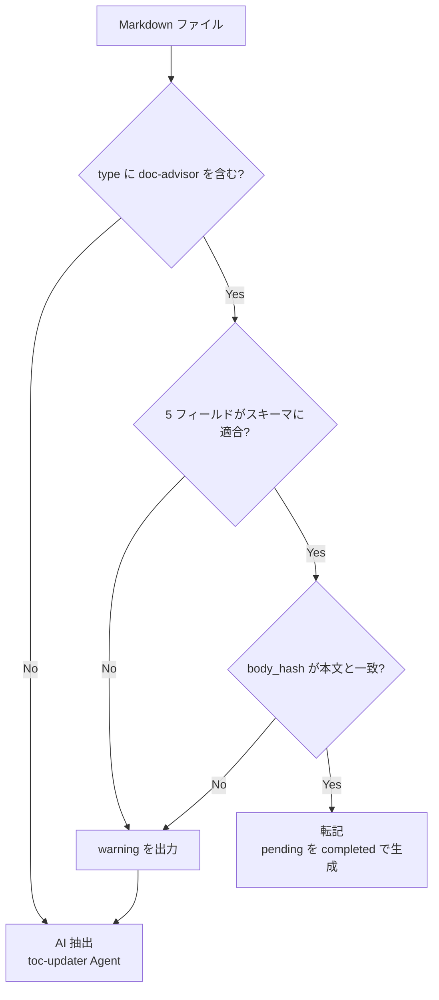
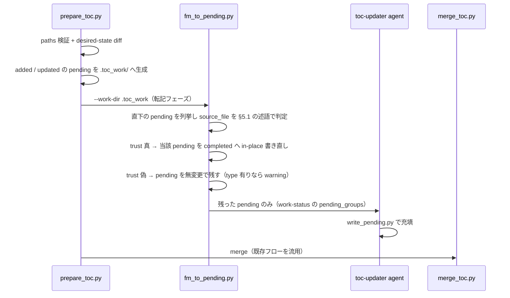

# DES-008: doc-advisor フロントマター設計書

## メタデータ

| 項目    | 値                                    |
| ------- | ------------------------------------- |
| 設計 ID | DES-008                               |
| 作成日  | 2026-07-31                            |
| 参照    | REQ-001, DES-005, FNC-002, toc_format |

## 1. 概要

doc-advisor が扱う Markdown 文書に、ToC 相当のメタデータをフロントマターとして埋め込む。目的は、文書の作成・編集を担う AI スキルが生成時点でメタデータを書き込むことで、`index-docs` 実行時の `toc-updater` Agent によるコールドリード（1 ファイルずつ本文を読んで再抽出）を省略し、大量文書の索引コストを削減することである。

`toc.yaml` は query 時の唯一の参照先として維持する（query 時に個々のフロントマターを都度パースする方式は採らない）。フロントマターは「pending エントリを高速に埋めるための入力」という位置づけであり、ToC の Single Source of Truth 性は変えない。

当初は Open Knowledge Format（OKF v0.1）準拠を検討したが、§3 の理由により**不採用**とし、doc-advisor 独自スキーマ（現行 ToC の 5 フィールド + 識別マーカー + 本文ハッシュ）を採用する。

## 2. 背景・経緯

- 現状、`index-docs` は `prepare_toc.py` が checksum 差分で `added`/`updated` を検出し、該当ファイルを `toc-updater` Agent（AI によるコールドリード）で 1 件ずつ処理する。600 件規模の初回インデックスでは数時間規模のコストがかかる
- `added` 判定のファイルには前回 checksum が存在しないため、既存の checksum スキップ機構は原理的に効かない
- 文書の作成・編集がほぼ全て AI スキル経由であるという前提のもと、作成時点でその AI が既に文書内容を完全に理解している状態でメタデータを書けば、限界コストはほぼゼロになる
- 編集時にも同じ AI スキルがフロントマターを見直す契約を持たせることで鮮度を保つ。ただしその契約をプロンプト規律のみに委ねず、本文ハッシュによる機械的な不一致検出を安全網として持たせる
- `toc.yaml` を廃止して query 時に都度フロントマターを解析する方式は、コストを「index 構築時の 1 回」から「query 実行のたびの毎回」へ付け替えるだけであり、原子的書き込み・検証・ロールバックという既存の安全機構（`merge_toc.py`）も失うため不採用とした
- 実装上の着地点は、pending YAML を `toc-updater` Agent を呼ばずにフロントマターから直接 `status: completed` として生成し、その後は `merge_toc.py` の既存フロー（backup → 原子的書き込み → `validate_toc` → checksums 更新）をそのまま流用することである
- フロントマターを持たない既存文書に対しては、書き込み用 SKILL で後から埋める（§8）。1 度コールドリードを払えば結果が文書内に残り、git を通じて全クローンで再利用される

---

## 3. OKF 準拠を採らない判断

### 3.1 判断の根拠となった OKF 実例

OKF 公式リファレンス実装（`GoogleCloudPlatform/knowledge-catalog` の GA4 バンドル）の実例を判断材料として記録する。

BigQuery テーブルを説明する文書:

```yaml
type: BigQuery Table
resource: https://bigquery.googleapis.com/v2/projects/bigquery-public-data/datasets/ga4_obfuscated_sample_ecommerce/tables/events_*
title: Events table (Google Analytics BigQuery Export)
description: Contains Google Analytics event export data from the `ga4_obfuscated_sample_ecommerce` dataset.
tags:
  - events
  - Google Analytics
  - BigQuery
  - ecommerce
timestamp: "2026-05-28T22:53:05+00:00"
```

BigQuery データセットを説明する文書:

```yaml
type: BigQuery Dataset
resource: https://bigquery.googleapis.com/v2/projects/bigquery-public-data/datasets/ga4_obfuscated_sample_ecommerce
title: BigQuery sample dataset for Google Analytics ecommerce web implementation
description: A sample of obfuscated Google Analytics BigQuery event export data for three months from the Google Merchandise Store.
tags:
  - ecommerce
  - web analytics
  - Google Analytics
  - BigQuery
timestamp: "2026-05-28T22:49:59+00:00"
```

### 3.2 `type` は `resource` と対でのみ機能する

上記 2 例において、`type` は `title` の主辞名詞をそのまま抜き出したものになっている（`Events table (...)` → `BigQuery Table`）。OKF において `type` が固定 enum ではなく自由記述の名詞句であることと合わせると、`type` 単独では情報を持たない。

OKF のリファレンス実装は**外部リソースのカタログ**であり、1 文書が 1 つの実体（BigQuery のテーブル、データセット）の 1:1 ラッパーになっている。`type` は `resource`（実体の URI）と対になって初めて「この URI の先は何のクラスか」という意味を持つ。

doc-advisor の対象は散文の文書（ルール・要件・設計）であり、対応する外部実体が存在しない。したがって `resource` に入れるべき値が無く、`resource` を落とした時点で `type` は相方を失って退化する。doc-advisor の文脈で `type` が取りうる意味は次の 3 つしかなく、いずれも成立しない。

| 読み方                                   | 帰結                                                     |
| ---------------------------------------- | -------------------------------------------------------- |
| 対象の種別（OKF 本来の意味）             | `resource` が無いため `title` の主辞の重複。情報量ゼロ   |
| 文書の分類（`Rule` / `Design Document`） | FNC-002 が検索寄与なしとして廃止した `doc_type` の復活   |
| 規約への適合を示すマーカー               | OKF の意味ではない。必須フィールドを別用途で流用するだけ |

### 3.3 `tags` と `keywords` は思想が逆向き

OKF の `tags` には `BigQuery` / `Google Analytics` のような大分類語が並ぶ。一方 doc-advisor の `keywords` は「クラス名・メソッド名・ドメイン固有語を優先し、カテゴリラベルを避ける」と定義されており、FNC-002 の見落としゼロはこの品質に直接依存している。

フィールド名は、それを書く AI に対する事前分布として働く。`tags` という名前は「汎用カテゴリ語を並べよ」という連想を持つため、改名すると `keywords` のルールと逆方向に引っ張る。したがって `tags` への改名は有害である。

### 3.4 結論

- OKF 準拠は目標としない。`type`（OKF 本来の意味）・`resource`・`tags`・予約ファイル名（`index.md` / `log.md`）は採用しない
- `description` への改名も行わない。doc-advisor の要約欄は「対象の説明」ではなく「その文書が何のためにあるか」であり、`purpose` の方が役割を正確に名指している。加えて配布物の SKILL.md が別の意味で `description` を使用しており、同一リポジトリ内で二義になることを避ける
- 結果として ToC の既存 5 フィールドはすべて名称を維持する。`type` のみ、§4.1 の**識別マーカー**として意味を変えて採用する

---

## 4. 確定スキーマ

### 4.1 フロントマター

```yaml
---
type: doc-advisor
title: Title of the document
purpose: What this document exists for, in at most 200 characters
content_details:
  - A concrete item the document covers, up to 10 entries
applicable_tasks:
  - A task type that needs this document, up to 10 entries
keywords:
  - A matching term, up to 10 words
body_hash: sha256:3f2a9c...(64 hex digits)
---
```

`title` / `purpose` / `content_details` / `applicable_tasks` / `keywords` の内容規約（文字数上限・件数上限・書き方の指針）は `toc_format` の Field Guidelines をそのまま適用する。本設計書で新たに定義するのは `type` と `body_hash` の 2 つのみである。

#### `type`

**識別マーカーの集合**である。OKF の `type`（対象の種別）とは意味が異なる。

用途は、フロントマターを読む側が「これは doc-advisor 規約に従ったフロントマターか」を、フィールドの有無を探ることなく 1 行で判定できるようにすることである。これにより次の 2 ケースを区別できる。

- `type` に `doc-advisor` が含まれない（別ツールのマーカーのみ、または `type` 自体が無い）→ 正常な対象外として AI 抽出へ
- `doc-advisor` が含まれるのに内容が不完全 → 規約違反であり異常。挙動は AI 抽出だが warning を出す（§5.3）

このマーカーが無いと上記 2 つを区別できず、壊れたフロントマターを「対象外の文書」として黙って見逃す。

**複数値を許容する理由**: `type` は doc-advisor が単独で所有するキーではない。上位層の forge は追加開発の一時文書に `type: temporary-feature-requirement` / `temporary-feature-design` を付与しており（`additive_development_spec` §6）、同一文書が両方の標識を持つ状況が実運用で発生する。単一値に固定すると、doc-advisor が書き込んだ時点で forge の標識が失われ、その文書が「実装完了後に旧仕様へ merge して削除される一時文書である」という情報が消える。

したがって値は**文字列または文字列の配列**とし、`doc-advisor` を含むかどうかで判定する。

doc-advisor のみが標識を持つ場合:

```yaml
type: doc-advisor
```

forge の一時文書に doc-advisor が書き込んだ場合:

```yaml
type:
  - temporary-feature-requirement
  - doc-advisor
```

この帰結として、**`type` だけは書き込み時に置換ではなく和集合で更新する**（§4.5）。

全文書で同じ値を含み検索の識別情報を持たないため、**`toc.yaml` には書き出さない**（`doc_type` を廃した FNC-002 の判断と整合）。

#### `body_hash`

フロントマターが現在の本文に対して書かれたものかを検証する。詳細は §4.2。`toc.yaml` には書き出さない。

### 4.2 `body_hash` の仕様

#### 対象範囲

**本文のみ**を対象とし、フロントマターを含めない。ハッシュ値自体をフロントマターに書き込むため、フロントマターを含めると自己参照となり不動点が存在しないためである。

- 本文 = 終端デリミタ行（`---`）の次の行から EOF まで

#### 正規化

ハッシュ計算前に次の正規化を行う。

1. 改行コードを LF に統一（`\r\n` → `\n`）
2. 末尾の空白・空行を除去し、改行 1 つを付与

この正規化は安全側に倒せる。正規化しすぎて起きるのは「意味が同じ本文が同じハッシュになる」＝正しい挙動であり、陳腐化の見逃しは生まない。逆に正規化が不足すると、意味の変わらない差で不一致が発生し、無用な AI 再抽出を招く。**迷ったら正規化する**方針とする。

#### アルゴリズムと値の形式

- SHA-256（`.toc_checksums.yaml` および work file 名と同一。リポジトリ内で 1 種類に統一）
- UTF-8 エンコードした正規化済み本文に対して計算
- 値は `sha256:<64 桁 hex>` の形式とし、**アルゴリズム名を前置する**

前置する理由は、将来アルゴリズムを変更した際に既存の値と区別できるようにするためである。読み取り側は未知の接頭辞を「判定不能 → AI 抽出へフォールバック」として安全に処理でき、混在期間を移行処理なしで越えられる。

桁は切り詰めない。work file 名の `[:16]` は衝突空間が key 単位ストア配下に閉じているための措置であり、本フィールドには当てはまらない。

#### 打刻タイミング

**整形器の実行後**に計算・書き込む。整形は本文のバイト列を変えるため、打刻後に整形が走ると全ハッシュが無効化され、全件が AI 再抽出に落ちる。詳細は §6.3。

なお本文ハッシュは本文のみを対象とするため、**打刻後にフロントマターが整形されてもハッシュは有効なまま**である。自己参照回避の設計が順序問題も同時に解いている。

### 4.3 `toc.yaml`（変更なし）

`toc.yaml` のスキーマは変更しない。`type` / `body_hash` は書き出さず、既存の 5 フィールドのみを持つ。したがって `validate_toc.py` の必須フィールド定義および `merge_toc.py` の書き出し処理に変更は不要である。

### 4.4 言語ルール

**全フィールド値を英語で書く。** ToC に従来から課している制約をフロントマターにも同じく適用し、本文の言語によらず英語で統一する。

根拠:

1. **`toc.yaml` 内で言語が混在しない。** ToC は desired-state 差分で更新されるため、`unchanged` のエントリは再抽出されない。言語を本文に追従させると「新規・変更分だけが本文の言語、それ以外は従前の言語」という混在が発生し、しかも `unchanged` は触られないため恒久的に残る。言語を固定すればこの状態が原理的に生じない
2. **query-worker が一貫した基準で全エントリを比較できる。** 検索は ToC を全量読んで意味理解で照合する（FNC-002）。エントリごとに言語が異なると、同義判定や横断的な関連判断の基準が揺れる余地を残す
3. `keywords` は識別子（クラス名・メソッド名）が主であり、英語で書いても情報が落ちない
4. **フロントマターの陳腐化は `body_hash` が機械的に検出する**（§4.2）。言語を本文に合わせることで人間が更新しやすくなるという期待に、腐敗検出を依存させる必要がない

`purpose` の 200 文字上限は英語前提の値として維持する。

プロジェクト単位で言語を切り替える設定は導入しない。

### 4.5 既存フロントマターとの共存

配布物の SKILL.md や `formats/*.md` は、Claude Code 仕様等により意味が固定された `name` / `description` / `applicable_when` を既に持つ。

- フロントマターの書き込みは**マージであり上書きではない**。doc-advisor が定義していないキーは値を変更せず保持する
- doc-advisor 側の判定は §5.1 の述語のみで行い、未知キーの存在は判定に影響しない

**`type` の扱いは他のキーと異なる**。doc-advisor が定義する 7 キーのうち、`type` 以外の 6 キーは doc-advisor が単独で所有するため書き込み時に値ごと置換してよい。`type` は他ツールの標識が同居しうる共有キーであり（§4.1）、**既存の値を保持したまま `doc-advisor` を追加する和集合更新**とする。置換すると forge の一時文書標識を消してしまう。

---

## 5. 信頼判定とフォールバック

### 5.1 判定述語

```
trust = ("doc-advisor" ∈ type)
      ∧ (5 フィールドが全て存在し、非空で、下表のスキーマに適合する)
      ∧ (body_hash が存在し、接頭辞が既知で、現在の本文と一致)
```

検証するスキーマ（`toc_format` の規約を機械判定可能な形に落としたもの）:

| フィールド         | 型                          | 制約                                                    |
| ------------------ | --------------------------- | ------------------------------------------------------- |
| `type`             | string または array[string] | `doc-advisor` を要素に含む（スカラは 1 要素として扱う） |
| `title`            | string                      | 非空                                                    |
| `purpose`          | string                      | 非空、200 文字以内                                      |
| `content_details`  | array[string]               | 1〜10 件、各要素は非空文字列                            |
| `applicable_tasks` | array[string]               | 1〜10 件、各要素は非空文字列                            |
| `keywords`         | array[string]               | 1〜10 件、各要素は非空文字列                            |
| `body_hash`        | string                      | `^sha256:[0-9a-f]{64}$` に一致し本文と一致              |



**存在確認だけでは不十分な理由**: 型・件数・文字数を検証しないと、`content_details: "x"`（配列ではなく文字列）のようなスキーマ違反が非空と判定され、そのまま pending へ転記される。不正な pending は `merge_toc.py` の `validate_toc` で検出されるが、そこでの失敗は DES-005 §6.5 により **`toc.yaml` 全体のロールバック**を引き起こし、当該 key の索引が丸ごと失敗する。1 ファイルの不正で全体を止めるより、そのファイルだけ AI 抽出へ落とす方が影響が小さい。したがって検証は転記より前、すなわち本述語で行う。

### 5.2 all-or-nothing とする根拠

`trust` が偽の場合、**欠けたフィールドのみを AI に補完させる部分利用は行わず、全項目を AI 抽出で作り直す**。

理由は、このフロントマターが script によって書き込まれるものだからである。script が書いたはずの成果物が不完全であるということは、契約の外側で何かが起きた証拠であり、残りのフィールドも同程度に疑わしい。部分的に信用する方が危険である。

この判断により分岐が 1 本に畳まれ、実装とテストが単純化される。

### 5.3 warning

挙動は上記のとおり一律フォールバックとするが、**`type` に `doc-advisor` が含まれるのに `trust` が偽になったケース**は warning として出力する。フィールドの欠落・空値・スキーマ違反（型・件数・文字数上限）・`body_hash` の不一致および形式不正のすべてを含む。script が書いたものが壊れている、あるいはフロントマターが本文から取り残されている状態を、黙って高コスト経路に落として気づかないまま放置することを避けるためである。

DES-005 §8.1 の JSON 契約に既に `warnings` フィールドがあるため、追加コストはない。

---

## 6. スクリプト構成

### 6.1 配置と独立性の境界

フロントマター関連の script は専用ディレクトリに配置し、ToC パイプラインへの依存を**一方向に限定**する。フロントマターは ToC のスキーマを原本側に前置きした派生機能であり、依存は派生側から中心（ToC）へ向かう。中心側がフロントマターの知識を持つことは倒立であり許さない（例外は転記の起動 1 箇所のみ。後述）。

```text
plugins/doc-advisor/scripts/frontmatter/
├── fm_core.py       # パース・生成・本文抽出・正規化・body_hash 計算・値域検証
├── fm_read.py       # 読み取り + 信頼判定 → JSON
├── fm_write.py      # 書き込み / 更新 + 整形呼び出し + body_hash 打刻
├── fm_to_pending.py # 信頼できるフロントマター → pending YAML（順方向）
├── fm_from_toc.py   # toc.yaml → フロントマターの転記 + 陳腐化ガード（逆方向。§8.2）
└── fm_run.py        # **書き込み SKILL が呼ぶラッパー**（plan / apply。§6.5）

tests/scripts/frontmatter/test_fm_*.py
```

独立性の境界を次のとおり定義する。

- **key 解決も store_dir 解決も行わない**。key / `store_dir` / ToC の置き場所を知る `toc_store.py` は import しない。**例外は `fm_from_toc.py` のみ**とする。ToC の値を原本へ写すには ToC の在り処を知る必要があり、その知識は 1 モジュールに閉じる（`fm_core` / `fm_read` / `fm_write` は ToC を知らないまま、任意のパスに対して使える汎用モジュールとして保つ）
- `toc_utils.py` は **表記・走査規則の共有に限って** import してよい。`fm_core.py` は `yaml_escape` を、`fm_run.py` は `expand_dirs.py` を共有する。同じ規則を 2 実装で持つと、同じ値がフロントマターと `toc.yaml` で異なる表記になる（あるいは走査規則が `prepare_toc.py` と食い違う）ため、実装は中心側に 1 つだけ置く。撤回時に `frontmatter/` を削除しても中心側の実装は残るため、この向きの依存は撤回容易性を損なわない
- どの script も**対象を自ら探索しない**。処理対象はコマンド引数で受け取る。`fm_read.py` は `--paths-json` で対象パスの配列を受け取り、ディレクトリを走査しない
- `fm_to_pending.py` は pending の**形式は知るが、置き場所は知らない**
- 呼び出し側（`index-docs` SKILL / `write-frontmatter` SKILL / `prepare_toc.py`）が場所を決めて渡す

対象を受け取る形にするのは、既存の `index-docs`（`--paths-json` で上位層から対象を受け取る）と同一の思想に揃えるためである。script 側に探索を持たせると、除外規則が `prepare_toc.py` の列挙と 2 箇所に分かれ、片方だけが改訂される。

`fm_to_pending.py` の処理単位は**ディレクトリ 1 つのみ**とする。

| オプション         | 処理単位     | 挙動                                                                                |
| ------------------ | ------------ | ----------------------------------------------------------------------------------- |
| `--work-dir <dir>` | ディレクトリ | 指定ディレクトリ直下の pending を一括処理し、信頼できるものを in-place で完了化する |

`--work-dir` は、そのディレクトリ直下にある pending を列挙し、各 pending の `_meta.source_file` が指す文書を §5.1 の述語で判定する。信頼できるものはその pending をその場で `status: completed` に更新し、信頼できないものは変更せず AI 抽出の対象として残す。列挙規則は `merge_toc.py` の pending 列挙と揃える（`*.yaml` かつ先頭 `.` 以外、昇順）。転記した pending を読む相手が merge であり、列挙集合が食い違うと「転記したのに merge が拾わない」状態が生まれる。書き出す pending は `write_pending.py` の出力と**バイト一致**させる。同一ディレクトリに AI 抽出由来と転記由来が混在するため、書式が揺れると merge 側に 2 系統の入力を作ることになる。

`--work-dir` を処理単位とする理由は 2 つある。ディレクトリ内の pending の列挙は決定論的な定型処理であり、AI に列挙・手転記をさせないため script 側に置く。かつ、渡されたディレクトリを走査するだけで key 解決も store_dir 解決も行わないため、本節の独立性の境界を保ったまま 1 コマンドで済む。

1 ファイル単位の処理単位（`--out <path>` で 1 件の結果を指定先へ書き出す形）は**持たせない**。呼び出し側は `index-docs` の転記フェーズのみであり、そこでは常に `.toc_work/` 配下の pending を一括で扱う。呼び出し元のない経路を実装すると `implementation_guidelines`「使わないコードは削除する」に反する。

この分離により、フロントマター方式を将来撤回する場合に 1 ディレクトリの削除で戻せる。

**中心 → 派生の向きの依存は、転記の起動 1 箇所だけを例外として認める**。転記は索引パイプラインの途中（pending 生成の直後・AI 抽出の前）で走らせる必要があり、誰かがそこで呼ばなければ成立しない。この継ぎ目は `index_docs.py` の `_transcribe()` に閉じ、関数呼び出し 1 行と関数本体を削れば撤回できる状態を保つ。SKILL に呼ばせて回避してはならない（script 間の受け渡しが AI に戻り、CLAUDE.md の「AI が呼ぶ入口は 1 本」に反する）。知識の依存（スキーマ・パス解決・データ読み取り）は例外なく派生 → 中心の一方向とする。

**ただしこの性質はディレクトリ構造だけでは成立しない**。索引側の呼び出し元が「ディレクトリの不在」を正常な状態として扱う必要があり、その実装は `index_docs.py` にある（DES-005 §4.1.1）。実装当初は不在で呼び出し元がクラッシュしており、「1 ディレクトリの削除で戻せる」という本節の主張は成立していなかった。現在は `frontmatter/` を含まない `scripts/` のコピーで索引が完了することをテストで固定している。

あわせて **不在（撤回）と読み込み失敗（破損）は区別される**。破損時も AI 抽出へフォールバックするため `toc.yaml` の内容は正しく、失われるのは転記による高速化だけだが、配布物が壊れたまま性能劣化が続くのを避けるため索引側は error にする（同 §4.1.1）。

### 6.2 各 script の責務

| script             | 責務                                                                                                                                                                                     |
| ------------------ | ---------------------------------------------------------------------------------------------------------------------------------------------------------------------------------------- |
| `fm_core.py`       | フロントマターのパース / 生成、本文抽出、正規化、`body_hash` 計算。他 3 script が共有する純粋ロジック                                                                                    |
| `fm_read.py`       | `--paths-json` で渡されたパスのフロントマターを読み、§5.1 の述語で信頼判定した結果を JSON 出力                                                                                           |
| `fm_write.py`      | メタデータの**値域を検証**してからフロントマターへマージ書き込み。整形器を呼んだ後に `body_hash` を計算・打刻                                                                            |
| `fm_to_pending.py` | `--work-dir` 直下の pending を一括処理し、信頼できるフロントマターを pending YAML（`status: completed`）へ転記する                                                                       |
| `fm_from_toc.py`   | key を受けて `toc.yaml` を読み、エントリの 5 フィールドを書き込み用メタデータへ写す。写せない状態（ToC に無い / 索引後に本文が変わった / 照合不能 / エントリ不足）を分類して返す（§8.2） |
| `fm_run.py`        | **書き込み SKILL が呼ぶラッパー**。`plan` で対象を確定し、`apply` で書き込み・整形・打刻・信頼判定を行う（§6.5）                                                                         |

`fm_to_pending.py` は pending の `_meta` に来歴を記録する（§8.2）。

`fm_read.py` の出力は per-file の判定を `results` 配列へ**入力順**で並べ、`status` は `ok` / `partial` / `error` の 3 値を取る。個別ファイルの読み取り失敗は 1 件で全体を落とさず `partial` へ写像し、他のファイルの判定はそのまま返す（`error` は引数自体が不正な場合に限る）。各フィールドの詳細は script の docstring とテストに委ねる。

#### 値域の検証を書き込み側にも課す

**`fm_write.py` は書き込みの前に metadata の値域（§5.1 の表のうち文字数上限・件数上限・非空・型）を検証し、違反があればその entry を書き込まない。** 判定は `fm_core` が持つ値域規則の**実装そのもの**を読み取り側と共有する（別々に持たせない）。

当初は「上限の検証は読み取り側（`fm_read`）の責務」として書き込み側では検証しない設計にしていたが、これは誤りだった。**書ける値の集合が信頼される値の集合に収まらない**ため、script が書いた直後の文書が信頼できないという状態が実際に発生した（`purpose` 206 文字）。§5.2 は「script が書いたはずの成果物が不完全であることは契約の**外側**で何かが起きた証拠であり、残りのフィールドも同程度に疑わしい」として all-or-nothing を正当化しているが、契約の内側で不完全なものを書けてしまえばこの前提が崩れる。

ただし **必須フィールドの充足（欠落の検査）は書き込み側では行わない**。`fm_write` は部分指定（一部のフィールドだけを差し替え、他は既存の値を保持する書き込み）を許すため、欠落を違反とすると部分更新が成立しない。したがって責務は次のように分かれる。

| 検査                               | 書き込み側（`fm_write`）            | 読み取り側（`fm_read`） |
| ---------------------------------- | ----------------------------------- | ----------------------- |
| 値域（文字数・件数・非空・型）     | **行う**（違反は書き込まない）      | 行う                    |
| 欠落（5 フィールドが揃っているか） | 行わない（部分更新を許すため）      | 行う                    |
| `type` の識別マーカー              | 行わない（script が和集合更新する） | 行う                    |
| `body_hash` と本文の一致           | 行わない（打刻するのは自分自身）    | 行う                    |

この非対称は「書ける集合 ⊆ 信頼される集合」を**値域について**成立させるためのものであり、一方向の包含としてテストで固定する（§6.4）。

ただし **ラッパー（`fm_run.py apply`）は書き込みの後に読み取り側の判定を実行する**（§6.5）。上表は個々の script の責務であり、呼び出し側から見た振る舞いは「書いて、書けたものが信頼されるかを確認して返す」である。この一段があるため、SKILL が `fm_read` を別途呼んで件数を比較する必要がない。

### 6.3 整形コマンド

`fm_write.py` は本文を整形の不動点に置いてから `body_hash` を打刻する必要があるため、整形器を呼ぶ。ただし配布先のプロジェクトが使う整形器は不定であるため、**script に特定の整形器名を持たせない**。

```text
fm_write.py --format-command "dprint fmt {file}"
```

- 未指定なら整形器を呼ばずにハッシュを計算する
- 整形器が存在しないプロジェクトでは誰も本文を書き換えないため、呼ばないことが正しい挙動であり、機能の劣化ではない

設定ファイルではなく CLI 引数で受け取る理由は 2 つある。doc-advisor は通常経路で設定ファイルを読まない設計（DES-005 §4.2）であり、「何を使うかは上位層が決めて渡す」という思想と一貫すること。および、設定ファイルに記述された任意コマンドを script が実行するリスクを避け、呼び出し側に責任を明示することである。

`fm_write.py` は対象とメタデータを `--entries-json` で一括して受け取る。要素は `{"path": <パス>, "metadata": {<doc-advisor 所有キー>}}` であり、per-file の結果を `results` へ入力順で並べ、部分失敗は `status: partial` で表す（`fm_read.py` と同じ契約）。`body_hash` は本 script が算出するため `metadata` では渡せない。

```text
fm_write.py --entries-json '[{"path": "docs/a.md", "metadata": {...}}]' [--format-command "dprint fmt {file}"]
```

1 件あたりの処理順序は次のとおりとする。手順 2 に `body_hash` を含めず、手順 6 で `body_hash` 単独をマージするのは、§4.5 のマージ規則（与えられたキーだけを差し替える）のもとで他のキーに触れずに打刻するためである。

0. metadata の値域を検証する。違反があれば**何も書かずに**当該 entry を失敗させ、違反の内容（コード・フィールド・実測値）を報告する
1. 対象を読む
2. メタデータをマージする（`body_hash` を含めない）
3. 原子的に書き込む
4. `--format-command` が指定されていれば実行する（未指定ならスキップ）
5. 再読込して本文から `body_hash` を算出する
6. `body_hash` 単独をマージする
7. 原子的に書き込む

手順 3 以降のいずれかで失敗した場合（整形コマンドの実行不能・非ゼロ終了、整形後の再読込失敗、打刻のマージ失敗、打刻の書き込み失敗）は、当該 entry の失敗として報告したうえで**書き込み前の内容へ復元する**。

復元する理由は、打刻に到達しなかった entry を信頼できる状態のまま残さないためである。§4.5 のマージ規則は与えられたキーだけを差し替えるため、元の文書が既に `body_hash` を持っていた場合、手順 2 を通ってもその値は残る。整形器が本文を変えていなければそのハッシュは依然として本文と一致し、失敗を報告したはずの entry を `fm_read` が `trust` 真と判定してしまう。加えて、メタデータだけが新しく書き換わった中間状態が残る。復元すれば失敗した entry は実行前と同じ状態になり、この 2 つの問題が同時に消える。

復元自体に失敗した場合は、その旨を当該 entry の詳細として報告する。この場合は変更が残っていることが確定するため、変更の有無を示す観測値は「変更あり」とする。

なお、打刻後に別経路（commit フック、CI、エディタの保存時整形）で整形が走った場合はハッシュが無効化される。ただしその帰結は AI 抽出へのフォールバック、すなわち現行挙動への復帰にとどまり、誤ったメタデータが混入することはない。必要な不変条件は「打刻時点で本文が整形の不動点にあること」であり、完全な保証ではなく違反頻度の低減で足りる。

### 6.4 テスト

`scripts/` 配下のテストは必須である。上記に加え、独立性に伴う固有のリスクへ対処するテストを設ける。

- **YAML エスケープの実装共有テスト**: 同一の値がフロントマターと `toc.yaml` で異なるエスケープを受けると、無用な不一致や壊れた `toc.yaml` を生む。当初は独立実装を 2 つ持ち「同じ値を両実装に通して出力が一致すること」を固定していたが、一致を維持し続けるコストに見合わないため実装を `toc_utils.yaml_escape` の 1 つへ集約した（§6.1）。テストは **`fm_core.yaml_escape` が `toc_utils.yaml_escape` と同一オブジェクトであること**を固定し、2 実装への再分岐を防ぐ
- **スキーマ規約の包含テスト**: 守るべき不変条件は **`fm_core` が信頼と判定する集合 ⊆ `validate_toc.py` が通す集合** という一方向の包含関係である。すなわち `fm_core` が転記した pending 由来のエントリは、必ず `validate_toc.py` を通る。同一の入力集合を両実装へ流し、`fm_core` が真を返した入力すべてについて `validate_toc.py` も真を返すことを固定するテストを置く。逆向き（`validate_toc.py` が通すものを `fm_core` も通す）は要求しない。`validate_toc.py` の検査は必須フィールドの非空性に留まり、`fm_core` は §5.1 の型・件数・文字数まで検証するため `fm_core` の方が狭く、双方向の一致は成立しない。§5.1 が防ごうとしているのは「転記側が通したものを merge 側が弾き ToC 全体のロールバックが起きる」ことだけであり、一方向の包含で必要十分である
- `body_hash`: 正規化（CRLF / 末尾空行）で値が変わらないこと、本文変更で値が変わること、フロントマター変更で値が変わらないこと
- 信頼判定: §5.1 述語の各分岐（`type` 欠落 / `doc-advisor` を含まない `type` / フィールド欠落 / 空値 / 型不一致 / 件数超過 / 文字数超過 / ハッシュ不一致 / ハッシュの形式不正 / 未知の接頭辞）。`type` はスカラ・配列の双方で判定できること
- `fm_write.py`: 未知キー（`name` / `description` 等）が保持されること、および **`type` が和集合更新されること**（`temporary-feature-requirement` のみを持つ文書へ書き込むと `[temporary-feature-requirement, doc-advisor]` になり、既存値が消えない）
- **値域検証の一方向包含（§6.2）**: 書き込み側が受理した metadata を書き込んだ結果に、読み取り側の**値域**判定が違反を返さないこと。あわせて値域違反の各種（文字数超過・件数超過・空・型不一致・配列内の空要素）で **対象ファイルのバイト列が 1 バイトも変わらない**ことを固定する。`changed` の値は script の自己申告であり、書かれていないことの証明にならないため、実ファイルを読み比べる。上限ちょうど（`purpose` 200 文字・配列 10 件）が違反にならない境界も固定する
- **部分指定が欠落を理由に弾かれないこと**: 一部のフィールドのみを渡した書き込みが成功し、渡さなかったフィールドの既存値が保持されること（§6.2 の非対称が実際に成立していることの確認）
- **引数契約（§8.1）**: `fm_run.py` が契約の各引数を受け付けること、および `write-frontmatter/SKILL.md` が契約の各引数を**記載していること**。SKILL.md は全面書き換えの対象になる配布物であり、記載が消えると AI がその形で呼べなくなる（DES-005 §10.1 の事故と同種）
- **転記（`fm_from_toc.py` / §8.2）**: ToC のエントリ 5 フィールドが**そのまま**メタデータになること（値の同一性。言い換えが混入しないこと）、doc-advisor が所有しないキー（`doc_type` 等）と `body_hash` を写さないこと、陳腐化ガードの 4 分類（`not_in_toc` / `body_changed` / `unverifiable` / `incomplete_entry`）が正しい理由で返ること、予約 key `all` の ToC を読めること。**`body_changed` のとき原本が 1 バイトも変わらないこと**を実ファイルの読み比べで固定する（陳腐化した値の打刻は回復しにくい状態を作るため）。toc.yaml はテスト内で本番の writer（`merge_toc.write_toc_atomic`）で生成する。テストが独自に YAML を組み立てると reader と writer のずれを隠す
- **ラッパーの転記経路（`fm_run.py --from-toc`）**: `--entries-file` を一切渡さずに書き込みが完結し、書き込み後の文書が信頼判定を通ること。`targets[].source` が `toc` / `ai` を区別すること。`--paths` 省略時に ToC の全文書が対象になること。転記できなかった対象が `needs_ai[]` に残り原本が変更されないこと
- **依存の向き（§6.1）**: 中心側の script（`toc_store` / `toc_utils` / `merge_toc` / `prepare_toc`）が frontmatter 側のモジュール名を参照しないこと。転記の起動（`index_docs.py` の `_transcribe`）だけが例外であり、それ以外で向きが逆転すると「`frontmatter/` の削除で撤回できる」性質が失われる
- **ラッパー（`fm_run.py`）**: `plan` が信頼できる文書を `targets` から外すこと・`doc-advisor` の標識を持つのに信頼できない文書を `warnings` に載せること・原本を 1 バイトも変更しないこと。`apply` が書き込み後の `trust` を返すこと・`trusted` が `written` に届かないとき `status: partial` になること・`--entries-file` の不正（不在・壊れた JSON・未知キー）が `error` になること

### 6.5 書き込み SKILL が呼ぶラッパー `fm_run.py`

`fm_read` / `fm_write` は個々の処理を決定論的に実装しているが、**その間の受け渡しが AI に残っていた**。書き込み SKILL の実運用では AI が次を手でやっていた。

- `expand_dirs` の出力 `paths` を `fm_read` の `--paths-json` へ組み替える
- `fm_read` の `results[].trust` を見て「書き込む対象」を自分で絞る
- `--entries-json` の JSON 構造を argv 上に組み立てる（長大になる）
- 書き込み後に `fm_read` を再度呼び、`counts.trusted` と書き込み件数を自分で比較する

そこで **AI が呼ぶ入口を 2 つのサブコマンドに畳む**。AI に残す責務は「メタデータの内容を作ること」と「書き込みの承認を取ること」だけである。

| サブコマンド | 責務                                                                                                        |
| ------------ | ----------------------------------------------------------------------------------------------------------- |
| `plan`       | 対象の展開（`expand_dirs` へ委譲）→ 信頼判定 → **書き込むべき対象だけを `targets` に返す**（読み取りのみ）  |
| `apply`      | `--entries-file` で受けた entry を書き込み、整形・打刻の後に **信頼判定まで行って `counts.trusted` を返す** |

`--from-toc <key>` を付けると、両サブコマンドがメタデータを `toc.yaml` から写す（§8.2）。`plan` は写した値を `targets[].metadata` に載せて承認に使わせ、`apply` は **plan と同じ手順で対象を確定し直してから**書き込む。plan の出力（entries）を呼び出し側に持ち回らせないためである。持ち回らせると、entries の受け渡しという決定論的な作業が AI に残り、転記を script 化した意味が無くなる。`targets[].source` が `toc` / `ai` のどちらかを示し、AI が内容を作るのは後者だけである。

`apply` が信頼判定まで行うことは、§6.2 が定めていた責務境界（`fm_write` は書く / `fm_read` は判定する）を変更する。分離それ自体は正しかったが、その帰結として SKILL が両方を呼んで件数を AI に比較させていた。**書いた側が「書けたものが信頼されるか」を確認して返す**方が、呼び出し側に決定論的な作業を残さない。`trusted` が `written` に届かなければ `status: partial` とし、どの文書がなぜ信頼されないかを `results[].violations` で示す。

`--entries-file` でファイル渡しにするのは、argv 上に長大な JSON を組み立てさせないためである（引用符のエスケープを手で組む必要がなくなり、argv 長の上限にも触れない）。

**`fm_read.py` / `fm_write.py` の CLI は残す**（テストと障害切り分けに必要）。ただし SKILL からは呼ばない。二重の入口を持つと「書き込み後の信頼判定」が抜けたり対象の絞り込みが食い違う。この規約は SKILL.md の禁止事項に明記する。

`expand_dirs.py` の import は §6.1 の独立性に反しない。key 解決も store_dir 解決も行わない汎用のパス展開であり、フロントマター方式を撤回しても `expand_dirs.py` は残る。走査規則を frontmatter 系統に持たせると `prepare_toc.py` の列挙と 2 箇所に分かれるため、既存の実装を使う方が正しい。

---

## 7. 処理フロー

### 7.1 `index-docs` への統合

本設計の変更点は、DES-005 §6.1 のシーケンスにおける「AI 層がメタデータ充填」の一箇所に閉じる。



転記は prepare と充填の**間に置く独立したフェーズ**であり、per-file の判定を prepare が行うわけではない。転記済みの pending は `_meta.status: completed` になるため `toc_store.py --work-status` の `pending` / `pending_groups` に現れず、充填フェーズの対象から自動的に外れる。全件転記できた場合は `next_action: merge` となり Agent 起動ゼロで merge へ直行する。

`merge_toc.py` 以降の**処理ロジック**（pending の統合、backup → 原子的書き込み、`validate_toc` による検証、checksums 更新、`.toc_work/` 削除）は変更しない。`toc.yaml` に書き出される内容も、それを書き出す手順も本設計の前後で同一である。

この無改造の範囲に **JSON 出力への項目追加は含まない**。§8.2 の書き戻し候補を SKILL へ渡すため、`merge_toc.py` の JSON 出力に `extracted_by: ai` の集約を追加し、`write_pending.py` の `_meta` に `extracted_by` を付与する。いずれも報告用の出力であり、上記の処理ロジックと `toc.yaml` の内容には影響しない。

### 7.2 2 種のハッシュの関係

本設計では SHA-256 のハッシュが 2 系統存在するが、**測っている関係が異なる**。混同を避けるため明記する。

| 対象                  | 範囲         | 意味                                                 | 所在                             |
| --------------------- | ------------ | ---------------------------------------------------- | -------------------------------- |
| `.toc_checksums.yaml` | ファイル全体 | 前回の index 実行時から変化したか                    | `.claude/` 配下のローカル状態    |
| `body_hash`           | 本文のみ     | このフロントマターは現在の本文に対して書かれたものか | 文書内（git で全クローンに伝播） |

この差が効く場面は 2 つある。

1. **`updated` の扱い**: checksum は「変わった」としか言わず、フロントマターも同時に更新されたのかを区別しない。`body_hash` があれば `updated` でも転記で済ませられ、コスト削減が `added` 以外にも及ぶ
2. **クローン境界**: `.toc_checksums.yaml` はクローンごとに独立するため、他者が本文だけ変更して commit したものを別クローンが初めて索引する場合（`added` 扱い、前回 checksum 無し）、checksum では原理的に検出できない。文書内に埋め込まれた `body_hash` のみがこれを捕捉する

`body_hash` の打刻はファイル全体を変えるため `.toc_checksums.yaml` 側も更新されるが、merge 完了時に checksums が更新されるため一巡して収束する。

### 7.3 効果範囲

- **効く**: フロントマターを持つ文書の `added`（新規作成・新規クローン）および `updated`（フロントマターも更新済みの場合）
- **効かない**: フロントマターを持たない既存文書（§8 の書き込み SKILL で解消する）
- **元から対象外**: `unchanged`（checksum スキップで既に処理されない）

---

## 8. 既存文書への適用

### 8.1 書き込み SKILL

フロントマターの書き込みは SKILL として提供する。AI が本文を読んでメタデータを作成し、`fm_write.py` が整形・打刻して書き込む。これにより**フロントマターを持たない既存文書にも後から埋められる**。

1 度コールドリードを払えば結果は文書内に残り、git を通じて全クローンに伝播するため、以降は誰がどこで索引しても転記のみで済む（§7.2 のクローン境界の議論による）。

#### `write-frontmatter` の引数契約 [MANDATORY]

**SKILL の引数は公開インターフェースであり、その正本は本設計書に置く。** 理由と変更規約は DES-005 §10.1 に規定する（SKILL.md を唯一の正本にすると、全面書き換えで契約が消えても突き合わせる相手がいない）。

| 引数                           | 主な呼び出し元        | 備考                                                                              |
| ------------------------------ | --------------------- | --------------------------------------------------------------------------------- |
| `--paths <path>...`            | `index-docs` / 利用者 | 対象ファイル。書き戻し（§8.2）はこの形で引き渡す                                  |
| `--dirs <dir>...`              | 利用者                | 対象ディレクトリ。グロブメタ文字可。`--paths` と併用可                            |
| `--exclude <path>...`          | 利用者                | `--dirs` 展開時の追加除外（システム固定除外は常時適用）                           |
| `--from-toc <key>`             | `index-docs` / 利用者 | 当該 key の ToC から転記する（§8.2）。単体モードの ToC は `all`。省略時は AI 起草 |
| `--format-command '<command>'` | 利用者                | `{file}` が対象パスへ置換される。**未指定なら整形しない**                         |

**現時点で上位層（forge / anvil）からの呼び出し元は存在しない。** 唯一の呼び出し元は `index-docs` の書き戻し経路であり `--paths` のみを使う。上位層への契約反映は §10.3 のとおり未決であり、**契約が生じた時点で本表と DES-005 §10.1 の「既知の呼び出し元」を同時に更新する**。

JSON 形（`--paths-json` 等）は持たない。上位層の呼び出し元が無く、機械的に配列を渡す必要が生じていないためである。必要になった時点で追加する（追加は既存の呼び出し元を壊さない）。

### 8.2 AI 抽出結果の書き戻し

`index-docs` が AI 抽出にフォールバックした場合、その結果を原本のフロントマターへ書き戻せばコーパスが自己修復する。ただし**索引処理と同時には行わない**。索引という読み取り操作の副作用で原本に git diff が生じるのは驚きがあるためである。

- ToC の生成完了後に、対象を提示してユーザに確認する
- 確認のための候補は、pending の `_meta.extracted_by`（`frontmatter` | `ai`）に記録し、`merge_toc.py` の JSON 出力を通じて SKILL が参照する
- `extracted_by` は `toc.yaml` には書き出さない（`type` と同じ理由で、検索の識別情報ではないため）

なお「信頼できるフロントマターを持たないファイルの集合」は `fm_read.py` でコーパスを走査すればいつでも再計算できるため、この来歴は永続状態として保持する必要はない。実行中の確認を簡便にするための一時情報である。

#### 書き戻しは転記であり、AI の再起草ではない [MANDATORY]

**`toc.yaml` のエントリは `title` / `purpose` / `content_details` / `applicable_tasks` / `keywords` の 5 フィールドを持ち、これはフロントマターと同一である。**したがって書き戻しに必要なものは `body_hash` を除いて既に揃っており、決定論的な転記で完結する。転記は `fm_from_toc.py` が行い、`body_hash` は §6.3 の手順どおり整形後に `fm_write` が打刻する。

当初の設計（本節の初版と §8.1）は AI が対象文書を読み直して 5 フィールドを**再起草**する形だった。これは誤りである。害は 2 つある。

1. **同じ本文に対する AI の読解を 2 回払う**。フロントマター方式の目的は「1 度読めば以後は転記だけ」（§7.2）であるのに、その 1 度目の結果を捨てていた
2. **決定論でない**。再起草の結果が索引時の値と一致する保証はないため、`toc.yaml` と原本フロントマターが食い違う。書き戻しでファイル hash が変わるので次回の索引はその文書を `updated` と見て転記し、**本文が 1 文字も変わっていないのに ToC の内容が入れ替わる**。ToC は本文の関数であるべきところに、起草のブレが混入する

これは「決定論的な定型処理（列挙・転記・集計・ファイル生成）は script 化する。AI は判断のみ担う」というプロジェクト規約にも反していた。

#### 陳腐化ガード

ToC のメタデータは**索引時点の本文**から作られている。索引後に本文が編集されていれば、その値は現在の本文を説明していない。それを写して `body_hash` を打刻すると、以後の索引は §5.1 の述語で「信頼できる」と判定して転記だけで済ませ、**古い記述が固定される**。したがって checksums（索引時のファイル hash）と現在のファイル hash を照合し、一致しないもの・照合できないものは転記せず AI 抽出（起草）へ回す。

転記できない理由は次の 4 値で返し、呼び出し側はこの値で分岐する。除外はしない（黙って対象から消すと、書き戻しが不完全になったことに呼び出し側が気づけない）。

| 値                 | 条件                                                  |
| ------------------ | ----------------------------------------------------- |
| `not_in_toc`       | 当該 key の ToC にその文書のエントリが無い            |
| `body_changed`     | checksums と現在のファイル hash が不一致              |
| `unverifiable`     | checksums に記録が無い / 現在の hash を算出できない   |
| `incomplete_entry` | エントリが 5 フィールドを満たさない（値域違反を含む） |

判定順は「ToC にあるか → 索引時点の本文と一致するか → エントリが揃っているか」とする。陳腐化を先に見るのは、古いエントリの値域を検証しても意味がないためである。既に信頼できるフロントマターを持つ文書は、この判定より前に `plan` が対象から外す（§6.5）。

値域の検証は `fm_core` の実装をそのまま共有する。転記側が独自の規則を持つと、「転記が通した値を書き込み側が弾く」あるいはその逆が生じる。必須フィールドの充足（欠落）は `fm_write` が検査しない（部分更新を許すため。§6.2）ので、転記側で検査する。転記は「ToC の内容で 5 フィールドを揃える」操作であり、欠けたまま書けば書き込み後の信頼判定が必ず落ちる。

#### 既知の制約

`toc.yaml` の reader（`toc_utils.load_existing_toc`）は値の引用符を単純除去するため、`yaml_escape` が施したエスケープ（`\n` / `\"` / `\\`）を復元しない。したがって改行や引用符を含むメタデータは、転記後の原本に余分なバックスラッシュを含んだ形で書かれる。5 フィールドは単一行の平文であることが前提であり実害は限定的だが、reader と writer が非対称であることは事実として記録する（Issue #14 の YAML 処理見直しで解消する範囲）。この非対称は転記の前後で一貫している（ToC と原本が同じ文字列を持つ）ため、食い違いは生じない。

---

## 9. 他文書への影響

本設計の実装時に、同一変更内で次を更新する必要がある。

| 対象         | 内容                                                                                                 |
| ------------ | ---------------------------------------------------------------------------------------------------- |
| `toc_format` | Language Rule（全フィールド英語）を §4.4 に合わせて改訂。pending の `_meta` に `extracted_by` を追加 |
| DES-005      | §6.1 のシーケンスに転記経路を追記（§7.1）。§4.1 のモジュール一覧に `frontmatter/` の位置づけを追記   |
| CLAUDE.md    | Repository Layout に `plugins/doc-advisor/scripts/frontmatter/` を追加                               |

---

## 10. 決定事項・次のステップ

フィールド定義・信頼判定・script 構成に加え、書き込み SKILL の形態と適用対象を次のとおり確定する。

### 10.1 書き込み SKILL の名称と配置

§8.1 の書き込み SKILL は、`plugins/doc-advisor/skills/write-frontmatter/` に**新規 SKILL** として置く。`index-docs` のモードとしては持たせない。

- 索引生成（読み取り）と原本への書き込みは、起動する主体も副作用の有無も異なる。SKILL を分けることで「索引実行では原本を書き換えない」という制約が起動単位で保証される
- 名称は既存の `index-docs` / `query-docs` / `check-toc` と同じ動詞-目的語の形に揃える

### 10.2 配布物への適用可否

このリポジトリでフロントマターを付与する対象は `docs/` 配下の文書とし、`plugins/doc-advisor/` 配下の配布物は**対象に含めない**。配布物の SKILL.md のフロントマターは Claude Code 仕様に従うため、独自キーの追加が許容されるかが仕様側に依存し、doc-advisor の側では担保できないためである。

ただしこれは**このリポジトリの運用方針であり、script の機能仕様ではない**。script は対象を自ら探索せず、処理対象のパスを呼び出し側から受け取る（§6.1）。したがって配布物が除外されるのは、書き込み SKILL へ渡すパスの集合にそれが含まれないからである。

script 側に「`plugins/doc-advisor/` を除外する」という判定は持たせない。配布先のプロジェクトにそのディレクトリは存在せず、この判定は doc-advisor 自身を開発するときにしか一致しない。配布物へ開発リポジトリ固有のパスを焼き込むことになるため採らない。

### 10.3 上位スキルへの契約反映（未決）

forge / anvil の文書作成・編集スキルに「作成時にフロントマターを書く / 編集時に見直す」契約を持たせる範囲と手順は未決である。実装計画として別途策定する。

## 改定履歴

| 日付       | バージョン | 内容                                                                                                                                                                                                                                                                                                                                                                                                                                                                                                                                                                                                                                                                                                                                       |
| ---------- | ---------- | ------------------------------------------------------------------------------------------------------------------------------------------------------------------------------------------------------------------------------------------------------------------------------------------------------------------------------------------------------------------------------------------------------------------------------------------------------------------------------------------------------------------------------------------------------------------------------------------------------------------------------------------------------------------------------------------------------------------------------------------ |
| 2026-07-31 | 0.1        | 初版作成。OKF 準拠の可否を検討するたたき台として、フィールド比較表と未決定事項を提示                                                                                                                                                                                                                                                                                                                                                                                                                                                                                                                                                                                                                                                       |
| 2026-08-01 | 1.0        | OKF 準拠を不採用と決定し（§3）、独自スキーマを確定。`type` を識別マーカーとして再定義、`body_hash` の仕様確定、all-or-nothing の信頼判定（§5）、`scripts/frontmatter/` への分離（§6）、英語限定ルールの解除（§4.4）、既存文書の書き込み SKILL と書き戻し方針（§8）を追記                                                                                                                                                                                                                                                                                                                                                                                                                                                                   |
| 2026-08-01 | 1.1        | `type` を複数値許容に変更（§4.1）。forge が追加開発の一時文書に `type: temporary-feature-*` を既に付与しており、単一値では上書きで標識が失われるため。判定を membership に、書き込みを和集合更新に改め（§4.5 / §5.1 / §5.3 / §6.4）                                                                                                                                                                                                                                                                                                                                                                                                                                                                                                        |
| 2026-08-02 | 1.2        | 実装着手前の判断事項を反映。`fm_to_pending.py` に `--work-dir` の一括処理を追加（§6.1 / §6.2）、スキーマ規約のテストを一方向の包含関係へ変更（§6.4）、§7.1 の無改造範囲を JSON 出力への項目追加を除く形へ限定して §8.2 との矛盾を解消、書き込み SKILL の形態と適用対象を決定（§10）                                                                                                                                                                                                                                                                                                                                                                                                                                                        |
| 2026-08-02 | 1.3        | `fm_read.py` の走査モードを廃止し、対象を `--paths-json` で受け取る形へ変更（§6.1 / §6.2）。§10.2 の配布物除外を script の機能仕様から運用方針へ位置づけ直した。配布先に存在しないパスの判定を配布物へ焼き込むことになり、対象を上位層が決める `index-docs --paths-json` の思想とも矛盾するため                                                                                                                                                                                                                                                                                                                                                                                                                                            |
| 2026-08-02 | 1.4        | `fm_to_pending.py` の処理単位を `--work-dir` のみへ限定し、1 ファイル単位（`--out`）を廃した（§6.1 / §6.2）。呼び出し元は転記フェーズの一括処理だけであり、使われない経路を実装しないため。あわせて pending の列挙規則を `merge_toc.py` と揃えること、および書式を `write_pending.py` の出力とバイト一致させることを §6.1 に明記                                                                                                                                                                                                                                                                                                                                                                                                           |
| 2026-08-13 | 2.1        | **書き戻し（§8.2）を AI の再起草から決定論的な転記へ変更した**。`toc.yaml` のエントリはフロントマターと同一の 5 フィールドを持つため、`body_hash` 以外は既に揃っており転記で完結する。従来は AI が対象文書を読み直して再起草しており、(a) 同じ本文への AI 読解を 2 回払う、(b) 再起草が索引時の値と一致せず `toc.yaml` と原本が食い違い、本文が変わっていないのに次回索引で ToC の内容が入れ替わる、という 2 つの害があった。`fm_from_toc.py` を新設し（§6.1 / §6.2）、`fm_run.py` の `plan` / `apply` に `--from-toc <key>` を追加（§6.5 / §8.1）、陳腐化ガードの 4 分類と判定順を §8.2 に規定、§6.4 にテスト規定を追加した。`fm_from_toc.py` は §6.1 の import 制限の唯一の例外（ToC の在り処を知る必要があるため 1 モジュールに閉じる） |
| 2026-08-13 | 2.0        | §6.1 の独立性の境界を「ディレクトリ単位の import 禁止」から**依存の向きの限定**へ改めた。フロントマターは ToC のスキーマを原本側に前置きした派生機能であり、依存は派生 → 中心へ向かうのが正しい。中心（`toc_store` / `toc_utils`）が派生を知る形は倒立であり、その向きで `scripts/` 直下へフロントマター専用の実装を置くと「`frontmatter/` の削除で戻せる」性質そのものが壊れる。この改訂に伴い `fm_core.yaml_escape` の独立実装を削除し `toc_utils.yaml_escape` を再輸出する形へ集約、§6.4 の一致テストを同一オブジェクトであることの固定へ置き換えた。あわせて中心 → 派生の例外が転記の起動（`index_docs.py` の `_transcribe()`）1 箇所に限られることを明記                                                                              |
| 2026-08-04 | 1.9        | **`write-frontmatter` の引数契約を §8.1 に規定した**（DES-005 §10.1 と対）。従来は引数仕様が SKILL.md にしか存在せず、SKILL.md は方式変更のたびに全面書き換えの対象になるため、契約が消えても突き合わせる相手が無かった（`index-docs` で実際に消えて上位層が失敗した）。あわせて現時点で上位層からの呼び出し元が存在せず唯一の呼び出し元が `index-docs` の書き戻し（`--paths` のみ）であることを明記し、契約が生じた時点で本表と DES-005 §10.1 を同時に更新する義務を課した。JSON 形を持たない判断（必要が生じていない。追加は既存の呼び出し元を壊さないため後からでよい）も記録。§6.4 に引数契約のテストを追加                                                                                                                            |
| 2026-08-04 | 1.8        | §6.1 の「1 ディレクトリの削除で戻せる」という主張に、**それがディレクトリ構造だけでは成立せず索引側の実装に依存する**ことを明記した。実装当初は `frontmatter/` の不在で呼び出し元（`index_docs.py`）がクラッシュしており、本節の主張は成立していなかった（現在はテストで固定）。あわせて不在（撤回）と読み込み失敗（破損）が区別されること、破損時も `toc.yaml` の内容は正しく失われるのは高速化だけであることを追記した                                                                                                                                                                                                                                                                                                                   |
| 2026-08-04 | 1.7        | 書き込み SKILL が呼ぶラッパー `fm_run.py` を追加した（§6.1 の配置図・§6.2 の責務表・§6.5 新節・§6.4 のテスト規定）。`fm_read` / `fm_write` の間の受け渡しが AI に残っており、`paths` の組み替え・`trust` を見た対象の絞り込み・`--entries-json` の argv 組み立て・書き込み後の件数比較を AI が手でやっていた。`plan` / `apply` の 2 サブコマンドに畳み、AI に残す責務を「メタデータの内容を作ること」と「承認を取ること」だけにした。`apply` が書き込み後の信頼判定まで行うため §6.2 の責務境界を変更した（分離自体は正しかったが、その帰結として SKILL に決定論的な比較が残っていた）。`fm_read` / `fm_write` の CLI は残すが SKILL からは呼ばない                                                                                        |
| 2026-08-04 | 1.6        | `fm_write.py` に値域検証を課した（§6.2 の新節「値域の検証を書き込み側にも課す」・§6.3 の処理順序へ手順 0 を追加・§6.4 のテスト規定）。当初は「上限の検証は読み取り側の責務」として書き込み側では検証しない設計だったが、**書ける値の集合が信頼される値の集合に収まらず**、script が書いた直後の文書が信頼できない状態が実際に発生した（`purpose` 206 文字）。値域規則の実装を読み取り側と共有し、一方向の包含をテストで固定する。必須フィールドの充足（欠落）は部分更新を許すため書き込み側では検査せず、責務の非対称を §6.2 の表で明示した                                                                                                                                                                                                |
| 2026-08-03 | 1.5        | §4.4 の言語ルールを英語統一へ戻した。1.0 で「本文の言語に合わせる」へ解除したが、その 4 根拠のうち 2 つ（検索が壊れない・`keywords` は識別子）は「日本語でも問題ない」という中立の主張で英語を撤廃する理由になっておらず、残る 2 つ（腐敗しにくい・翻訳の劣化とコスト）も弱いと判断した。腐敗検出は `body_hash` が担っており言語に依存しない。加えて desired-state 差分で `unchanged` が再抽出されないため、言語を本文追従にすると `toc.yaml` 内で言語混在が恒久的に残ることが実データで判明した                                                                                                                                                                                                                                           |
