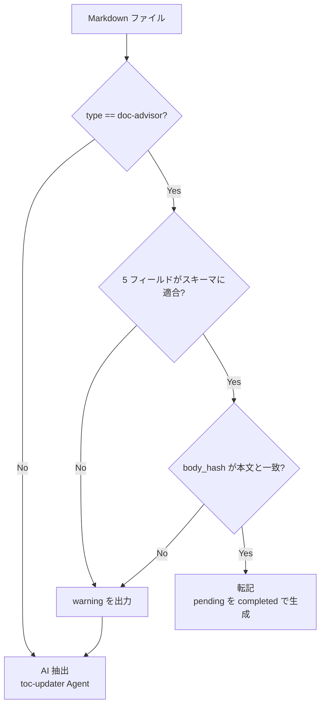
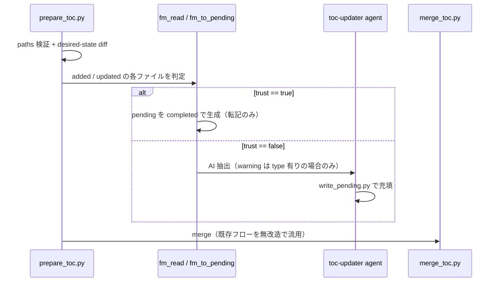

# DES-008: doc-advisor フロントマター設計書

## メタデータ

| 項目    | 値                                    |
| ------- | ------------------------------------- |
| 設計 ID | DES-008                               |
| 作成日  | 2026-07-31                            |
| 参照    | REQ-001, DES-005, FNC-002, toc_format |

## 1. 概要

doc-advisor が扱う Markdown 文書に、ToC 相当のメタデータをフロントマターとして埋め込む。目的は、文書の作成・編集を担う AI スキルが生成時点でメタデータを書き込むことで、`index-docs` 実行時の `toc-updater` Agent によるコールドリード（1 ファイルずつ本文を読んで再抽出）を省略し、大量文書の索引コストを削減することである。

`toc.yaml` は query 時の唯一の参照先として維持する（query 時に個々のフロントマターを都度パースする方式は採らない）。フロントマターは「pending エントリを高速に埋めるための入力」という位置づけであり、ToC の Single Source of Truth 性は変えない。

当初は Open Knowledge Format（OKF v0.1）準拠を検討したが、§3 の理由により**不採用**とし、doc-advisor 独自スキーマ（現行 ToC の 5 フィールド + 識別マーカー + 本文ハッシュ）を採用する。

## 2. 背景・経緯

- 現状、`index-docs` は `prepare_toc.py` が checksum 差分で `added`/`updated` を検出し、該当ファイルを `toc-updater` Agent（AI によるコールドリード）で 1 件ずつ処理する。600 件規模の初回インデックスでは数時間規模のコストがかかる
- `added` 判定のファイルには前回 checksum が存在しないため、既存の checksum スキップ機構は原理的に効かない
- 文書の作成・編集がほぼ全て AI スキル経由であるという前提のもと、作成時点でその AI が既に文書内容を完全に理解している状態でメタデータを書けば、限界コストはほぼゼロになる
- 編集時にも同じ AI スキルがフロントマターを見直す契約を持たせることで鮮度を保つ。ただしその契約をプロンプト規律のみに委ねず、本文ハッシュによる機械的な不一致検出を安全網として持たせる
- `toc.yaml` を廃止して query 時に都度フロントマターを解析する方式は、コストを「index 構築時の 1 回」から「query 実行のたびの毎回」へ付け替えるだけであり、原子的書き込み・検証・ロールバックという既存の安全機構（`merge_toc.py`）も失うため不採用とした
- 実装上の着地点は、pending YAML を `toc-updater` Agent を呼ばずにフロントマターから直接 `status: completed` として生成し、その後は `merge_toc.py` の既存フロー（backup → 原子的書き込み → `validate_toc` → checksums 更新）を無改造で流用することである
- フロントマターを持たない既存文書に対しては、書き込み用 SKILL で後から埋める（§8）。1 度コールドリードを払えば結果が文書内に残り、git を通じて全クローンで再利用される

---

## 3. OKF 準拠を採らない判断

### 3.1 判断の根拠となった OKF 実例

OKF 公式リファレンス実装（`GoogleCloudPlatform/knowledge-catalog` の GA4 バンドル）の実例を判断材料として記録する。

BigQuery テーブルを説明する文書:

```yaml
type: BigQuery Table
resource: https://bigquery.googleapis.com/v2/projects/bigquery-public-data/datasets/ga4_obfuscated_sample_ecommerce/tables/events_*
title: Events table (Google Analytics BigQuery Export)
description: Contains Google Analytics event export data from the `ga4_obfuscated_sample_ecommerce` dataset.
tags:
  - events
  - Google Analytics
  - BigQuery
  - ecommerce
timestamp: "2026-05-28T22:53:05+00:00"
```

BigQuery データセットを説明する文書:

```yaml
type: BigQuery Dataset
resource: https://bigquery.googleapis.com/v2/projects/bigquery-public-data/datasets/ga4_obfuscated_sample_ecommerce
title: BigQuery sample dataset for Google Analytics ecommerce web implementation
description: A sample of obfuscated Google Analytics BigQuery event export data for three months from the Google Merchandise Store.
tags:
  - ecommerce
  - web analytics
  - Google Analytics
  - BigQuery
timestamp: "2026-05-28T22:49:59+00:00"
```

### 3.2 `type` は `resource` と対でのみ機能する

上記 2 例において、`type` は `title` の主辞名詞をそのまま抜き出したものになっている（`Events table (...)` → `BigQuery Table`）。OKF において `type` が固定 enum ではなく自由記述の名詞句であることと合わせると、`type` 単独では情報を持たない。

OKF のリファレンス実装は**外部リソースのカタログ**であり、1 文書が 1 つの実体（BigQuery のテーブル、データセット）の 1:1 ラッパーになっている。`type` は `resource`（実体の URI）と対になって初めて「この URI の先は何のクラスか」という意味を持つ。

doc-advisor の対象は散文の文書（ルール・要件・設計）であり、対応する外部実体が存在しない。したがって `resource` に入れるべき値が無く、`resource` を落とした時点で `type` は相方を失って退化する。doc-advisor の文脈で `type` が取りうる意味は次の 3 つしかなく、いずれも成立しない。

| 読み方                                   | 帰結                                                           |
| ---------------------------------------- | -------------------------------------------------------------- |
| 対象の種別（OKF 本来の意味）             | `resource` が無いため `title` の主辞の重複。情報量ゼロ         |
| 文書の分類（`Rule` / `Design Document`） | FNC-002 が検索寄与なしとして廃止した `doc_type` の復活         |
| 定数マーカー                             | OKF の意味ではない。必須フィールドをプレースホルダで埋めるだけ |

### 3.3 `tags` と `keywords` は思想が逆向き

OKF の `tags` には `BigQuery` / `Google Analytics` のような大分類語が並ぶ。一方 doc-advisor の `keywords` は「クラス名・メソッド名・ドメイン固有語を優先し、カテゴリラベルを避ける」と定義されており、FNC-002 の見落としゼロはこの品質に直接依存している。

フィールド名は、それを書く AI に対する事前分布として働く。`tags` という名前は「汎用カテゴリ語を並べよ」という連想を持つため、改名すると `keywords` のルールと逆方向に引っ張る。したがって `tags` への改名は有害である。

### 3.4 結論

- OKF 準拠は目標としない。`type`（OKF 本来の意味）・`resource`・`tags`・予約ファイル名（`index.md` / `log.md`）は採用しない
- `description` への改名も行わない。doc-advisor の要約欄は「対象の説明」ではなく「その文書が何のためにあるか」であり、`purpose` の方が役割を正確に名指している。加えて配布物の SKILL.md が別の意味で `description` を使用しており、同一リポジトリ内で二義になることを避ける
- 結果として ToC の既存 5 フィールドはすべて名称を維持する。`type` のみ、§4.1 の**識別マーカー**として意味を変えて採用する

---

## 4. 確定スキーマ

### 4.1 フロントマター

```yaml
---
type: doc-advisor
title: ドキュメントのタイトル
purpose: この文書が何のためにあるかの要約（最大 200 文字）
content_details:
  - 具体的な内容項目（最大 10 件）
applicable_tasks:
  - この文書が必要になるタスク種別（最大 10 件）
keywords:
  - 照合語（最大 10 語）
body_hash: sha256:3f2a9c...（64 桁）
---
```

`title` / `purpose` / `content_details` / `applicable_tasks` / `keywords` の内容規約（文字数上限・件数上限・書き方の指針）は `toc_format` の Field Guidelines をそのまま適用する。本設計書で新たに定義するのは `type` と `body_hash` の 2 つのみである。

#### `type`

固定値 `doc-advisor` を取る**識別マーカー**である。OKF の `type`（対象の種別）とは意味が異なる。

用途は、フロントマターを読む側が「これは doc-advisor 規約に従ったフロントマターか」を、フィールドの有無を探ることなく 1 行で判定できるようにすることである。これにより次の 2 ケースを区別できる。

- `type` が無い（SKILL.md の `name` / `description` 等、別種のフロントマター）→ 正常な対象外として AI 抽出へ
- `type` があるのに内容が不完全 → 規約違反であり異常。挙動は AI 抽出だが warning を出す（§5.3）

このマーカーが無いと上記 2 つを区別できず、壊れたフロントマターを「対象外の文書」として黙って見逃す。

全文書で同値であり検索の識別情報を持たないため、**`toc.yaml` には書き出さない**（`doc_type` を廃した FNC-002 の判断と整合）。

#### `body_hash`

フロントマターが現在の本文に対して書かれたものかを検証する。詳細は §4.2。`toc.yaml` には書き出さない。

### 4.2 `body_hash` の仕様

#### 対象範囲

**本文のみ**を対象とし、フロントマターを含めない。ハッシュ値自体をフロントマターに書き込むため、フロントマターを含めると自己参照となり不動点が存在しないためである。

- 本文 = 終端デリミタ行（`---`）の次の行から EOF まで

#### 正規化

ハッシュ計算前に次の正規化を行う。

1. 改行コードを LF に統一（`\r\n` → `\n`）
2. 末尾の空白・空行を除去し、改行 1 つを付与

この正規化は安全側に倒せる。正規化しすぎて起きるのは「意味が同じ本文が同じハッシュになる」＝正しい挙動であり、陳腐化の見逃しは生まない。逆に正規化が不足すると、意味の変わらない差で不一致が発生し、無用な AI 再抽出を招く。**迷ったら正規化する**方針とする。

#### アルゴリズムと値の形式

- SHA-256（`.toc_checksums.yaml` および work file 名と同一。リポジトリ内で 1 種類に統一）
- UTF-8 エンコードした正規化済み本文に対して計算
- 値は `sha256:<64 桁 hex>` の形式とし、**アルゴリズム名を前置する**

前置する理由は、将来アルゴリズムを変更した際に既存の値と区別できるようにするためである。読み取り側は未知の接頭辞を「判定不能 → AI 抽出へフォールバック」として安全に処理でき、混在期間を移行処理なしで越えられる。

桁は切り詰めない。work file 名の `[:16]` は衝突空間が key 単位ストア配下に閉じているための措置であり、本フィールドには当てはまらない。

#### 打刻タイミング

**整形器の実行後**に計算・書き込む。整形は本文のバイト列を変えるため、打刻後に整形が走ると全ハッシュが無効化され、全件が AI 再抽出に落ちる。詳細は §6.3。

なお本文ハッシュは本文のみを対象とするため、**打刻後にフロントマターが整形されてもハッシュは有効なまま**である。自己参照回避の設計が順序問題も同時に解いている。

### 4.3 `toc.yaml`（変更なし）

`toc.yaml` のスキーマは変更しない。`type` / `body_hash` は書き出さず、既存の 5 フィールドのみを持つ。したがって `validate_toc.py` の必須フィールド定義および `merge_toc.py` の書き出し処理に変更は不要である。

### 4.4 言語ルール

**本文の言語に合わせる。** 従来 ToC に課していた「全フィールド値を英語」という制約は解除する。

根拠:

1. フロントマターは原本に埋め込まれるため人間が読む。日本語文書に英語メタデータだけが浮いていると、編集時に更新されず腐りやすい
2. 書き手である AI にとっても、本文と同じ言語の方が正確に書ける。翻訳を挟むと劣化し、かつ翻訳のための AI 介在はコスト削減目標と両立しない
3. 検索は壊れない。FNC-002 のとおり query-worker は ToC を全量読んで意味理解で照合するため、言語混在に耐える（トークン一致ではない）
4. 最も検索に効く `keywords`（クラス名・メソッド名）は識別子であり、文書の言語に依存しない

副次的な影響として、`purpose` の 200 文字上限は言語により実質的な情報量が変わるが、上限としては引き続き妥当なため数値は変更しない。

プロジェクト単位で言語を固定する設定は、必要性が確認されるまで導入しない。

### 4.5 既存フロントマターとの共存

配布物の SKILL.md や `formats/*.md` は、Claude Code 仕様等により意味が固定された `name` / `description` / `applicable_when` を既に持つ。

- フロントマターの書き込みは**マージであり上書きではない**。doc-advisor が定義していないキーは値を変更せず保持する
- doc-advisor 側の判定は §5.1 の述語のみで行い、未知キーの存在は判定に影響しない

---

## 5. 信頼判定とフォールバック

### 5.1 判定述語

```
trust = (type == "doc-advisor")
      ∧ (5 フィールドが全て存在し、非空で、下表のスキーマに適合する)
      ∧ (body_hash が存在し、接頭辞が既知で、現在の本文と一致)
```

検証するスキーマ（`toc_format` の規約を機械判定可能な形に落としたもの）:

| フィールド         | 型            | 制約                                       |
| ------------------ | ------------- | ------------------------------------------ |
| `type`             | string        | `doc-advisor` に一致                       |
| `title`            | string        | 非空                                       |
| `purpose`          | string        | 非空、200 文字以内                         |
| `content_details`  | array[string] | 1〜10 件、各要素は非空文字列               |
| `applicable_tasks` | array[string] | 1〜10 件、各要素は非空文字列               |
| `keywords`         | array[string] | 1〜10 件、各要素は非空文字列               |
| `body_hash`        | string        | `^sha256:[0-9a-f]{64}$` に一致し本文と一致 |



**存在確認だけでは不十分な理由**: 型・件数・文字数を検証しないと、`content_details: "x"`（配列ではなく文字列）のようなスキーマ違反が非空と判定され、そのまま pending へ転記される。不正な pending は `merge_toc.py` の `validate_toc` で検出されるが、そこでの失敗は DES-005 §6.5 により **`toc.yaml` 全体のロールバック**を引き起こし、当該 key の索引が丸ごと失敗する。1 ファイルの不正で全体を止めるより、そのファイルだけ AI 抽出へ落とす方が影響が小さい。したがって検証は転記より前、すなわち本述語で行う。

### 5.2 all-or-nothing とする根拠

`trust` が偽の場合、**欠けたフィールドのみを AI に補完させる部分利用は行わず、全項目を AI 抽出で作り直す**。

理由は、このフロントマターが script によって書き込まれるものだからである。script が書いたはずの成果物が不完全であるということは、契約の外側で何かが起きた証拠であり、残りのフィールドも同程度に疑わしい。部分的に信用する方が危険である。

この判断により分岐が 1 本に畳まれ、実装とテストが単純化される。

### 5.3 warning

挙動は上記のとおり一律フォールバックとするが、**`type: doc-advisor` が存在するのに `trust` が偽になったケース**は warning として出力する。フィールドの欠落・空値・スキーマ違反（型・件数・文字数上限）・`body_hash` の不一致および形式不正のすべてを含む。script が書いたものが壊れている、あるいはフロントマターが本文から取り残されている状態を、黙って高コスト経路に落として気づかないまま放置することを避けるためである。

DES-005 §8.1 の JSON 契約に既に `warnings` フィールドがあるため、追加コストはない。

---

## 6. スクリプト構成

### 6.1 配置と独立性の境界

フロントマター関連の script は既存の ToC パイプラインから**完全に独立**させ、専用ディレクトリに配置する。

```text
plugins/doc-advisor/scripts/frontmatter/
├── fm_core.py       # パース・生成・本文抽出・正規化・body_hash 計算
├── fm_read.py       # 読み取り + 信頼判定 → JSON
├── fm_write.py      # 書き込み / 更新 + 整形呼び出し + body_hash 打刻
└── fm_to_pending.py # 信頼できるフロントマター → pending YAML

tests/scripts/frontmatter/test_fm_*.py
```

独立性の境界を次のとおり定義する。

- `toc_store.py` / `toc_utils.py` を **import しない**。key 解決も store_dir 解決も行わない
- `fm_to_pending.py` は pending の**形式は知るが、置き場所は知らない**。出力先はコマンド引数（`--out <path>`）で受け取る
- 呼び出し側（`index-docs` SKILL / `prepare_toc.py`）が場所を決めて渡す

この分離により、フロントマター方式を将来撤回する場合に 1 ディレクトリの削除で戻せる。

### 6.2 各 script の責務

| script             | 責務                                                                                                  |
| ------------------ | ----------------------------------------------------------------------------------------------------- |
| `fm_core.py`       | フロントマターのパース / 生成、本文抽出、正規化、`body_hash` 計算。他 3 script が共有する純粋ロジック |
| `fm_read.py`       | 対象ファイルのフロントマターを読み、§5.1 の述語で信頼判定した結果を JSON 出力                         |
| `fm_write.py`      | メタデータを受け取りフロントマターへマージ書き込み。整形器を呼んだ後に `body_hash` を計算・打刻       |
| `fm_to_pending.py` | 信頼できるフロントマターを pending YAML（`status: completed`）として `--out` の指定先へ書き出す       |

`fm_to_pending.py` は pending の `_meta` に来歴を記録する（§8.2）。

### 6.3 整形コマンド

`fm_write.py` は本文を整形の不動点に置いてから `body_hash` を打刻する必要があるため、整形器を呼ぶ。ただし配布先のプロジェクトが使う整形器は不定であるため、**script に特定の整形器名を持たせない**。

```text
fm_write.py --format-command "dprint fmt {file}"
```

- 未指定なら整形器を呼ばずにハッシュを計算する
- 整形器が存在しないプロジェクトでは誰も本文を書き換えないため、呼ばないことが正しい挙動であり、機能の劣化ではない

設定ファイルではなく CLI 引数で受け取る理由は 2 つある。doc-advisor は通常経路で設定ファイルを読まない設計（DES-005 §4.2）であり、「何を使うかは上位層が決めて渡す」という思想と一貫すること。および、設定ファイルに記述された任意コマンドを script が実行するリスクを避け、呼び出し側に責任を明示することである。

なお、打刻後に別経路（commit フック、CI、エディタの保存時整形）で整形が走った場合はハッシュが無効化される。ただしその帰結は AI 抽出へのフォールバック、すなわち現行挙動への復帰にとどまり、誤ったメタデータが混入することはない。必要な不変条件は「打刻時点で本文が整形の不動点にあること」であり、完全な保証ではなく違反頻度の低減で足りる。

### 6.4 テスト

`scripts/` 配下のテストは必須である。上記に加え、独立性に伴う固有のリスクへ対処するテストを設ける。

- **YAML エスケープ一致テスト**: 完全独立の帰結として、YAML 値のエスケープ実装が `toc_utils.yaml_escape` と `fm_core` の 2 つになる。同一の値がフロントマターと `toc.yaml` で異なるエスケープを受けると、無用な不一致や壊れた `toc.yaml` を生む。**同じ値を両実装に通して出力が一致すること**を固定するテストを置く
- **スキーマ規約の一致テスト**: §5.1 の型・件数・文字数の規約は `validate_toc.py` と `fm_core` の 2 箇所に実装される。**同じ入力に対して両者が同じ合否を返すこと**を固定するテストを置く。乖離すると、転記側が通したものを merge 側が弾き、§5.1 が防ごうとした ToC 全体のロールバックが再発する
- `body_hash`: 正規化（CRLF / 末尾空行）で値が変わらないこと、本文変更で値が変わること、フロントマター変更で値が変わらないこと
- 信頼判定: §5.1 述語の各分岐（`type` 欠落 / フィールド欠落 / 空値 / 型不一致 / 件数超過 / 文字数超過 / ハッシュ不一致 / ハッシュの形式不正 / 未知の接頭辞）
- `fm_write.py`: 未知キー（`name` / `description` 等）が保持されること

---

## 7. 処理フロー

### 7.1 `index-docs` への統合

本設計の変更点は、DES-005 §6.1 のシーケンスにおける「AI 層がメタデータ充填」の一箇所に閉じる。



`merge_toc.py` 以降（backup → 原子的書き込み → `validate_toc` → checksums 更新 → `.toc_work/` 削除）は一切変更しない。

### 7.2 2 種のハッシュの関係

本設計では SHA-256 のハッシュが 2 系統存在するが、**測っている関係が異なる**。混同を避けるため明記する。

| 対象                  | 範囲         | 意味                                                 | 所在                             |
| --------------------- | ------------ | ---------------------------------------------------- | -------------------------------- |
| `.toc_checksums.yaml` | ファイル全体 | 前回の index 実行時から変化したか                    | `.claude/` 配下のローカル状態    |
| `body_hash`           | 本文のみ     | このフロントマターは現在の本文に対して書かれたものか | 文書内（git で全クローンに伝播） |

この差が効く場面は 2 つある。

1. **`updated` の扱い**: checksum は「変わった」としか言わず、フロントマターも同時に更新されたのかを区別しない。`body_hash` があれば `updated` でも転記で済ませられ、コスト削減が `added` 以外にも及ぶ
2. **クローン境界**: `.toc_checksums.yaml` はクローンごとに独立するため、他者が本文だけ変更して commit したものを別クローンが初めて索引する場合（`added` 扱い、前回 checksum 無し）、checksum では原理的に検出できない。文書内に埋め込まれた `body_hash` のみがこれを捕捉する

`body_hash` の打刻はファイル全体を変えるため `.toc_checksums.yaml` 側も更新されるが、merge 完了時に checksums が更新されるため一巡して収束する。

### 7.3 効果範囲

- **効く**: フロントマターを持つ文書の `added`（新規作成・新規クローン）および `updated`（フロントマターも更新済みの場合）
- **効かない**: フロントマターを持たない既存文書（§8 の書き込み SKILL で解消する）
- **元から対象外**: `unchanged`（checksum スキップで既に処理されない）

---

## 8. 既存文書への適用

### 8.1 書き込み SKILL

フロントマターの書き込みは SKILL として提供する。AI が本文を読んでメタデータを作成し、`fm_write.py` が整形・打刻して書き込む。これにより**フロントマターを持たない既存文書にも後から埋められる**。

1 度コールドリードを払えば結果は文書内に残り、git を通じて全クローンに伝播するため、以降は誰がどこで索引しても転記のみで済む（§7.2 のクローン境界の議論による）。

### 8.2 AI 抽出結果の書き戻し

`index-docs` が AI 抽出にフォールバックした場合、その結果を原本のフロントマターへ書き戻せばコーパスが自己修復する。ただし**索引処理と同時には行わない**。索引という読み取り操作の副作用で原本に git diff が生じるのは驚きがあるためである。

- ToC の生成完了後に、対象を提示してユーザに確認する
- 確認のための候補は、pending の `_meta.extracted_by`（`frontmatter` | `ai`）に記録し、`merge_toc.py` の JSON 出力を通じて SKILL が参照する
- `extracted_by` は `toc.yaml` には書き出さない（`type` と同じ理由で、検索の識別情報ではないため）

なお「信頼できるフロントマターを持たないファイルの集合」は `fm_read.py` でコーパスを走査すればいつでも再計算できるため、この来歴は永続状態として保持する必要はない。実行中の確認を簡便にするための一時情報である。

---

## 9. 他文書への影響

本設計の実装時に、同一変更内で次を更新する必要がある。

| 対象         | 内容                                                                                                 |
| ------------ | ---------------------------------------------------------------------------------------------------- |
| `toc_format` | Language Rule（全フィールド英語）を §4.4 に合わせて改訂。pending の `_meta` に `extracted_by` を追加 |
| DES-005      | §6.1 のシーケンスに転記経路を追記（§7.1）。§4.1 のモジュール一覧に `frontmatter/` の位置づけを追記   |
| CLAUDE.md    | Repository Layout に `plugins/doc-advisor/scripts/frontmatter/` を追加                               |

---

## 10. 未決事項・次のステップ

本設計書でフィールド定義・信頼判定・script 構成は確定した。実装に着手する前に次を決める必要がある。

1. **書き込み SKILL の名称と配置**（§8.1）。新規 SKILL として追加するか、既存の `index-docs` にモードとして持たせるか
2. **配布物 SKILL.md への適用可否**。SKILL.md のフロントマターは Claude Code 仕様に従うため、doc-advisor 独自キーを追加してよいか（§4.5 のマージ規則により既存キーは保持されるが、未知キー追加の許容度は未確認）
3. **上位スキルへの契約反映**。forge / anvil の文書作成・編集スキルに「作成時にフロントマターを書く / 編集時に見直す」契約を持たせる範囲と手順。実装計画として別途策定する

## 改定履歴

| 日付       | バージョン | 内容                                                                                                                                                                                                                                                                     |
| ---------- | ---------- | ------------------------------------------------------------------------------------------------------------------------------------------------------------------------------------------------------------------------------------------------------------------------ |
| 2026-07-31 | 0.1        | 初版作成。OKF 準拠の可否を検討するたたき台として、フィールド比較表と未決定事項を提示                                                                                                                                                                                     |
| 2026-08-01 | 1.0        | OKF 準拠を不採用と決定し（§3）、独自スキーマを確定。`type` を識別マーカーとして再定義、`body_hash` の仕様確定、all-or-nothing の信頼判定（§5）、`scripts/frontmatter/` への分離（§6）、英語限定ルールの解除（§4.4）、既存文書の書き込み SKILL と書き戻し方針（§8）を追記 |
