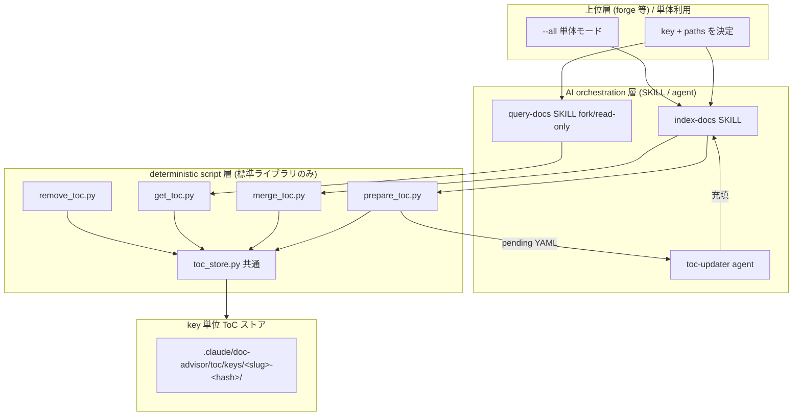
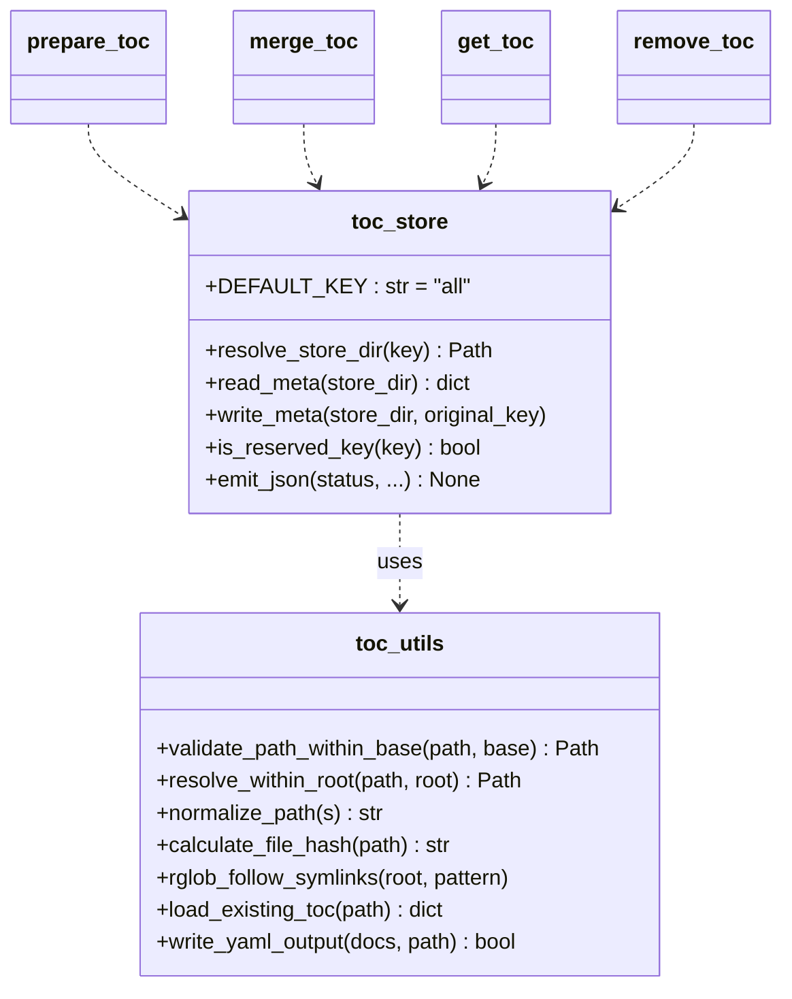
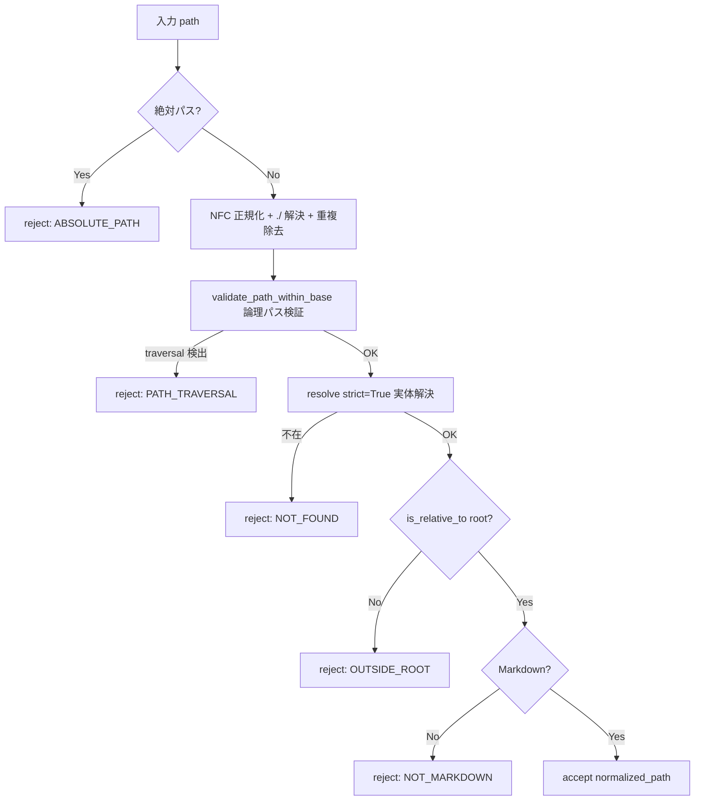
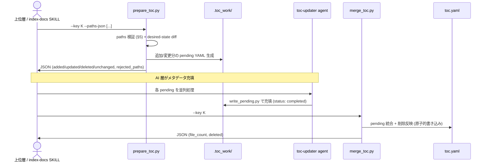
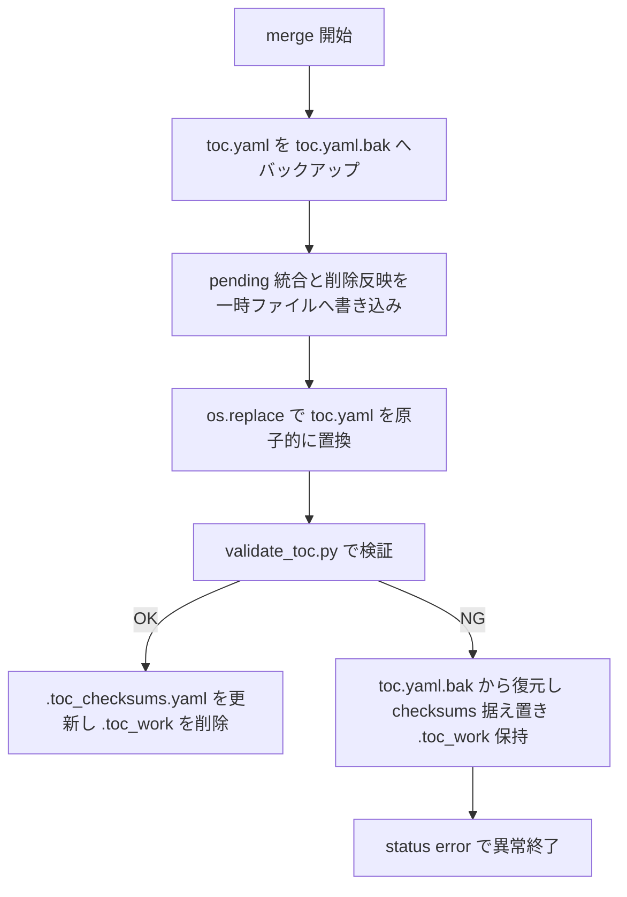
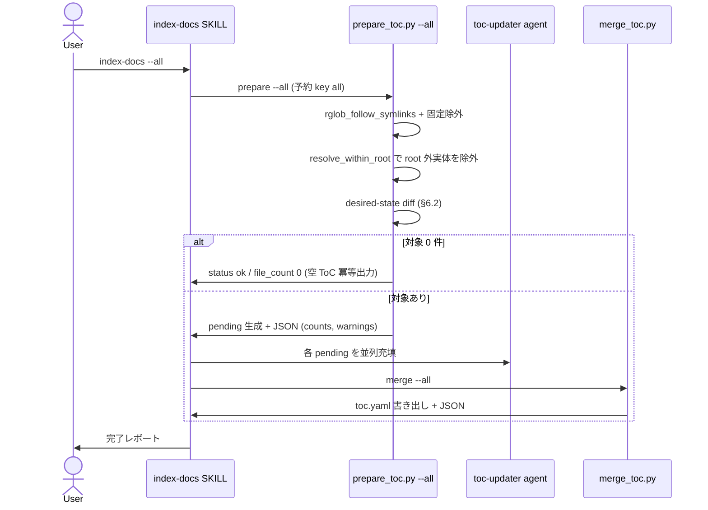
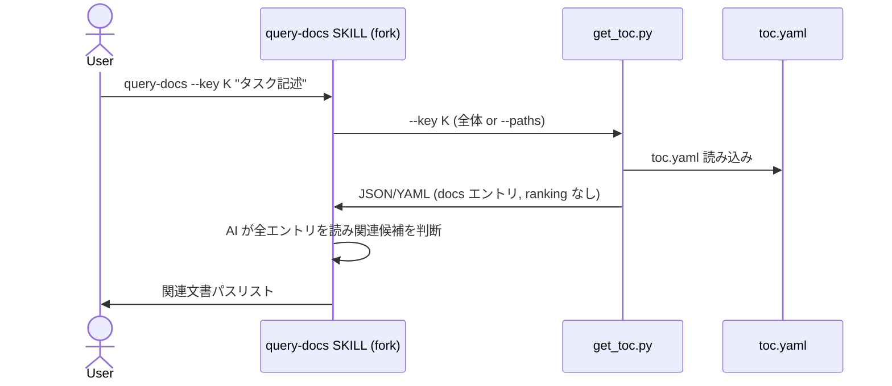

# DES-006 key + path 汎用 ToC Provider 設計書

## メタデータ

| 項目     | 値                                                                                                                      |
| -------- | ----------------------------------------------------------------------------------------------------------------------- |
| 設計 ID  | DES-006                                                                                                                 |
| 関連要件 | REQ-004                                                                                                                 |
| 作成日   | 2026-05-30                                                                                                              |
| 参照     | base/REQ-001, base/DES-003, base/DES-004, base/DES-005, base/ADR-002, base/FNC-002（継続・supersede の別は REQ-004 §9） |

## 1. 概要

REQ-004 が定める「key + project-root-relative paths を入力とする汎用 ToC Provider」を実装するための設計を定義する。現行の category（rules/specs）固定・`.doc_structure.yaml` 探索ベースの実装（base/DES-004, base/DES-005）を、**opaque key 単位のストア**へ再編し、文書集合の決定責務を上位層へ委譲する。決定的処理（path 検証・差分検出・merge）と AI 処理（メタデータ抽出）の境界を script 構成で明示する。

採用アプローチ:

- ToC を `key` 単位のストアディレクトリに分離（category 固定パスを廃止）
- desired-state sync を `prepare_toc.py`（差分検出 + pending 生成）と `merge_toc.py`（統合）の 2 フェーズに分割し、間に AI メタデータ充填を挟む
- path 検証は既存の論理パス検証（traversal）を流用しつつ、symlink 実体解決を**新規ロジック**として追加
- 全 script を単一 JSON の stdout 契約に統一

## 2. アーキテクチャ概要

### 2.1 レイヤー構成

REQ-004 FR-N07 のレイヤー責務境界を、deterministic script 層と AI orchestration 層に分離する。



### 2.2 依存方向規範 [MANDATORY]

レイヤード依存とし、下位が上位を参照しない。

1. AI 層 → script 層 → 共通モジュール（`toc_store.py` / `toc_utils.py`）→ ストアの単方向
2. script 層は AI 層を呼ばない（メタデータ抽出は AI 層が `prepare → merge` の間で実施）
3. 循環依存を作らない。共通ロジックは `toc_utils.py`（既存）と新設 `toc_store.py`（key 解決・ストア I/O）に集約

base/DES-005 の fork 型 SKILL と Agent の関係（fork SKILL は Agent を起動できない）を継続する。生成系 `index-docs` は fork せず（agent 並列起動のため）、検索系 `query-docs` は fork する（base/ADR-002 継続）。

## 3. ストレージ設計

### 3.1 key → 保存パス変換

REQ-004 FR-N01-3 の「衝突しない決定的変換」を以下で実現する。

```text
store_dir(key) = .claude/doc-advisor/toc/keys/{slug}-{sha256(key)[:12]}/
```

- `slug`: key を NFC 正規化（既存 `normalize_path`）後、`[a-z0-9_-]` 以外を `_` に置換し、英小文字化・連続 `_` 圧縮・長さ 40 文字で切り詰め。さらに切り詰めの前後で前後の `_` を除去する（識別はサフィックスが担うため安全で、可読性目的の整形）
- `{sha256(key)[:12]}`: 切り詰め・正規化による衝突を回避する 12 桁 hex サフィックス（original key 全体のハッシュ）
- slug が空（記号のみ key 等）になる場合は `slug = "k"` とし、識別はサフィックスが担う

衝突しない根拠: サフィックスは original key 全体の SHA-256 から導出するため、slug が衝突しても別ディレクトリに解決される。slug は人間可読性のための前置詞に過ぎない。

### 3.2 ストアディレクトリ構造

```text
.claude/doc-advisor/toc/keys/{slug}-{hash}/
├── meta.yaml          # original_key, created_at, schema_version
├── toc.yaml           # 最終 ToC (metadata + docs)
├── .toc_checksums.yaml # key 単位の変更検出用チェックサム
└── .toc_work/         # prepare が生成する pending YAML (一時)
```

- `meta.yaml` に **original key** を保持（REQ-004 FR-N01-4）。`store_dir` から key を復元・照合可能にする
- 予約 key `all`（REQ-004 FR-N04）は `store_dir("all")` に解決する。`all` はユーザー任意 key として reject されるため（FR-N01-5）、名前空間衝突は起きない

base/DES-004 の category 別固定パス（`toc/rules/`, `toc/specs/`）は廃止し、本構造へ移行する。既存ストアからの移行は行わず再生成とする（REQ-004 §6.2 clean break 確定 / 非目的「自動 migration を持たない」）。

### 3.3 key の検証

| 入力              | 扱い                                                                              |
| ----------------- | --------------------------------------------------------------------------------- |
| 空 key            | reject（`error_code: KEY_EMPTY`）                                                 |
| 過長 key          | slug 切り詰め + hash サフィックスで吸収（reject しない）                          |
| Unicode key       | NFC 正規化後に slug 化                                                            |
| `all`（任意指定） | reject（`error_code: KEY_RESERVED`）。`--all` / `--key` 省略のみが予約 key に到達 |

## 4. モジュール設計

### 4.1 モジュール一覧

| モジュール                                                          | 責務                                                                                 | 依存                     |
| ------------------------------------------------------------------- | ------------------------------------------------------------------------------------ | ------------------------ |
| `toc_store.py`（新設）                                              | key → store_dir 解決、meta.yaml I/O、JSON 出力ヘルパ、予約 key 判定                  | `toc_utils`              |
| `toc_utils.py`（改修）                                              | path 検証（traversal + symlink 実体解決）、glob、checksums、YAML I/O                 | 標準ライブラリ           |
| `prepare_toc.py`（新設 / 旧 `create_pending_yaml.py` を改名・転用） | paths 検証 → desired-state 差分検出 → pending 生成、`--dry-run`、JSON 出力           | `toc_store`, `toc_utils` |
| `merge_toc.py`（改修）                                              | 充填済み pending を統合 → `toc.yaml` 書き出し（削除反映、原子的書き込み）、JSON 出力 | `toc_store`, `toc_utils` |
| `get_toc.py`（新設 / 旧 `filter_toc.py` を統合）                    | `toc.yaml` 取得（全体 or `--paths` 縮小抽出）、ranking しない、JSON or YAML 出力     | `toc_store`, `toc_utils` |
| `remove_toc.py`（新設）                                             | key 全体削除 / `--paths` 個別エントリ削除、JSON 出力                                 | `toc_store`, `toc_utils` |
| `write_pending.py`（改修）                                          | toc-updater agent が pending にメタデータ充填（`--key` 対応、doc_type 引数廃止）     | `toc_utils`              |
| `validate_toc.py`（改修）                                           | `toc.yaml` 検証（doc_type 必須を撤廃、key ストアパス対応）                           | `toc_store`, `toc_utils` |

`create_checksums.py` の `--promote-pending` / `--clean-work-dir` 機能は `toc_store.py` に統合し、key 単位で扱う。

### 4.2 toc_utils.py の改修方針

| 廃止 / 改修                                                                                                                                                                                                                       | 理由                                                                |
| --------------------------------------------------------------------------------------------------------------------------------------------------------------------------------------------------------------------------------- | ------------------------------------------------------------------- |
| `load_config()` の category 分岐 / `_get_default_config()` の rules/specs 固定キー                                                                                                                                                | REQ-004 §6.2 旧 category ロジック削除                               |
| `init_common_config()` の `root_dirs` / `doc_types_map` 探索・`ConfigNotReadyError`                                                                                                                                               | doc_structure 探索廃止。key + paths を直接受け取る                  |
| `find_config_file()`（`.doc_structure.yaml` 探索）                                                                                                                                                                                | 通常経路で `.doc_structure.yaml` を読まない（REQ-004 受け入れ基準） |
| 流用: `normalize_path` / `calculate_file_hash` / `rglob_follow_symlinks` / `should_exclude` / `load_existing_toc` / `write_yaml_output` / `yaml_escape` / `validate_path_within_base` / `write_checksums_yaml` / `load_checksums` | REQ-004 NFR-N02 既存資産再利用                                      |

### 4.3 主要関数のクラス図（共通モジュール）



## 5. path 検証設計

REQ-004 §6.1 / id🔴1（既存関数流用と symlink 厳格化の両立）を解決する。**traversal 検証は既存 `validate_path_within_base()` を流用し、symlink 実体解決は別ロジック `resolve_within_root()` として新規実装する**。

### 5.1 検証フロー



### 5.2 新規ロジック `resolve_within_root()`

- `Path.resolve(strict=True)` で symlink を辿って実体を解決（不在は `FileNotFoundError` → NOT_FOUND として扱い、REQ-004 FR-N03-4 の不在 reject と兼ねる）
- `Path.is_relative_to(project_root)`（Python 3.9+、REQ-004 NFR-N01 で下限確定）で root 配下を判定。root 外実体を指す symlink は reject
- 大文字小文字衝突は正規化後パスの集合で検出し warning（処理は継続）

既存 `validate_path_within_base()` の docstring（symlink 先を意図的に許可）は変更せず、traversal 専用として流用する。symlink 厳格化は本新規関数が担う。この分離により base のポリシー（論理パス検証）と新 I/F の厳格化が両立する。

### 5.3 単体モード走査との関係（REQ-004 id🟡5）

`--all` 収集は `rglob_follow_symlinks`（`os.walk(followlinks=True)`）で symlink を follow して列挙するが、**列挙後に各ファイルへ `resolve_within_root()` を適用し、root 外実体を指すものを除外**する。明示 paths 検証（上位層入力）は §5.1 で直接 reject する。両経路とも最終的に「実体が root 配下」を保証する。

## 6. desired-state sync 設計

### 6.1 prepare / merge 2 フェーズ（REQ-004 §6.3 / FR-N07-3）



### 6.2 差分検出アルゴリズム

paths を当該 key の完全な desired state として扱う（REQ-004 FR-N02）。

1. 入力 paths を §5 で検証・正規化 → `desired`（集合）
2. `store_dir/.toc_checksums.yaml` から前回状態 `prev`（path → hash）を読む
3. 各カテゴリを算出:
   - **added**: `desired - prev.keys()`
   - **updated**: `desired ∩ prev.keys()` かつ現在の SHA-256 が `prev[path]` と不一致
   - **unchanged**: `desired ∩ prev.keys()` かつ hash 一致
   - **deleted**: `prev.keys() - desired`
4. added + updated について pending YAML を生成（merge 待ち）
5. deleted は merge フェーズで `toc.yaml` から除去

`--dry-run` 時は手順 4-5 を行わず、件数と path 一覧のみ JSON 出力（REQ-004 FR-N02-5）。

### 6.3 desired-state の破壊性（REQ-004 受け入れ基準）

部分配列を渡すと `prev` の残りが deleted となり ToC から消える。これは仕様であり上位層の責務。`prepare_toc.py` は deleted 件数を JSON に明示し、`--dry-run` で事前確認できるようにする。回帰テストで「部分配列 → 残り削除」を固定する。

### 6.4 work file 名

base/DES-005 の `sha256(source_file)[:16].yaml` を踏襲する。ただし衝突空間は key 単位ストア配下に閉じる。

### 6.5 バックアップと異常系（merge 失敗時の復元）

REQ-004 NFR-N07（base/DES-005 のバックアップ・復元フローを key 単位で継続）を反映する。`merge_toc.py` は base/DES-005 Phase 3/4 の backup → validate → restore フローを key 単位ストアに対して踏襲する。



- 原子的書き込み（`os.replace`、既存 `write_yaml_output`）で書き込み途中の破損を防ぐ
- 検証失敗時は `toc.yaml.bak` から復元し、checksums を更新せず `.toc_work/` を保持して再実行可能とする（base/DES-005 Phase 4 の挙動を key 単位で維持）
- バックアップ・work ファイルは当該 key の `store_dir` 配下に閉じるため、他 key の merge と干渉しない

### 6.6 中断耐性と continuation（key 単位）

base/DES-005 の continuation モードを key 単位ストアで成立させる。`.toc_work/` を `store_dir/.toc_work/` に置くことで、再開判定と work dir 競合回避を key 単位に閉じる。

| 状況                                         | 判定                                                         |
| -------------------------------------------- | ------------------------------------------------------------ |
| `store_dir/.toc_work/` が存在し pending あり | 当該 key の prepare を再実行せず、残 pending から merge 待ち |
| `store_dir/.toc_work/` が存在し全 completed  | 当該 key の merge へ直行                                     |
| `store_dir/.toc_work/` なし                  | 通常の prepare から開始                                      |

- 複数 key を同時に処理しても、各 key の `.toc_work/` は別ディレクトリのため競合しない（base/DES-005 は category 単位で同等の分離を持っていた）
- continuation 判定は `index-docs` SKILL が key ごとに行う（base/DES-005 orchestrator パターンを key 単位で継承）

## 7. ToC スキーマ設計

### 7.1 doc_type の除去（REQ-004 id🟡2 / 非目的）

base の `formats/toc_format.md` から `doc_type` を除去する。category 廃止により doc_type 自動分類が成立しないため。

```yaml
# 改訂後 toc.yaml（doc_type 削除）
metadata:
  name: string # key 由来の索引名
  key: string # original key
  generated_at: datetime
  file_count: integer
docs:
  <project-relative-path>:
    title: string
    purpose: string
    content_details: array[string] # 1..10
    applicable_tasks: array[string] # 1..10
    keywords: array[string] # 1..10
```

- pending YAML の `_meta` からも `doc_type` を削除。`write_pending.py` の `--doc-type` 関連引数を廃止
- `validate_toc.py` の必須フィールドから `doc_type` を除外（title/purpose + 3 配列のみ必須）
- 検索（query-docs）は title/purpose/keywords を AI が読む方式（base/FNC-002 継続）で、doc_type 除去による検索機能影響はない

### 7.2 metadata 拡張

`metadata.key` に original key を併記し、ToC 単体でも由来 key を追跡可能にする。original key の **SoT は `meta.yaml`**（§3.2）であり、`toc.yaml` の `metadata.key` はその派生コピー（ToC 利用側の自己完結性のため）。`merge_toc.py` は `toc.yaml` 書き出し時に `meta.yaml` の `original_key` を読んで `metadata.key` に転記し、両者の同期を保証する（二重保持による不整合を防ぐ）。

## 8. JSON 出力契約

### 8.1 共通スキーマ（REQ-004 FR-N08 / §G）

全 script は stdout に単一 JSON、ログ・進捗は stderr（既存 `log()` を踏襲）。ただし `get_toc.py` の `--format yaml` は検索 SKILL が AI に渡す用途の例外で、既定は JSON、`--format yaml` 指定時のみ ToC 本体の生 YAML を stdout に出す（§4.1 の「JSON or YAML 出力」に対応）。

```json
{
  "status": "ok | error | partial",
  "error_code": "INVALID_PATH | PATH_TRAVERSAL | ABSOLUTE_PATH | OUTSIDE_ROOT | NOT_FOUND | NOT_MARKDOWN | KEY_EMPTY | KEY_RESERVED | TOC_NOT_FOUND | NO_TARGETS | null",
  "message": "human-readable",
  "key": "rules",
  "toc_path": ".claude/doc-advisor/toc/keys/rules-<hash>/toc.yaml",
  "normalized_paths": ["docs/a.md"],
  "rejected_paths": [{ "path": "../x.md", "reason": "PATH_TRAVERSAL" }],
  "counts": { "added": 0, "updated": 0, "deleted": 0, "unchanged": 0 },
  "warnings": ["case-insensitive collision: docs/A.md vs docs/a.md"]
}
```

### 8.2 enum 定義

| フィールド   | 値域                                                                                                |
| ------------ | --------------------------------------------------------------------------------------------------- |
| `status`     | `ok` / `error` / `partial`（一部 path を reject しつつ処理続行した場合）                            |
| `error_code` | §8.1 の列挙値 + `null`。`toc_store.py` に定数として集約し、テストで enum を固定（REQ-004 FR-N08-2） |

各 script は使うフィールドのみ出力してよいが、`status` / `error_code` は必須。

## 9. 単体モード（all-markdown）設計

REQ-004 FR-N04。`--all` / `--key` 省略時、予約 key `all` に解決し project root 以下の Markdown を対象にする。

### 9.1 走査と除外

- `rglob_follow_symlinks(project_root, "**/*.md")` で列挙
- 固定除外（REQ-004 §6.4）: `.git/**`, `.claude/**` runtime state, `.codex/**`, `node_modules/**`, `vendor/**`, `dist/**`, `build/**`, `__pycache__/**`, `.venv/**`, `target/**`, `coverage/**`, `.pytest_cache/**`, `.mypy_cache/**`, 生成済み ToC / work files。既存 `should_exclude()` に固定除外リストを渡して適用
- 列挙後に `resolve_within_root()` で root 外実体を除外（§5.3）

### 9.2 境界条件

- 最大ファイル数超過時は `warnings` に含め処理継続（REQ-004 NFR-N05、閾値は 100 件）
- 空 repo / 対象 0 件は `error` ではなく空 `toc.yaml` を冪等出力（`status: ok`, `file_count: 0`）

### 9.3 単体モードのシーケンス



## 10. SKILL / agent 設計

REQ-004 §6.2 の clean break に従い、旧 SKILL（`query-rules` / `query-specs` / `create-rules-toc` / `create-specs-toc` / `setup-doc-structure`）を全廃し、以下へ一本化する。

| コンポーネント | 種別                      | 責務                                                                       |
| -------------- | ------------------------- | -------------------------------------------------------------------------- |
| `index-docs`   | SKILL（fork なし）        | `prepare_toc` → toc-updater 並列 → `merge_toc` を駆動。`--key` / `--all`   |
| `query-docs`   | SKILL（fork / read-only） | `get_toc` を呼び ToC を取得、AI が関連判断。`--key` 省略時は予約 key `all` |
| `toc-updater`  | Agent（Read, Bash）       | pending を読み元文書からメタデータ抽出 → `write_pending.py --key` で充填   |

base/ADR-002（query SKILL の fork / read-only 隔離）を `query-docs` が継承する。base/DES-005 の orchestrator パターン（Phase 2 並列・中断耐性・continue モード）を `index-docs` が継承する。

## 11. ユースケース設計

### 11.1 ユースケース一覧

| ユースケース             | アクター        | 入口                                |
| ------------------------ | --------------- | ----------------------------------- |
| key の ToC を生成・更新  | 上位層 / 利用者 | `index-docs --key K`                |
| 単体で全 Markdown を索引 | 利用者          | `index-docs --all`                  |
| key の ToC を検索        | 利用者 / Claude | `query-docs --key K` / `query-docs` |
| key の ToC を削除        | 上位層 / 利用者 | `remove_toc.py --key K`             |
| desired-state の事前確認 | 上位層          | `prepare_toc.py --key K --dry-run`  |

### 11.2 検索ユースケースのシーケンス（query-docs）



`get_toc.py` は lexical ranking / score を行わず ToC の定義順を保持する（REQ-004 FR-N05-2）。最終的な関連判断は AI（SKILL）が担う。

## 12. 使用する既存コンポーネント

| コンポーネント                                | ファイルパス                     | 用途                                       |
| --------------------------------------------- | -------------------------------- | ------------------------------------------ |
| `validate_path_within_base()`                 | `scripts/toc_utils.py`           | traversal 検証（流用、§5.1）               |
| `normalize_path()`                            | `scripts/toc_utils.py`           | NFC 正規化（§5.1）                         |
| `calculate_file_hash()`                       | `scripts/toc_utils.py`           | SHA-256 変更検出（§6.2）                   |
| `rglob_follow_symlinks()`                     | `scripts/toc_utils.py`           | 単体モード走査（§9.1）                     |
| `should_exclude()`                            | `scripts/toc_utils.py`           | 固定除外適用（§9.1）                       |
| `load_existing_toc()`                         | `scripts/toc_utils.py`           | toc.yaml 読み込み（§6 / get_toc）          |
| `write_yaml_output()`                         | `scripts/merge_toc.py`           | 原子的 ToC 書き込み（§6）。改修方針は §4.2 |
| `write_checksums_yaml()` / `load_checksums()` | `scripts/toc_utils.py`           | key 単位 checksums I/O（§6.2）             |
| `yaml_escape()`                               | `scripts/toc_utils.py`           | YAML エスケープ                            |
| `has_substantive_content()`                   | `scripts/create_pending_yaml.py` | 空ファイルスキップ（prepare へ転用）       |
| orchestrator パターン                         | `workflows/toc_orchestrator.md`  | index-docs の並列・中断耐性（継続）        |

再利用しない判断: `find_config_file()` / `load_config()` の category 分岐は doc_structure 廃止に伴い削除（再利用せず）。理由は REQ-004 §6.2。

## 13. テスト設計

REQ-004 NFR-N03（`scripts/` テスト必須）に従い、同一 PR でテストを伴う。

- **単体テスト対象**:
  - `toc_store.resolve_store_dir()`: slug 化・hash サフィックス・予約 key `all`・空/過長/Unicode key
  - path 検証: 絶対パス / traversal / root 外 symlink / 不在 / 非 Markdown / `./a.md`↔`a.md` 同一視 / 大小衝突 warning
  - desired-state diff: added/updated/unchanged/deleted の算出、**部分配列が残りを削除する固定**（REQ-004 受け入れ基準）
  - JSON 契約: status / error_code enum の固定
  - 単体モード: 固定除外の適用、空 repo の冪等空出力、root 外 symlink 除外
- **統合テスト対象**:
  - `prepare → write_pending → merge` の協調フローで toc.yaml が生成される
  - `remove --key` でストアが削除される
  - 旧 doc_structure 依存が通常経路に残っていないことの回帰テスト（base からの継続: 既存の embedding-removal 回帰テストに倣う）

## 14. 移行に伴う設計上の注意

- 既存 `toc/{rules,specs}/` から `toc/keys/` への自動移行は行わない（clean break、REQ-004 §6.2 / 非目的で確定）。再生成で対応
- README / SKILL / workflow から `setup-doc-structure` 前提の記述を削除（REQ-004 受け入れ基準、コードと同一 PR）
- PR 分割方針は REQ-004 TBD-002（暫定: 設計 → script 層 → SKILL 一本化 → doc_structure 削除）

## 改定履歴

| 日付       | バージョン | 内容                                   |
| ---------- | ---------- | -------------------------------------- |
| 2026-05-30 | 0.1        | 初版作成。REQ-004 を実装する設計を定義 |
