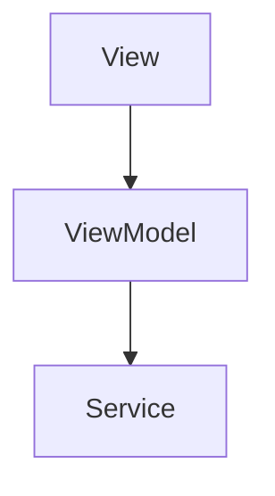

# 設計書フォーマットルール

## 目的

設計書の作成において統一的なフォーマットを定め、以下を実現します：

- **一貫性のある文書構造**: 全ての設計書が同じ構造で記載される
- **AIエージェントの理解促進**: 統一フォーマットによりAIが設計を正確に理解
- **要件とタスクの橋渡し**: 要件IDとタスクIDを接続するトレーサビリティ
- **保守性の向上**: 設計変更時の影響範囲を明確化

---

## 記載上の重要な原則 [MANDATORY]

**設計書は「How（どう作るか）」を記述します。「What（何を作るか）」は要件定義書に記載します。**

### 設計書の必須構成要素 [MANDATORY]

設計書には以下の要素を**必ず**含めること:

| 要素 | 形式 | 配置セクション |
|------|------|--------------|
| モジュールリスト | 表形式（責務と依存を記載） | 「モジュール設計」 |
| クラス図 | Mermaid形式 | 「モジュール設計」または「クラス設計」 |
| ユースケース一覧 | 表形式 | 「ユースケース設計」 |
| シーケンス図 | Mermaid形式 | 「ユースケース設計」または「シーケンス設計」 |

**注意**: セクション名・番号は設計内容に応じて柔軟に調整可能（後述の「テンプレートの柔軟性」参照）

### 記載すべき内容

- ✅ **実装方法**（クラス名、メソッド名、デザインパターン）
- ✅ **技術的詳細**（フレームワーク、ライブラリの選定）
- ✅ **処理フロー・アルゴリズム**（内部の処理ステップ）
- ✅ **データフロー**（Service → DataStore → ViewModel）
- ✅ **状態管理の実装**（ViewState enum、@Observable等）
- ✅ **アーキテクチャ設計**（レイヤー配置、依存関係）
- ✅ **シーケンス図、クラス図**
- ✅ **テストケース設計**（正常系/異常系）
- ✅ **使用する既存コンポーネント**（具体的なファイルパス）

### 記載してはいけない内容

- ❌ **ソースコード**（実装の領域）
  - ※小規模なコード例（5-10行程度）は設計意図を伝えるために許容
  - ※特殊な事情がある場合は人間に確認

### 判断基準

**迷ったら「実装者がこれで実装できるか？」で判断**
- **Yes** → 設計書に記載
- **No** → より詳細化が必要、または要件定義書の領域

**判断の具体例**:
| シナリオ | 判断 | 理由 |
|---------|------|------|
| 「検索処理を実装する」 | ❌ 不十分 | どのように検索するか不明 |
| 「SearchService.search()でcontactsをフィルタリング」 | ✅ 十分 | 実装方法が明確 |
| 「debounce 300msで検索APIを呼び出す」 | ✅ 十分 | 技術的詳細が明確 |

**要件定義書との境界**: `rules/format/spec_design_boundary_guide.md` を参照

---

## 設計書の階層構造 [MANDATORY]

設計書は**階層構造**で管理します。1つの巨大なファイルにまとめるのではなく、適切な粒度で分割します。

### 階層構造

```
トップレベル設計書（DES-001）
├── 子設計書（DES-002）
├── 子設計書（DES-003）
├── 子設計書（DES-004）
└── ...
```

### トップレベル設計書の役割

**記載内容**:
- アーキテクチャ全体像（レイヤー構成、依存関係）
- 全モジュールの一覧と概要
- 共通設計方針（命名規約、エラーハンドリング方針等）
- DI設計（Factory構成）
- 子設計書への参照リンク

**記載しない内容**:
- 各サービスの詳細設計（子設計書に委譲）
- 詳細なシーケンス図（子設計書に記載）
- 詳細なテストケース（子設計書に記載）

### 子設計書の役割

**記載内容**:
- 担当するサービス/モジュールの詳細設計
- 詳細なインターフェース定義
- 処理フロー・シーケンス図
- テストケース設計
- エラー型定義

### 分割基準

**基本原則**: Domain層のService単位で分割

| 分割単位 | 例 | 適用場面 |
|---------|-----|---------|
| Service単位（推奨） | FooService設計書 | 標準的なケース |
| 機能グループ単位 | 検索機能群設計書 | 密接に関連するService群 |
| Library単位 | FooLib設計書 | Library層の重要機能群（境界明確化・再利用見据え） |
| UI機能単位 | ダッシュボード画面設計書 | 複雑なUI機能 |

**分割の判断基準**:
- 単一ファイルが500行を超える場合 → **分割を検討**（ただしトップレベル設計書は例外、詳細は後述）
- 独立してテスト可能な単位 → 分割候補
- 異なる開発者が並行作業する可能性がある単位 → 分割推奨

**500行ルールの例外**:
- **トップレベル設計書（DES-001）**: アーキテクチャ全体像を1ファイルで保持するため、1000行以上でも分割不要
- **既存設計書**: 既に運用中の設計書は、大規模リファクタリングの機会まで現状維持可
- **密結合な設計**: 分割すると理解しづらくなる場合は1ファイルを維持

### 階層構造の例

```
specs/{feature}/design/
├── DES-001_{feature}_architecture_design.md   # トップレベル（アーキテクチャ全体）
├── DES-002_foo_service_design.md              # FooService詳細
├── DES-003_bar_service_design.md              # BarService詳細
├── DES-004_hoge_service_design.md             # HogeService詳細
└── DES-005_main_window_ui_design.md           # MainWindow UI詳細
```

### トップレベル設計書での子設計書参照

トップレベル設計書には、子設計書への参照を明記します：

```markdown
## 詳細設計書

| 設計ID | タイトル | 内容 |
|--------|---------|------|
| DES-002 | FooService設計書 | Foo機能の詳細設計 |
| DES-003 | BarService設計書 | Bar機能の詳細設計 |
| ...
```

### 子設計書でのトップレベル参照

子設計書のメタデータには、トップレベル設計書への参照を記載します：

```markdown
## メタデータ

| 項目 | 値 |
|-----|-----|
| 設計ID | DES-002 |
| 親設計書 | DES-001 |  ← この項目を追加
| 関連要件 | FNC-001 |
```

---

## 設計ID体系

各設計には以下の体系で一意のIDを付与します：

| プレフィックス | 説明 | 例 |
|--------------|------|-----|
| DES- | Design（設計） | DES-001 |

**ID付与ルール**:
- 001から連番
- 一度付与したIDは変更しない
- 削除された設計のIDは欠番とする
- 新規追加時は最後の番号の次を使用
- **トップレベル設計書は001を使用**（Feature内で最初に作成される設計書）

## ファイル命名規則

### 基本ルール
- **設計IDをファイル名の先頭に付与**: `DES-001_user_list_design.md`
- **スネークケース**使用: `{設計ID}_{設計対象名}_design.md`
- 末尾に`_design.md`を必ず付与
- 英語で記載（日本語は使用しない）

## 設計書テンプレート

### テンプレートの柔軟性 [IMPORTANT]

以下のテンプレートは**ガイドライン**です。設計内容に応じて柔軟に調整してください：

- **セクション番号・名称**: 設計内容に適した名称・順序に変更可
- **セクションの追加/削除**: 必要に応じて追加、不要なセクションは省略可
- **サブセクション**: 内容に応じて自由に追加可

**必須事項**:
1. 必須構成要素（モジュールリスト、クラス図、ユースケース一覧、シーケンス図）を**どこかのセクションに**含めること
2. メタデータセクションを文書先頭に配置すること
3. 改定履歴セクションを文書末尾に配置すること

### 基本テンプレート

```markdown
# [設計名] 設計書

**設計ID**: DES-XXX
**関連要件**: [要件ID列挙]
**ファイル**: design/DES-XXX_{機能名}_design.md

## メタデータ

| 項目 | 値 |
|-----|-----|
| 設計ID | DES-XXX |
| 関連要件 | [カンマ区切りで関連要件IDを列挙] |
| 実装層 | [UI層 / Domain層 / Infrastructure層 / DI層] |
| 主要モジュール | |
| - Entity | [Entity名列挙] |
| - Service | [Service名列挙] |
| - DataStore | [DataStore名列挙] |
| - Repository | [Repository名列挙] |
| - View | [View名列挙] |
| - ViewModel | [ViewModel名列挙] |
| - Component | [Component名列挙] |

## 1. 概要

[設計の概要と目的を1-3段落で記載]

## 2. アーキテクチャ概要

[システム全体のアーキテクチャ図（mermaid推奨）]

## 3. モジュール設計

### 3.1 モジュール一覧

[モジュール一覧表 - 必須構成要素]

### 3.2 クラス図

[Mermaid形式のクラス図 - 必須構成要素]

## 4. ユースケース設計

### 4.1 ユースケース一覧

[ユースケース一覧表 - 必須構成要素]

### 4.2 シーケンス図

[Mermaid形式のシーケンス図 - 必須構成要素]

## 5. テスト設計

[テストケース設計]

## 改定履歴

| 日付 | バージョン | 作成者 | 変更内容 |
|------|-----------|--------|----------|
| YYYY-MM-DD | 1.0 | [作成者] | 初版作成 |
```

### 追加可能なセクション（必要に応じて）

設計内容に応じて、以下のセクションを追加してください：

| セクション名 | 用途 | 記載内容 |
|------------|------|---------|
| データフロー設計 | データの流れが複雑な場合 | Repository→Service→DataStore→ViewModel→View の流れ |
| 処理フロー設計 | アルゴリズムが複雑な場合 | 処理ステップ、条件分岐、ループ |
| 状態管理設計 | 状態遷移が複雑な場合 | ViewState設計、状態遷移図 |
| エラーハンドリング | エラー処理が重要な場合 | エラー型定義、リカバリー処理 |
| パフォーマンス考慮 | パフォーマンス要件がある場合 | 最適化方針、キャッシュ戦略 |
| セキュリティ考慮 | セキュリティ要件がある場合 | 認証・認可、データ保護 |

## メタデータ記載のガイドライン

### オプション項目の追加

基本テンプレートの項目に加えて、以下の項目を**必要に応じて**追加できます：

| 項目名 | 用途 | 例 |
|-------|------|-----|
| 親設計書 | 子設計書の場合、トップレベル設計書を参照 | DES-001 |
| 関連設計 | 密接に関連する他の設計書（親子関係以外） | DES-023, DES-024 |
| カテゴリ | 設計の分類（技術横断的な設計の場合） | DI設計、共通基盤 |
| ステータス | 設計の状態 | Draft / Review / Approved |

**追加項目の記載位置**: メタデータ表の「関連要件」の後に追加

**例**:
```markdown
| 項目 | 値 |
|-----|-----|
| 設計ID | DES-002 |
| 親設計書 | DES-001 |
| 関連設計 | DES-023 |
| 関連要件 | FNC-001, BL-009 |
| カテゴリ | Entity拡張 |
| 実装層 | Domain層, Infrastructure層 |
```

### 実装層の判定

**判定基準**:
- **UI層**: View、ViewModel、Componentが含まれる
- **Domain層**: Service、Entity、DataStore Protocol、Repository Protocolが含まれる
- **Infrastructure層**: DataStore実装、Repository実装が含まれる
- **DI層**: Factory Resolver実装が含まれる

**記載方法**: 該当する層を全て列挙（カンマ区切り）

### 主要モジュールの記載

**記載する項目**:
- **Entity**: ビジネスエンティティ（例: FooEntity, BarEntity, SettingsEntity）
- **Service**: ビジネスロジック（例: FooService, BarService）
- **DataStore**: データ保持とStream配信（例: FooDataStore）
- **Repository**: 外部システム連携（例: FooRepository）
- **View**: SwiftUI View（例: FooListView）
- **ViewModel**: 状態管理（例: FooListViewModel）
- **Component**: 再利用可能UIコンポーネント（例: FooListItem）

**記載しない項目**:
- 補助的なEnum、ValueObject
- 内部的なヘルパークラス
- Extension

### 関連要件の記載

**記載方法**:
- この設計が実現する要件IDを全て列挙
- カンマ区切り（例: SCR-001, CMP-001, BL-001）
- 要件トレーサビリティマトリクスと一致させる

## 記載上の注意事項

### 図表の使用

#### Mermaid図（推奨）

**よく使う図の種類**:
- **フローチャート**: アーキテクチャ図、処理フロー
- **クラス図**: モジュール構造、型関係
- **シーケンス図**: ユースケース、データフロー

**例（フローチャート）**:


**構文リファレンス**:
- [Flowchart](https://mermaid.js.org/syntax/flowchart.html) - アーキテクチャ図、処理フロー
- [Class Diagram](https://mermaid.js.org/syntax/classDiagram.html) - モジュール構造、型関係
- [Sequence Diagram](https://mermaid.js.org/syntax/sequenceDiagram.html) - ユースケース、データフロー

**注意**: flowchartで小文字の`end`は使用禁止（`End`または`END`を使用）

### 相互参照

- **要件参照**: 要件IDを明記（例: 「SCR-001の画面仕様に基づく」）
- **他設計参照**: 設計IDを明記（例: 「DES-002と連携」）

## 改定履歴セクション [MANDATORY]

設計書の変更履歴は**各ファイルの末尾**に、以下の形式で記載すること：

### 標準形式

```markdown
## 改定履歴

| 日付 | バージョン | 作成者 | 変更内容 |
|------|-----------|--------|----------|
| 2025-01-01 | 1.0 | Claude | 初版作成 |
| 2025-01-15 | 1.1 | Claude | モジュール追加 |
```

**命名ルール**:
- セクション名は「`## 改定履歴`」を使用（「変更履歴」「承認と改訂履歴」等は使用しない）
- 設計書の**最後のセクション**として配置

**記載ルール**:
- 日付は `YYYY-MM-DD` 形式
- バージョンは `X.Y` 形式（メジャー.マイナー）
- 作成者は git config user.name の値、またはAIの場合は「Claude」
- 変更内容は簡潔に記載（1-2文）

