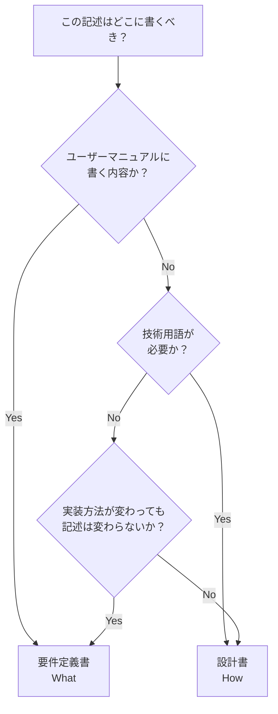

# 要件定義書と設計書の境界ガイド

**目的**: What（要件定義書）とHow（設計書）の境界を明確化し、記載内容の判断を支援する

---

## 1. 基本原則

### 要件定義書（What）

- **目的**: 何を作るか
- **視点**: ユーザー視点
- **内容**: 必要な機能、データ、ルール
- **読者**: ステークホルダー全員
- **詳細度**: 概念レベル
- **技術**: 技術中立（実装方法に依存しない）

### 設計書（How）

- **目的**: どう作るか
- **視点**: 開発者視点
- **内容**: 実装方法、アーキテクチャ、処理フロー
- **読者**: 開発者、AI
- **詳細度**: 実装レベル
- **技術**: 技術依存（SwiftUI、Actor等）

---

## 2. 判断基準

### 主要な判断基準

**「ユーザーマニュアルに書くか？」**

- **Yes** → 要件定義書
- **No** → 設計書

### 補助的な判断基準

| 質問                                           | Yes → 要件定義書 | No → 設計書 |
| ---------------------------------------------- | ---------------- | ----------- |
| 実装方法が変わっても、この記述は変わらないか？ | ✓                |             |
| ユーザーマニュアルに書くか？                   | ✓                |             |
| SwiftUI、Actor等の技術用語が必要か？           |                  | ✓           |
| 「どのように」という質問への答えか？           |                  | ✓           |
| クラス名やメソッド名が含まれるか？             |                  | ✓           |

---

## 3. 判断フローチャート



---

## 4. カテゴリ別ガイド

### 4.1 データ関連

| 内容                                        | 要件定義書 | 設計書 |
| ------------------------------------------- | ---------- | ------ |
| 必要なデータの種類                          | ✓          |        |
| データの内容（概念）                        | ✓          |        |
| データフロー（Service→DataStore→ViewModel） |            | ✓      |
| AsyncStreamの使用                           |            | ✓      |

**例**:

- 要件定義書：「データ（名前、電話番号、グループ）が必要」
- 設計書：「FooService → FooDataStore → AsyncStream → ViewModel」

### 4.2 状態関連

| 内容                             | 要件定義書 | 設計書 |
| -------------------------------- | ---------- | ------ |
| 必要な状態の種類                 | ✓          |        |
| ユーザーから見える状態           | ✓          |        |
| 状態管理の実装（ViewState enum） |            | ✓      |
| @Observable、@MainActorの使用    |            | ✓      |

**例**:

- 要件定義書：「ローディング中、エラー表示中の状態が必要」
- 設計書：「ViewState enumを使用（.loading, .error）」

### 4.3 処理関連

| 内容                     | 要件定義書 | 設計書 |
| ------------------------ | ---------- | ------ |
| 機能の目的               | ✓          |        |
| ユーザーから見た振る舞い | ✓          |        |
| 処理フロー・アルゴリズム |            | ✓      |
| シーケンス図             |            | ✓      |

**例**:

- 要件定義書：「検索キーワードでデータを絞り込む」
- 設計書：「debounce（300ms） → Service.search() → フィルタリング → DataStore更新」

### 4.4 ビジネスルール関連

| 内容                         | 要件定義書 | 設計書 |
| ---------------------------- | ---------- | ------ |
| ルールの内容（条件、計算式） | ✓          |        |
| ルールの実装方法             |            | ✓      |
| バリデーションの実装         |            | ✓      |

**例**:

- 要件定義書：「電話番号は10桁または11桁である必要がある」
- 設計書：「FooValidator.validate() → ハイフン除去 → 長さチェック」

### 4.5 テスト関連

| 内容         | 要件定義書 | 設計書 |
| ------------ | ---------- | ------ |
| テストケース |            | ✓      |
| テスト方法   |            | ✓      |
| 検証項目     |            | ✓      |

**例**:

- 要件定義書：記載しない
- 設計書：「@Test("データ取得成功時、DataStoreが更新される")」

---

## 5. 良い例/悪い例

### 5.1 データフロー

**要件定義書 ✅**:

```markdown
## データ要件

- データリストを表示するために、データが必要
- データは名前、電話番号、グループ情報を含む
- データはリアルタイムで更新される必要がある
```

**設計書 ✅**:

```markdown
## データフロー設計

- FooService → FooRepository → API取得
- Service → FooDataStore.updateItems()
- DataStore → AsyncStream → ViewModel → View更新
```

**要件定義書 ❌**:

```markdown
## データフロー要件

- FooService → FooRepository → API取得
- Service → FooDataStore.updateItems()を呼び出す
```

### 5.2 状態管理

**要件定義書 ✅**:

```markdown
## 状態要件

- ローディング中、データ表示中、エラー表示中の状態が必要
- ユーザーは現在の状態を視覚的に認識できる必要がある
```

**設計書 ✅**:

```markdown
## 状態管理設計

- ViewState enumを使用（.none, .loading, .loaded, .error）
- ViewModelで管理（@MainActor @Observable）
- ViewでViewStateをswitchして表示を切り替え
```

**要件定義書 ❌**:

```markdown
## 画面状態管理要件

- ViewState enumを使用する
- ViewModelで@Observableを使って管理する
```

### 5.3 機能フロー

**要件定義書 ✅**:

```markdown
## 機能：検索

- ユーザーが検索キーワードを入力する
- 名前またはその他フィールドで検索できる
- 検索結果はリアルタイムで表示される
- 検索結果が0件の場合、「見つかりません」と表示される
```

**設計書 ✅**:

```markdown
## 検索の処理フロー設計

1. ViewModel.searchTextが変更
2. debounce（300ms）
3. FooService.search(keyword)
4. Service → Repository.fetch()
5. フィルタリング
6. DataStore.updateSearchResults()
7. ViewModel（Stream購読）→ View更新

シーケンス図:
[mermaid図]
```

**要件定義書 ❌**:

```markdown
## 機能フロー：検索

1. ViewModel.searchTextが変更
2. debounce（300ms）
3. FooService.search()呼び出し
4. DataStore更新
```

### 5.4 ビジネスルール

**要件定義書 ✅**:

```markdown
## ビジネスルール：電話番号の妥当性

- 電話番号は10桁または11桁である必要がある
- ハイフンは許容する（内部的に除去）
- 国際電話番号（+81）は対応しない
```

**設計書 ✅**:

```markdown
## 電話番号検証アルゴリズム設計

1. ハイフンを除去
2. 文字列長をチェック（10 or 11）
3. 全文字が数字かチェック
4. ValidationResultを返却

実装:

- PhoneNumberValidator（Tools/）を使用
- FooService内で検証実行
```

**要件定義書 ❌**:

```markdown
## 処理フロー：電話番号検証

1. PhoneNumberValidator.validate()呼び出し
2. ハイフンを除去
3. 文字列長チェック
```

---

## 6. グレーゾーンの扱い

### 6.1 データモデルの型

**問題**: 「String」「Int」等は技術的詳細か、概念的な記述か？

**結論**: 実用上の観点から**許容する**（グレーゾーン）

**推奨**:

- 概念レベル：「文字列」「数値」「日時」「真偽値」
- 実装型：「String」「Int」「Date」「Bool」も許容

**理由**:

- 要件レベルでも型の明示は有用
- ただし、詳細な型設計（Optional、カスタム型等）は設計書で

### 6.2 mermaid図

**問題**: mermaid図は「What」か「How」か？

**結論**: 内容による

**要件定義書で許容**:

- 画面遷移図（ユーザーから見た遷移）
- ナビゲーション構造図（画面の階層）
- ユースケース図（外部から見た相互作用）

**設計書で記載**:

- シーケンス図（内部の処理ステップ）
- データフロー図（内部のデータの流れ）
- クラス図（実装構造）

---

## 7. まとめ

### 7.1 基本方針

**要件定義書は「ユーザーマニュアル」**

- ユーザーが理解できる内容
- 実装方法に依存しない

**設計書は「実装ガイド」**

- 開発者が実装できる詳細
- 技術的な詳細を含む

### 7.2 迷ったら

1. 「ユーザーマニュアルに書くか？」で判断
2. それでも迷ったら、人間に確認
3. グレーゾーン（data_models/の型等）は実用上許容
