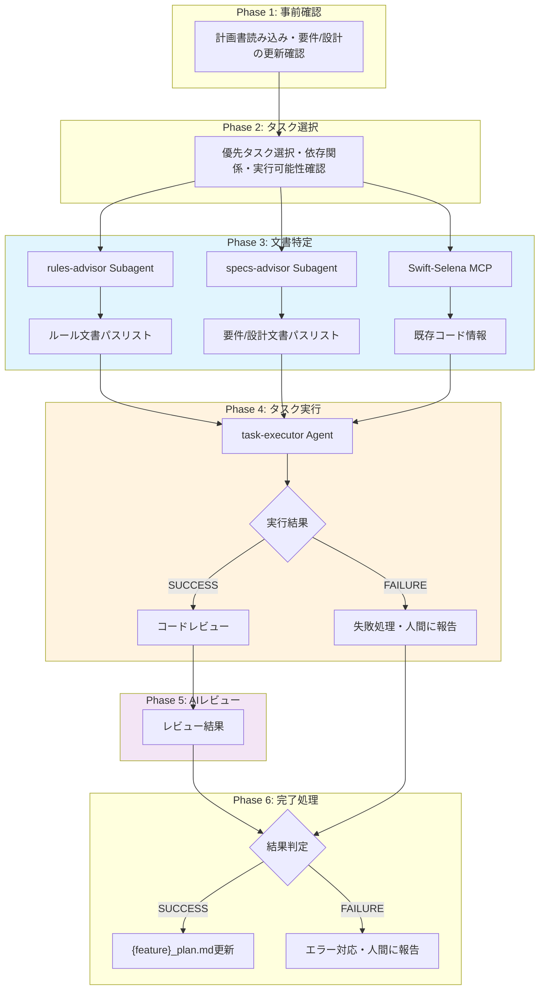

# タスク実行制御ガイド（Claude用）

## 必読文書 [MANDATORY]

**NEVER skip.** 以下の手順で必読文書を動的に特定し、全て読み込むこと
- rules-advisor Subagent でルール文書を特定（Phase 3）
- specs-advisor Subagent で要件定義書・設計書を特定（Phase 3）

## 概要

{feature}_plan.mdから適切なタスクを選択し、必要な情報を整理してAgent(task-executor)に渡すプロセスを定義します。

## 重要原則 [MANDATORY]

以下の原則は本ワークフロー全体を通じて**必ず遵守**すること：

- **ドキュメントは、subagentに全体を読んでもらう** - 部分的な指定は失敗の原因
- **関連ドキュメントは省略しない** - 「最小限」思考は捨てる。見落としの方がリスクが高い
- **ピンポイント指定は禁止** - セクション番号や行番号での指定は避ける
- **具体的なファイルパスで指定** - glob指定は禁止
- **タスクに少しでも関係する可能性があるドキュメントは含める**

**注意**: 「読まなくてもAgentに指示できる」という態度で過去に事故が発生している。事故防止のため、省略は禁止。

**文書量が多い場合のガイダンス**:
- **全て含める方針は維持** — 省略による見落としの方がリスクが高い
- **executor渡し時の構造化**: 必読文書リストは以下の順序で記載し、executorが重要度を把握できるようにする
  1. 設計書（タスクの直接根拠）
  2. 要件定義書（仕様の確認用）
  3. レイヤー固有ルール（実装規約）
  4. 参照コード（既存実装の確認用）

## ワークフロー全体像



**ポイント**:
- Phase 3: **オーケストレーター（Claude）自身が** advisor Subagent を呼び出し、文書を特定
- Phase 4: task-executor は**渡された文書を読むだけ**（Subagent呼び出し不可）
- Phase 4: executor が FAILURE を報告した場合、Phase 5 をスキップし人間に対応を確認
- Phase 5: **オーケストレーター（Claude）自身が** レビューを実施
- Phase 6: **オーケストレーターが** {feature}_plan.md を更新（executor は更新しない）

---

## Phase 1: 事前確認

### 1.1 必読インデックス文書 [MANDATORY]

下記のドキュメントを読み込むこと：

- `specs/{feature}/plan/{feature}_plan.md` - 実装計画書

※ルール文書（rules/）は Phase 3.1 で rules-advisor Subagent を使って特定する
※要件定義書・設計書は Phase 3.1 で specs-advisor Subagent を使って特定する

### 1.2 要件定義書/設計書の更新確認

**Issue/バグ修正/新機能追加の場合の確認事項**

issueやバグ修正、新機能の追加依頼をタスク化する場合、以下を必ず確認すること：

1. **要件定義書への反映確認** - その内容が要件定義書（`specs/{feature}/requirements/**/*.md`）に追記または修正されているか
2. **設計書への反映確認** - 設計変更を伴う場合、設計書（`specs/{feature}/design/**/*.md`）に反映されているか
3. **未反映の場合** - 要件定義書/設計書への追記・修正を先に実施してからタスク化する
4. **背景情報の保持** - issueの背景、理由、目的が要件定義書に明記されているか確認

これにより、タスク実行時に「なぜこの変更が必要か」という情報が失われることを防ぐ。

---

## Phase 2: タスク選択

### 2.1 優先タスクの選択

**ユーザーからタスク指定がある場合**:
- ユーザー指定タスクを最優先で実行

**ユーザー指定がない場合**:
1. `specs/{feature}/plan/{feature}_plan.md`を読み込む（対象Featureの計画書）
2. 全タスクを優先度順（数値が大きい順）で確認
3. 未完了タスク（☐）から最高優先度のものを1つ選択

### 2.2 実行可能性の確認

選択したタスクについて以下を確認：

- **依存関係チェック**
  - 「依存関係」列の全タスクが完了済み（✅）か確認
  - 未完了の依存がある場合は、人間に相談

- **前提条件チェック**
  - 全層共通：要件定義書が存在する（大前提）
  - 設計書：設計ID ≠ `-` の場合は設計書が存在する（単発バグ修正等で設計ID = `-` の場合は不要）
  - UI層タスク：対応するDomain層が実装済み
  - Infrastructure層タスク：対応するProtocolが定義済み

- **タスクグループの確認**
  - 選択タスクがグループ内の場合、グループ開始タスクから順次実行
  - グループ途中から実行不可（グループ先頭タスクが未完了の場合は待機）
  - グループ内タスクの並列実行は不可

---

## Phase 3: 必読文書の特定

### 3.1 文書特定の手順 [MANDATORY]

**オーケストレーター（Claude）自身が**以下のSubagentを起動して文書を特定する：

1. **rules-advisor Subagent** でルール文書を特定
   ```
   subagent_type: rules-advisor
   prompt: [タスク内容を記載]
   ```
   - タスク内容を分析し、必要なルール文書パスを返却
   - 共通必読文書、レイヤー別必読文書、ワークフロー別必読文書を自動判定

2. **specs-advisor Subagent** で要件・設計文書を特定
   ```
   subagent_type: specs-advisor
   prompt: [タスク内容を記載]
   ```
   - タスク内容を分析し、必要な要件定義書・設計書パスを返却
   - トレーサビリティマップを活用して関連文書を自動判定

3. **Swift-Selena MCP** で既存実装を確認（接続時）
   - `search_code` - 類似実装の検索（重複防止）
   - `find_type_usages` - 既存コンポーネントの使用箇所確認
   - `list_symbols` - 参考実装のメソッド一覧

4. 特定した**全ファイルパス**を Phase 4 で task-executor に渡す

#### Subagent失敗時の対応 [MANDATORY]

advisor Subagentが起動できない、またはエラーを返した場合：

1. エラー内容をユーザーに報告する
2. ユーザーの指示を待つ（自動フォールバックは行わない）
3. 報告には失敗した Subagent 名とエラー内容を含める

### 3.2 設計書の特定

タスクの「設計ID」から必要な設計書を特定：

※設計トレーサビリティマトリクスは `specs/{feature}/plan/{feature}_plan.md` 内に記載

```
例：設計ID: DES-003
→ 設計トレーサビリティマトリクスから設計書名を確認
→ 必読: specs/main/design/DES-003_category_management_design.md
```

### 3.3 要件定義書の特定

設計トレーサビリティマトリクス（`{feature}_plan.md` 内）から関連する要件IDを確認し、必要な文書を特定：

```
例：設計ID DES-003の関連要件ID: FNC-001, FNC-002
→ 必読:
  - specs/main/requirements/functions/FNC-001_category_management_spec.md
  - specs/main/requirements/functions/FNC-002_ui_agent_system_spec.md
```

### 3.4 ルール文書の選定

rules-advisor Subagentの返却結果を使用する（Phase 3.1で特定済み）。

### 3.5 既存コードの調査

タスクに関連する既存コードを**網羅的に特定**：

```
例：FooService実装の場合
調査対象：
- Domain/Entity/FooEntity.swift（依存Entity）
- Domain/DataStore/FooDataStoreProtocol.swift（依存Protocol）
- Domain/Repository/FooRepositoryProtocol.swift（依存Protocol）
- 類似サービスの実装例（参考用）
```

### 3.6 「必読」欄への記載 [MANDATORY]

advisor Subagentから返却された文書パスを**そのまま記載**すること。

**正しい記載**:
```markdown
## 必読文書（全文読み込み必須）
- 設計書:
  - specs/main/design/DES-001_foo_list_design.md
- 要件定義書:
  - specs/main/requirements/business_logic/BL-001_data_sync_persistence_spec.md
  - specs/main/requirements/screens/SCR-001_foo_list_screen_spec.md
- レイヤー固有ルール:
  - rules/layer/domain/domain_core.md
  - rules/layer/domain/domain_factory.md
```

**誤った記載**:
```markdown
- 設計書: foo_list_design ❌（曖昧名）
- 設計書: DES-001 ❌（IDのみ）
- ルール: rules/layer/domain/*.md ❌（glob）
```

**理由**: executorが文書を一意に特定できるよう、具体的なファイルパスで記載する。

---

## Phase 4: Agent起動

Agent名: **task-executor**

### 4.1 パラメータテンプレート

```markdown
## タスク情報
- タスクID: [{feature}_plan.mdのタスクID]
- タスク名: [タスクのタイトル]
- 優先度: [数値]
- 実装内容: [やるべき内容の箇条書き]

## 必読文書（全文読み込み必須）
- 設計書:
  - [設計書ファイルパス]
- 要件定義書:
  - [具体的なファイルパス]
  - [関連する全ての要件定義書]
- レイヤー固有ルール:
  - [関連する全てのルール文書]
- 参照コード:
  - [関連する全ての既存実装]

## 実装指示
[タスク固有の実装指示]

## 検証要件
- ビルド確認: [必須 | スキップ]
- テスト実行: [Domain層の場合は必須 | スキップ]
- 動作確認: [必要に応じて | スキップ]
- スキップ理由: [タスクグループ途中（REFACTOR-001: 2/4） | -]（スキップの場合のみ）

**注**: オーケストレーターが計画書を読んで判定し、明示的に指定する（判定ロジックは後述の「4.4 検証要件の判定ロジック」参照）。
```

**層別の追加情報**：
- **Domain層**：Mock実装の要否、テストケース要件
- **UI層**：デザイントークン、既存コンポーネント情報
- **Infrastructure層**：外部システム連携方法、権限設定

### 4.2 詳細仕様書の活用（任意）

#### 使用条件

以下のいずれかに該当する場合、**人間の承認を得てから**詳細仕様書を作成する：

1. **複雑な実装ロジック**
   - 複数ファイルにまたがる修正が10箇所以上
   - アーキテクチャレベルの変更を伴う
   - 実装手順が5ステップ以上

2. **詳細な背景説明が必要**
   - 問題の原因分析が必要
   - 複数の解決案から選択した理由の説明
   - パフォーマンスや保守性の考慮事項

3. **コードサンプルが必要**
   - 実装パターンの具体例
   - Before/Afterの比較
   - エラーハンドリングの詳細

#### 詳細仕様書の形式

```markdown
# [タスク名] 詳細仕様書

## 背景と問題点
[現状の問題を具体的に記載]

## 実装方針
[解決策とその理由]

## 実装詳細
[コードサンプル付きで説明]

## テスト項目
[動作確認項目]

## 注意事項
[実装時の注意点]
```

#### 運用ルール

- **ファイル配置**: `specs/{feature}/plan/reference/[優先度]_[タスクタイトル].md`
  - 例: `specs/main/plan/reference/91_refresh最適化フェーズ1.md`
- **ファイル保持**: 削除せず、実装記録として保持
- **命名規則**: `[優先度]_[タスクタイトル].md`
  - 優先度は1桁または2桁の数字（0〜99）
  - タスクタイトルはスペースを削除
- **参照方法**: {feature}_plan.mdの特筆事項欄に記載
  ```
  詳細仕様書：
  specs/{feature}/plan/reference/
  [優先度]_[タスクタイトル].md
  ```

### 4.3 実行コマンドと例

**Agentに渡すパラメータは、人間が確認できるように表示すること**

```
subagent_type: task-executor
prompt: 上記で生成したパラメータを含む詳細な指示
```

#### 実行例

```markdown
以下のタスクを実装してください：

## タスク情報
- タスクID: D-004
- タスク名: FooService実装
- 優先度: 50
- 実装内容:
  - Actor-basedサービス実装
  - アイテムCRUD操作
  - 権限管理機能
  - FooDataStore連携
  - FooRepository連携

## 必読文書（全文読み込み必須）
- 設計書:
  - specs/main/design/DES-001_foo_list_design.md
- 要件定義書:
  - specs/main/requirements/business_logic/BL-001_data_sync_persistence_spec.md
  - specs/main/requirements/screens/SCR-001_foo_list_screen_spec.md
  - specs/main/requirements/ui_components/CMP-001_FooListItem_spec.md
- レイヤー固有ルール:
  - rules/layer/domain/domain_core.md
  - rules/layer/domain/domain_factory.md
  - rules/layer/domain/domain_protocol_mock.md
  - rules/layer/domain/stream_manager_usage.md
  - rules/layer/domain/unit_test.md
- 参照コード:
  - Domain/Entity/FooEntity.swift
  - Domain/DataStore/FooDataStoreProtocol.swift
  - Domain/Repository/FooRepositoryProtocol.swift
  - Domain/Service/SampleService.swift（参考実装例）

## 実装指示
1. Domain/Service/FooService.swiftを作成
2. Actor-basedアーキテクチャで実装
3. 全メソッドをasync/awaitで実装
4. 権限エラーはDomainErrorで返却

## 検証要件
- ビルド確認: 必須（/xcode-build Skill）
- テスト実行: 必須（/xcode-test Skill）
```

---

### 4.4 検証要件の判定ロジック [MANDATORY]

オーケストレーターは、計画書を読んでタスクの検証要件を判定します。

**「ビルド確認」列の値定義**: `rules/format/plan_format.md` のタスク各列の説明を正本とする。

#### 判定手順

1. **計画書の「ビルド確認」列を読む**（最優先）
   - `タスクごと`（または省略） → ビルド確認必須
   - `スキップ` → ビルド確認スキップ
   - `グループ完了時` → グループ最終タスクとしてビルド確認必須

2. **「ビルド確認」列の値に基づいて検証要件を決定**:

   **「タスクごと」の場合**（独立タスク、グループ最終タスク）:
   ```markdown
   ## 検証要件
   - ビルド確認: 必須
   - テスト実行: [下記テストポリシー参照]
   - 動作確認: 任意
   ```

   **「スキップ」の場合**（タスクグループ途中タスク）:
   ```markdown
   ## 検証要件
   - ビルド確認: スキップ
   - 部分コンパイル確認: 推奨（可能な場合）
   - 単体テスト部分実行: 推奨（可能な場合）
   - スキップ理由: タスクグループ途中（[グループID列の値を転記]）
   ```

   **「グループ完了時」の場合**:
   ```markdown
   ## 検証要件
   - ビルド確認: 必須
   - テスト実行: [下記テストポリシー参照]
   - 動作確認: 任意
   - グループ完了: [グループID列の値を転記]
   ```

**注**: 判定の根拠は計画書の「ビルド確認」列であり、グループIDから推測しない。これにより `coding_rule.md` の「計画書のビルド確認列が最優先」と一致する。

#### テスト実行ポリシー

| 層 | テスト実行 | 理由 |
|----|-----------|------|
| Domain層（Service） | **必須** | TDDサイクルの一環。テストが存在する前提 |
| Domain層（Mock） | 不要 | Mock自体のテストは不要 |
| Infrastructure層 | **テストが存在する場合は実行** | DataStoreImpl等にテストがある場合 |
| UI層 | 不要 | SwiftUI Previewで確認（動作確認が指定された場合） |
| DI層 | 不要 | ビルド成功で検証十分 |

#### グループ開始タスクの確認

選択タスクがグループ内の場合、グループ先頭タスク（1/N）が完了済みか確認:
- 未完了の場合: グループ先頭タスクから順次実行
- 完了済みの場合: 選択タスクを実行

#### 責任分離の原則

- **オーケストレーター**: 計画書を読んで判定、検証要件を決定
- **executor**: 渡された検証要件に従うのみ（判定ロジック不要）

---

## Phase 5: AIレビュー [MANDATORY]

task-executor が SUCCESS を報告した後、レビューを実施する。

> executor が FAILURE を報告した場合、本 Phase はスキップし、失敗内容を人間に報告して対応を確認する。

### 5.0 Code Header 生成

レビュー前に、executor が作成/変更した Swift ファイルの Code Header を生成する：

```
/create-code-headers --changed
```

**Skill失敗時**: Code Header生成がエラーの場合、スキップしてPhase 5.1に進む。報告に「Code Header生成スキップ」を記載。

### 5.1 レビューの実施

`/review` Skill を対話的モードで実行する：

```
/review code [task-executorが作成/変更したファイル一覧] --claude
```

`/review` の Phase 2 で参考文書（ルール・仕様）が自動収集される。

**Skill失敗時**: `/review` が実行できない場合、変更ファイルの差分（`git diff`）を人間に提示し、手動レビューを依頼する。

### 5.2 人間への報告 [MANDATORY]

`/review` の Phase 4（対話的結果提示）により、レビュー結果が段階的に提示される。
**修正するかどうかは全て人間が決定する。**

人間の判断後、Phase 6 へ進む。

---

## Phase 6: 完了処理

### 6.0 結果判定

executor の報告ステータスに基づいて分岐する：
- **SUCCESS** → 6.1（レビュー結果確認）へ
- **FAILURE** → 6.4（エラー時の対応）へ

### 6.1 レビュー結果の確認（SUCCESS パス）

AIレビュー（Phase 5）の結果を人間に報告済みであること。
人間が修正不要と判断した場合、6.2 へ進む。

### 6.2 {feature}_plan.md 更新 [MANDATORY]（SUCCESS パス）

**レビュー完了後、オーケストレーター（Claude）が** {feature}_plan.md を更新する：

1. **タスクのチェックマーク更新**: `☐` → `✅`
2. **優先度変更**: 0（ゼロ）に変更
3. **完了日記入**: `YYYY-MM-DD`

### 6.3 完了確認（SUCCESS パス）

- [ ] タスクの全実装内容が実装された
- [ ] 検証要件に基づく検証が完了した（ビルド必須の場合はビルド成功、スキップの場合は代替検証実施）
- [ ] AIレビューが完了し、人間が確認済み
- [ ] {feature}_plan.md が更新された

### 6.4 エラー時の対応（FAILURE パス）

executor からの報告が FAILURE の場合、またはレビューで修正が必要な場合：

1. **エラー内容を人間に報告**し、対応方針を確認
2. 人間の判断に基づいて対応：
   - **executor 再実行** → 下記の再実行手順に従う
   - **手動で修正** → オーケストレーターまたは人間が直接修正
   - **タスクをスキップ** → {feature}_plan.md は更新しない

#### 再実行手順

1. 前回の失敗報告（失敗理由・未解決の問題）を**再実行時の追加指示**として含める
2. Phase 3（文書特定）は原則やり直さない（前回と同じ文書リストを使用）
   - ただし、文書不足が失敗原因の場合は Phase 3 からやり直す
3. Phase 4 のパラメータに以下を追加して executor を再起動：
   ```
   ## 前回の失敗情報
   - 失敗理由: [前回の報告から転記]
   - 修正指示: [人間の判断に基づく追加指示]
   ```

**再実行上限: 1回**（初回実行 + 再実行1回 = 最大2回）。
上限に達した場合は人間にエスカレーションし、手動対応を依頼する。

---

## 付録

### A. レイヤー別チェックリスト

#### Domain層タスク
- [ ] 設計書の該当箇所確認
- [ ] 要件定義書のBL/FNC確認
- [ ] Entity依存関係確認
- [ ] Protocol定義確認
- [ ] Mock実装指示追加
- [ ] Unit Test要件追加

#### UI層タスク
- [ ] 設計書の該当箇所確認
- [ ] 画面要件（SCR）確認
- [ ] コンポーネント要件（CMP）確認
- [ ] ViewModel設計確認
- [ ] デザイントークン確認
- [ ] Preview実装指示追加

#### Infrastructure層タスク
- [ ] 設計書の該当箇所確認
- [ ] Protocol仕様確認
- [ ] 外部システム連携方法確認
- [ ] 権限設定確認
- [ ] エラーハンドリング指示追加
- [ ] DebugView実装指示追加

### B. 並列実行の活用

独立したタスクは並列で複数のAgent（task-executor）を起動可能（各Agentは1タスクのみ担当、`coding_rule.md` の「一度に1つのタスク」原則はAgent単位で適用）：
- Entity定義タスク群
- 異なる層のMock実装群
- 独立したUIコンポーネント群

**注意**: 複数タスクを並列実行する場合、{feature}_plan.md の同時更新で競合が発生する可能性がある。
並列実行時は Phase 6.2 の {feature}_plan.md 更新を逐次的に行うこと。

### C. フィードバックループ

実行結果から学習：
- よくあるエラーパターンを事前に指示に含める
- 成功パターンをテンプレート化
- 必読文書リストを最適化

### D. 文書構造の理解

各タスクに対して適切な必読文書を選定できるよう、以下を把握：
- 要件IDと設計IDの対応関係（要件トレーサビリティマトリクス参照）
- 設計IDとタスクIDの対応関係（設計トレーサビリティマトリクス参照）
- レイヤー間の依存関係
- 既存コンポーネントの構造
