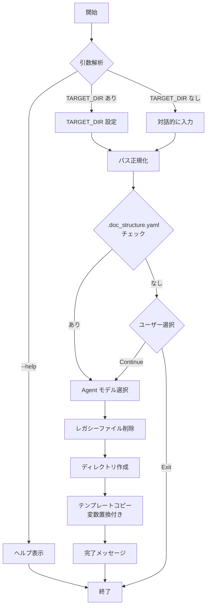

# DES-001: setup.sh 詳細設計

## 概要

`setup.sh` は Doc Advisor のセットアップスクリプト。テンプレートリポジトリからターゲットプロジェクトへ必要なファイルをコピーし、プロジェクト固有の設定ファイルを生成する。

## 基本情報

| 項目         | 値                                          |
| ------------ | ------------------------------------------- |
| ファイル名   | `setup.sh`                                  |
| バージョン   | v4.0                                        |
| 実行要件     | Bash                                        |
| 依存コマンド | `sed`, `find`, `mkdir`, `cp`, `chmod`, `rm` |

## 使用方法

```bash
# 指定したディレクトリにセットアップ
./setup.sh TARGET_DIR

# 対話モード（ディレクトリを対話的に入力）
./setup.sh

# ヘルプ表示
./setup.sh -h
./setup.sh --help
```

## 引数

| 引数           | 必須 | 説明                                                           |
| -------------- | ---- | -------------------------------------------------------------- |
| `TARGET_DIR`   | 任意 | セットアップ先プロジェクトのパス。省略時は対話的に入力を求める |
| `-h`, `--help` | 任意 | ヘルプメッセージを表示して終了                                 |

## デフォルト値

| 変数                  | デフォルト値 | 説明                       |
| --------------------- | ------------ | -------------------------- |
| `DEFAULT_AGENT_MODEL` | `opus`       | Agent 定義に使用するモデル |

## 処理フロー



> **Note**: v4.0 で `.doc_structure.yaml` チェックはセットアップの最初に行われる。未検出時はユーザーに Continue/Exit を選択させ、doc-structure プラグインを先にインストールする機会を与える。`.doc_structure.yaml` がなければ `/setup-doc-structure` スキルで作成する。ディレクトリ分類はターゲットプロジェクト側の `/setup-doc-structure` スキルで AI 駆動で実行する。

---

## 主要関数

### `copy_and_substitute()`

単一ファイルをコピーしながら変数置換を行う。

```bash
copy_and_substitute "$src" "$dst"
```

**置換対象変数:**

| プレースホルダー          | 置換値                 | 置換方法 |
| ------------------------- | ---------------------- | -------- |
| `{{AGENT_MODEL}}`         | Agent 定義のモデル指定 | `sed`    |
| `{{DOC_ADVISOR_VERSION}}` | Doc Advisor バージョン | `sed`    |

**実装:**

```bash
copy_and_substitute() {
    local src="$1"
    local dst="$2"
    if [[ -f "$src" ]]; then
        sed -e "s|{{AGENT_MODEL}}|${AGENT_MODEL}|g" \
            -e "s|{{DOC_ADVISOR_VERSION}}|${DOC_ADVISOR_VERSION}|g" \
            "$src" > "$dst"
    fi
}
```

### `copy_dir_with_substitution()`

ディレクトリを再帰的にコピーし、テキストファイルには変数置換を適用する。

```bash
copy_dir_with_substitution "$src_dir" "$dst_dir"
```

**処理対象ファイル:**

| 拡張子  | 処理                          |
| ------- | ----------------------------- |
| `.md`   | 変数置換してコピー            |
| `.yaml` | 変数置換してコピー            |
| `.py`   | 変数置換してコピー            |
| `.sh`   | そのままコピー → 実行権限付与 |

---

## v4.0 生成構造

```
TARGET_DIR/
├── .claude/
│   ├── agents/                      # Agent 定義（上書きのみ、1ファイル）
│   │   └── toc-updater.md           # ワーカー: rules/specs の個別エントリ処理
│   ├── skills/
│   │   ├── setup-doc-structure/           # ドキュメントディレクトリ自動分類スキル
│   │   │   └── SKILL.md
│   │   ├── query-rules/             # ドキュメント検索スキル (context: fork)
│   │   │   └── SKILL.md
│   │   ├── query-specs/             # ドキュメント検索スキル (context: fork)
│   │   │   └── SKILL.md
│   │   ├── create-rules-toc/        # rules ToC 生成スキル
│   │   │   └── SKILL.md
│   │   └── create-specs-toc/        # specs ToC 生成スキル
│   │       └── SKILL.md
│   └── doc-advisor/                 # 共有リソース + ランタイム出力
│       ├── docs/                    # ドキュメント
│       │   ├── toc_orchestrator.md
│       │   ├── toc_format.md
│       │   ├── toc_update_workflow.md
│       │   └── classification_rules.md  # /setup-doc-structure 用分類ルール
│       ├── scripts/                 # Python/Shell スクリプト
│       │   ├── toc_utils.py
│       │   ├── classify_dirs.py         # ディレクトリスキャナー
│       │   ├── check_doc_structure.sh          # スキル Pre-check スクリプト
│       │   ├── create_checksums.py
│       │   ├── create_pending_yaml.py   # --target rules|specs
│       │   ├── write_pending.py         # --target rules|specs
│       │   ├── merge_toc.py             # --target rules|specs
│       │   ├── validate_rules_toc.py
│       │   └── validate_specs_toc.py
│       └── toc/                     # ランタイム出力
│           ├── rules/
│           │   ├── rules_toc.yaml       # 生成される ToC
│           │   ├── .toc_checksums.yaml  # チェックサム
│           │   └── .toc_work/           # 作業ディレクトリ
│           └── specs/
│               ├── specs_toc.yaml
│               ├── .toc_checksums.yaml
│               └── .toc_work/
```

---

## アップグレード処理（v2.0 → v3.0）

### レガシーファイル削除

v2.0 からのアップグレード時、doc-advisor のレガシーファイルを**ファイル名指定で自動削除**する。

#### 削除対象

| レガシーパス                   | 処理     | 理由             |
| ------------------------------ | -------- | ---------------- |
| `commands/create-rules_toc.md` | 自動削除 | Skills に統合    |
| `commands/create-specs_toc.md` | 自動削除 | Skills に統合    |
| `doc-advisor/config.yaml`      | 自動削除 | 新しい場所に移動 |
| `doc-advisor/docs/`            | 自動削除 | 新しい場所に移動 |

#### 保持されるもの

| パス                                               | 理由               |
| -------------------------------------------------- | ------------------ |
| `commands/` 内のユーザー独自コマンド               | ユーザー資産の保護 |
| `agents/` 内のユーザー独自エージェント             | ユーザー資産の保護 |
| `doc-advisor/toc/rules/`, `doc-advisor/toc/specs/` | ランタイム出力     |

### コピー方式

| ディレクトリ               | 方式           | 理由                                                                      |
| -------------------------- | -------------- | ------------------------------------------------------------------------- |
| `agents/`                  | **上書きのみ** | ユーザーの独自 agent を保護（管理対象は `toc-updater.md` 1 ファイルのみ） |
| `skills/setup-doc-structure/`     | **上書き**     | 単一ファイルなので上書きで十分                                            |
| `skills/query-rules/`      | **上書き**     | 単一ファイルなので上書きで十分                                            |
| `skills/query-specs/`      | **上書き**     | 単一ファイルなので上書きで十分                                            |
| `skills/create-rules-toc/` | **上書き**     | 単一ファイルなので上書きで十分                                            |
| `skills/create-specs-toc/` | **上書き**     | 単一ファイルなので上書きで十分                                            |
| `skills/doc-advisor/`      | **自動削除**   | v3.0 レガシー（分割されたため不要）                                       |

## アップグレード処理（v3.6 → v3.7: advisor agent → skill 移行）

### 削除対象

| レガシーパス              | 処理                                 | 理由                         |
| ------------------------- | ------------------------------------ | ---------------------------- |
| `agents/rules-advisor.md` | バージョン識別子チェック後に自動削除 | query-rules skill に置き換え |
| `agents/specs-advisor.md` | バージョン識別子チェック後に自動削除 | query-specs skill に置き換え |

### 削除判断

現行バージョン (`DOC_ADVISOR_VERSION`) の `doc-advisor-version-xK9XmQ` 識別子を持つファイルは保護される。識別子がない、または旧バージョンの場合のみ削除する。

---

## アップグレード処理（v3.8: スクリプト・Agent・ドキュメント統合）

### 概要

v3.8 でカテゴリ別に分かれていたスクリプト・Agent・ドキュメントを統合。`--target rules|specs` パラメータで切り替える方式に変更。

### 削除対象（バージョンチェックなし、無条件削除）

統合による置き換えのため、同一バージョンであっても旧ファイルを削除する。

| レガシーパス                           | 統合先                           |
| -------------------------------------- | -------------------------------- |
| `agents/rules-toc-updater.md`          | `agents/toc-updater.md`          |
| `agents/specs-toc-updater.md`          | `agents/toc-updater.md`          |
| `scripts/create_pending_yaml_rules.py` | `scripts/create_pending_yaml.py` |
| `scripts/create_pending_yaml_specs.py` | `scripts/create_pending_yaml.py` |
| `scripts/write_rules_pending.py`       | `scripts/write_pending.py`       |
| `scripts/write_specs_pending.py`       | `scripts/write_pending.py`       |
| `scripts/merge_rules_toc.py`           | `scripts/merge_toc.py`           |
| `scripts/merge_specs_toc.py`           | `scripts/merge_toc.py`           |
| `docs/rules_orchestrator.md`           | `docs/toc_orchestrator.md`       |
| `docs/specs_orchestrator.md`           | `docs/toc_orchestrator.md`       |
| `docs/rules_toc_format.md`             | `docs/toc_format.md`             |
| `docs/specs_toc_format.md`             | `docs/toc_format.md`             |
| `docs/rules_toc_update_workflow.md`    | `docs/toc_update_workflow.md`    |
| `docs/specs_toc_update_workflow.md`    | `docs/toc_update_workflow.md`    |

> **Note**: バージョンチェックを行わない理由 — これらは「更新」ではなく「置き換え」であるため。旧ファイル名のまま残すと重複動作の原因となる。

### ディレクトリ選択の廃止

v3.8 でディレクトリ選択機能を廃止。`config.yaml` の `root_dirs` は空配列 `[]` で生成され、`/setup-config` スキルで自動分類・設定する。（v5.0 で config.yaml 廃止、`.doc_structure.yaml` + コードデフォルトに移行。v5.0 で `/setup-config` は `/setup-doc-structure` に改名）

### v4.0: setup-config 復活と SessionStart hook（v3.8 → v4.0）

| 変更                              | 内容                                                                                            |
| --------------------------------- | ----------------------------------------------------------------------------------------------- |
| `setup_dirs.sh` 廃止              | `/setup-config` スキルで完全に代替                                                              |
| `--skip-doc-structure` フラグ廃止 | setup.sh はディレクトリ分類を行わないため不要                                                   |
| `setup-config` スキル復活         | テンプレートとして `templates/skills/setup-config/SKILL.md` を配置。AI 駆動でディレクトリを分類 |
| スキル Pre-check 導入             | `check_doc_structure.sh` を各スキルの先頭で呼び出し、未設定時は `/setup-config` を先に実行させる       |

---

## アップグレード処理（v5.0: config.yaml 廃止）

### 概要

v5.0 で config.yaml を廃止し、`.doc_structure.yaml` + コードデフォルトに移行。

### 削除対象

| レガシーパス                                  | 処理     | 理由                                       |
| --------------------------------------------- | -------- | ------------------------------------------ |
| `doc-advisor/config.yaml`                     | 自動削除 | `.doc_structure.yaml` に移行               |
| `doc-advisor/scripts/import_doc_structure.py` | 自動削除 | 直接参照に変更（import 不要）              |
| `doc-advisor/scripts/merge_config.py`         | 自動削除 | config.yaml 廃止に伴い不要                 |

---

### 削除判断の原則

```
【重要】識別子ベースの削除ロジック

ファイルに doc-advisor 識別子があるか？
  → ある（現行バージョン）: 管理中 → 削除しない
  → ある（旧バージョン）:   更新対象 → 削除OK
  → ない:                   古い残骸 → 削除OK

※例外: v3.8 統合による置き換え → バージョン問わず無条件削除
```

> **Note**: v3.6 で `doc-advisor-version-xK9XmQ` 識別子が導入済み。v3.7 の advisor agent 削除はこの識別子ベースで動作している。レガシー（v2.0）ファイルは識別子がないためファイル名指定で削除する。v3.8 の統合削除はバージョンチェックなしで動作する。

---

## .doc_structure.yaml の構造

文書構造の SSOT（Single Source of Truth）となる設定ファイルの構造:

```yaml
# doc_structure_version: 3.0

rules:
  root_dirs:
    - rules/
  doc_types_map:
    rules/: rule
  patterns:
    target_glob: "**/*.md"
    exclude: []

specs:
  root_dirs:
    - specs/
  doc_types_map:
    specs/requirements/: requirement
    specs/design/: design
  patterns:
    target_glob: "**/*.md"
    exclude: []
```

> **Note**: `.doc_structure.yaml` は forge プラグインまたは `/setup-doc-structure` スキルで作成する。Doc Advisor 内部設定（toc_file, checksums_file, work_dir, output, common 等）はコードデフォルト（toc_utils.py `_get_default_config()`）で管理される。

---

## config.yaml マイグレーション（廃止）

v5.0 で config.yaml を廃止。`.doc_structure.yaml` + コードデフォルトに移行したため、
`merge_config.py` によるマイグレーションは不要になった。

---

## スキル Pre-check（v4.0）

### 概要

各スキル（create-rules-toc, create-specs-toc, query-rules, query-specs）の先頭で `check_doc_structure.sh` を実行し、ドキュメントディレクトリが未設定の場合は `/setup-doc-structure` を先に実行させる。

### check_doc_structure.sh のチェック順序

1. `.doc_structure.yaml` が存在しない → 警告メッセージを出力（`/setup-doc-structure` の実行を促す）
2. `.doc_structure.yaml` に `root_dirs:` が設定済み → 即 exit 0（出力なし = OK）
3. `.doc_structure.yaml` は存在するが `root_dirs` が未設定 → `[ACTION REQUIRED]` 警告メッセージを出力

### スキル側の処理

```markdown
## Pre-check (MANDATORY - Run first)

bash .claude/doc-advisor/scripts/check_doc_structure.sh {rules|specs}

- No output → Proceed
- Output present → STOP. Run /setup-doc-structure first, then restart this skill
```

> カテゴリ引数（`rules` または `specs`）を渡すことで、対象カテゴリの `root_dirs` のみを検証する。引数なしの場合はいずれかの `root_dirs` が設定されていれば OK（後方互換）。

---

## エラーハンドリング

| エラー条件                           | 挙動                      |
| ------------------------------------ | ------------------------- |
| 不明なオプション                     | エラーメッセージ + exit 1 |
| 引数が多すぎる                       | エラーメッセージ + exit 1 |
| TARGET_DIR が存在しない              | エラーメッセージ + exit 1 |
| テンプレートディレクトリが存在しない | Warning 表示 + 続行       |

**スクリプト設定:**

- `set -e`: エラー発生時に即座に終了

## セットアップ後の次のステップ

### .doc_structure.yaml に root_dirs が設定済みの場合

`.doc_structure.yaml` が存在し root_dirs が設定済み。すぐに ToC 生成が可能:

1. Claude Code を起動:
   ```bash
   cd TARGET_DIR
   claude
   ```
2. 初回 ToC 生成を実行:
   ```
   /create-rules-toc --full
   /create-specs-toc --full
   ```

### .doc_structure.yaml に root_dirs が未設定の場合

スキルの Pre-check（check_doc_structure.sh）が未設定を検出し、`/setup-doc-structure` の実行を指示する:

1. Claude Code を起動
2. `/create-rules-toc --full` を実行 → Pre-check が `/setup-doc-structure` の実行を指示
3. `/setup-doc-structure` で root_dirs が設定された後、再度 `/create-rules-toc --full`

## 注意事項

- templates/ ディレクトリがスクリプトと同じディレクトリに存在する必要がある
- `.py`, `.md`, `.yaml` はプレースホルダー置換付きでコピーされる。`.sh` 等その他はそのままコピー
- `agents/` はディレクトリ削除せず上書きのみ（ユーザーの独自 agent を保護、管理対象は `toc-updater.md` 1 ファイルのみ）
- `skills/doc-advisor/` はクリーンインストール（全削除→再作成）（v3.0 レガシー）
- advisor agent（rules-advisor.md, specs-advisor.md）は自動削除される（v3.7 移行）
- v3.8 統合による旧ファイル（per-category scripts/agents/docs）は無条件削除される
- setup.sh はテンプレートコピー・変数置換を行う。AI によるディレクトリ分類は行わない
- `.doc_structure.yaml` がない場合は `/setup-doc-structure` スキルで作成する
- 各スキルの Pre-check で `check_doc_structure.sh` を呼び出し、未設定時は `/setup-doc-structure` を先に実行させる

## ローカルテスト設計

Claude Code 向け `setup.sh` は現状でもローカル project fixture で deterministic test が可能である。Claude Code 実機の slash command / agent 実行確認とは分離し、まず shell で判定できる install 結果を固定する。

### テスト層

| 層 | 対象 | 判定方法 |
| -- | ---- | -------- |
| install 構造 | `.claude/skills/`, `.claude/agents/`, `.claude/doc-advisor/` | file existence / absence |
| 変換結果 | `${CLAUDE_PLUGIN_ROOT}`, `/doc-advisor:`, `/forge:` の残存 | grep absent |
| Python scripts | doc-advisor / forge 由来 scripts | `python3 -m py_compile` または import check |
| source 追跡 | `.source_version` | source plugin version / commit / dirty suffix |
| excluded / disabled | `create-code-index`, `query-code`, optional 未指定 plugin | file absence |
| scenario | sample rules/specs で ToC script が動く | pending / merge / validate / checksums |

### 推奨 fixture

```text
tests/
├── claude_test_project/
│   ├── README.md
│   ├── .doc_structure.yaml
│   └── docs/
│       ├── rules/coding.md
│       └── specs/sample/requirements.md
├── test_setup_validation.sh
└── test_claude_scenario.sh
```

既存 `tests/test_project` を使い続けてもよいが、Claude setup の install 検証と ToC scenario を安定させるため、将来的には `tests/claude_test_project` を専用 fixture として切り出す。

### 実行コマンド

```bash
bash tests/run_all_tests.sh
bash tests/test_setup_validation.sh
bash tests/test_claude_scenario.sh
```

`test_setup_validation.sh` は `setup.sh tests/claude_test_project` を実行し、install 結果の構造検証を行う。`test_claude_scenario.sh` は Claude Code 本体に依存しない script 層のみを検証する。

Claude Code 実機でのみ確認できる項目は deterministic test とは分ける。

| 実機確認項目 | 理由 |
| ------------ | ---- |
| `/setup-doc-structure` | AskUserQuestion / Write を含む |
| `/create-rules-toc --full` | `toc-updater` agent の Task 起動を含む |
| `/create-specs-toc --full` | 同上 |
| `/query-rules ...` / `/query-specs ...` | `context: fork` と skill trigger の実行確認が必要 |

## Claude-ready generated set 案

Codex 向けに `codex_skill_set/` を保持する方式は、Claude Code 向けにも段階導入できる。Claude 側では上流 source が既に Claude Code plugin 形式であるため変換量は少ないが、forge の構成変更耐性・事前レビュー・install の再現性に効果がある。

### 目的

- `setup.sh` 実行時の source tree 推測と sed 変換を減らす
- forge / doc-advisor の取り込み資産を事前生成・レビュー済みにする
- target project へ壊れた SKILL / agent / script を配るリスクを下げる
- Codex 用 generated set と Claude 用 generated set の差分を管理できるようにする

### 将来構成

```text
DocAdvisor/
├── generated_sets/
│   ├── claude/
│   │   ├── skills/
│   │   ├── agents/
│   │   ├── doc-advisor/
│   │   └── manifest.yaml
│   └── codex/
│       ├── skills/
│       ├── resources/
│       └── manifest.yaml
├── install_profiles/
│   ├── claude/
│   └── codex/
├── setup.sh
└── setup_for_codex.sh
```

### 導入順序

1. 現行 `setup.sh` の deterministic validation を追加する
2. Codex 側で `codex_skill_set/` 方式を先に実装し、運用を安定させる
3. Claude 側に `generated_sets/claude/` を追加する
4. 現行 `setup.sh` の install 結果と `generated_sets/claude/` からの install 結果をテストで比較する
5. 差分が安定してから、`setup.sh` のコピー元を generated set に切り替える

既存 `setup.sh` は migration / cleanup / optional plugin / `.doc_structure.yaml` 案内を担っているため、generated set 方式へ一度に置き換えてはならない。まずは検証モードとして導入する。

### 受け入れ基準

- `tests/claude_test_project` に対して `setup.sh` が成功する
- install 後 deterministic validation が PASS する
- sample rules/specs で ToC 生成 scripts が成功する
- `setup.sh` 再実行で不要差分が増えない
- generated set 導入後も既存 migration / cleanup の挙動が変わらない

## 関連ドキュメント

- `tests/test_setup_upgrade.sh`: アップグレードテスト
