# DES-CODEX-001: setup_for_codex.sh 設計書

## メタデータ

| 項目       | 値 |
| ---------- | -- |
| 設計 ID    | DES-CODEX-001 |
| 対象       | `setup_for_codex.sh` / Codex install profile |
| 関連要件   | REQ-001 / REQ-002 / REQ-004 |
| 関連設計書 | DES-001 / DES-006 |
| 作成日     | 2026-05-07 |
| 作成者     | k2moons |
| Created by | k2moons |

## 1. 概要

`setup_for_codex.sh` は、DocAdvisor リポジトリ内に保持する Codex-native SKILL セットを、環境全体で使う通常の Codex Skill として install するためのスクリプトである。必要な場合のみ `--project` で target project の runtime state と `AGENTS.md` を初期化する。

Codex-native SKILL セットは、`bw-cc-plugins` に含まれる Claude Code plugin 形式の Doc Advisor / forge 資産を元に、DocAdvisor 側で事前変換・レビューして保持する。`${CLAUDE_PLUGIN_ROOT}`、`/doc-advisor:*`、`/forge:*`、Claude Code 固有 frontmatter などは、この保存済み Codex セット内では変換済みでなければならない。

`bw-cc-plugins` の plugin 構成は将来変更される可能性があるため、install 時にソースツリーを都度推測してコピーしてはならない。Codex install は、DocAdvisor 側で commit 済みの Codex-native SKILL セットと、その元になった source plugin version / commit / layout を記録する **install profile** を正本として実行する。

採用方針:

1. **事前解析必須**: plugin version / commit / layout ごとに解析を行い、install profile を生成する
2. **Codex-native 正本 install**: `codex_skill_set/` は本物の Codex Skill 形式で作成・検証し、`setup_for_codex.sh` はその内容を `${CODEX_HOME:-~/.codex}/skills` に通常 Skill として配置する
3. **未知構成で停止**: 対応 profile が存在しない version / commit / layout では install を失敗させる
4. **生成と install の分離**: Claude plugin から Codex SKILL への変換は事前生成・レビュー時に行い、install 時には原則として変換しない
5. **bw-cc-plugins 読み取り専用**: source plugin 側には manifest 追加・修正を行わない

## 2. 設計原則

| 原則 | 内容 |
| ---- | ---- |
| 保存済み Codex セットを正本にする | install 本体は source tree を変換せず、DocAdvisor 内のレビュー済み成果物をコピーする |
| 推測より profile | source tree の自動探索結果は Codex セット生成補助にのみ使い、install 本体は直接信用しない |
| version だけに依存しない | `plugin.json#version` に加え、git commit と layout hash を照合する |
| 未知構成は fail closed | 未解析の構成を warning だけで install しない |
| 既存 Claude setup 非干渉 | `setup.sh` と `.claude/` 向け install 動作は変更しない |
| 変換残骸ゼロ | `${CLAUDE_PLUGIN_ROOT}` や `/doc-advisor:` など Claude Code 固有文字列を Codex セットと install 結果に残さない |
| 人間レビュー前提 | Codex セット生成は補助自動化するが、採用前に人間レビューして commit する |
| Skill と project state を分離する | `codex_skill_set/` は環境全体の Codex Skill として保ち、ToC/index などの runtime output だけを project 側 `.codex/state/doc-advisor/` に置く |

## 3. アーキテクチャ

```mermaid
flowchart TD
    subgraph Source[bw-cc-plugins 読み取り専用]
        DA[plugins/doc-advisor]
        FG[plugins/forge]
        PJ[.claude-plugin/plugin.json]
    end

    subgraph Analyze[事前解析フェーズ]
        AP[analyze_codex_install_profile.sh]
        PROF[codex_install_profiles/*.yaml]
        GEN[generate_codex_skill_set.sh]
        NATIVE[codex_skill_set/]
        REVIEW[人間レビュー]
    end

    subgraph Install[install フェーズ]
        SETUP[setup_for_codex.sh]
        LOAD[profile 読み込み]
        MATCH[source version / commit / layout hash 照合]
        COPY[Codex-native set を copy]
        VALIDATE[post-install validation]
    end

    subgraph Environment[Codex user environment]
        SKILLS[~/.codex/skills/]
        RES[~/.codex/doc-advisor/resources/]
        EMETA[~/.codex/doc-advisor/install.yaml]
    end

    subgraph Target[target project optional]
        AGENTS[AGENTS.md Skill note]
        STATE[.codex/state/doc-advisor/]
        META[.codex/installs/doc-advisor.yaml]
    end

    Source --> AP
    AP --> PROF
    PROF --> GEN
    GEN --> NATIVE
    NATIVE --> REVIEW
    PROF --> REVIEW
    REVIEW --> SETUP
    Source --> SETUP
    SETUP --> LOAD --> MATCH --> COPY --> VALIDATE
    NATIVE --> COPY
    COPY --> SKILLS
    COPY --> RES
    COPY --> EMETA
    SETUP --> AGENTS
    SETUP --> STATE
    SETUP --> META
```



## 4. ディレクトリ構成

```text
DocAdvisor/
├── setup.sh                              # 既存 Claude Code 向け。変更しない
├── setup_for_codex.sh                    # 新規 Codex 向け installer
├── analyze_codex_install_profile.sh      # 新規 profile 生成補助
├── generate_codex_skill_set.sh           # 新規 Codex-native SKILL セット生成補助
├── codex_skill_set/
│   ├── skills/
│   │   ├── create-rules-toc/
│   │   ├── create-specs-toc/
│   │   ├── query-rules/
│   │   ├── query-specs/
│   │   ├── setup-doc-structure/
│   │   ├── start-requirements/
│   │   ├── start-design/
│   │   └── start-plan/
│   ├── resources/
│   │   ├── doc-advisor/
│   │   └── forge/
│   └── manifest.yaml
├── codex_install_profiles/
│   └── doc-advisor/
│       ├── current.yaml
│       └── 0.2.2-<commit>-<layout_hash>.yaml  # forge supported 資産も同一 profile に固定する
├── tests/
│   ├── codex_test_project/
│   ├── test_codex_skill_set.sh
│   ├── test_setup_for_codex.sh
│   └── test_codex_scenario.sh
└── specs/codex/design/
    └── DES-CODEX-001_setup_for_codex.md
```

`codex_skill_set/` 自体は通常の Codex Skill 形式で保持する。`setup_for_codex.sh` は `${CODEX_HOME:-~/.codex}/skills/` に Skill を配置し、共有 resource を `${CODEX_HOME:-~/.codex}/doc-advisor/resources/` に配置する。personal marketplace entry は作成しない。

environment 側の install 先:

```text
${CODEX_HOME:-~/.codex}/
├── skills/
│   ├── create-rules-toc/
│   ├── create-specs-toc/
│   ├── query-rules/
│   ├── query-specs/
│   ├── setup-doc-structure/
│   ├── start-requirements/
│   ├── start-design/
│   └── start-plan/
└── doc-advisor/
    ├── resources/
    │   ├── doc-advisor/
    │   └── forge/
    ├── manifest.yaml
    └── install.yaml
```

`--project TARGET` 指定時のみ target project 側に作成する:

```text
target/
├── AGENTS.md                         # Doc Advisor Skill section を追記
└── .codex/
    ├── state/doc-advisor/
    │   ├── toc/
    │   └── index/
    └── installs/doc-advisor.yaml
```

project 側には Skill 本体や共有 resource をコピーしない。

global 側の `${CODEX_HOME:-~/.codex}/doc-advisor/` は、install metadata と共有 resources/scripts の置き場である。ToC / index / `.toc_work` / checksum / embedding index などの runtime state は置かない。bundled Python scripts を実行する場合は `PYTHONDONTWRITEBYTECODE=1` を付け、global resources 配下に `__pycache__/` や `*.pyc` を残さない。

### 4.1 project-local bridge pattern

project-local bridge は、Codex の正式な Skill install 機構ではない。`AGENTS.md` の project instruction として「特定の要求では project 内の `SKILL.md` 風ファイルを読む」と明示し、Codex に通常の文書参照として従わせる互換パターンである。

この方式は以下の構成を取る。

```text
target/
├── AGENTS.md
└── .codex/
    ├── skills/
    │   ├── create-rules-toc/SKILL.md
    │   ├── create-specs-toc/SKILL.md
    │   ├── query-rules/SKILL.md
    │   └── ...
    ├── resources/
    │   ├── doc-advisor/
    │   └── forge/
    └── state/doc-advisor/
        ├── toc/
        └── index/
```

`AGENTS.md` には、機能・典型 trigger・参照先 path の表を置く。

```markdown
| Function | Typical trigger | Path |
| --- | --- | --- |
| specs ToC update | requirements/design/plan documents changed | `.codex/skills/create-specs-toc/SKILL.md` |
| specs query | the user asks about requirements/designs/plans | `.codex/skills/query-specs/SKILL.md` |
```

この方式の価値:

- project 単位で有効化でき、`${CODEX_HOME:-~/.codex}` を変更せずに試験できる
- repo に Skill 相当の手順と resources を同梱できる
- Claude Code plugin 由来の SKILL を Codex 向けに段階移行しやすい
- local fixture / sandbox test で、environment-wide install なしに install 結果を観察できる

この方式の制約:

- Codex の正式な Skill discovery 対象ではない
- `$SkillName` としての発火や Skill 一覧表示は保証されない
- 実行品質は `AGENTS.md` の指示遵守に依存する
- environment-wide Skill と同名で併用すると、同じ Skill が二重に見える、または参照元が曖昧になる
- project 内に `.codex/skills/` と `.codex/resources/` を持つため、runtime state と配布物の境界が曖昧になりやすい
- Codex 本体の将来仕様変更に対して互換性を保証できない

運用ルール:

1. 標準 install 方式としては採用しない
2. production / normal setup は environment-wide Skill install を使う
3. project-local bridge を使う場合は、同名 environment Skill を無効化するか、bridge 側 skill 名を明示的に prefix する
4. bridge は migration / local experiment / fallback のための documented pattern として扱う
5. `setup_for_codex.sh --project` は legacy bridge の管理対象 `.codex/skills/` / `.codex/resources/` を削除し、通常 Skill install と project runtime state の分離を維持する

## 5. install profile 設計

### 5.1 profile の役割

profile は、特定の source plugin version / commit / layout と、DocAdvisor 内の Codex-native SKILL セットの対応を固定する YAML である。初期実装では、Doc Advisor profile が forge の supported 資産（`setup-doc-structure` と `doc_structure` scripts/docs）も同一 source commit / layout hash の中で固定する。

`setup_for_codex.sh` は `codex_skill_set/` にないファイルを install しない。source tree の自動探索は profile 作成補助、Codex セット生成補助、validation にのみ使用する。

### 5.2 profile schema

```yaml
profile_schema: 1

source:
  plugin: doc-advisor
  plugin_version: 0.2.2
  source_commit: "<bw-cc-plugins commit hash>"
  source_dirty_allowed: false
  layout_hash: "<deterministic hash>"
  plugin_json: ".claude-plugin/plugin.json"

compatibility:
  codex_skill_schema: 1
  install_target_kind: environment-skill
  generated_by: analyze_codex_install_profile.sh
  codex_set_path: "codex_skill_set"
  codex_set_hash: "<deterministic hash of codex_skill_set>"
  reviewed: true

native_set:
  skills:
    - path: "skills/create-rules-toc"
      kind: user_skill
      source_ref: "doc-advisor:skills/create-rules-toc"
    - path: "skills/create-specs-toc"
      kind: user_skill
      source_ref: "doc-advisor:skills/create-specs-toc"
    - path: "skills/query-rules"
      kind: user_skill
      source_ref: "doc-advisor:skills/query-rules"
    - path: "skills/query-specs"
      kind: user_skill
      source_ref: "doc-advisor:skills/query-specs"
    - path: "skills/setup-doc-structure"
      kind: user_skill
      source_ref: "forge:skills/setup-doc-structure"
      install_tier: supported
    - path: "skills/start-requirements"
      kind: codex_wrapper_skill
      source_ref: "forge:skills/start-requirements"
      install_tier: supported
    - path: "skills/start-design"
      kind: codex_wrapper_skill
      source_ref: "forge:skills/start-design"
      install_tier: supported
    - path: "skills/start-plan"
      kind: codex_wrapper_skill
      source_ref: "forge:skills/start-plan"
      install_tier: supported
  agents:
    - path: "resources/doc-advisor/agents/toc-updater.md"
      kind: codex_reference
      source_ref: "doc-advisor:agents/toc-updater.md"
  docs:
    - path: "resources/doc-advisor/docs/toc_format.md"
      source_ref: "doc-advisor:docs/toc_format.md"
    - path: "resources/doc-advisor/docs/toc_orchestrator.md"
      source_ref: "doc-advisor:docs/toc_orchestrator.md"
    - path: "resources/doc-advisor/docs/toc_update_workflow.md"
      source_ref: "doc-advisor:docs/toc_update_workflow.md"
    - path: "resources/doc-advisor/docs/query_toc_workflow.md"
      source_ref: "doc-advisor:docs/query_toc_workflow.md"
    - path: "resources/doc-advisor/docs/query_index_workflow.md"
      source_ref: "doc-advisor:docs/query_index_workflow.md"
    - path: "resources/forge/docs/doc_structure_format.md"
      source_ref: "forge:docs/doc_structure_format.md"
    - path: "resources/forge/docs/codex_confirmation_protocol.md"
      source_ref: "doc-advisor:generated"
    - path: "resources/forge/docs/requirement_format.md"
      source_ref: "forge:docs/requirement_format.md"
    - path: "resources/forge/docs/design_format.md"
      source_ref: "forge:docs/design_format.md"
    - path: "resources/forge/docs/plan_format.md"
      source_ref: "forge:docs/plan_format.md"
  scripts:
    - path: "resources/doc-advisor/scripts/create_pending_yaml.py"
      source_ref: "doc-advisor:scripts/create_pending_yaml.py"
    - path: "resources/doc-advisor/scripts/write_pending.py"
      source_ref: "doc-advisor:scripts/write_pending.py"
    - path: "resources/doc-advisor/scripts/merge_toc.py"
      source_ref: "doc-advisor:scripts/merge_toc.py"
    - path: "resources/doc-advisor/scripts/validate_toc.py"
      source_ref: "doc-advisor:scripts/validate_toc.py"
    - path: "resources/doc-advisor/scripts/create_checksums.py"
      source_ref: "doc-advisor:scripts/create_checksums.py"
    - path: "resources/doc-advisor/scripts/toc_utils.py"
      source_ref: "doc-advisor:scripts/toc_utils.py"
    - path: "resources/doc-advisor/scripts/filter_toc.py"
      source_ref: "doc-advisor:scripts/filter_toc.py"
    - path: "resources/doc-advisor/scripts/search_docs.py"
      source_ref: "doc-advisor:scripts/search_docs.py"
    - path: "resources/doc-advisor/scripts/grep_docs.py"
      source_ref: "doc-advisor:scripts/grep_docs.py"
    - path: "resources/doc-advisor/scripts/embed_docs.py"
      source_ref: "doc-advisor:scripts/embed_docs.py"
    - path: "resources/doc-advisor/scripts/embedding_api.py"
      source_ref: "doc-advisor:scripts/embedding_api.py"
    - path: "resources/forge/scripts/doc_structure"
      source_ref: "forge:scripts/doc_structure"
      install_tier: supported
    - path: "resources/forge/skills/next-spec-id/scripts/scan_spec_ids.py"
      source_ref: "forge:skills/next-spec-id/scripts/scan_spec_ids.py"
      install_tier: reference-only

disabled_skills:
  - create-code-index
  - query-code

transforms:
  applied_at: generate_codex_skill_set.sh
  install_time_transform: false
  frontmatter:
    drop:
      - context
      - agent
      - model
      - user-invocable
      - argument-hint
      - color
      - tools
    keep:
      - name
      - description
      - allowed-tools
      - metadata
    map:
      tools: allowed-tools
  replacements:
    - from: '${CLAUDE_PLUGIN_ROOT}/'
      to: '<CODEX_DOC_ADVISOR_RESOURCE_ROOT>/'
    - from: '/doc-advisor:'
      to: '<codex-skill-ref:'
    - from: '/forge:setup-doc-structure'
      to: '<codex-skill-ref:setup-doc-structure>'

validation:
  require_files:
    - "skills/create-rules-toc/SKILL.md"
    - "skills/create-specs-toc/SKILL.md"
    - "skills/query-rules/SKILL.md"
    - "skills/query-specs/SKILL.md"
    - "skills/setup-doc-structure/SKILL.md"
  forbid_residual:
    - '${CLAUDE_PLUGIN_ROOT}'
    - '/doc-advisor:'
    - '/forge:'
    - 'AskUserQuestion'
    - 'Task(subagent_type:'
  python_compile:
    - "resources/doc-advisor/scripts"
    - "resources/forge/scripts/doc_structure"
  project_initializer:
    agents_md_section: "Doc Advisor / forge Codex Skills"
    project_state_root: ".codex/state/doc-advisor"
```

### 5.3 layout hash

`layout_hash` は、source plugin の構造が profile 作成時から変わっていないことを検出するための決定論的 hash である。

hash 入力:

- install 対象候補となるファイルの相対パス
- 各ファイルの SHA-256
- `plugin.json` の正規化 JSON
- disabled skill の存在有無

hash 対象外:

- `.git/`
- `__pycache__/`
- `.DS_Store`
- `.pyc`
- ToC など runtime output

`plugin_version` と `source_commit` が一致しても `layout_hash` が不一致なら install は停止する。

## 6. 事前解析フェーズ

### 6.1 analyze_codex_install_profile.sh

`analyze_codex_install_profile.sh` は、source plugin を読み取り、profile 候補を生成する補助スクリプトである。

責務:

1. `plugin.json` を読み取る
2. git commit と dirty 状態を取得する
3. source tree の layout hash を計算する
4. `skills/*/SKILL.md`、`docs/**`、`scripts/**`、`agents/**` を探索する
5. Claude Code 固有 frontmatter / 文字列を検出する
6. profile YAML 候補を生成する
7. unknown / risky 項目を `review_required` として出力する

非責務:

- profile の自動採用
- source plugin の修正
- target project への install

### 6.2 generate_codex_skill_set.sh

`generate_codex_skill_set.sh` は、profile 候補と source plugin を読み取り、DocAdvisor 内の `codex_skill_set/` を生成・更新する補助スクリプトである。

責務:

1. profile の `native_set` に対応する source 資産を読み取る
2. Codex Skill frontmatter へ変換する
3. `${CLAUDE_PLUGIN_ROOT}`、`/doc-advisor:*`、`/forge:*` などを Codex 用 resource path / Skill 参照へ変換する
4. `AskUserQuestion`、`Task(subagent_type: ...)` などの Claude Code tool 前提を検出し、機械変換不能な箇所を `review_required` として残す
5. `codex_skill_set/manifest.yaml` に source_ref、変換日時、codex_set_hash を記録する

非責務:

- target project への install
- 人間レビューなしでの Codex セット採用
- `blocked` / `excluded` tier 資産の user skill 化

### 6.3 人間レビュー

生成された profile と `codex_skill_set/` は、以下を人間が確認してから commit する。

| 観点 | 確認内容 |
| ---- | -------- |
| imports | Codex に配布すべき資産だけが含まれているか |
| disabled | 未完成・非対応 skill が除外されているか |
| transforms | Claude Code 固有表現が Codex で実行可能な表現に変換されるか |
| agents | Claude agent を Codex でどう扱うかが明記されているか |
| validation | 変換漏れを検出できるか |
| codex_skill_set | 保存済み Codex SKILL が Codex-native として読める内容になっているか |

`reviewed: true` でない profile、または `codex_set_hash` が一致しない Codex セットを `setup_for_codex.sh` が使用してはならない。

## 7. install フェーズ

### 7.1 setup_for_codex.sh の引数

```bash
./setup_for_codex.sh
./setup_for_codex.sh --project TARGET_DIR
./setup_for_codex.sh --codex-home CODEX_HOME_DIR
./setup_for_codex.sh --source SOURCE_PLUGIN_ROOT
./setup_for_codex.sh --profile PROFILE_PATH
./setup_for_codex.sh --codex-set CODEX_SET_DIR
./setup_for_codex.sh --list-profiles
./setup_for_codex.sh --help
```

| 引数 | 説明 |
| ---- | ---- |
| `--project` | runtime state と AGENTS.md を初期化する project root |
| `--codex-home` | Codex home。省略時は `${CODEX_HOME:-~/.codex}` |
| `--source` | `bw-cc-plugins/plugins/doc-advisor` など source plugin root |
| `--profile` | 明示 profile。指定時も source 照合は省略しない |
| `--codex-set` | install 正本の Codex-native Skill set。省略時は `codex_skill_set/` |
| `--list-profiles` | 利用可能な profile 一覧を表示 |

### 7.2 正常フロー

1. 引数を parse する
2. source plugin root を解決する
3. `plugin.json` を読む
4. source commit / dirty / layout hash を取得する
5. 対応 profile を検索する
6. profile の `reviewed: true` を確認する
7. `plugin_version` / `source_commit` / `layout_hash` を照合する
8. DocAdvisor 内の `codex_skill_set/` の `codex_set_hash` を照合する
9. `${CODEX_HOME:-~/.codex}/skills/` に allowlist の Skill を作成または更新する
10. `${CODEX_HOME:-~/.codex}/doc-advisor/resources/` に共有 resource を作成または更新する
11. install-time 本文変換は行わない
12. `--project` 指定時のみ `.codex/state/doc-advisor/` と `.codex/installs/doc-advisor.yaml` を作成する
13. `--project` 指定時のみ legacy project-local bridge の管理対象 `.codex/skills/*` / `.codex/resources/doc-advisor` / `.codex/resources/forge` / `.codex/doc-advisor` を削除する
14. `--project` 指定時のみ `AGENTS.md` に Doc Advisor Skill section を追記または更新する
15. post-install validation を実行する
16. 必要に応じて Codex restart が必要であることを表示する

### 7.3 停止条件

以下の場合、install は exit 1 で停止する。

| 条件 | 理由 |
| ---- | ---- |
| source plugin root が存在しない | 入力不正 |
| `plugin.json` が存在しない | source が plugin ではない |
| 対応 profile がない | 未解析構成 |
| profile が `reviewed: true` でない | 人間レビュー未完了 |
| `plugin_version` が profile と不一致 | profile 不一致 |
| `source_commit` が profile と不一致 | profile 不一致 |
| dirty source で `source_dirty_allowed: false` | 再現性なし |
| `layout_hash` が profile と不一致 | 構成変更 |
| `codex_skill_set/` が存在しない | install 正本がない |
| `codex_set_hash` が profile と不一致 | レビュー済み Codex セットと異なる |
| post-install validation が FAIL | 壊れた install |

未知構成で `--force` install するオプションは設けない。必要な場合は先に profile を作成・レビューする。

## 8. Codex セット生成設計

本章の変換は `generate_codex_skill_set.sh` と人間レビューで実施する。`setup_for_codex.sh` は install 時に本文変換を行わない。

### 8.1 SKILL frontmatter 変換

Claude Code SKILL frontmatter から Codex 非対応キーを除去する。

| Claude Code key | Codex での扱い |
| --------------- | -------------- |
| `name` | 維持 |
| `description` | 維持 |
| `allowed-tools` | 維持候補。Codex 仕様確認後に許容される場合のみ |
| `metadata` | 維持 |
| `context` | 削除。本文に fork 相当の注意として移す |
| `agent` | 削除 |
| `model` | 削除 |
| `user-invocable` | 削除 |
| `argument-hint` | 削除。本文に Usage として残す |
| `tools` | `allowed-tools` へ map するか削除 |
| `color` | 削除 |

### 8.2 Claude Code 固有表現の変換

| 入力 | Codex 変換方針 |
| ---- | -------------- |
| `${CLAUDE_PLUGIN_ROOT}/docs/...` | Codex resource root への相対参照に変換 |
| `${CLAUDE_PLUGIN_ROOT}/scripts/...` | Codex resource root への相対参照に変換 |
| `/doc-advisor:create-rules-toc` | Codex Skill 名 `create-rules-toc` の参照へ変換 |
| `/forge:setup-doc-structure` | Codex Skill 名 `setup-doc-structure` の参照へ変換 |
| `AskUserQuestion` | 通常のユーザー確認手順へ書き換え |
| `Task(subagent_type: ...)` | Codex で実行可能な orchestration 手順へ書き換え |

`Task(subagent_type: toc-updater)` の扱いは最重要未確定事項である。実装前に以下のいずれかを採用する。

| 案 | 内容 | 評価 |
| -- | ---- | ---- |
| A | `toc-updater` を Codex reference skill として置き、create-*-toc が手順を読む | 実装容易だが並列性は Codex 実行に依存 |
| B | Python 側で ToC entry 抽出を完結させ、agent 依存を削除 | 安定するが機能変更が大きい |
| C | Codex subagent 機構へ明示変換する | 仕様確認が必須。通常 Skill としての配布性に注意 |

初期実装は A 案を採用候補とし、B 案は将来改善とする。

## 9. post-install validation

`tests/test_setup_for_codex.sh` は、Codex セット install 後に以下を検証する。

| ID | 検証 | 失敗時 |
| -- | ---- | ------ |
| V1 | install 先 skill の `SKILL.md` が存在する | FAIL |
| V2 | frontmatter が Codex Skill として parse できる | FAIL |
| V3 | frontmatter に禁止 key が残っていない | FAIL |
| V4 | `${CLAUDE_PLUGIN_ROOT}` / `/doc-advisor:` / `/forge:` が残っていない | FAIL |
| V5 | `AskUserQuestion` / `Task(subagent_type:` が残っていない | FAIL |
| V6 | profile の `require_files` が全て存在する | FAIL |
| V7 | disabled skills が install されていない | FAIL |
| V8 | Python scripts が `python3 -m py_compile` できる | FAIL |
| V9 | `${CODEX_HOME:-~/.codex}/skills/` と `${CODEX_HOME:-~/.codex}/doc-advisor/resources/` に install されている | FAIL |
| V10 | profile の `native_set` にない file が install されていない | FAIL |
| V11 | `codex_skill_set/manifest.yaml` と profile の source_ref が一致する | FAIL |
| V12 | `--project` 指定時に `AGENTS.md` に Skill section が存在し、主要機能表がある | FAIL |
| V13 | project-local `.codex/skills/` / `.codex/resources/` / legacy `.codex/doc-advisor/` が作成されず、既存の管理対象 legacy path は削除される | FAIL |

validation は全項目を実行し、最後に集計する。途中 FAIL で即停止しない。

## 10. install metadata

Codex Skill install では、environment 側の metadata を `${CODEX_HOME:-~/.codex}/doc-advisor/install.yaml` に生成する。`--project` 指定時のみ、project 側にも `.codex/installs/doc-advisor.yaml` を生成する。

```yaml
# Auto-generated by setup_for_codex.sh - do not edit
target_runtime: codex
doc_advisor_version: 0.2.2
forge_version: 0.0.43
source_commit: "<commit>"
layout_hash: "<layout_hash>"
codex_set_hash: "<codex_set_hash>"
install_target_kind: environment-skill
```

environment Skill install では、Skill は Codex home の `skills/` に置き、共有 resource は Codex home の `doc-advisor/resources/` に置く。runtime state は project 側 `.codex/state/doc-advisor/` に置く。project-local `.codex/skills/` と `.codex/resources/` は作成しない。

global resource root は runtime output を持たない。post-install validation と scenario test は、`${CODEX_HOME:-~/.codex}/doc-advisor/` 直下に `state/`、`toc/`、`index/` が作成されないこと、resources 配下に `__pycache__/` / `*.pyc` が残らないことを検査する。

## 11. テスト設計

### 11.1 test_codex_skill_set.sh

DocAdvisor リポジトリ内の `codex_skill_set/` と `codex_install_profiles/doc-advisor/current.yaml` を検証する。target install 前に失敗を検出することが目的である。

| 検証 | 期待結果 |
| ---- | -------- |
| `codex_skill_set/manifest.yaml` と profile | 存在する |
| disabled skill | `create-code-index` / `query-code` が含まれない |
| excluded 資産 | `scripts/monitor/` が含まれない |
| forge authoring wrapper | `start-requirements` / `start-design` / `start-plan` が存在する |
| confirmation protocol | `resources/forge/docs/codex_confirmation_protocol.md` が存在する |
| Codex SKILL frontmatter | `name` / `description` を持ち、Claude Code 固有 key を持たない |
| Claude Code 固有文字列 | `${CLAUDE_PLUGIN_ROOT}` / `/doc-advisor:` / `/forge:` が残らない |
| Claude Code tool 前提 | `AskUserQuestion` / `Task(subagent_type:` が残らない |
| Python scripts | `python3 -m py_compile` が通る |

### 11.2 test_setup_for_codex.sh

実 install を検証する。

1. test project を準備する
2. `setup_for_codex.sh` を実行する
3. post-install validation を実行する
4. unknown layout fixture で fail closed を確認する
5. dirty source fixture は profile 設定に従って停止することを確認する

### 11.3 AGENTS.md managed section

`setup_for_codex.sh --project` は target の `AGENTS.md` に管理セクションを追記する。既存 `AGENTS.md` がある場合は、管理セクションのみを置換し、ユーザー記述を保持する。

管理セクションには最低限以下の表を含める。

| 列 | 内容 |
| -- | ---- |
| 機能 | Codex で利用する機能名 |
| トリガー | いつ参照・実行すべきか |
| Skill | `create-rules-toc` など plugin skill 名 |
| Codex での実行 | Claude Code 前提をどう読み替えるか |

必須行:

- rules ToC 生成
- specs ToC 生成
- rules 検索
- specs 検索
- doc structure 初期設定

### 11.4 tests/codex_test_project

Codex 用の固定ローカル fixture を追加し、project install と deterministic scenario を検証する。

```text
tests/
├── codex_test_project/
│   ├── README.md
│   ├── .doc_structure.yaml
│   └── docs/
│       ├── rules/coding.md
│       └── specs/sample/requirements.md
├── test_codex_skill_set.sh
├── test_setup_for_codex.sh
└── test_codex_scenario.sh
```

`test_codex_scenario.sh` は Codex 本体の判断品質に依存しない deterministic 範囲を対象にする。

| シナリオ | 検証 |
| -------- | ---- |
| `.doc_structure.yaml` あり | setup 後に `${CODEX_HOME:-~/.codex}/doc-advisor/resources/doc-advisor` 配下の scripts から rules / specs root が読める |
| rules/specs sample あり | pending YAML 生成 script が成功する |
| ToC 生成 script | merge / validate / checksums 更新が成功する |
| 再実行 | `.codex/` 管理対象と AGENTS.md 管理セクションが冪等で、不要差分が増えない |
| excluded | monitor が target に入らない |

AI が `query-rules` / `query-specs` を読んで適切に使えるかは、deterministic test とは分けて手動または半自動確認にする。

## 12. forge 対応方針

forge plugin も Codex install の対象に含める。ただし forge は Doc Advisor 本体より責務が広く、単一段階で全 SKILL を Codex 互換化するとリスクが高い。そのため、初期実装では Doc Advisor profile 内に forge 資産の **install tier** を持たせる。将来 forge の対応範囲が広がる場合は、forge 専用 profile への分離を再検討する。

| tier | 意味 | install 方針 |
| ---- | ---- | ------------ |
| `supported` | Codex 互換変換・検証済み | `setup_for_codex.sh` が install してよい |
| `reference-only` | Codex で参照資産としては使えるが、Skill として未保証 | resources へ配置してよいが user skill として登録しない |
| `blocked` | Claude Code 依存・外部依存・破壊的操作などが未解決 | install しない |
| `excluded` | Codex 初期版のスコープ外として意図的に除外 | install しない。validation で混入を検出する |

初期 supported 候補:

| forge 資産 | 初期 tier | 理由 |
| ---------- | --------- | ---- |
| `skills/setup-doc-structure` | `supported` 候補 | Doc Advisor の初期設定に必須。ただし対話手順の Codex 変換が必要 |
| `skills/doc-structure` | `supported` 候補 | `resolve_doc_structure.py` を共有実行資産として使う |
| `scripts/doc_structure/` | `supported` 候補 | `.doc_structure.yaml` 検査・分類・migration に必要 |
| `docs/doc_structure_format.md` | `supported` 候補 | `.doc_structure.yaml` schema 参照に必要 |
| `skills/start-requirements` | `supported` 候補 | Codex wrapper として要件定義書作成の目的に絞って再包装する。review / commit / monitor は自動実行しない |
| `skills/start-design` | `supported` 候補 | Codex wrapper として設計書作成の目的に絞って再包装する。Agent 収集は `query-*` と通常探索へ落とす |
| `skills/start-plan` | `supported` 候補 | Codex wrapper として計画書作成の目的に絞って再包装する。実装開始は含めない |
| `docs/codex_confirmation_protocol.md` | `supported` 候補 | `AskUserQuestion` の目的をチャット上の確認プロトコルで満たすための共通ルール |
| `skills/next-spec-id/scripts/scan_spec_ids.py` | `reference-only` 候補 | plan wrapper が必要時に task ID 採番補助として使う |
| `skills/query-forge-rules` | `reference-only` 候補 | forge 自体の ToC を参照する内部検索。Codex fork / agent 前提の変換が必要 |

初期 blocked 候補:

| forge 資産 | 初期 tier | 主な理由 |
| ---------- | --------- | -------- |
| `skills/review` / `reviewer` / `evaluator` / `fixer` / `present-findings` | `blocked` | session 管理、review engine、内部 worker SKILL、Codex CLI 起動、書き込み操作が絡む |
| `skills/start-implement` / `start-uxui-design` | `blocked` | 複数 phase・Agent・session/monitor 前提が強い。実装・UXUI 外部資産も絡む |
| `skills/update-version` / `setup-version-config` | `blocked` | version file 更新、git 操作、auto commit 前提がある |
| `skills/clean-rules` | `blocked` | 削除・再構築・commit 確認を含むため安全境界の確定が必要 |
| `skills/help` | `blocked` | Claude slash command 組み立てと AskUserQuestion 前提が強い |

初期 excluded:

| forge 資産 | tier | 理由 |
| ---------- | ---- | ---- |
| `scripts/monitor/` | `excluded` | localhost server、browser open、background process を使う UX 補助機能であり、Doc Advisor / forge の Codex Skill install に必須ではない |
| `scripts/monitor/templates/` | `excluded` | monitor 本体と一体の UI 資産であり、初期 Codex 版では配布しない |

forge 資産は解析対象に含めるが、`supported` 以外を user skill として install してはならない。`excluded` は未解決の暫定停止ではなく、初期 Codex 版の意図的な scope 外として扱う。

## 13. forge 対応の問題点

| ID | 問題 | 影響 | 対応方針 |
| -- | ---- | ---- | -------- |
| F-P01 | forge の多くの SKILL が `AskUserQuestion` を手順に含む | Codex の通常応答・確認手順へ変換しないと実行不能 | profile transform で検出し、未変換残存は FAIL |
| F-P02 | `Agent` / `Task` / fork context 前提がある | Codex Skill としての orchestration 境界が不明 | worker 相当は初期 blocked。個別設計後に supported 昇格 |
| F-P03 | `${CLAUDE_PLUGIN_ROOT}` 参照が docs / skills / scripts に広く存在する | resource root 変換漏れで runtime file not found になる | forge plugin 用 resource root を profile に定義し、残存 grep を必須化 |
| F-P04 | `/forge:*` と `/doc-advisor:*` の相互呼び出しが多い | Codex Skill 参照へ単純置換できない箇所がある | 呼び出し型を `skill-reference` / `instruction-only` / `blocked` に分類する |
| F-P05 | `.claude/.temp` を session / monitor の作業領域として使う | Codex project-local install で `.claude` を作るべきか未確定 | 初期 authoring wrapper では session 系を自動実行しない。将来 `CODEX_FORGE_TEMP_ROOT` を検討 |
| F-P06 | `run_review_engine.sh` が `codex exec` を起動する | Codex 実行中に Codex CLI を再帰起動する可能性がある | review 系は初期 blocked。明示的 opt-in 設計が必要 |
| F-P07 | monitor が localhost server / browser open / background process を使う | install 後検証や sandbox 環境で不安定 | monitor は初期 `excluded`。必須機能ではないため Codex 初期版から外す |
| F-P08 | version 更新系が git / auto commit / ファイル書き換えを扱う | install 先 project で破壊的変更リスクがある | 初期 blocked。権限・確認モデルを別途設計 |
| F-P09 | `~/.claude/plans` など Claude 固有 home path が存在する | Codex 環境で期待ディレクトリが違う | 残存検出し、Codex home path 方針確定まで blocked |
| F-P10 | Figma MCP など外部 tool 前提の mode がある | optional dependency を満たさない環境で壊れる | feature flag / capability 宣言を profile に追加する |
| F-P11 | forge `plugin.json` は `skills: "./skills/"` で全 SKILL を指す | 自動全 install すると未対応 SKILL まで入る | Codex セット生成時に `native_set` allowlist のみ採用 |
| F-P12 | forge docs に Codex と Claude の両 engine 記述が混在する | 単純文字列置換で意味が壊れる可能性がある | docs は reference-only 変換とし、実行手順化は個別レビュー |

## 14. forge 対応の未確定事項

| ID | 内容 | 解決タイミング |
| -- | ---- | -------------- |
| TBD-FORGE-001 | forge の install 対象を `setup-doc-structure` 周辺だけに限定するか、将来的な全 SKILL 対応を同一 script で扱うか | 初期実装前 |
| TBD-FORGE-002 | `.claude/.temp` 相当の Codex 用 session root をどこに置くか | session 系 supported 化前 |
| TBD-FORGE-003 | `AskUserQuestion` を Codex の通常確認文に落とす標準変換ルール | 初期実装では `codex_confirmation_protocol.md` を採用。専用 UI が必要になった時点で再検討 |
| TBD-FORGE-004 | `Agent` / worker SKILL を Codex subagent・reference 手順・Python 化のどれに寄せるか | start/review 系対応前 |
| TBD-FORGE-005 | `codex exec` を内部から呼ぶ review engine を許容するか | review 系対応前 |
| TBD-FORGE-006 | 将来 monitor を optional capability として別 profile に切り出すか | monitor 再検討時 |
| TBD-FORGE-007 | Figma MCP など optional capability の profile 表現 | optional mode 対応前 |
| TBD-FORGE-008 | forge docs の `/doc-advisor:*` 参照を Codex Skill 参照にするか、自然言語案内にするか | docs 変換実装前 |

## 15. 実装順序

1. Codex Skill frontmatter の正式許容 key を確認する
2. environment Skill と `AGENTS.md` 管理セクション形式を確定する
3. profile schema を実装する
4. profile に `native_set`、`codex_set_hash`、`install_tier`、capability 表現を追加する
5. `analyze_codex_install_profile.sh` を追加する
6. `generate_codex_skill_set.sh` を追加する
7. 現在の `doc-advisor` profile と Codex-native SKILL セットを生成し、人間レビュー後に commit する
8. forge は `setup-doc-structure` 周辺のみを supported 候補として Codex-native 化し、他は blocked / reference-only / excluded に分類する
9. `setup_for_codex.sh` を Codex-native set の environment Skill installer として実装する
10. post-install validation を実装する
11. `tests/codex_test_project` と deterministic scenario tests を追加する
12. tests を `tests/run_all_tests.sh` に統合する
13. README / README_en に Codex setup 手順を追記する

## 16. 未確定事項

forge 固有の未確定事項は §14 に集約する。本節は Codex install 基盤全体に関わる未確定事項のみを扱う。

| ID | 内容 | 解決タイミング |
| -- | ---- | -------------- |
| TBD-CODEX-001 | Codex home の Skill discovery / cache の挙動差分 | Skill install 検証時 |
| TBD-CODEX-002 | Codex Skill frontmatter の正式許容 key | 実装前 |
| TBD-CODEX-003 | `toc-updater` agent 相当処理を reference / Python / subagent のどれで扱うか | 初期 profile 作成前 |
| TBD-CODEX-004 | Codex Skill から bundled resources を参照する推奨パス表現 | 実装前 |
| TBD-CODEX-005 | forge `setup-doc-structure` の対話処理を Codex でどう表現するか | forge supported 資産の拡張前 |
| TBD-CODEX-006 | `codex_skill_set/` を通常 Skill 配布正本にする場合の resource root 表現をさらに簡素化できるか | Skill install 安定後 |

## 17. 受け入れ基準

- `setup_for_codex.sh` が対応 profile のある source に対してのみ成功する
- 未対応 version / commit / layout hash では install しない
- `setup_for_codex.sh` は `bw-cc-plugins` から直接 SKILL 本文を変換コピーしない
- `setup_for_codex.sh` は DocAdvisor 内の `codex_skill_set/` から `${CODEX_HOME:-~/.codex}/skills/` と `${CODEX_HOME:-~/.codex}/doc-advisor/resources/` へ通常 Skill として install する
- `codex_skill_set/` と profile の `codex_set_hash` が一致しない場合 install しない
- `--project` 指定時、target の `AGENTS.md` に Doc Advisor Skill section が作成・更新される
- `codex_skill_set/` 自体は本物の Codex Skill 形式として validation を通過する
- install 結果の Codex Skill frontmatter が validation を通過する
- install 結果に Claude Code 固有の未変換文字列が残らない
- disabled skills が install されない
- forge の `blocked` tier 資産が user skill として install されない
- forge の `excluded` tier 資産、特に `scripts/monitor/` が install 結果に混入しない
- `tests/codex_test_project` に対する setup / deterministic scenario test が PASS する
- Codex 本体の判断に依存しない範囲で ToC 生成 scripts が sample rules/specs に対して成功する
- `setup_for_codex.sh` を同じ environment / target に再実行しても不要差分が増えない
- environment metadata と、`--project` 指定時の `.codex/installs/doc-advisor.yaml` に source version / commit / layout hash / codex_set_hash / profile path が記録される
- bw-cc-plugins に変更が発生しない
- 既存 `setup.sh` の Claude Code 向け install 動作に差分がない
