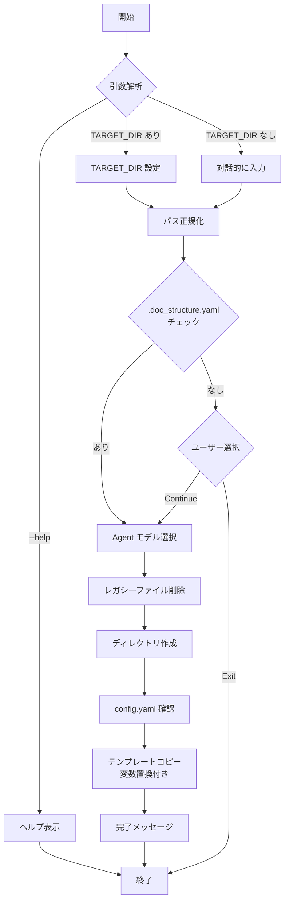

# DES-001: setup.sh 詳細設計

## 概要

`setup.sh` は Doc Advisor のセットアップスクリプト。テンプレートリポジトリからターゲットプロジェクトへ必要なファイルをコピーし、プロジェクト固有の設定ファイルを生成する。

## 基本情報

| 項目 | 値 |
|------|-----|
| ファイル名 | `setup.sh` |
| バージョン | v4.0 |
| 実行要件 | Bash |
| 依存コマンド | `sed`, `find`, `mkdir`, `cp`, `chmod`, `rm` |

## 使用方法

```bash
# 指定したディレクトリにセットアップ
./setup.sh TARGET_DIR

# 対話モード（ディレクトリを対話的に入力）
./setup.sh

# ヘルプ表示
./setup.sh -h
./setup.sh --help
```

## 引数

| 引数 | 必須 | 説明 |
|------|------|------|
| `TARGET_DIR` | 任意 | セットアップ先プロジェクトのパス。省略時は対話的に入力を求める |
| `-h`, `--help` | 任意 | ヘルプメッセージを表示して終了 |

## デフォルト値

| 変数 | デフォルト値 | 説明 |
|------|--------------|------|
| `DEFAULT_AGENT_MODEL` | `opus` | Agent 定義に使用するモデル |
| `PYTHON_PATH` | `python3` | Python 実行パス（shell wrapper 検出時は実パスに切替） |

## 処理フロー



> **Note**: v4.0 で `.doc_structure.yaml` チェックはセットアップの最初に行われる。未検出時はユーザーに Continue/Exit を選択させ、doc-structure プラグインを先にインストールする機会を与える。ディレクトリ分類はターゲットプロジェクト側の `/classify-docs` スキルで AI 駆動で実行する。

---

## 主要関数

### `copy_and_substitute()`

単一ファイルをコピーしながら変数置換を行う。

```bash
copy_and_substitute "$src" "$dst"
```

**置換対象変数:**

| プレースホルダー | 置換値 | 置換方法 |
|------------------|--------|----------|
| `{{AGENT_MODEL}}` | Agent 定義のモデル指定 | `sed` |
| `{{PYTHON_PATH}}` | Python 実行パス | `sed` |
| `{{DOC_ADVISOR_VERSION}}` | Doc Advisor バージョン | `sed` |

**実装:**

```bash
copy_and_substitute() {
    local src="$1"
    local dst="$2"
    if [[ -f "$src" ]]; then
        sed -e "s|{{AGENT_MODEL}}|${AGENT_MODEL}|g" \
            -e "s|{{PYTHON_PATH}}|${PYTHON_PATH}|g" \
            -e "s|{{DOC_ADVISOR_VERSION}}|${DOC_ADVISOR_VERSION}|g" \
            "$src" > "$dst"
    fi
}
```

### `copy_dir_with_substitution()`

ディレクトリを再帰的にコピーし、テキストファイルには変数置換を適用する。

```bash
copy_dir_with_substitution "$src_dir" "$dst_dir"
```

**処理対象ファイル:**

| 拡張子 | 処理 |
|--------|------|
| `.md` | 変数置換してコピー |
| `.yaml` | 変数置換してコピー |
| `.py` | 変数置換してコピー |
| `.sh` | そのままコピー → 実行権限付与 |

---

## v4.0 生成構造

```
TARGET_DIR/
├── .claude/
│   ├── agents/                      # Agent 定義（上書きのみ、1ファイル）
│   │   └── toc-updater.md           # ワーカー: rules/specs の個別エントリ処理
│   ├── skills/
│   │   ├── classify-docs/           # ドキュメントディレクトリ自動分類スキル
│   │   │   └── SKILL.md
│   │   ├── query-rules/             # ドキュメント検索スキル (context: fork)
│   │   │   └── SKILL.md
│   │   ├── query-specs/             # ドキュメント検索スキル (context: fork)
│   │   │   └── SKILL.md
│   │   ├── create-rules-toc/        # rules ToC 生成スキル
│   │   │   └── SKILL.md
│   │   └── create-specs-toc/        # specs ToC 生成スキル
│   │       └── SKILL.md
│   └── doc-advisor/                 # 共有リソース + ランタイム出力
│       ├── config.yaml              # 設定ファイル（root_dirs は setup.sh で取り込み、または /classify-docs で設定）
│       ├── docs/                    # ドキュメント
│       │   ├── toc_orchestrator.md
│       │   ├── toc_format.md
│       │   ├── toc_update_workflow.md
│       │   └── classification_rules.md  # /classify-docs 用分類ルール
│       ├── scripts/                 # Python/Shell スクリプト
│       │   ├── toc_utils.py
│       │   ├── classify_dirs.py         # ディレクトリスキャナー
│       │   ├── check_config.sh          # スキル Pre-check スクリプト
│       │   ├── import_doc_structure.py  # .doc_structure.yaml → config.yaml 取り込み
│       │   ├── create_checksums.py
│       │   ├── create_pending_yaml.py   # --target rules|specs
│       │   ├── write_pending.py         # --target rules|specs
│       │   ├── merge_toc.py             # --target rules|specs
│       │   ├── validate_rules_toc.py
│       │   └── validate_specs_toc.py
│       └── toc/                     # ランタイム出力
│           ├── rules/
│           │   ├── rules_toc.yaml       # 生成される ToC
│           │   ├── .toc_checksums.yaml  # チェックサム
│           │   └── .toc_work/           # 作業ディレクトリ
│           └── specs/
│               ├── specs_toc.yaml
│               ├── .toc_checksums.yaml
│               └── .toc_work/
```

---

## アップグレード処理（v2.0 → v3.0）

### レガシーファイル削除

v2.0 からのアップグレード時、doc-advisor のレガシーファイルを**ファイル名指定で自動削除**する。

#### 削除対象

| レガシーパス | 処理 | 理由 |
|-------------|------|------|
| `commands/create-rules_toc.md` | 自動削除 | Skills に統合 |
| `commands/create-specs_toc.md` | 自動削除 | Skills に統合 |
| `doc-advisor/config.yaml` | 自動削除 | 新しい場所に移動 |
| `doc-advisor/docs/` | 自動削除 | 新しい場所に移動 |

#### 保持されるもの

| パス | 理由 |
|------|------|
| `commands/` 内のユーザー独自コマンド | ユーザー資産の保護 |
| `agents/` 内のユーザー独自エージェント | ユーザー資産の保護 |
| `doc-advisor/toc/rules/`, `doc-advisor/toc/specs/` | ランタイム出力 |

### コピー方式

| ディレクトリ | 方式 | 理由 |
|-------------|------|------|
| `agents/` | **上書きのみ** | ユーザーの独自 agent を保護（管理対象は `toc-updater.md` 1 ファイルのみ） |
| `skills/classify-docs/` | **上書き** | 単一ファイルなので上書きで十分 |
| `skills/query-rules/` | **上書き** | 単一ファイルなので上書きで十分 |
| `skills/query-specs/` | **上書き** | 単一ファイルなので上書きで十分 |
| `skills/create-rules-toc/` | **上書き** | 単一ファイルなので上書きで十分 |
| `skills/create-specs-toc/` | **上書き** | 単一ファイルなので上書きで十分 |
| `skills/doc-advisor/` | **自動削除** | v3.0 レガシー（分割されたため不要） |

### config.yaml の保護

既存の `config.yaml` がある場合、ユーザーに選択肢を提示:

```
Options:
  [o] Overwrite (backup to config.yaml.bak)
  [s] Skip (keep existing config)
  [m] Merge manually (show diff after setup)
```

Overwrite 選択時のバックアップ先: `doc-advisor/config.yaml.bak`

## アップグレード処理（v3.6 → v3.7: advisor agent → skill 移行）

### 削除対象

| レガシーパス | 処理 | 理由 |
|-------------|------|------|
| `agents/rules-advisor.md` | バージョン識別子チェック後に自動削除 | query-rules skill に置き換え |
| `agents/specs-advisor.md` | バージョン識別子チェック後に自動削除 | query-specs skill に置き換え |

### 削除判断

現行バージョン (`DOC_ADVISOR_VERSION`) の `doc-advisor-version-xK9XmQ` 識別子を持つファイルは保護される。識別子がない、または旧バージョンの場合のみ削除する。

---

## アップグレード処理（v3.8: スクリプト・Agent・ドキュメント統合）

### 概要

v3.8 でカテゴリ別に分かれていたスクリプト・Agent・ドキュメントを統合。`--target rules|specs` パラメータで切り替える方式に変更。

### 削除対象（バージョンチェックなし、無条件削除）

統合による置き換えのため、同一バージョンであっても旧ファイルを削除する。

| レガシーパス | 統合先 |
|-------------|--------|
| `agents/rules-toc-updater.md` | `agents/toc-updater.md` |
| `agents/specs-toc-updater.md` | `agents/toc-updater.md` |
| `scripts/create_pending_yaml_rules.py` | `scripts/create_pending_yaml.py` |
| `scripts/create_pending_yaml_specs.py` | `scripts/create_pending_yaml.py` |
| `scripts/write_rules_pending.py` | `scripts/write_pending.py` |
| `scripts/write_specs_pending.py` | `scripts/write_pending.py` |
| `scripts/merge_rules_toc.py` | `scripts/merge_toc.py` |
| `scripts/merge_specs_toc.py` | `scripts/merge_toc.py` |
| `docs/rules_orchestrator.md` | `docs/toc_orchestrator.md` |
| `docs/specs_orchestrator.md` | `docs/toc_orchestrator.md` |
| `docs/rules_toc_format.md` | `docs/toc_format.md` |
| `docs/specs_toc_format.md` | `docs/toc_format.md` |
| `docs/rules_toc_update_workflow.md` | `docs/toc_update_workflow.md` |
| `docs/specs_toc_update_workflow.md` | `docs/toc_update_workflow.md` |

> **Note**: バージョンチェックを行わない理由 — これらは「更新」ではなく「置き換え」であるため。旧ファイル名のまま残すと重複動作の原因となる。

### ディレクトリ選択の廃止

v3.8 でディレクトリ選択機能を廃止。`config.yaml` の `root_dirs` は空配列 `[]` で生成され、`/classify-docs` スキルで自動分類・設定する。

### v4.0: classify-docs 復活と SessionStart hook（v3.8 → v4.0）

| 変更 | 内容 |
|------|------|
| `setup_dirs.sh` 廃止 | `/classify-docs` スキルで完全に代替 |
| `--skip-doc-structure` フラグ廃止 | setup.sh はディレクトリ分類を行わないため不要 |
| `classify-docs` スキル復活 | テンプレートとして `templates/skills/classify-docs/SKILL.md` を配置。AI 駆動でディレクトリを分類 |
| スキル Pre-check 導入 | `check_config.sh` を各スキルの先頭で呼び出し、未設定時は `/classify-docs` を先に実行させる |

---

### 削除判断の原則

```
【重要】識別子ベースの削除ロジック

ファイルに doc-advisor 識別子があるか？
  → ある（現行バージョン）: 管理中 → 削除しない
  → ある（旧バージョン）:   更新対象 → 削除OK
  → ない:                   古い残骸 → 削除OK

※例外: v3.8 統合による置き換え → バージョン問わず無条件削除
```

> **Note**: v3.6 で `doc-advisor-version-xK9XmQ` 識別子が導入済み。v3.7 の advisor agent 削除はこの識別子ベースで動作している。レガシー（v2.0）ファイルは識別子がないためファイル名指定で削除する。v3.8 の統合削除はバージョンチェックなしで動作する。

---

## config.yaml の構造

生成される設定ファイルの構造:

```yaml
# === rules 設定 ===
rules:
  # root_dirs: []    # Auto-configured by setup.sh or /classify-docs
  # doc_types_map: {}  # Path-to-doc_type mapping (auto-configured)
  toc_file: .claude/doc-advisor/toc/rules/rules_toc.yaml
  checksums_file: .claude/doc-advisor/toc/rules/.toc_checksums.yaml
  work_dir: .claude/doc-advisor/toc/rules/.toc_work/
  patterns:
    target_glob: "**/*.md"
    exclude: []
  output:
    header_comment: "Development documentation search index for query-rules skill"
    metadata_name: "Development Documentation Search Index"

# === specs 設定 ===
specs:
  # root_dirs: []    # Auto-configured by setup.sh or /classify-docs
  # doc_types_map: {}  # Path-to-doc_type mapping (auto-configured)
  toc_file: .claude/doc-advisor/toc/specs/specs_toc.yaml
  checksums_file: .claude/doc-advisor/toc/specs/.toc_checksums.yaml
  work_dir: .claude/doc-advisor/toc/specs/.toc_work/
  patterns:
    target_glob: "**/*.md"
    exclude: []
  output:
    header_comment: "Project specification document search index for query-specs skill"
    metadata_name: "Project Specification Document Search Index"

# === 共通設定 ===
common:
  parallel:
    max_workers: 5               # 並列処理数
    fallback_to_serial: true     # 並列失敗時は直列実行
```

> **Note**: `root_dirs` と `doc_types_map` はテンプレート上はコメントアウト状態。setup.sh は `.doc_structure.yaml` が存在する場合、`import_doc_structure.py` を呼び出して config.yaml の `root_dirs` と `doc_types_map` に書き込む。存在しない場合はテンプレートコピーに徹し、ターゲットプロジェクトで `/classify-docs` スキルが AI 駆動で設定する。実行時に `.doc_structure.yaml` は参照しない（REQ-001 FR-08）。

## スキル Pre-check（v4.0）

### 概要

各スキル（create-rules-toc, create-specs-toc, query-rules, query-specs）の先頭で `check_config.sh` を実行し、ドキュメントディレクトリが未設定の場合は `/classify-docs` を先に実行させる。

### check_config.sh のチェック順序

1. `config.yaml` が存在しない → 即 exit 0（Doc Advisor 未インストール）
2. `config.yaml` に `root_dirs:` が設定済み → 即 exit 0（出力なし = OK）
3. `config.yaml` は存在するが `root_dirs` が未設定 → `[ACTION REQUIRED]` 警告メッセージを出力

> `.doc_structure.yaml` の存在チェックは行わない。実行時は config.yaml のみを参照する（REQ-001 FR-08）。

### スキル側の処理

```markdown
## Pre-check (MANDATORY - Run first)

bash .claude/doc-advisor/scripts/check_config.sh {rules|specs}

- No output → Proceed
- Output present → STOP. Run /classify-docs first, then restart this skill
```

> カテゴリ引数（`rules` または `specs`）を渡すことで、対象カテゴリの `root_dirs` のみを検証する。引数なしの場合はいずれかの `root_dirs` が設定されていれば OK（後方互換）。

---

## エラーハンドリング

| エラー条件 | 挙動 |
|------------|------|
| 不明なオプション | エラーメッセージ + exit 1 |
| 引数が多すぎる | エラーメッセージ + exit 1 |
| TARGET_DIR が存在しない | エラーメッセージ + exit 1 |
| テンプレートディレクトリが存在しない | Warning 表示 + 続行 |

**スクリプト設定:**
- `set -e`: エラー発生時に即座に終了

## セットアップ後の次のステップ

### config.yaml に root_dirs が設定済みの場合

setup.sh が `.doc_structure.yaml` を取り込み済み、または `/classify-docs` で設定済み。すぐに ToC 生成が可能:

1. Claude Code を起動:
   ```bash
   cd TARGET_DIR
   claude
   ```
2. 初回 ToC 生成を実行:
   ```
   /create-rules-toc --full
   /create-specs-toc --full
   ```

### config.yaml に root_dirs が未設定の場合

スキルの Pre-check（check_config.sh）が未設定を検出し、`/classify-docs` の実行を指示する:

1. Claude Code を起動
2. `/create-rules-toc --full` を実行 → Pre-check が `/classify-docs` の実行を指示
3. `/classify-docs` で root_dirs が設定された後、再度 `/create-rules-toc --full`

## 注意事項

- templates/ ディレクトリがスクリプトと同じディレクトリに存在する必要がある
- `.py`, `.md`, `.yaml` はプレースホルダー置換付きでコピーされる。`.sh` 等その他はそのままコピー
- `agents/` はディレクトリ削除せず上書きのみ（ユーザーの独自 agent を保護、管理対象は `toc-updater.md` 1 ファイルのみ）
- `skills/doc-advisor/` はクリーンインストール（全削除→再作成）（v3.0 レガシー）
- advisor agent（rules-advisor.md, specs-advisor.md）は自動削除される（v3.7 移行）
- v3.8 統合による旧ファイル（per-category scripts/agents/docs）は無条件削除される
- `config.yaml` が既存の場合はユーザーに確認を求める
- setup.sh はテンプレートコピー・変数置換・`.doc_structure.yaml` からの設定取り込みを行う。AI によるディレクトリ分類は行わない
- `.doc_structure.yaml` がない場合、`config.yaml` の `root_dirs` はコメントアウト状態のまま（`/classify-docs` で設定）
- 各スキルの Pre-check で `check_config.sh` を呼び出し、未設定時は `/classify-docs` を先に実行させる

## 関連ドキュメント

- `tests/test_setup_upgrade.sh`: アップグレードテスト
