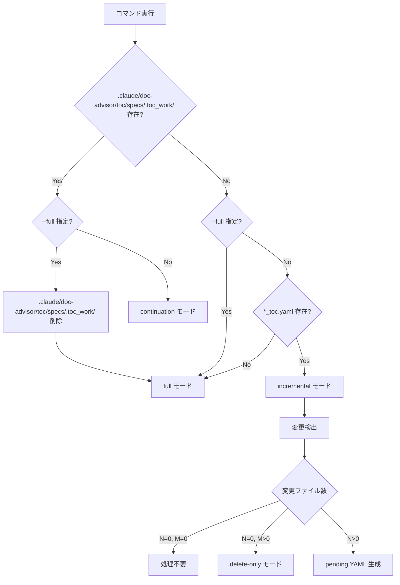
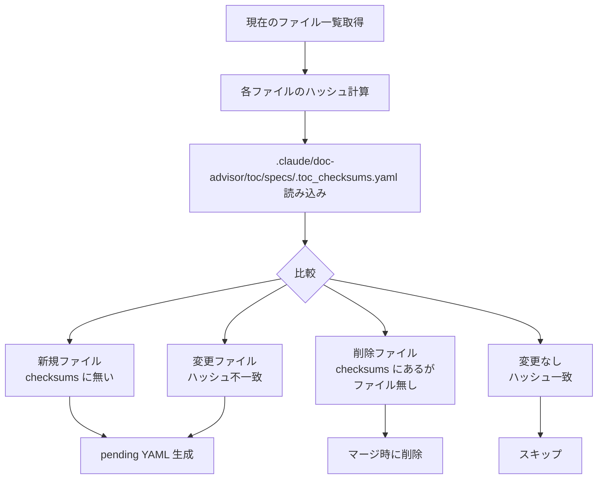
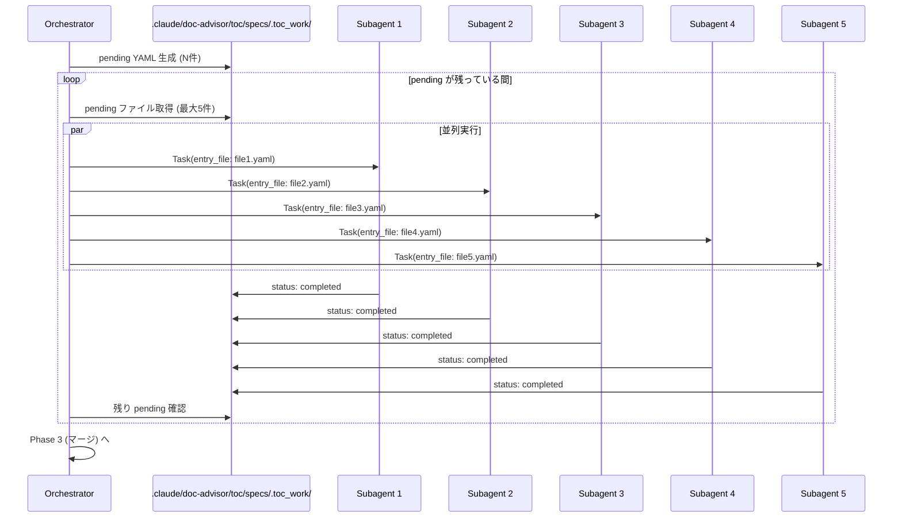
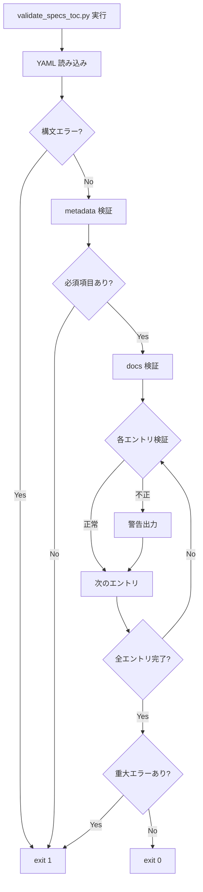
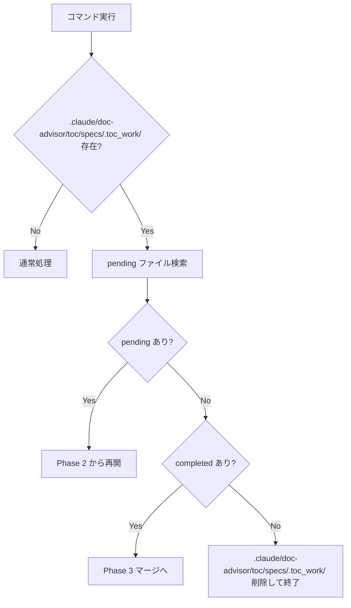

# DES-005: ToC 生成フロー設計書

## 概要

本設計書では、Doc Advisor の ToC（Table of Contents）自動生成システムの全体フロー、変更検出メカニズム、並列分割処理、マージ処理を定義する。

## 関連要件

- REQ-001 FR-02: ToC 自動生成
- REQ-001 FR-03: 変更検出
- REQ-001 FR-04: 並列処理

---

## システム構成

### コンポーネント一覧

| コンポーネント | 役割 | 実装 |
|---------------|------|------|
| Orchestrator | 全体フロー制御 | `skills/create-*-toc/SKILL.md` |
| Subagent | 個別ファイル処理 | `agents/toc-updater.md`（`--target rules\|specs` で切替） |
| Checksum Generator | ハッシュ計算 | `create_checksums.py` |
| Pending Generator | pending YAML 生成 | `create_pending_yaml.py --target rules\|specs` |
| Writer | pending YAML 書き込み | `write_pending.py --target rules\|specs` |
| Merger | エントリ統合 | `merge_toc.py --target rules\|specs` |
| Validator | 出力検証 | `validate_rules_toc.py` / `validate_specs_toc.py` |

> **前提条件**: ToC 生成の前に `config.yaml` の `root_dirs` が設定されている必要がある。`.doc_structure.yaml` がある場合はランタイムで導出される。ない場合は `/classify-docs` スキルで事前に設定する。

### データフロー

```
┌─────────────────────────────────────────────────────────────────────┐
│                         Orchestrator                                │
│  ┌──────────┐    ┌──────────┐    ┌──────────┐    ┌──────────┐     │
│  │  変更    │ -> │ pending  │ -> │ 並列     │ -> │ マージ   │     │
│  │  検出    │    │ YAML生成 │    │ 処理     │    │ 検証     │     │
│  └──────────┘    └──────────┘    └──────────┘    └──────────┘     │
│       │                              │                 │           │
│       v                              v                 v           │
│  .claude/doc-advisor/toc/specs/.toc_checksums.yaml  .claude/doc-advisor/toc/specs/.toc_work/  .claude/doc-advisor/toc/specs/specs_toc.yaml  │
└─────────────────────────────────────────────────────────────────────┘
```

---

## 処理モード

### モード一覧

| モード | トリガー | 動作 |
|--------|---------|------|
| `full` | `--full` オプション または ToC 未存在 | 全ファイルスキャン、ToC 新規生成 |
| `incremental` | デフォルト | 変更ファイルのみ処理、差分マージ |
| `continuation` | `.claude/doc-advisor/toc/specs/.toc_work/` が存在 | 中断された処理を再開 |
| `delete-only` | 変更0件、削除あり | 削除のみ反映（subagent 不要） |

### モード判定フロー



---

## Phase 1: 変更検出（ハッシュベース）

### 設計思想

- **Git 非依存**: コミット状態に関係なく、実際のファイル内容で判定
- **高精度**: SHA-256 ハッシュで変更を確実に検出
- **チーム共有**: `.claude/doc-advisor/toc/specs/.toc_checksums.yaml` を Git 管理し、チーム間で差分検出を共有

### チェックサムファイル形式

```yaml
# .claude/doc-advisor/toc/specs/.toc_checksums.yaml
generated_at: 2026-01-22T12:00:00Z
file_count: 25
checksums:
  specs/requirements/app_overview.md: a1b2c3d4e5f6...
  specs/design/login_screen.md: b2c3d4e5f6a1...
```

### 変更検出アルゴリズム



### ハッシュ計算処理

```python
def calculate_file_hash(filepath):
    """SHA-256 ハッシュを計算"""
    sha256 = hashlib.sha256()
    with open(filepath, 'rb') as f:
        for chunk in iter(lambda: f.read(8192), b''):
            sha256.update(chunk)
    return sha256.hexdigest()
```

### 変更カウントと処理分岐

| 条件 | 処理 |
|------|------|
| N=0, M=0 | 処理終了（変更なし） |
| N=0, M>0 | delete-only モード（マージスクリプトのみ実行） |
| N>0 | pending YAML 生成 → subagent → マージ |

**N** = 新規 + 変更ファイル数、**M** = 削除ファイル数

---

## Phase 2: 並列分割処理（個別エントリファイル方式）

### 設計思想

1. **1ファイル = 1 subagent**: 各ドキュメントを独立して処理
2. **永続的成果物**: subagent の出力をファイルとして保存
3. **中断耐性**: 完了分は保持、未完了分から再開可能
4. **並列効率**: 最大5並列で処理時間を短縮

### 作業ディレクトリ構造

```
.claude/doc-advisor/toc/specs/.toc_work/               # 作業ディレクトリ
├── specs_requirements_app_overview.yaml
├── specs_design_login_screen.yaml
└── ... (対象ファイルごとに1つ)
```

### ファイル名変換規則

```
元パス: specs/requirements/login.md
作業ファイル: specs_requirements_login.yaml

変換: '/' → '_', '.md' → '.yaml'
```

### pending YAML テンプレート

両カテゴリ共通のテンプレート:

```yaml
_meta:
  source_file: specs/requirements/app_overview.md  # 処理対象ファイルパス
  status: pending                                  # pending | completed
  updated_at: null                                 # 完了時刻

# 以下は subagent が埋める
title: null
purpose: null
content_details: []
applicable_tasks: []
keywords: []
```

> **Note**: rules と specs で同一テンプレート。カテゴリの違いは ToC 出力先と作業ディレクトリで区別される。

### 並列処理フロー



### Subagent 処理内容

1. pending YAML を読み込み（`_meta.source_file` を取得）
2. 元ドキュメント（.md）を読み込み
3. メタデータを抽出:
   - `title`: H1 見出しから
   - `purpose`: ドキュメントの目的（1-2行）
   - `content_details`: 内容詳細（5-10項目）
   - `applicable_tasks`: 適用タスク
   - `keywords`: キーワード（5-10語）
4. `_meta.status: completed`、`_meta.updated_at` を設定
5. YAML を保存

---

## Phase 3: マージ処理

### マージモード

| モード | 入力 | 処理 |
|--------|------|------|
| `full` | `.claude/doc-advisor/toc/specs/.toc_work/*.yaml` のみ | 新規生成 |
| `incremental` | 既存 ToC + `.claude/doc-advisor/toc/specs/.toc_work/*.yaml` | 差分マージ + 削除反映 |
| `delete-only` | 既存 ToC のみ | 削除のみ反映 |

### マージフロー

```mermaid
flowchart TD
    A[マージ開始] --> B{モード}

    B -->|full| C[docs = {}]
    B -->|incremental| D[docs = 既存 ToC 読み込み]
    B -->|delete-only| E[docs = 既存 ToC 読み込み]

    C --> F[.claude/doc-advisor/toc/specs/.toc_work/*.yaml を追加]
    D --> G[削除ファイル検出]
    G --> H[該当エントリ削除]
    H --> F
    E --> G2[削除ファイル検出]
    G2 --> H2[該当エントリ削除]
    H2 --> I[出力]

    F --> I

    I --> J[バックアップ作成]
    J --> K[*_toc.yaml 書き込み]
    K --> L[バリデーション実行]
    L --> M{検証結果}
    M -->|成功| N[チェックサム更新]
    M -->|失敗| O[バックアップから復元]
    N --> P[.claude/doc-advisor/toc/specs/.toc_work/ 削除]
    O --> Q[エラー終了]
```

### 削除検出ロジック

```python
# チェックサムファイルに記録されているファイル
checksum_files = load_checksums(checksums_file)

# 現在実際に存在するファイル
existing_files = get_existing_files()

# 削除されたファイル = チェックサムにあるが実ファイルがない
deleted_files = checksum_files - existing_files

# ToC から該当エントリを削除
for del_file in deleted_files:
    if del_file in docs:
        del docs[del_file]
```

### マージ後の出力形式

```yaml
# .claude/doc-advisor/toc/specs/specs_toc.yaml
metadata:
  name: Project Specification Search Index
  generated_at: 2026-01-22T12:00:00Z
  file_count: 25

docs:
  specs/requirements/app_overview.md:
    title: Application Overview
    purpose: Defines overall requirements
    content_details:
      - User authentication
      - Use cases
    applicable_tasks:
      - New feature planning
    keywords:
      - application
      - requirements
```

---

## Phase 4: バリデーション

### 検証項目

| カテゴリ | 検証内容 | 実装状況 |
|----------|----------|----------|
| YAML 構文 | インデント、コロン、ハイフンの正確性 | ✅ 実装済み |
| 必須フィールド | metadata: name, generated_at, file_count | 📋 将来対応 |
| エントリフィールド | title, purpose, content_details, applicable_tasks, keywords | ✅ 実装済み |
| ファイル存在 | docs に記載された全ファイルが実在 | ✅ 実装済み |

> **Note**: metadata セクションの必須フィールド検証は現行実装では未対応。エントリレベルの検証のみ実施。

### バリデーションフロー



### 検証失敗時の動作

1. バックアップファイル（`*.yaml.bak`）から復元
2. チェックサムは更新しない
3. `.claude/doc-advisor/toc/specs/.toc_work/` は削除しない（再実行可能）
4. エラー内容を報告

---

## エラーハンドリングと再開

### エラー種別と対応

| エラー種別 | 発生箇所 | 対応 |
|-----------|---------|------|
| ファイル読み込みエラー | Subagent | エラーメッセージ出力、該当 YAML は pending のまま |
| YAML 構文エラー | Merger | 該当ファイルをスキップ、警告出力 |
| バリデーションエラー | Validator | バックアップ復元、処理中断 |
| マージエラー | Merger | .claude/doc-advisor/toc/specs/.toc_work/ 保持、再実行可能 |

### Subagent エラー時の扱い

- エラーは標準出力に報告
- 該当 entry は pending のまま（error status は使用しない）

### 再開（Continuation）処理



### 中断耐性の実現

| 状況 | 保持されるもの | 再開時の動作 |
|------|---------------|-------------|
| Phase 1 中断 | なし | 最初から実行 |
| Phase 2 中断 | completed な YAML | pending から処理再開 |
| Phase 3 中断 | .claude/doc-advisor/toc/specs/.toc_work/、バックアップ | マージから再実行 |

---

## 処理統計と完了レポート

### 完了レポート形式

```
✅ specs_toc.yaml has been updated

[Summary]
- Mode: incremental
- Files processed: 5
- Deleted: 1

[Cleanup]
- Deleted .claude/doc-advisor/toc/specs/.toc_work/
```

### エラーレポート形式

```
⚠️ specs_toc.yaml generation completed with warnings

[Summary]
- Mode: full
- Files processed: 23
- Errors: 2

[Error Files]
- specs_requirements_broken.yaml: File read error
- specs_design_invalid.yaml: Invalid YAML syntax

[Action Required]
- Review error files manually
- Re-run /create-specs-toc to retry
```

---

## 性能考慮

### 並列処理の効果

| ファイル数 | 直列処理 | 5並列処理 | 短縮率 |
|-----------|---------|----------|-------|
| 5 | 5T | T | 80% |
| 25 | 25T | 5T | 80% |
| 100 | 100T | 20T | 80% |

**T** = 1ファイルあたりの処理時間

### ボトルネック

1. **LLM API 呼び出し**: subagent の処理時間の大部分
2. **ファイル I/O**: ハッシュ計算、YAML 読み書き
3. **マージ処理**: 大量エントリの結合

### 最適化ポイント

- 並列数は `config.yaml` の `common.parallel.max_workers` で調整可能
- incremental モードで変更ファイルのみ処理
- チェックサムファイルで不要な再計算を回避

---

## Skill / Agent 設計根拠

### コンポーネントの使い分け

| コンポーネント | 種別 | 根拠 |
|---------------|------|------|
| `query-rules`, `query-specs` | **Skill** (`context: fork`) | ユーザー呼び出し (`/query-*`)、Claude 自動トリガー、隔離実行が必要 |
| `create-rules-toc`, `create-specs-toc` | **Skill** (fork なし) | ユーザー呼び出し (`/create-*-toc`) が必要。agent を並列起動するため fork 不可 |
| `toc-updater` | **Agent** | ツール制限 (`Read, Bash` のみ)、並列起動、system prompt の確実性が必要。`--target rules\|specs` で分岐 |

### 重要な制約: fork と subagent の関係

```
メイン会話 ─── skill (fork なし) ──→ Task(agent) ✅ 可能
メイン会話 ─── skill (fork あり) ──→ Task(agent) ❌ 不可能
                                      ↑ subagent は他の subagent を起動できない
```

このため、orchestrator (`create-*-toc`) は fork **しない**（agent を並列起動するため）。
検索 (`query-*`) は fork **する**（agent 起動不要、コンテキスト隔離が有益）。

---

## 関連設計書

| 設計書 | 内容 |
|--------|------|
| DES-003 | 文書識別子の設計 |
| DES-004 | ドキュメントモデルと設定仕様 |
