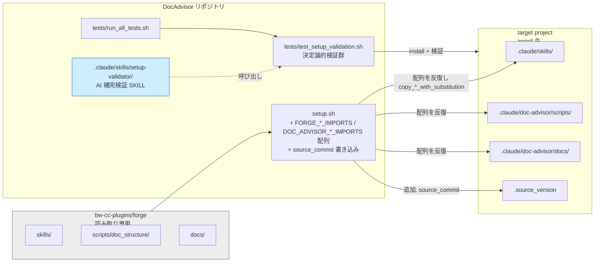
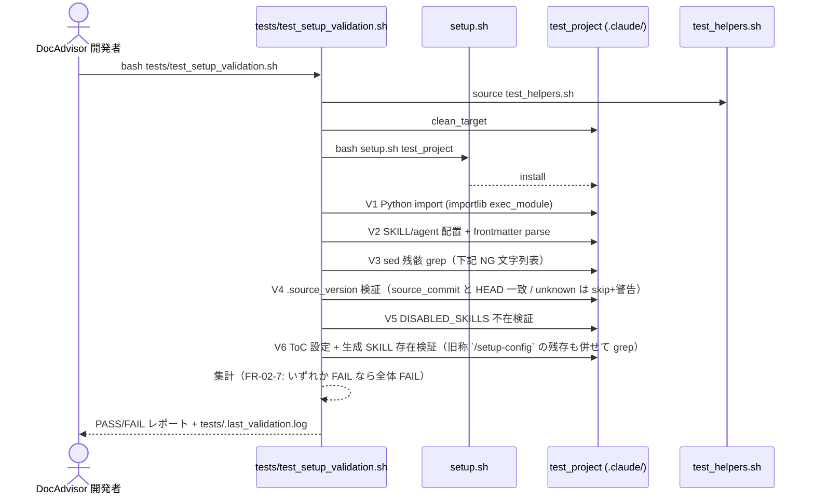

# DES-006: setup.sh の forge プラグイン変更耐性強化 設計書

## メタデータ

| 項目         | 値                                                                                |
| ------------ | --------------------------------------------------------------------------------- |
| 設計 ID      | DES-006                                                                           |
| 関連要件     | REQ-004                                                                           |
| 関連設計書   | DES-001（setup.sh 正本、本 feature が拡張）/ DES-005（ToC 設定生成） |
| 作成日       | 2026-04-28                                                                        |
| 作成者       | k_terada                                                                          |

## 1. 概要

`setup.sh` が forge plugin から取り込む資産（SKILL / script / docs）を**宣言リスト化**し、install 結果を**決定論的検証** + **AI 補完検証**の二段で確認する仕組みを導入する。forge 側マニフェスト連携と Python env 変数化（FR-04 / FR-05）は受け入れ要件のみ定義し、実装は別 PR に委ねる。

採用アプローチ:

1. **可視化**: `setup.sh` トップレベルに forge 側 `FORGE_*_IMPORTS` および doc-advisor 側 `DOC_ADVISOR_*_IMPORTS` 配列を定義し、Phase B はそれらを反復するだけにする（FR-01-1 / FR-01-2）。`DISABLED_SKILLS` は除外 SKILL 名の正本変数として保持し、`DOC_ADVISOR_SKILL_IMPORTS` はその subset として保つ（FR-02-5）
2. **決定論的検証**: 新規 `tests/test_setup_validation.sh` で install 後の state を網羅検証（Python import / SKILL 配置 / sed 残骸 / `.source_version` / DISABLED_SKILLS 等）
3. **AI 補完検証**: DocAdvisor リポジトリ直下のみに `setup-validator` SKILL を配置し、決定論的検証 PASS 後に意味的妥当性を AI 検証する
4. **`.source_version` の commit 化**: 既存の `source_plugin_version`（SemVer）はそのまま残し、追加で `source_commit` キーを書き込む（A 案、REQ-004 FR-02-4 で確定）

## 2. アーキテクチャ概要

責務分担:

| レイヤ                              | 責務                                                                          |
| ----------------------------------- | ----------------------------------------------------------------------------- |
| `setup.sh` 宣言リスト               | forge / doc-advisor 双方から取り込む資産の唯一の正本（FR-01-1）。Phase B のロジックは配列反復のみで、資産名の個別ハードコード行を持たない（FR-01-2）。`DISABLED_SKILLS` は除外 SKILL 名の正本変数で、`DOC_ADVISOR_SKILL_IMPORTS` はそれを引いた subset として保持される（FR-02-5） |
| `tests/test_setup_validation.sh`    | install 結果の決定論的検証。FR-02 全項目を 1 ファイルに集約                   |
| `.claude/skills/setup-validator/`   | 決定論的検証の起動 + AI 意味検証。DocAdvisor 開発者専用、target には届かない  |
| `bw-cc-plugins/forge/`（将来 PR）   | マニフェスト宣言（FR-04） / Python env 変数解決（FR-05）。本 PR では受け入れ要件のみ |

## 3. モジュール設計

### 3.1 モジュール一覧

| モジュール名                       | 種別     | 責務                                                                                               | 依存                                                                       |
| ---------------------------------- | -------- | -------------------------------------------------------------------------------------------------- | -------------------------------------------------------------------------- |
| `setup.sh::FORGE_SKILL_IMPORTS`    | bash 配列 | forge skills/ から取り込む SKILL ディレクトリ名のリスト                                            | なし（トップレベル定義）                                                   |
| `setup.sh::FORGE_SCRIPT_IMPORTS`   | bash 配列 | forge scripts/ から取り込む script ディレクトリ名のリスト                                          | なし                                                                       |
| `setup.sh::FORGE_DOC_IMPORTS`      | bash 配列 | forge docs/ から取り込む doc ファイル名のリスト                                                    | なし                                                                       |
| `setup.sh::DOC_ADVISOR_SKILL_IMPORTS` | bash 配列 | doc-advisor skills/ から取り込む SKILL ディレクトリ名のリスト（`DISABLED_SKILLS` を除いた subset、FR-01-1 / FR-02-5） | なし（トップレベル定義）                                                   |
| `setup.sh::DOC_ADVISOR_AGENT_IMPORTS` | bash 配列 | doc-advisor agents/ から取り込む agent 名のリスト                                                | なし                                                                       |
| `setup.sh::DOC_ADVISOR_SCRIPT_IMPORTS` | bash 配列 | doc-advisor scripts/ から取り込む script ディレクトリ名のリスト                                  | なし                                                                       |
| `setup.sh::DOC_ADVISOR_DOC_IMPORTS` | bash 配列 | doc-advisor docs/ から取り込む doc ファイル名のリスト                                              | なし                                                                       |
| `setup.sh::DISABLED_SKILLS`        | bash 変数 | doc-advisor 取り込み除外 SKILL の名前リストの**正本**（FR-02-5）。`DOC_ADVISOR_SKILL_IMPORTS` は本変数を引いた集合として保持される | なし                                                                       |
| `setup.sh::install_plugin_imports()` | bash 関数 | forge 側 3 配列および doc-advisor 側 4 配列を反復し、`copy_dir_with_substitution` / `copy_and_substitute` を呼ぶ。欠落時は警告継続。sed 変換ルールは `copy_and_substitute()` の責務であり本関数は関与しない（責務境界は §6.5 を参照） | `copy_*` 関数群（DES-001 既存）、`SOURCE_FORGE`、`SOURCE_DIR`（doc-advisor）、`SKILLS_DIR`、`AGENTS_DIR`、`DOC_ADVISOR_DIR`、`HAS_FORGE` |
| `setup.sh::write_source_version()` | bash 関数 | `.source_version` を生成。既存 `source_plugin_version` に加え `source_commit: <bw-cc-plugins HEAD>` を書き込む。dirty 検知時は `-dirty` suffix。`git -C bw-cc-plugins rev-parse HEAD` 取得不能時（`--source` で submodule 外を指す / git 不在 等）は `source_commit: unknown` を書き込む（FR-02-4） | `git -C bw-cc-plugins rev-parse HEAD` / `git -C bw-cc-plugins status --porcelain` |
| `tests/test_setup_validation.sh`   | shell 検証スクリプト | install 後の決定論的検証群（Python import / SKILL 配置 / sed 残骸 / `.source_version` / DISABLED_SKILLS 不在 / ToC 設定）を実行し PASS/FAIL を集計。冒頭で `check_environment` を呼び事前条件を検査 | `tests/test_helpers.sh`（後述、既存ハーネスを共通化）                    |
| `tests/test_helpers.sh`            | shell ヘルパ関数群 | `check_file_exists` / `check_file_absent` / `check_grep_absent` / `check_grep_present` / `clean_target` 等のアサーション関数群、および `check_environment()`（PRE-01〜PRE-03: submodule init / python3 / 書き込み権限 を 1 関数で検査し、欠如時は exit 2 を返す）を共通化（既存 `tests/test_optional_plugins.sh` から抽出） | なし                                                                       |
| `.claude/skills/setup-validator/SKILL.md`         | SKILL    | AI 補完検証のオーケストレーション。決定論的検証を呼び出し、PASS なら AI 検証群（FR-03-3 で要件定義された responsibility 単位の検証）を実行 | `tests/test_setup_validation.sh`、`claude-code-guide`（仕様確認）          |
| `.claude/skills/setup-validator/scripts/run_tests.sh` | shell    | `tests/test_setup_validation.sh` をラップし、SKILL から構造的に読み取れる形式（PASS/FAIL カウント + JSON）に整形して exec する。達成率算出・KPI 化は行わない | `tests/test_setup_validation.sh`                                           |

### 3.2 関数構造図

```mermaid
flowchart TD
    main[setup.sh: main]
    main --> phaseA[Phase A: legacy 削除]
    main --> phaseB[Phase B: copy templates]
    main --> phaseC[Phase C: post-install]

    phaseB --> ifi[install_plugin_imports]
    ifi --> loop_fs[for skill in FORGE_SKILL_IMPORTS]
    ifi --> loop_fc[for script in FORGE_SCRIPT_IMPORTS]
    ifi --> loop_fd[for doc in FORGE_DOC_IMPORTS]
    ifi --> loop_ds[for skill in DOC_ADVISOR_SKILL_IMPORTS]
    ifi --> loop_da[for agent in DOC_ADVISOR_AGENT_IMPORTS]
    ifi --> loop_dc[for script in DOC_ADVISOR_SCRIPT_IMPORTS]
    ifi --> loop_dd[for doc in DOC_ADVISOR_DOC_IMPORTS]
    loop_fs --> cdws[copy_dir_with_substitution]
    loop_fc --> cdws
    loop_fd --> cas[copy_and_substitute]
    loop_ds --> cdws
    loop_da --> cdws
    loop_dc --> cdws
    loop_dd --> cas

    phaseC --> wsv[write_source_version]
    wsv --> git1[git rev-parse HEAD]
    wsv --> git2[git status --porcelain]

    subgraph Validation
        tsv[test_setup_validation.sh]
        tsv --> v_python_import[Python import 検証]
        tsv --> v_skill_layout[SKILL/agent 配置検証]
        tsv --> v_sed_residue[sed 残骸検証]
        tsv --> v_source_version[.source_version 検証]
        tsv --> v_disabled_skills[DISABLED_SKILLS 不在検証]
        tsv --> v_toc_config[ToC 設定検証]
    end

    subgraph SetupValidator
        sv[setup-validator SKILL]
        sv --> rt[run_tests.sh]
        rt --> tsv
        sv -- PASS のみ --> ai_frontmatter[AI: frontmatter 整合]
        sv -- PASS のみ --> ai_python_lazy[AI: Python lazy 解決整合]
        sv -- PASS のみ --> ai_sed_logic[AI: sed 論理整合]
        sv -- PASS のみ --> ai_unfound_files[AI: 未捕捉ファイル検知]
        sv -- PASS のみ --> ai_source_commit[AI: source_commit 内容対応]
    end
```

## 4. ユースケース設計

### 4.1 ユースケース一覧

| UC ID  | ユースケース                            | 関連要件               | アクター        |
| ------ | --------------------------------------- | ---------------------- | --------------- |
| UC-01  | forge から資産を取り込む（宣言リスト駆動） | FR-01-1〜FR-01-4       | DocAdvisor 開発者 |
| UC-02  | install 後に決定論的検証を実行する         | FR-02-0〜FR-02-8       | DocAdvisor 開発者 |
| UC-03  | install 後に AI 補完検証を実行する         | FR-03-1〜FR-03-6       | DocAdvisor 開発者 |
| UC-04  | forge に新規 SKILL/script/doc が追加されたとき取り込む | FR-01-3、FR-03-3-e | DocAdvisor 開発者 |
| UC-05  | forge マニフェスト経由で取り込む（将来段階） | FR-04-1〜FR-04-4       | DocAdvisor 開発者（forge PR 完了後）|
| UC-06  | forge Python の env 変数経由 path 解決（将来段階） | FR-05-1〜FR-05-4       | runtime（forge native / target install）|

### 4.2 UC-01: 宣言リスト駆動の取り込み

**前提条件**: `bw-cc-plugins/plugins/doc-advisor/` および `bw-cc-plugins/plugins/forge/` が submodule として initialize 済み。

**正常フロー**:

1. ユーザーが `bash setup.sh TARGET_DIR` を実行
2. setup.sh が Phase B に到達
3. `install_plugin_imports()` が forge 側 / doc-advisor 側双方の各 *_IMPORTS 配列を反復する:
   - forge 側: `FORGE_SKILL_IMPORTS` → `${SOURCE_FORGE}/skills/<name>` を `${SKILLS_DIR}/<name>` に `copy_dir_with_substitution`、`FORGE_SCRIPT_IMPORTS` → `${DOC_ADVISOR_DIR}/scripts/<name>` へ、`FORGE_DOC_IMPORTS` → `${DOC_ADVISOR_DIR}/docs/<name>` へ
   - doc-advisor 側: `DOC_ADVISOR_SKILL_IMPORTS` → `${SOURCE_DIR}/skills/<name>` を `${SKILLS_DIR}/<name>` へ、`DOC_ADVISOR_AGENT_IMPORTS` → `${SOURCE_DIR}/agents/<name>` を `${AGENTS_DIR}/<name>` へ、`DOC_ADVISOR_SCRIPT_IMPORTS` → `${SOURCE_DIR}/scripts/<name>` を `${DOC_ADVISOR_DIR}/scripts/<name>` へ、`DOC_ADVISOR_DOC_IMPORTS` → `${SOURCE_DIR}/docs/<name>` を `${DOC_ADVISOR_DIR}/docs/<name>` へ
4. `DOC_ADVISOR_SKILL_IMPORTS` は事前に `DISABLED_SKILLS` を除外した subset として保持されるため、ループ内では除外判定を行わない（FR-02-5）。新規 SKILL の追加は `DOC_ADVISOR_SKILL_IMPORTS` への 1 行追加で完結し、コピー処理ロジックの修正は不要（FR-01-3）
5. 各反復で source 不在を検知した場合、stdout に `Warning: <plugin> resource missing: <type>/<name> ... skipped` を出力し継続

**エラーフロー**:

- `${SOURCE_FORGE}` 自体が存在しない → 既存の `HAS_FORGE` 判定で forge 側ループをスキップ（DES-001 既存挙動）。doc-advisor 側ループは継続
- 個別資産の不在 → 警告して継続（FR-01-4）。install 全体は exit 0 を維持

### 4.3 UC-02: 決定論的検証

**前提条件**: install が完了している（または検証スクリプト内で setup.sh を呼ぶ）。

**正常フロー（test_setup_validation.sh）**:

**決定論的検証で grep 検査する NG 文字列群（V3 / V6。FR-02-3 由来。sed / 変換ルール追加時は本表への追記が PR レビュー必須項目）**:

| # | NG 文字列 | 検査箇所 | 由来 | 備考 |
| - | --------- | -------- | ---- | ---- |
| 1 | `${CLAUDE_PLUGIN_ROOT}/` | V3 | forge / doc-advisor SKILL/script 内のプラグイン参照 | `copy_and_substitute()` で `.claude/doc-advisor/` へ置換される |
| 2 | `/doc-advisor:` | V3 | doc-advisor plugin namespaced slash 起動 | `/` へ置換される |
| 3 | `/forge:setup-doc-structure` | V3 | forge plugin namespaced slash 起動 | `/setup-doc-structure` へ置換される |
| 4 | `/setup-config` | V6 | REQ-002 由来の旧称（別 PR で `/setup-doc-structure` へ移行予定） | WARN 扱い（FAIL に含めない）。移行 PR 完了後に WARN を解除し V3 1〜3 と同等の FAIL に昇格する |

**エラーフロー**:

- 環境エラー（submodule 未 init / python3 不在 / 書込不可）→ FR-02-0 に従い exit 2 で停止
- 個別検証 FAIL → FR-02-8 に従い後続項目も実行し集計後に exit 1（全体 FAIL）
- V4 で `source_commit: unknown` を検出した場合は PASS / FAIL いずれでもない skip 結果を返し警告ログを残す（FR-02-4。`--source` で submodule 外を指したケース等が該当）

### 4.4 UC-03: AI 補完検証

**前提条件**: `tests/test_setup_validation.sh` が実行可能。Claude Code 上で SKILL を呼べる。

**正常フロー（setup-validator SKILL）**:

1. ユーザーが Claude Code で `/setup-validator [target_path]` を起動
2. SKILL が `scripts/run_tests.sh` を Bash で起動 → 決定論的検証を実行
3. 全 PASS なら、SKILL が REQ-004 FR-03-3 が確定する以下 5 件の AI 検証を実行（責務単位の列挙。各項目の入力 / 観察対象 / 三値判定境界は TBD-006 で setup-validator SKILL.md 本文に確定する。FR-02-6 でカバーされる ToC 設定の存在確認は決定論的検証 V6 側の責務とし、AI 検証側には含めない）:
   - frontmatter 意味的整合
   - Python script の関数内 lazy 解決の整合
   - sed ルールの論理整合（forge 側 Python の現状と setup.sh sed の対応）
   - forge 新規ファイル検知（`git -C bw-cc-plugins log` で setup.sh 宣言リスト未捕捉ファイルを照合。DocAdvisor 本体の git log は対象外）
   - `.source_version` の `source_commit` と install 内容の対応（diff 概観）
4. 各検証は `OK / 注意 / 要確認` の三値で診断を返し、最後にサマリ表示
5. 決定論的検証が FAIL の場合は AI 検証をスキップしてテスト結果のみ報告する（FR-03-2）。スキップ時は stdout に `[SKIP] AI verification skipped: deterministic FAIL` の固定フォーマットで明記する
6. AI 利用不可時は決定論的検証の結果のみ報告する（FR-03-6）。スキップ時は stdout に `[SKIP] AI verification skipped: SKILL unavailable` の固定フォーマットで明記する

**エラーフロー**:

- target 引数未指定 → 既定値 `tests/test_project` を使用（FR-03-1）
- 検証 SKILL の `allowed-tools` 不足 → frontmatter で `Bash, Read, Glob, Grep` を pre-approved 宣言

## 5. 使用する既存コンポーネント

| コンポーネント                          | ファイルパス                                                  | 用途                                                  |
| --------------------------------------- | ------------------------------------------------------------- | ----------------------------------------------------- |
| `copy_and_substitute()`                 | `setup.sh` (DES-001)                                          | 単一ファイルコピー + 変数置換 + sed 変換ルール群      |
| `copy_dir_with_substitution()`          | `setup.sh` (DES-001)                                          | 再帰的ディレクトリコピー + 変数置換                   |
| `install_optional_plugin()`             | `setup.sh` (既存)                                             | `.source_version` 生成のひな型。`source_commit` 追記の参考実装 |
| `check_file_exists` / `check_file_absent` | `tests/test_optional_plugins.sh` L38-72                       | 検証用アサーション。`tests/test_helpers.sh` に共通化  |
| `check_grep_absent` / `check_grep_present` | `tests/test_optional_plugins.sh`                              | sed 残骸検証（V3）の中核                              |
| `clean_target`                          | `tests/test_optional_plugins.sh`                              | 検証前の test_project クリーンアップ                  |
| `setup_test_project()`                  | `tests/test_setup_upgrade.sh` L37-64                          | test_project 構築ヘルパ                               |
| `test_result()`                         | `tests/test_setup_upgrade.sh` L19-31                          | PASS/FAIL 集計                                        |
| `run_test()`                            | `tests/run_all_tests.sh`                                      | テストランナー登録（Phase 7 として `test_setup_validation.sh` を追加） |
| `claude-code-guide` agent               | Claude Code 公式                                              | SKILL frontmatter 仕様確認（NFR-05）                  |

**新規作成は最小化**:

- `test_helpers.sh` は新規作成だが、中身は `tests/test_optional_plugins.sh` の既存ハーネス関数を抽出して共通化する（重複実装を作らない）
- `setup-validator` SKILL は流用先がないため新規（`.claude/skills/setup-validator/`）

## 6. 設計判断と代替案

### 6.1 `.source_version` の commit 記録方式（A 案採用）

| 案 | 内容 | 採用判断 |
|---|---|---|
| A | 既存 `source_plugin_version`（SemVer）に加え `source_commit: <hash>` を追加 | **採用**。要件 FR-02-4 の「HEAD 追従」意図と整合。dirty 時は `<hash>-dirty` suffix |
| B | `source_plugin_version` を commit hash に置き換える | 既存の SemVer 互換性を壊す。テストや optional plugin 経路への影響大 |
| C | 検証側で `source_plugin_version` ↔ HEAD を間接的に照合 | 1 commit に 1 SemVer は保証されないため判定が一意にならない |

**dirty 検知**: `git -C bw-cc-plugins status --porcelain` の出力が空でない場合 `-dirty` 付加。検証側は `-dirty` suffix を含む値を warning（致命的 FAIL ではない）として扱い、`/setup-validator` 出力では「注意」を返す。CI ゲートは allow（block しない）とする。本決定の方針（warning 扱い・CI allow）を変更する場合は §6.1 と REQ-004 を同期更新する。

**unknown フォールバック**: `git -C bw-cc-plugins rev-parse HEAD` が失敗（`--source` で submodule 外を指す / git 不在 等）した場合は `source_commit: unknown` を書き込む。検証側 V4 は `unknown` 値を検出した場合 skip + 警告のみ（PASS / FAIL に含めない、FR-02-4）。

### 6.2 マニフェスト不在のフォールバック（FR-04-3）

`setup.sh` は本 PR では宣言リスト方式のみを実装する。FR-04 が forge 側で完成した時点で setup.sh に「マニフェストがあれば優先、なければ宣言リスト」の分岐を追加する。フォールバックを必ず維持する設計とすることで古い forge ブランチへの切替で setup が壊れることを防ぐ。

### 6.3 検証 SKILL の配置先（DocAdvisor 直下のみ）

| 案 | 内容 | 採用判断 |
|---|---|---|
| 直下のみ | DocAdvisor `.claude/skills/setup-validator/` に配置、target には届けない | **採用**。target ユーザーに不要な SKILL を配布しない |
| target にも install | setup.sh 経由で target にもコピー | target の `.claude/skills/` を肥大化させる。target ユーザーが意図せず実行できてしまう |
| install 経路外ディレクトリ | DocAdvisor `dev-tools/setup-validator/` 等の `.claude/` 外に配置 | 不採用。Phase A の skill ループはソース側を反復するため target 側上書きの懸念は false positive だが、CLAUDE.md の「`.claude/` は修正対象ではない」宣言と plugin 由来 SKILL / 開発専用 SKILL の責務境界の曖昧化は実在課題として認識する |

**注記**: `.claude/skills/` 採用継続にあたり、setup-validator は plugin install 結果領域に同居するが、本 SKILL の正本（版管理対象）は DocAdvisor リポジトリ自体に commit された `.claude/skills/setup-validator/` であり、setup.sh のコピー対象ではない（target にコピーされない）。混在による責務境界の曖昧化は、SKILL の README 冒頭または frontmatter で「DocAdvisor 開発専用、setup.sh は本 SKILL を target に届けない」を明記することで許容する。

### 6.4 並列実行と部分失敗（テスト側）

`test_setup_validation.sh` は決定論的検証群（Python import / SKILL 配置 / sed 残骸 / `.source_version` / DISABLED_SKILLS 不在 / ToC 設定）を**順次実行**する。並列化は以下の理由で採用しない:

- 同一 test_project に対する読み込みのみ（書き込み競合なし）
- 順序依存はないが、ログの可読性と再現性のため順次のほうが扱いやすい
- 設計書では並列化の構造（独立に実行可能な検証単位の境界）のみを示し、実行時間が問題化したかの判断は運用段階の体感に委ねる（DocAdvisor 開発者の主観による暫定運用の既知制約）

### 6.5 宣言リスト追加 vs 変換ルール追加の判定基準

新規 SKILL / agent / script / docs を取り込む場合、宣言リスト追加だけで完結するか sed 変換ルール追加が必要かを以下で判定する。`install_plugin_imports()` は宣言リストの反復のみを責務とし、sed 変換ルールは `copy_and_substitute()` の責務である（責務境界の正本）。

| 変更内容 | 必要な対応 | どの決定論的検証で先に検知されるか |
| -------- | ---------- | --------------------------------- |
| 既存パターンに合致する SKILL / script / doc を新規追加 | 該当 *_IMPORTS 配列に 1 行追加するだけで完結（FR-01-3） | V2（SKILL/agent 配置）または V6（ToC 設定）で「未配置」として FAIL する形で検知 |
| forge 側 Python の親階層が変化 | `copy_and_substitute()` の sed 変換ルール（parent カウント補正）を更新 | V1（Python import）が import エラーで FAIL |
| 新たな plugin namespace（例: `/foo:`）を取り込む | `copy_and_substitute()` に新 sed ルールを追加し、V3 NG 文字列表（§4.3）にも追記 | V3（sed 残骸）が NG 文字列残存で FAIL |
| `${CLAUDE_PLUGIN_ROOT}` 系の置換先が変わる | 同上（sed ルール更新 + V3 NG 文字列表追記） | V3 が FAIL |

判定原則: V1 が先に FAIL する変更は変換ルール追加が必須。V3 が先に FAIL する変更は sed ルール追加と V3 表追記が必須。V2 / V6 のみが FAIL する変更は宣言リスト追加だけで足りる。

## 7. テスト設計

### 7.1 単体テスト対象

| 対象                          | 方式                                                                                                          |
| ----------------------------- | ------------------------------------------------------------------------------------------------------------- |
| `install_plugin_imports()`    | forge / doc-advisor 各 *_IMPORTS 配列に新規要素を追加した状態で setup.sh を実行し、対応するディレクトリ/ファイルが target に存在することを検証 |
| `write_source_version()`      | install 後 `.source_version` の `source_commit` キーが `git rev-parse HEAD` 出力と一致することを検証          |
| 決定論的検証群の各検証関数     | `test_setup_validation.sh` 内で個別関数化し（V1〜V6 各責務）、test_project を意図的に壊した状態で FAIL を出すことを確認        |

### 7.2 統合テスト対象（受け入れ基準シナリオに対応）

| シナリオ ID | 内容                                                              | 期待結果                                                |
| ----------- | ----------------------------------------------------------------- | ------------------------------------------------------- |
| AC-01       | forge に新規 SKILL を追加 + 宣言リスト反映                          | install で取り込まれ、決定論的検証が PASS               |
| AC-02       | forge に新規 SKILL を追加するが宣言リスト未反映                     | `/setup-validator` AI 検証が `要確認` を出す            |
| AC-03       | sed ルール不足で `${CLAUDE_PLUGIN_ROOT}` 残存                      | 決定論的検証 V3 が FAIL                                |
| AC-04       | forge Python の parent カウントが変わり import 失敗               | 決定論的検証 V1 が FAIL                                |
| AC-05       | bw-cc-plugins HEAD と `source_commit` 不一致                      | 決定論的検証 V4 が FAIL                                |
| AC-05b      | `--source` で submodule 外を指したため `source_commit: unknown`   | 決定論的検証 V4 は skip + 警告（FAIL に含めない、FR-02-4）|
| AC-06       | DISABLED_SKILLS が install されてしまう                            | 決定論的検証 V5 が FAIL                                |
| AC-07       | 環境エラー（submodule 未 init / python3 不在）                     | 決定論的検証が exit 2 で停止                           |

### 7.3 既存テストとの分担

| 既存テスト                    | 役割                                                                          |
| ----------------------------- | ----------------------------------------------------------------------------- |
| `tests/test_setup_upgrade.sh` | レガシー削除・上書き原則・version 識別子のアップグレード検証（既存責務を継続）|
| `tests/test_optional_plugins.sh` | optional plugin 経路の install 検証（既存責務を継続）                       |
| `tests/test_setup_validation.sh`（新規） | 必須 install の forge 取り込み・配置・残骸の決定論的検証（本 feature の正本）|

`test_setup_upgrade.sh` の Test 17/24/44/45/48 のうち、forge 取り込み資産検証・sed 残存ゼロ検証・動的 SKILL 列挙に該当する部分は本テストに移譲し、`test_setup_upgrade.sh` 側はレガシー削除責務に絞る。

### 7.4 テストランナー登録

`tests/run_all_tests.sh` に Phase 7 として `test_setup_validation.sh` を追加する。Phase 番号は既存末尾の次番号を使用する（実装時に確認）。

## 8. 実装順序とマイグレーション

### 8.1 段階的 PR

| 段階 | 内容                                                          | 本書の対応               |
| ---- | ------------------------------------------------------------- | ------------------------ |
| §1   | 宣言リスト導入（FR-01）+ `source_commit` 追加                  | 本書 §3-§5、UC-01        |
| §2   | 決定論的検証（FR-02）追加                                     | 本書 §3、UC-02、§7       |
| §3   | setup-validator SKILL（FR-03）追加                            | 本書 §3、UC-03           |
| §4   | forge マニフェスト連携（FR-04）— forge 側別 PR 完成後          | UC-05、本書では受入要件のみ |
| §5   | forge env 変数化（FR-05）— forge 側別 PR 完成後                | UC-06、本書では受入要件のみ |

§1〜§3 は本リポジトリ内で完結し、本 feature の必須完了条件（REQ-004 適用範囲§本 PR の完了条件）を満たす。

### 8.2 暫定運用の既知制約

§4・§5 が未完了の暫定運用期間中、`copy_and_substitute()` 内の sed 変換ルール群（特に Python parent カウント補正 3 本）は残存する。forge 側 Python の親階層が変更された場合、当該 sed ルールの追従更新と決定論的検証 V1 の再走で検知 → 修正サイクルで運用する。

## 9. 既知の TBD（要件由来）

REQ-004 の TBD は本設計でも未確定として残る。実装着手時点で確定する必要があるもの:

| TBD ID  | 内容                                                  | 要件側の確定期限 | 本設計での扱い                                                   |
| ------- | ----------------------------------------------------- | ---------------- | ---------------------------------------------------------------- |
| TBD-001 | forge マニフェストのスキーマ詳細                      | FR-04 着手前     | UC-05 / FR-04 の実装時に確定                                     |
| TBD-002 | forge env 変数命名（`CLAUDE_PLUGIN_ROOT` 等）の正式仕様 | FR-05 着手前     | UC-06 / FR-05 の実装時に確定                                    |
| TBD-003 | AI 検証のコミット差分解析範囲                          | FR-03 設計時     | setup-validator SKILL.md 本文の AI 検証 e の手順記述で確定       |
| TBD-004 | Python import 検証の対象 / cwd / コマンド / exit code | FR-02 設計時     | TBD として §9 に記録（設計判断は実装フェーズへ持ち越し）。設計フェーズでは対象モジュールの確定列挙・cwd・判定コマンド・許容 exit code を確定できなかったため、`test_setup_validation.sh` V1 の実装着手時に確定する。要件側との合意形成は実装 PR で実施 |
| TBD-005 | 個別項目単独再実行の引数仕様                          | FR-02 設計時     | TBD として §9 に記録（設計判断は実装フェーズへ持ち越し）。CLI 引数の正式仕様は `test_setup_validation.sh` の実装着手時に確定する |
| TBD-006 | AI 検証 5 項目の入力資料 / 期待出力 / 三値判定境界    | FR-03 設計時     | TBD として §9 に記録（設計判断は実装フェーズへ持ち越し）。設計書本文（§4.4 UC-03）では AI 検証を REQ-004 FR-03-3 の確定 5 件として列挙するに留め、各項目の入力 / 観察対象 / 三値判定境界は setup-validator SKILL.md 本文で確定する |
| TBD-007 | forge 最低サポートバージョン境界                       | FR-05 着手時     | FR-04-3 / FR-05-3 のフォールバック削除タイミングで確定           |
| TBD-008 | 運用 NFR の数値目標                                   | FR-02 / FR-03 検証実装後 | NFR-06 / 計画書策定時に確定。**この数値は運用検証で確認する事項であり、設計の達成保証ではない（設計の責務は『どう狙うか』の構造提示に留まる）** |

## 10. 関連ドキュメント

- 要件: `specs/requirements/REQ-004_setup_resilience.md`
- 既存設計（拡張対象）: `specs/design/DES-001_setup_script.md`
- 関連既存設計: `specs/design/DES-005_toc_generation_flow.md`
- plan: `~/.claude/plans/enumerated-nibbling-balloon.md`
- ルール: `rules/python_detection.md`、`rules/cli_output_formatting.md`、`CLAUDE.md`

## 改定履歴

| 日付       | バージョン | 内容       |
| ---------- | ---------- | ---------- |
| 2026-04-28 | 1.0        | 初版作成   |
| 2026-04-28 | 1.1        | レビュー指摘反映: doc-advisor 側宣言リスト・DISABLED_SKILLS subset 関係追加、`source_commit: unknown` フォールバック追記、AI 検証項目数を要件 5 項目に整合・責務単位列挙へ改稿、V3 NG 文字列表転記、§6.3 配置先比較に第 3 案追加、§6.5 責務境界判定基準追加、§9 TBD 表に要件側確定期限欄を追加 |
| 2026-04-28 | 1.2        | 単独修正レビュー指摘反映: §4.4 UC-03 step 3 を「FR-03-3 確定 5 件」に明示化、§4.3 NG 文字列表のタイトルを V3 / V6 へ拡張し検査箇所列追加、§9 TBD 表の確定期限を REQ-004 と一致させ TBD-009 を §9 から除去（§6.1 の決定事項として残置、変更時の同期文を追記） |
