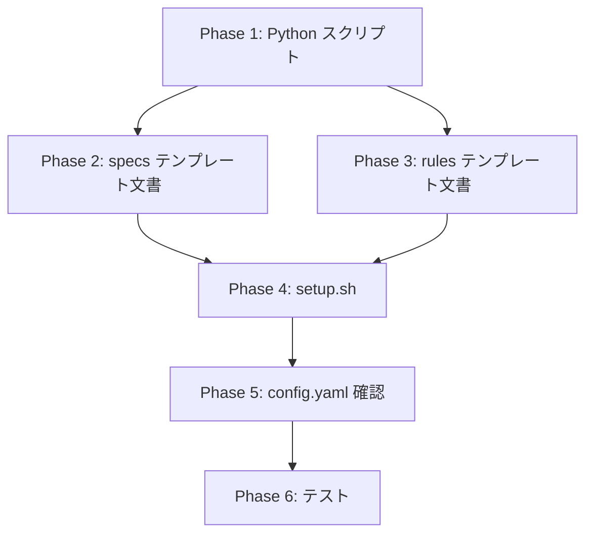

# PLAN-001: v3.8 実装計画

## 概要

設計書・要件定義書で定義した新モデル（doc_type 廃止、Feature 廃止、複数 root_dirs 対応）を、テンプレートファイル・Python スクリプト・setup.sh に反映する。

## 設計根拠

| 変更 | 理由 | 設計書 |
|------|------|--------|
| doc_type 廃止 | AI は文書の内容で判断する。分類は機能的な意味がない | REQ-001 v3.8 |
| Feature 廃止 | YAGNI。`**/` グロブで十分。メタデータが分類を担う | REQ-001 v3.8 |
| 複数 root_dirs | ユーザーのディレクトリ構成に柔軟に対応 | DES-004 v3.8 |
| ループ入力 UX | カンマ入力は typo しやすい。候補提示で利便性向上 | DES-001 v3.8 |

---

## Phase 1: Python スクリプト（基盤）

テンプレートの動作基盤を先に整える。specs 系スクリプトを rules 系と同等に簡素化する。

### 1-1. toc_utils.py

| 変更 | 詳細 |
|------|------|
| `get_default_target_dirs()` 削除 | doc_type マッピング不要 |
| `_get_default_config()` 修正 | `root_dir` → `root_dirs`（配列）、`target_dirs` 削除 |
| `root_dirs` 後方互換 | config 読み込み時に `root_dir`（文字列）→ `root_dirs: [値]` に変換するヘルパー追加 |

### 1-2. create_checksums.py

| 変更 | 詳細 |
|------|------|
| `find_md_files_specs()` 簡素化 | `target_dir_names` パラメータ削除。全 `.md` ファイルを対象化（rules と同じロジック） |
| 複数 root_dirs 対応 | `root_dir` 単数 → `root_dirs` ループ |
| パスプリフィックス | 各 root_dir 名をプリフィックスとして付与（現行と同じ方式を root_dir ごとに適用） |

### 1-3. create_pending_yaml_specs.py

| 変更 | 詳細 |
|------|------|
| `get_doc_type()` 削除 | doc_type 検出不要 |
| `is_target_dir()` 削除 | target_dirs フィルタ不要 |
| `PENDING_TEMPLATE` 修正 | `doc_type` フィールド削除 |
| `TARGET_DIRS` 参照削除 | グローバル変数削除 |
| 複数 root_dirs 対応 | `SPECS_DIR` 単数 → ループ処理 |

### 1-4. create_pending_yaml_rules.py

| 変更 | 詳細 |
|------|------|
| 複数 root_dirs 対応 | `RULES_DIR` 単数 → ループ処理 |

### 1-5. merge_specs_toc.py

| 変更 | 詳細 |
|------|------|
| `doc_type` フィールド削除 | 出力 YAML から `doc_type` 行を削除 |
| `TARGET_DIRS` 参照削除 | `is_target_dir()` 削除 |
| `get_existing_files()` 修正 | 複数 root_dirs 対応 |

### 1-6. merge_rules_toc.py

| 変更 | 詳細 |
|------|------|
| 複数 root_dirs 対応 | `get_existing_files()` 修正 |

### 1-7. validate_specs_toc.py

| 変更 | 詳細 |
|------|------|
| `doc_type` 分離ロジック削除 | `requirements` / `designs` 辞書 → 単一 `docs` 辞書 |
| 必須フィールドから `doc_type` 削除 | `required_string_fields` 更新 |
| 複数 root_dirs 対応 | ファイル存在チェックのパス解決 |

### 1-8. validate_rules_toc.py

| 変更 | 詳細 |
|------|------|
| 複数 root_dirs 対応 | ファイル存在チェックのパス解決 |

### 1-9. write_specs_pending.py

| 変更 | 詳細 |
|------|------|
| `doc_type` フィールド削除 | `_meta` セクションから削除、存在チェック削除、成功メッセージから削除 |

### 1-10. write_rules_pending.py

| 変更 | 詳細 |
|------|------|
| 変更なし | 元々 doc_type 参照なし |

---

## Phase 2: テンプレート文書（specs 系）

specs 系のドキュメントテンプレートから doc_type / Feature / target_dirs 概念を除去する。

### 2-1. specs_toc_format.md（最大の変更量）

| 変更 | 詳細 |
|------|------|
| doc_type フィールド削除 | スキーマ定義から `doc_type` 行削除 |
| `{{REQUIREMENT_DIR_NAME}}` / `{{DESIGN_DIR_NAME}}` 除去 | パス例をシンプルな `{{SPECS_DIR}}/` ベースに |
| Feature パス例の更新 | `specs/main/` → `specs/` |
| target_dirs セクション削除 | ToC 対象判定ルールの簡素化 |

### 2-2. specs_toc_update_workflow.md

| 変更 | 詳細 |
|------|------|
| 3フェーズ説明のパス更新 | `{{REQUIREMENT_DIR_NAME}}` / `{{DESIGN_DIR_NAME}}` 除去 |
| Feature パス例の更新 | `specs/main/` → `specs/` |
| pending YAML テンプレート | `doc_type` フィールド削除 |
| 対象ディレクトリ説明 | target_dirs ベースの説明をグロブベースに |

### 2-3. specs_orchestrator.md

| 変更 | 詳細 |
|------|------|
| doc_type 判定説明の削除 | ステップ2 の doc_type determination 削除 |
| ファイル検索コマンド | `find` コマンドの target_dirs フィルタ削除 |
| パス例の更新 | `{{SPECS_DIR}}/main/{{REQUIREMENT_DIR_NAME}}/` → `{{SPECS_DIR}}/` |
| Task 呼び出し例の更新 | ファイル名変換例の更新 |

### 2-4. specs-toc-updater.md（agent）

| 変更 | 詳細 |
|------|------|
| パラメータ例の更新 | `entry_file` パス例から `main_{{REQUIREMENT_DIR_NAME}}` 削除 |
| `doc_type` 参照削除 | requirement/design 文書の特別扱い削除 |

### 2-5. query-specs/SKILL.md

| 変更 | 詳細 |
|------|------|
| `{{REQUIREMENT_DIR_NAME}}` / `{{DESIGN_DIR_NAME}}` 除去 | パス例の簡素化 |
| Feature パス例の更新 | `specs/main/` → `specs/` |
| target ディレクトリ説明削除 | "Target is ... only" の行削除 |

---

## Phase 3: テンプレート文書（rules 系）

rules 系は doc_type / Feature の影響が小さいため、主に root_dirs 対応のみ。

### 3-1. rules_toc_format.md

| 変更 | 詳細 |
|------|------|
| 大きな変更なし | 元々 doc_type / Feature なし |
| root_dirs 対応の記述追加 | 複数ディレクトリからのスキャン説明（必要に応じて） |

### 3-2. rules_toc_update_workflow.md

| 変更 | 詳細 |
|------|------|
| 大きな変更なし | root_dirs 対応のパス記述のみ |

### 3-3. rules_orchestrator.md

| 変更 | 詳細 |
|------|------|
| 大きな変更なし | root_dirs 対応のパス記述のみ |

### 3-4. rules-toc-updater.md（agent）

| 変更 | 詳細 |
|------|------|
| 変更なし | 元々 doc_type 参照なし |

### 3-5. query-rules/SKILL.md

| 変更 | 詳細 |
|------|------|
| 変更なし or 軽微 | 元々シンプル |

---

## Phase 4: setup.sh

### 4-1. デフォルト値・変数

| 変更 | 詳細 |
|------|------|
| `DEFAULT_REQUIREMENT_DIR_NAME` 削除 | L28 |
| `DEFAULT_DESIGN_DIR_NAME` 削除 | L29 |
| `DEFAULT_PLAN_DIR_NAME` 削除 | L30 |
| `.last_setup` 復元ロジック | 上記3変数の復元削除、`root_dirs` 配列の復元追加 |

### 4-2. 新規関数: `scan_candidate_dirs()`

```
入力: TARGET_DIR
処理:
  1. TARGET_DIR 直下のディレクトリを列挙
  2. 除外: .git, .claude, node_modules, .venv, __pycache__, .DS_Store
  3. 各ディレクトリ配下の .md ファイル数を再帰カウント
  4. 1件以上あるディレクトリを候補として返す
出力: 候補ディレクトリ配列（.md ファイル数付き）
```

### 4-3. 新規関数: `select_dirs_loop()`

```
入力: カテゴリ名, デフォルトディレクトリ, 候補配列
処理:
  1. 候補を番号付きで表示
  2. ループ入力:
     - 初回デフォルト = 候補[1] or デフォルトディレクトリ
     - 2回目以降デフォルト = done
  3. バリデーション: 存在チェック、重複チェック、.md ファイル数表示
  4. 最低1つ選択されるまでループ
出力: 選択されたディレクトリ配列
```

### 4-4. ディレクトリ選択フロー変更

| 変更 | 詳細 |
|------|------|
| L118-159 の対話プロンプト | 2つの `read` → `select_dirs_loop()` 呼び出し × 2 |
| サブディレクトリ設定削除 | L129-139 の REQUIREMENT/DESIGN/PLAN プロンプト削除 |

### 4-5. sed 置換変更

| 変更 | 詳細 |
|------|------|
| `{{RULES_DIRS}}` 追加 | YAML 配列形式で置換（`    - dir1/\n    - dir2/`） |
| `{{SPECS_DIRS}}` 追加 | 同上 |
| `{{REQUIREMENT_DIR_NAME}}` 削除 | sed 行削除 |
| `{{DESIGN_DIR_NAME}}` 削除 | sed 行削除 |
| `{{PLAN_DIR_NAME}}` 削除 | sed 行削除 |

> **Note**: `{{RULES_DIR}}` と `{{SPECS_DIR}}`（単数形）は query-rules/query-specs SKILL.md で引き続き使用される可能性がある。テンプレート内の参照を確認して判断する。

### 4-6. 設定表示・保存

| 変更 | 詳細 |
|------|------|
| L176-180 の表示更新 | サブディレクトリ名 → ディレクトリ群の表示 |
| `.last_setup` 保存更新 | REQUIREMENT/DESIGN/PLAN 削除、RULES_DIRS / SPECS_DIRS 保存 |

---

## Phase 5: config.yaml テンプレート

| 変更 | 詳細 |
|------|------|
| 完了済み | `root_dir` → `root_dirs`, `target_dirs` 廃止済み |
| プレースホルダー確認 | `{{RULES_DIRS}}` / `{{SPECS_DIRS}}` の形式確認 |

---

## Phase 6: テスト

### 6-1. 既存テストの更新

| テスト | 変更 |
|--------|------|
| `tests/test_setup_upgrade.sh` | 新 config 構造（root_dirs）の検証追加 |
| `tests/run_all_tests.sh` | 新テストケースの追加 |

### 6-2. 新規テスト

| テスト | 内容 |
|--------|------|
| 複数 root_dirs でのチェックサム生成 | 2つのディレクトリから正しくハッシュ計算されるか |
| 複数 root_dirs での pending YAML 生成 | 異なるディレクトリのファイルが正しく pending 化されるか |
| 複数 root_dirs でのマージ | 異なるディレクトリのエントリが1つの ToC に統合されるか |
| doc_type なしの ToC 出力 | `doc_type` フィールドが出力されないことを確認 |
| 旧 config 後方互換 | `root_dir` (単数) の config が正しく動作するか |

---

## 実施順序と依存関係



- **Phase 1 が最優先**: スクリプトが正しく動かないとテンプレート文書の修正も検証できない
- **Phase 2 と 3 は並行可能**: specs 系と rules 系は独立
- **Phase 4 は Phase 2/3 完了後**: テンプレート変更に合わせてプレースホルダーを調整
- **Phase 6 は最後**: 全変更完了後に統合テスト

---

## リスク

| リスク | 影響 | 対策 |
|--------|------|------|
| 旧 config との非互換 | 既存ユーザーの設定が壊れる | `root_dir` → `root_dirs` の自動変換ヘルパー |
| specs/rules スクリプト統一の見送り | コード重複が残る | 今回は構造変更のみ。統一は将来の課題 |
| テンプレート修正漏れ | 置換後のファイルにプレースホルダーが残る | テスト時に `grep` で未置換プレースホルダーを検出 |

---

## スコープ外

| 項目 | 理由 |
|------|------|
| specs/rules スクリプトの統一（単一スクリプト化） | 構造が同一になったが、ファイル統合は別タスク |
| `extract_id_from_filename()` の削除 | DES-003 で非推奨化済み。実害なし |
| CHANGELOG.md / README 更新 | バージョン更新スキルで別途実施 |
